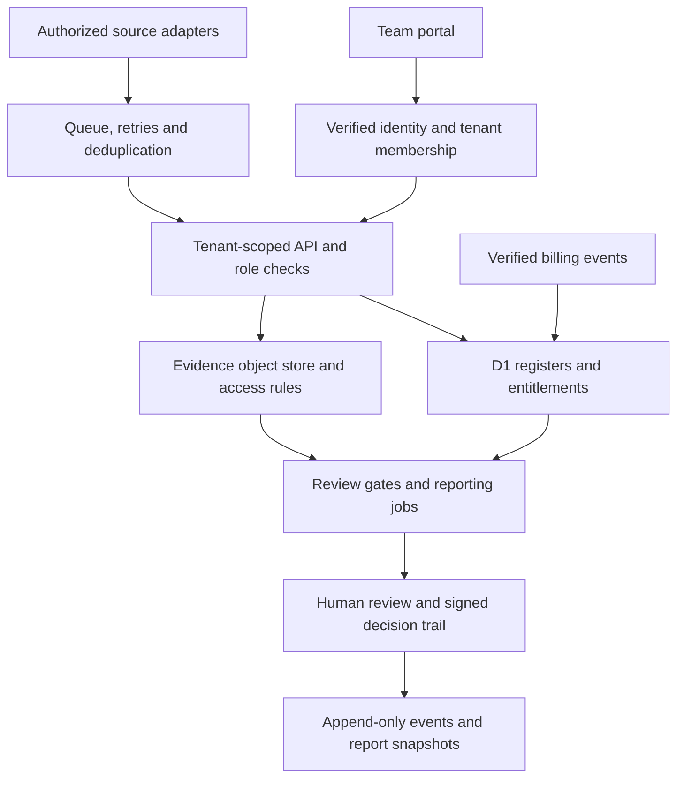

# Enterprise commercialization strategy

Prepared 5 October 2026. Commercial hypotheses and proposed prices; not contracted rates, measured ROI or an active SaaS subscription offer.

## 1. Positioning and first buyer

**Offer:** Connect AI systems, supplier decisions and control evidence into an accountable review process your team can maintain.

Sell one bounded decision process first, using the 29-domain catalogue as the connected operating model. These are review domains, not 29 standards or 29 implemented compliance certifications. Start with mid-market B2B software organizations that have an AI/vendor approval backlog or an approaching customer assurance review, a named sponsor, accessible evidence and an agreed reporting period. Expand into enterprise teams after delivery, security review and support capacity are proven.

| Buyer | Trigger | Decision supported | Inspectable output | Acceptance measure |
|---|---|---|---|---|
| CISO / Head of GRC | AI vendors introduced without clear ownership | Approve, condition or hold a supplier/use case | Supplier inventory, evidence gaps and named treatment owners | All scoped suppliers classified; every material gap assigned |
| AI governance lead | New LLM feature or agent release | Release prerequisites and human escalation | AI inventory, applicability review, evaluation and oversight checklist | Each scoped use case has an owner, evidence reference and review gate |
| Audit lead | Control evidence scattered or expired | Which controls are supported for the reporting period? | Control-evidence-test joins and exception queue | Scoped controls have owners; stale evidence identified; tests traceable |
| Procurement / Privacy lead | Unclear processor and subprocessor terms | Contract/data-transfer review and escalation | DPA, retention, data-use and subprocessor gap register | Every scoped vendor has an explicit terms review status |

The suite exposes gaps rather than auto-approving them. Concrete AI risks include undocumented use cases, inappropriate data egress, supplier dependency changes, stale evaluation results, missing oversight, unclear model/tool authority and unsupported assurance statements. Framework applicability is assessed per system and jurisdiction. NIST AI RMF and NIST AI 600-1 guide risk review; ISO/IEC 42001 guides management-system design; SOC 2 TSC guides scoped controls; EU AI Act obligations require an applicability assessment. Mapping alone does not establish compliance.

## 2. Architecture audit: shipped versus proposed

| Layer | Current source and behavior | Commercial implication |
|---|---|---|
| Public UI | Python-generated static pages and browser ES modules; 29 projects, 16 record types and 132 views | Free inspection/distribution surface; counts must come from catalogues |
| Local state | Browser-local/in-memory records and explicit save/export; origin-specific device storage | Useful for individual review; not a shared system of record |
| Readiness review | Domain-specific assertions, dated evidence references, likelihood × impact and human review prerequisites | Sell configuration and review discipline, not automatic certification |
| Supplier/AI Decision Lab | Separate specialist data schema; memo, CSV and JSON | Preserve schema boundaries and reconcile imports explicitly |
| Engine and collectors | Source-controlled assessment, policy and ingestion examples | Implement authorized adapters and operational ownership before promising live collection |
| Organization evaluations | Pages Functions, validated identity, provisioned membership, atomic D1 quota reservation and provider adapter | Available as configurable source; not a complete multi-tenant operating backend |
| Billing | No provider or verified subscription webhook | Sell scoped services by contract now; do not advertise working subscription checkout |
| Enterprise operations | Full shared register persistence, fine-grained roles, collector schedules, immutable events and reporting pipeline remain deployment work | Quote build scope and acceptance tests; label managed SaaS as planned |

### Target managed architecture

D1 is a possible metadata store, not an automatic tenant-isolation guarantee. Every API query must derive its tenant from verified membership and enforce role permissions. Use tenant-qualified identifiers/uniqueness constraints, negative cross-tenant tests and database isolation appropriate to the client. Store binary evidence in an appropriately configured object store, with explicit retention, access and processing requirements. Source adapters use scoped credentials, versioned mappings, idempotency, retry limits and freshness timestamps. Record collector failures as unknown/error, never passing evidence.

## 3. Community and enterprise boundary

| Capability | Community edition, available now | Paid delivery / target managed tier |
|---|---|---|
| Domain catalogue and framework associations | All 29 projects, schema/source inspection and public guides | Client applicability and control-baseline configuration |
| Local workspace | Single-user device state, editable registers, review calculations | Contracted shared deployment with persistent team records |
| Exports | Existing JSON, CSV and decision memos remain free | Scheduled, versioned audit packages and PDF generation after implementation |
| Data ingestion | Inspectable authorized-export examples | Operated AWS/Azure/Jira adapters under agreed access and support scope |
| Identity | No team permission enforcement in static workspace | Verified SSO, tenant provisioning and server-enforced roles |
| Evidence operations | References and date checks; no evidence content verification | Protected evidence store, retention/deletion, provenance and reviewer workflow |
| Monitoring | Recalculation on interaction and source examples | Scheduled collection, bounded alert routing, failures/retries and reconciliation |
| Support | Public documentation without SLA | Agreed hours, response targets, handover and maintenance |
| Hosting | Run locally or host under the open-source license | Managed convenience, operations and service commitments by contract |

Do not remove existing exports or introduce an artificial local-use restriction. Commercial value is implementation accountability, ongoing operation, integration quality and reviewer time saved. Charge by service scope and operated resources, not by claiming exclusive ownership of NIST/ISO/SOC frameworks.

## 4. Licensing model

The current core remains **AGPL-3.0**, including commercial-use rights subject to its terms. This is not an evaluation-only license. A paid hosting or advisory contract does not cancel the code license, and terms must not narrow rights already granted by it.

**Recommended initial model: open-source core plus paid services and managed operations.** Charge for deployment, adaptation, support, training and integrations while complying with the core license. Do not assume that an HTTP boundary or the word “plugin” makes a derived component proprietary. Review how components are combined and what rights and notices apply.

**Alternative commercial licensing: conditional, not presently promised.** Offer another license only for code whose copyright and licensing rights are verified, including contributor permissions and dependency rights. Maintain a provenance register, dependency license inventory and contribution policy before quoting exceptions. Existing AGPL grants cannot simply be withdrawn from prior recipients. Do not claim that all repository code can be relicensed just because the repository is under your account.

Read LICENSE and TERMS_AND_CONDITIONS.md for current code/tool terms. New enterprise deliverables need their own clear contractual scope and license schedule.

## 5. Service packages and pricing hypotheses

Prices below are suggested USD validation ranges, excluding taxes, infrastructure/provider charges and out-of-scope work. Fixed scope creates repeatability; high margin depends on actual delivery hours and costs, not the package label. Each timetable begins after complete inputs and sponsor availability. Readiness is not a guaranteed audit result or certification.

| Package | Bounded scope and outputs | Suggested fee | Delivery target / acceptance |
|---|---|---|---|
| Decision and evidence diagnostic | One system, up to 5 AI use cases or 10 suppliers; scope memo, evidence-gap register, priorities and walkthrough | $750–$1,500 | 3–5 working days; all scoped records classified with actionable owners |
| AI governance readiness sprint | One business unit, up to 10 AI use cases; NIST AI RMF/600-1 mapping, inventory, evaluation gaps, oversight and release prerequisites | $3,000–$6,000 | 14 calendar days after inputs; agreed register, gaps and reviewer gates delivered |
| Supplier and AI assurance sprint | Up to 15 vendors; tiering, data-use/retention/DPA/subprocessor review, concentration links and remediation plan | $2,500–$5,000 | 10–14 calendar days; every scoped vendor reviewed and missing evidence explicit |
| Control-to-evidence implementation | One scoped system and up to 30 agreed controls; mappings, test metadata, evidence freshness and handover | $4,000–$8,000 | 2–4 weeks; agreed controls have owners and traceable test/evidence relationships |
| Custom enterprise integration | One tenant and one source adapter; identity, access/storage design, data contract, deployment and acceptance tests | $6,000–$15,000 | Discovery-led 4–8 week plan; security and failure-path acceptance required |
| Assurance operations retainer | 8–16 scheduled hours/month; monthly freshness/exception review, change triage and management pack | $1,000–$2,500/month | Defined hours and outputs; no 24/7 incident response or independent audit opinion |

Use a paid diagnostic as the lowest-friction first purchase; credit part of its fee toward a larger implementation only when commercially justified. Price implementation as a fixed package with explicit record/system caps and change orders. Use milestone billing (for example 40% start, 40% accepted draft, 20% handover) subject to agreed contract. Retainers purchase planned capacity; extra work requires written scope. Independent certification audits or regulated opinions require suitably authorized providers.

### Economics and quote control

Fee floor = direct delivery cost / (1 − target gross margin). Direct cost includes delivery and support hours at an internal loaded rate, contractors, infrastructure, processing, payment fees and delivery-specific costs. Contribution margin must also cover selling/admin time. Example only: 24 hours × $75 + $200 other direct costs = $2,000; at a 50% target gross margin, fee floor is $4,000. Track actual hours and revise the scope when the floor exceeds the buyer's budget.

Do not guarantee that a proposed fee is market-clearing or a guaranteed high-margin sale. Validate it in buyer conversations and completed delivery. Avoid percentage-of-fine-avoided pricing and invented savings.

## 6. Managed SaaS commercialization gates

A subscription should follow repeatable service delivery, not precede it. Start with client-managed deployment or a specifically contracted managed pilot. Proposed pilot pricing: $500–$1,500 per tenant/month plus $3,000–$8,000 onboarding, for a small defined team, one integration and a documented usage/retention envelope. This is a pricing experiment, not a published available plan. Larger enterprise agreements are scoped annually after security/procurement review.

Before any public paid launch: verify SSO and membership; role/tenant isolation; backend validation; protected evidence access and lifecycle; tested backup/restore; versioned review and report history; scheduled collector failures and retries; signed billing events and entitlement reconciliation; privacy/DPA/subprocessor disclosures; monitored operations, support commitments and incident ownership. Define data regions and a recoverability test rather than promising universal data residency or unlimited usage.

Paid access must be enforced server-side. The present two-run organization evaluation allowance is separate from the unlimited local core. Cookies, browser fingerprints and email-domain claims cannot substitute for provisioned tenant membership. A quota exhaustion contact link is not a working paywall/payment service.

## 7. Conversion journey and actual copy

One primary conversion is a **qualified scope brief**: named organization/sponsor, decision problem, population, framework/jurisdiction, evidence availability, target date and paid-delivery intent. Do not require confidential evidence in the first message. Secondary route: inspect the free workspace/source.

**Website hero:** “Turn AI and supplier risk into reviewable decisions.”

**Support copy:** “Connect scope, ownership, control evidence and treatment across your governance process. Start with one system or supplier set, then agree the implementation and handover your team needs.”

**Primary CTA:** “Request an implementation scope”.

**Commercial boundary:** “The local core is open source under AGPL-3.0. Paid engagements cover assessment support, configuration, deployment, integration and ongoing operations. Managed capabilities are delivered against an agreed scope; the public workspace remains available for inspection.”

**LinkedIn About addition:** “For organizations introducing AI systems or reviewing supplier and control evidence, I offer bounded governance reviews and implementation scopes: AI inventory and oversight, supplier assurance, control-to-evidence mapping and maintainable decision records. Review the open-source operating model, then share the system population, evidence available and target decision date to discuss a paid engagement.”

**Demo script:** “Choose one approval or assurance decision. This gate shows what evidence and ownership it needs. Let’s change the expiry date and inspect the resulting gap. The local core makes that reasoning inspectable; a paid engagement adapts the scope, evidence sources and team review process to your environment.”

**Hiring route:** Present source contracts, review logic and acceptance checks as capability evidence. Link to the professional profile for employment inquiries. Do not substitute sales claims for verified experience or promised regulatory outcomes.

## 8. Sales execution and measurement

| Phase | Highest-value action | Decision gate |
|---|---|---|
| Week 1 | Publish clear commercial boundary, package scope and contact path; hold 5 qualified discovery conversations | At least one buyer has accessible inputs, budget intent and an accountable sponsor |
| Weeks 2–3 | Sell and deliver one paid diagnostic; record actual hours and baseline review friction | Buyer accepts output and requests a concrete next scope |
| Weeks 3–6 | Repeat one sprint and templatize evidence intake, review and handover | Repeatable acceptance and positive contribution margin |
| After repeatability | Build the minimum shared backend requested by paying clients | Security/operations acceptance before SaaS claims |

These are execution targets, not promised contract dates. Use existing network and specific buyer problems; avoid unsolicited mass messaging or fake scarcity. No outreach is sent automatically by the site.

Measure qualified briefs / eligible visitor sessions with a defined time window and qualification criteria. Track CTA clicks, completed briefs, paid diagnostics, proposal acceptance, delivery effort and margin. Keep sensitive form contents out of analytics. Establish a baseline before claiming conversion lift. For delivered workflows measure time-to-review, overdue actions and supported control coverage within the actual scoped denominator. Publish results only with evidence and client permission.

## 9. Contract and handover checklist

State systems/records/controls in scope; client evidence and reviewer dependencies; required accesses; deliverables and acceptance criteria; payment and changes; data handling and subprocessors; IP/code licenses; ownership of decisions; warranty/support limits; termination/export/deletion; and who owns operational incidents. Include editable exports, field definitions, evidence links, walkthrough, deployment/runbook and scheduled review responsibilities. Retainers exclude open-ended firefighting unless separately contracted.

## 10. Source and maintenance notes

Architecture findings are grounded in functions/api/evaluate.js, server/evaluation-runtime.mjs, migrations/0001_evaluations.sql, docs/ORGANIZATION-EVALUATIONS.md, content/domain-reviews.json and the shipped suite/Decision Lab. Documentation and README maps regenerate with the normal build. The commercial page and service descriptions are scoped offers, not activation of billing or enterprise infrastructure.

Primary references (accessed 5 October 2026):
- GNU licensing FAQ: https://www.gnu.org/licenses/gpl-faq.en.html — commercial use, rights holders and combined/separate programs.
- Cloudflare D1 overview: https://developers.cloudflare.com/d1/ — metadata database capabilities; application tenancy remains a design responsibility.
- Repository license: LICENSE. Deployment contract: docs/ORGANIZATION-EVALUATIONS.md.
