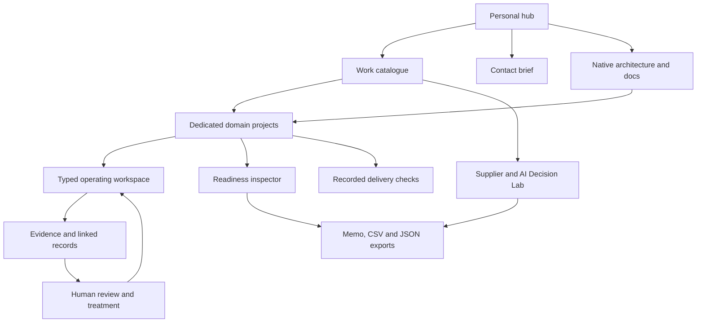
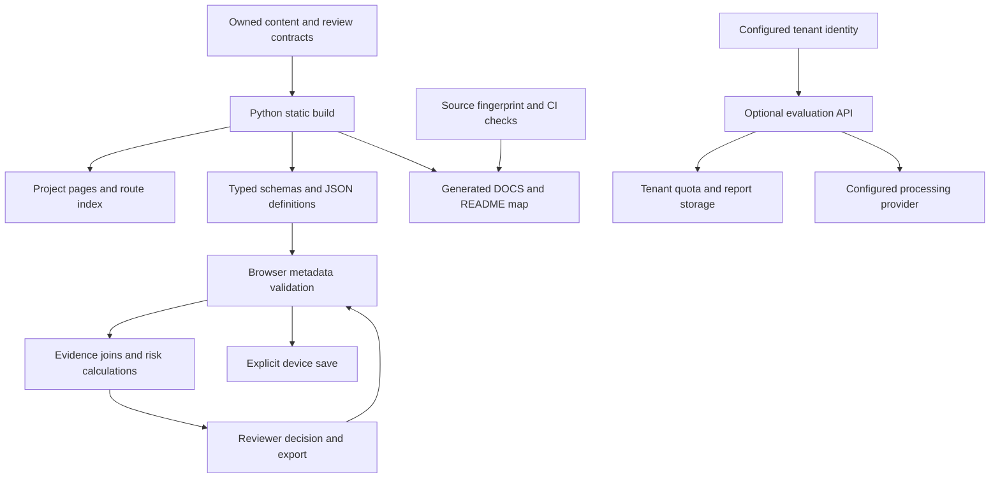

# GRC suite: system guide and client demonstration manual

Generated from 29 active domain projects, 16 record types and 132 register/reporting views.

Source contract SHA-256: `6c56bc8755e6b8f34fbf6a7236bc25546665954d26e2841faa38623175db74ad`

## System overview

The portfolio is a static, owned-source website deployed from GitHub to Cloudflare Pages. The personal hub introduces the offer; the catalogue and project pages explain scope; the workspace stores typed governance metadata and recalculates joined views. No browser action silently approves risk, fetches an evidence URL, runs a cloud collector or sends confidential evidence.





## Navigation and route contract

| Route | What it opens | Client purpose |
|---|---|---|
| [/architecture/](https://aaowasi-projects.pages.dev/architecture/) | Named page, controls and destinations enumerated below | Inspect scope, evidence and next action |
| [/assurance/](https://aaowasi-projects.pages.dev/assurance/) | Named page, controls and destinations enumerated below | Inspect scope, evidence and next action |
| [/decision-lab/](https://aaowasi-projects.pages.dev/decision-lab/) | Named page, controls and destinations enumerated below | Inspect scope, evidence and next action |
| [/docs/](https://aaowasi-projects.pages.dev/docs/) | Named page, controls and destinations enumerated below | Inspect scope, evidence and next action |
| [/enterprise/](https://aaowasi-projects.pages.dev/enterprise/) | Named page, controls and destinations enumerated below | Inspect scope, evidence and next action |
| [/evaluate/](https://aaowasi-projects.pages.dev/evaluate/) | Named page, controls and destinations enumerated below | Inspect scope, evidence and next action |
| [//](https://aaowasi-projects.pages.dev//) | Named page, controls and destinations enumerated below | Inspect scope, evidence and next action |
| [/privacy/](https://aaowasi-projects.pages.dev/privacy/) | Named page, controls and destinations enumerated below | Inspect scope, evidence and next action |
| [/results/](https://aaowasi-projects.pages.dev/results/) | Named page, controls and destinations enumerated below | Inspect scope, evidence and next action |
| [/suite/](https://aaowasi-projects.pages.dev/suite/) | Named page, controls and destinations enumerated below | Inspect scope, evidence and next action |
| [/terms/](https://aaowasi-projects.pages.dev/terms/) | Named page, controls and destinations enumerated below | Inspect scope, evidence and next action |
| [/tools/vendor-review/](https://aaowasi-projects.pages.dev/tools/vendor-review/) | Named page, controls and destinations enumerated below | Inspect scope, evidence and next action |
| [/work/agent-authorization/](https://aaowasi-projects.pages.dev/work/agent-authorization/) | Dedicated domain project and evidence-led readiness review | Inspect scope, evidence and next action |
| [/work/ai-governance/](https://aaowasi-projects.pages.dev/work/ai-governance/) | Dedicated domain project and evidence-led readiness review | Inspect scope, evidence and next action |
| [/work/ai-safety/](https://aaowasi-projects.pages.dev/work/ai-safety/) | Dedicated domain project and evidence-led readiness review | Inspect scope, evidence and next action |
| [/work/ai-transparency/](https://aaowasi-projects.pages.dev/work/ai-transparency/) | Dedicated domain project and evidence-led readiness review | Inspect scope, evidence and next action |
| [/work/audit-readiness/](https://aaowasi-projects.pages.dev/work/audit-readiness/) | Dedicated domain project and evidence-led readiness review | Inspect scope, evidence and next action |
| [/work/cloud-change/](https://aaowasi-projects.pages.dev/work/cloud-change/) | Dedicated domain project and evidence-led readiness review | Inspect scope, evidence and next action |
| [/work/continuous-assurance/](https://aaowasi-projects.pages.dev/work/continuous-assurance/) | Dedicated domain project and evidence-led readiness review | Inspect scope, evidence and next action |
| [/work/control-management/](https://aaowasi-projects.pages.dev/work/control-management/) | Dedicated domain project and evidence-led readiness review | Inspect scope, evidence and next action |
| [/work/customer-assurance/](https://aaowasi-projects.pages.dev/work/customer-assurance/) | Dedicated domain project and evidence-led readiness review | Inspect scope, evidence and next action |
| [/work/data-governance/](https://aaowasi-projects.pages.dev/work/data-governance/) | Dedicated domain project and evidence-led readiness review | Inspect scope, evidence and next action |
| [/work/evidence-integrity/](https://aaowasi-projects.pages.dev/work/evidence-integrity/) | Dedicated domain project and evidence-led readiness review | Inspect scope, evidence and next action |
| [/work/executive-risk/](https://aaowasi-projects.pages.dev/work/executive-risk/) | Dedicated domain project and evidence-led readiness review | Inspect scope, evidence and next action |
| [/work/financial-conduct/](https://aaowasi-projects.pages.dev/work/financial-conduct/) | Dedicated domain project and evidence-led readiness review | Inspect scope, evidence and next action |
| [/work/governance-program/](https://aaowasi-projects.pages.dev/work/governance-program/) | Dedicated domain project and evidence-led readiness review | Inspect scope, evidence and next action |
| [/work/identity-authorization/](https://aaowasi-projects.pages.dev/work/identity-authorization/) | Dedicated domain project and evidence-led readiness review | Inspect scope, evidence and next action |
| [/work/internal-audit/](https://aaowasi-projects.pages.dev/work/internal-audit/) | Dedicated domain project and evidence-led readiness review | Inspect scope, evidence and next action |
| [/work/ongoing-authorization/](https://aaowasi-projects.pages.dev/work/ongoing-authorization/) | Dedicated domain project and evidence-led readiness review | Inspect scope, evidence and next action |
| [/work/policy-governance/](https://aaowasi-projects.pages.dev/work/policy-governance/) | Dedicated domain project and evidence-led readiness review | Inspect scope, evidence and next action |
| [/work/privacy-lifecycle/](https://aaowasi-projects.pages.dev/work/privacy-lifecycle/) | Dedicated domain project and evidence-led readiness review | Inspect scope, evidence and next action |
| [/work/processor-governance/](https://aaowasi-projects.pages.dev/work/processor-governance/) | Dedicated domain project and evidence-led readiness review | Inspect scope, evidence and next action |
| [/work/regulatory-obligations/](https://aaowasi-projects.pages.dev/work/regulatory-obligations/) | Dedicated domain project and evidence-led readiness review | Inspect scope, evidence and next action |
| [/work/remediation/](https://aaowasi-projects.pages.dev/work/remediation/) | Dedicated domain project and evidence-led readiness review | Inspect scope, evidence and next action |
| [/work/resilience/](https://aaowasi-projects.pages.dev/work/resilience/) | Dedicated domain project and evidence-led readiness review | Inspect scope, evidence and next action |
| [/work/sector-assurance/](https://aaowasi-projects.pages.dev/work/sector-assurance/) | Dedicated domain project and evidence-led readiness review | Inspect scope, evidence and next action |
| [/work/security-boundary/](https://aaowasi-projects.pages.dev/work/security-boundary/) | Dedicated domain project and evidence-led readiness review | Inspect scope, evidence and next action |
| [/work/shadow-ai/](https://aaowasi-projects.pages.dev/work/shadow-ai/) | Dedicated domain project and evidence-led readiness review | Inspect scope, evidence and next action |
| [/work/threat-supply-chain/](https://aaowasi-projects.pages.dev/work/threat-supply-chain/) | Dedicated domain project and evidence-led readiness review | Inspect scope, evidence and next action |
| [/work/vendor-risk/](https://aaowasi-projects.pages.dev/work/vendor-risk/) | Dedicated domain project and evidence-led readiness review | Inspect scope, evidence and next action |
| [/work/workforce-security/](https://aaowasi-projects.pages.dev/work/workforce-security/) | Dedicated domain project and evidence-led readiness review | Inspect scope, evidence and next action |
| [/workspace/](https://aaowasi-projects.pages.dev/workspace/) | Named page, controls and destinations enumerated below | Inspect scope, evidence and next action |

The personal hub and portfolio alias have separate browser origins. Device storage is origin-specific. Domain pages on the alias use the canonical project workspace for shared workflow destinations. The Decision Lab is a separate specialist supplier/AI model, not another copy of the typed suite. Its module tabs change in-memory projections; its project links open dedicated /work/ pages.

## State, validation and calculations

- Typed suite: `version: 1`, `records`, `updatedAt`; up to 5,000 records and 20 MB. Each record has an entity type, stable ID and optional domainSlug. Unknown fields, duplicate IDs, invalid typed references and vendor dependency cycles are rejected before committing.
- Inspector: one domain checklist per project, owner, boundary, reviewer, HTTPS evidence reference, validity date and qualitative likelihood/impact. Readiness = confirmed checks / checklist length. Any missing scope, owner, reviewer, invalid evidence reference, expired evidence or unconfirmed check holds the gate. Even a complete gate only means ready for accountable review.
- Qualitative inspector risk = likelihood × impact (1–5 each), high ≥15, moderate ≥8. The typed suite high-risk threshold is ≥15. Decision Lab uses its documented separate policy: high ≥16 and moderate ≥9 after signal points and evidence credit. These are prioritization policies, not probabilities or interchangeable score scales.
- Typed control coverage joins scoped controls to all linked tests, including tests assigned to another domain. Only passing tests within the reporting-date validity period count. A passing test requires evidence URL, named reviewer and test date.
- Decision Lab: `schemaVersion: 1.0`; up to 250 records and 10 MB. A linked supplier/AI record carries evidence state, test result, reviewer, disclosure, oversight and processor metadata. Ten specialist views derive supplier, AI, evidence and questionnaire review signals. Import/export cannot silently interchange this model with the typed suite.
- In-memory edits are lost on page reload unless explicitly exported (or saved via the typed suite device-save button). Readiness review JSON is a report, not a suite import. Saving a form is an assertion, not evidence-content verification.

## Optional backend and integrations

Cloudflare Pages Functions expose `/api/status`, `/api/login`, `/api/account`, `/api/evaluate`. With configured tenant identity, D1 and provider settings, the server validates identity and same-origin requests, validates input, atomically reserves tenant quota, enforces idempotency, calls the configured processing provider over HTTPS and stores a bounded report. Failed/unconfigured dependencies return an error or access-request state. Local browser counts never grant backend access. No billing, SSO or remote processing is claimed live without verified deployment configuration. Repository collectors, policies and OSCAL artifacts are integration building blocks and are not continuously running behind the public pages.

## Domain-by-domain operating and client guide

### D01: Corporate governance & accountability

**What and how:** [Corporate governance & accountability](https://aaowasi-projects.pages.dev/work/governance-program/) uses the `decision` typed register and its domain-specific readiness checklist. Inputs produce dated evidence gaps, ownership requests, a qualitative risk score and an exportable JSON review.

**Why it exists:** Named owners, decisions and review dates. Unowned or unsupported decisions create follow-up work and uncertain review boundaries.

**Required assertions and evidence questions:**

- Board mandate and delegated authority recorded. Confirm the supporting artifact, owner and review date rather than relying on the checkbox alone.
- Named accountable owners assigned. Confirm the supporting artifact, owner and review date rather than relying on the checkbox alone.
- Decision rationale and review cadence approved. Confirm the supporting artifact, owner and review date rather than relying on the checkbox alone.

**Framework anchors:** ISO/IEC 27001 clauses 4–6 · NIST SP 800-53 PM. Applicability and control-level interpretation remain with the accountable specialist.

**Upstream:** regulatory-obligations, executive-risk, processor-governance, ai-transparency, shadow-ai, resilience, remediation, financial-conduct.
**Downstream:** executive-risk, policy-governance, ai-governance, financial-conduct.

**B2B value:** Makes missing prerequisites and accountable next actions inspectable before release, procurement or assurance review. Agree a baseline for reviewer effort and overdue issues before claiming savings.

**Demo talking point:** “Here is the decision boundary for corporate governance & accountability. I can change the recorded evidence date or remove one domain assertion and show exactly which prerequisite blocks review. The output preserves the responsible owner, evidence request and linked operating domains.”

### D02: Enterprise risk & appetite

**What and how:** [Enterprise risk & appetite](https://aaowasi-projects.pages.dev/work/executive-risk/) uses the `risk` typed register and its domain-specific readiness checklist. Inputs produce dated evidence gaps, ownership requests, a qualitative risk score and an exportable JSON review.

**Why it exists:** Likelihood, impact, treatment and acceptance. Unowned or unsupported decisions create follow-up work and uncertain review boundaries.

**Required assertions and evidence questions:**

- Risk appetite and tolerance documented. Confirm the supporting artifact, owner and review date rather than relying on the checkbox alone.
- Inherent and residual assessments recorded. Confirm the supporting artifact, owner and review date rather than relying on the checkbox alone.
- Treatment and escalation owner assigned. Confirm the supporting artifact, owner and review date rather than relying on the checkbox alone.

**Framework anchors:** NIST SP 800-53 RA · ISO/IEC 27001 clause 6. Applicability and control-level interpretation remain with the accountable specialist.

**Upstream:** governance-program, sector-assurance.
**Downstream:** governance-program, control-management.

**B2B value:** Makes missing prerequisites and accountable next actions inspectable before release, procurement or assurance review. Agree a baseline for reviewer effort and overdue issues before claiming savings.

**Demo talking point:** “Here is the decision boundary for enterprise risk & appetite. I can change the recorded evidence date or remove one domain assertion and show exactly which prerequisite blocks review. The output preserves the responsible owner, evidence request and linked operating domains.”

### D03: Regulatory applicability & change

**What and how:** [Regulatory applicability & change](https://aaowasi-projects.pages.dev/work/regulatory-obligations/) uses the `obligation` typed register and its domain-specific readiness checklist. Inputs produce dated evidence gaps, ownership requests, a qualitative risk score and an exportable JSON review.

**Why it exists:** Jurisdiction, applicable requirement and effective date. Unowned or unsupported decisions create follow-up work and uncertain review boundaries.

**Required assertions and evidence questions:**

- Jurisdiction and applicability determined. Confirm the supporting artifact, owner and review date rather than relying on the checkbox alone.
- Obligation-to-control mappings reviewed. Confirm the supporting artifact, owner and review date rather than relying on the checkbox alone.
- Regulatory change owner and review date assigned. Confirm the supporting artifact, owner and review date rather than relying on the checkbox alone.

**Framework anchors:** GDPR · EU AI Act · NIST SP 800-53 PL. Applicability and control-level interpretation remain with the accountable specialist.

**Upstream:** sector-assurance, privacy-lifecycle.
**Downstream:** governance-program, policy-governance, control-management, privacy-lifecycle, ai-transparency, sector-assurance.

**B2B value:** Makes missing prerequisites and accountable next actions inspectable before release, procurement or assurance review. Agree a baseline for reviewer effort and overdue issues before claiming savings.

**Demo talking point:** “Here is the decision boundary for regulatory applicability & change. I can change the recorded evidence date or remove one domain assertion and show exactly which prerequisite blocks review. The output preserves the responsible owner, evidence request and linked operating domains.”

### D04: Policy lifecycle

**What and how:** [Policy lifecycle](https://aaowasi-projects.pages.dev/work/policy-governance/) uses the `policy` typed register and its domain-specific readiness checklist. Inputs produce dated evidence gaps, ownership requests, a qualitative risk score and an exportable JSON review.

**Why it exists:** Version, ownership and attestation. Unowned or unsupported decisions create follow-up work and uncertain review boundaries.

**Required assertions and evidence questions:**

- Policy scope and approval owner recorded. Confirm the supporting artifact, owner and review date rather than relying on the checkbox alone.
- Version and effective date controlled. Confirm the supporting artifact, owner and review date rather than relying on the checkbox alone.
- Attestations and exceptions reviewed. Confirm the supporting artifact, owner and review date rather than relying on the checkbox alone.

**Framework anchors:** ISO/IEC 27001 clause 7 · NIST SP 800-53 PL. Applicability and control-level interpretation remain with the accountable specialist.

**Upstream:** governance-program, regulatory-obligations.
**Downstream:** control-management, data-governance, shadow-ai, workforce-security.

**B2B value:** Makes missing prerequisites and accountable next actions inspectable before release, procurement or assurance review. Agree a baseline for reviewer effort and overdue issues before claiming savings.

**Demo talking point:** “Here is the decision boundary for policy lifecycle. I can change the recorded evidence date or remove one domain assertion and show exactly which prerequisite blocks review. The output preserves the responsible owner, evidence request and linked operating domains.”

### D05: Control implementation & ownership

**What and how:** [Control implementation & ownership](https://aaowasi-projects.pages.dev/work/control-management/) uses the `control` typed register and its domain-specific readiness checklist. Inputs produce dated evidence gaps, ownership requests, a qualitative risk score and an exportable JSON review.

**Why it exists:** Requirement → control → owner. Unowned or unsupported decisions create follow-up work and uncertain review boundaries.

**Required assertions and evidence questions:**

- Implementation and control owner recorded. Confirm the supporting artifact, owner and review date rather than relying on the checkbox alone.
- Operating evidence and test procedure linked. Confirm the supporting artifact, owner and review date rather than relying on the checkbox alone.
- Exceptions and compensating controls reviewed. Confirm the supporting artifact, owner and review date rather than relying on the checkbox alone.

**Framework anchors:** NIST SP 800-53 · ISO/IEC 27001 Annex A · SOC 2 TSC. Applicability and control-level interpretation remain with the accountable specialist.

**Upstream:** regulatory-obligations, executive-risk, policy-governance.
**Downstream:** internal-audit, audit-readiness.

**B2B value:** Makes missing prerequisites and accountable next actions inspectable before release, procurement or assurance review. Agree a baseline for reviewer effort and overdue issues before claiming savings.

**Demo talking point:** “Here is the decision boundary for control implementation & ownership. I can change the recorded evidence date or remove one domain assertion and show exactly which prerequisite blocks review. The output preserves the responsible owner, evidence request and linked operating domains.”

### D06: Internal audit & independence

**What and how:** [Internal audit & independence](https://aaowasi-projects.pages.dev/work/internal-audit/) uses the `audit` typed register and its domain-specific readiness checklist. Inputs produce dated evidence gaps, ownership requests, a qualitative risk score and an exportable JSON review.

**Why it exists:** Plan, finding and corrective action. Unowned or unsupported decisions create follow-up work and uncertain review boundaries.

**Required assertions and evidence questions:**

- Audit independence and mandate documented. Confirm the supporting artifact, owner and review date rather than relying on the checkbox alone.
- Risk-based scope and sampling approved. Confirm the supporting artifact, owner and review date rather than relying on the checkbox alone.
- Findings and management actions assigned. Confirm the supporting artifact, owner and review date rather than relying on the checkbox alone.

**Framework anchors:** ISO/IEC 27001 clause 9 · NIST SP 800-53 CA. Applicability and control-level interpretation remain with the accountable specialist.

**Upstream:** control-management, evidence-integrity.
**Downstream:** audit-readiness, financial-conduct.

**B2B value:** Makes missing prerequisites and accountable next actions inspectable before release, procurement or assurance review. Agree a baseline for reviewer effort and overdue issues before claiming savings.

**Demo talking point:** “Here is the decision boundary for internal audit & independence. I can change the recorded evidence date or remove one domain assertion and show exactly which prerequisite blocks review. The output preserves the responsible owner, evidence request and linked operating domains.”

### D07: External audit & certification readiness

**What and how:** [External audit & certification readiness](https://aaowasi-projects.pages.dev/work/audit-readiness/) uses the `test` typed register and its domain-specific readiness checklist. Inputs produce dated evidence gaps, ownership requests, a qualitative risk score and an exportable JSON review.

**Why it exists:** Reviewed tests and dated evidence. Unowned or unsupported decisions create follow-up work and uncertain review boundaries.

**Required assertions and evidence questions:**

- Audit scope and reporting period agreed. Confirm the supporting artifact, owner and review date rather than relying on the checkbox alone.
- Control evidence and reviewer recorded. Confirm the supporting artifact, owner and review date rather than relying on the checkbox alone.
- Readiness gaps and retest dates assigned. Confirm the supporting artifact, owner and review date rather than relying on the checkbox alone.

**Framework anchors:** SOC 2 TSC · ISO/IEC 27001 clauses 9–10. Applicability and control-level interpretation remain with the accountable specialist.

**Upstream:** internal-audit, evidence-integrity, control-management.
**Downstream:** customer-assurance, ongoing-authorization.

**B2B value:** Makes missing prerequisites and accountable next actions inspectable before release, procurement or assurance review. Agree a baseline for reviewer effort and overdue issues before claiming savings.

**Demo talking point:** “Here is the decision boundary for external audit & certification readiness. I can change the recorded evidence date or remove one domain assertion and show exactly which prerequisite blocks review. The output preserves the responsible owner, evidence request and linked operating domains.”

### D08: Continuous assurance & remediation

**What and how:** [Continuous assurance & remediation](https://aaowasi-projects.pages.dev/work/continuous-assurance/) uses the `issue` typed register and its domain-specific readiness checklist. Inputs produce dated evidence gaps, ownership requests, a qualitative risk score and an exportable JSON review.

**Why it exists:** Evidence expiry, failed tests and treatment. Unowned or unsupported decisions create follow-up work and uncertain review boundaries.

**Required assertions and evidence questions:**

- Monitoring criteria and frequency defined. Confirm the supporting artifact, owner and review date rather than relying on the checkbox alone.
- Failed or expired evidence routed to an owner. Confirm the supporting artifact, owner and review date rather than relying on the checkbox alone.
- Closure evidence and retest decision reviewed. Confirm the supporting artifact, owner and review date rather than relying on the checkbox alone.

**Framework anchors:** NIST SP 800-53 CA-7 · SOC 2 CC4. Applicability and control-level interpretation remain with the accountable specialist.

**Upstream:** ongoing-authorization, evidence-integrity.
**Downstream:** remediation, ongoing-authorization.

**B2B value:** Makes missing prerequisites and accountable next actions inspectable before release, procurement or assurance review. Agree a baseline for reviewer effort and overdue issues before claiming savings.

**Demo talking point:** “Here is the decision boundary for continuous assurance & remediation. I can change the recorded evidence date or remove one domain assertion and show exactly which prerequisite blocks review. The output preserves the responsible owner, evidence request and linked operating domains.”

### D09: Supplier lifecycle & concentration

**What and how:** [Supplier lifecycle & concentration](https://aaowasi-projects.pages.dev/work/vendor-risk/) uses the `vendor` typed register and its domain-specific readiness checklist. Inputs produce dated evidence gaps, ownership requests, a qualitative risk score and an exportable JSON review.

**Why it exists:** Tier, dependencies and exit conditions. Unowned or unsupported decisions create follow-up work and uncertain review boundaries.

**Required assertions and evidence questions:**

- Supplier criticality and concentration assessed. Confirm the supporting artifact, owner and review date rather than relying on the checkbox alone.
- Due diligence and contractual evidence reviewed. Confirm the supporting artifact, owner and review date rather than relying on the checkbox alone.
- Exit plan and reassessment triggers documented. Confirm the supporting artifact, owner and review date rather than relying on the checkbox alone.

**Framework anchors:** NIST SP 800-53 SR · ISO/IEC 27001 Annex A. Applicability and control-level interpretation remain with the accountable specialist.

**Upstream:** customer-assurance, privacy-lifecycle.
**Downstream:** customer-assurance, processor-governance, ai-governance, resilience, security-boundary, threat-supply-chain.

**B2B value:** Makes missing prerequisites and accountable next actions inspectable before release, procurement or assurance review. Agree a baseline for reviewer effort and overdue issues before claiming savings.

**Demo talking point:** “Here is the decision boundary for supplier lifecycle & concentration. I can change the recorded evidence date or remove one domain assertion and show exactly which prerequisite blocks review. The output preserves the responsible owner, evidence request and linked operating domains.”

### D10: Procurement & customer assurance

**What and how:** [Procurement & customer assurance](https://aaowasi-projects.pages.dev/work/customer-assurance/) uses the `contract` typed register and its domain-specific readiness checklist. Inputs produce dated evidence gaps, ownership requests, a qualitative risk score and an exportable JSON review.

**Why it exists:** Requirements and evidence-backed answers. Unowned or unsupported decisions create follow-up work and uncertain review boundaries.

**Required assertions and evidence questions:**

- Customer requirement and disclosure scope agreed. Confirm the supporting artifact, owner and review date rather than relying on the checkbox alone.
- Each response linked to approved evidence. Confirm the supporting artifact, owner and review date rather than relying on the checkbox alone.
- External response approved by accountable reviewer. Confirm the supporting artifact, owner and review date rather than relying on the checkbox alone.

**Framework anchors:** SOC 2 CC9 · NIST SP 800-53 SR. Applicability and control-level interpretation remain with the accountable specialist.

**Upstream:** vendor-risk, audit-readiness.
**Downstream:** vendor-risk, sector-assurance.

**B2B value:** Makes missing prerequisites and accountable next actions inspectable before release, procurement or assurance review. Agree a baseline for reviewer effort and overdue issues before claiming savings.

**Demo talking point:** “Here is the decision boundary for procurement & customer assurance. I can change the recorded evidence date or remove one domain assertion and show exactly which prerequisite blocks review. The output preserves the responsible owner, evidence request and linked operating domains.”

### D11: Privacy & individual rights

**What and how:** [Privacy & individual rights](https://aaowasi-projects.pages.dev/work/privacy-lifecycle/) uses the `processing` typed register and its domain-specific readiness checklist. Inputs produce dated evidence gaps, ownership requests, a qualitative risk score and an exportable JSON review.

**Why it exists:** Purpose, retention and impact review. Unowned or unsupported decisions create follow-up work and uncertain review boundaries.

**Required assertions and evidence questions:**

- Purpose and lawful basis documented. Confirm the supporting artifact, owner and review date rather than relying on the checkbox alone.
- Rights handling and retention process reviewed. Confirm the supporting artifact, owner and review date rather than relying on the checkbox alone.
- DPIA applicability and privacy owner recorded. Confirm the supporting artifact, owner and review date rather than relying on the checkbox alone.

**Framework anchors:** GDPR Articles 5, 12–22, 25, 35. Applicability and control-level interpretation remain with the accountable specialist.

**Upstream:** data-governance, regulatory-obligations.
**Downstream:** regulatory-obligations, vendor-risk, processor-governance.

**B2B value:** Makes missing prerequisites and accountable next actions inspectable before release, procurement or assurance review. Agree a baseline for reviewer effort and overdue issues before claiming savings.

**Demo talking point:** “Here is the decision boundary for privacy & individual rights. I can change the recorded evidence date or remove one domain assertion and show exactly which prerequisite blocks review. The output preserves the responsible owner, evidence request and linked operating domains.”

### D12: Processors & cross-border transfers

**What and how:** [Processors & cross-border transfers](https://aaowasi-projects.pages.dev/work/processor-governance/) uses the `contract` typed register and its domain-specific readiness checklist. Inputs produce dated evidence gaps, ownership requests, a qualitative risk score and an exportable JSON review.

**Why it exists:** DPA, subprocessors and transfer mechanism. Unowned or unsupported decisions create follow-up work and uncertain review boundaries.

**Required assertions and evidence questions:**

- Processor agreement and subprocessors reviewed. Confirm the supporting artifact, owner and review date rather than relying on the checkbox alone.
- Transfer mechanism and jurisdiction assessed. Confirm the supporting artifact, owner and review date rather than relying on the checkbox alone.
- Changes and ongoing processor reviews assigned. Confirm the supporting artifact, owner and review date rather than relying on the checkbox alone.

**Framework anchors:** GDPR Articles 28, 30, 44–49. Applicability and control-level interpretation remain with the accountable specialist.

**Upstream:** vendor-risk, privacy-lifecycle.
**Downstream:** governance-program.

**B2B value:** Makes missing prerequisites and accountable next actions inspectable before release, procurement or assurance review. Agree a baseline for reviewer effort and overdue issues before claiming savings.

**Demo talking point:** “Here is the decision boundary for processors & cross-border transfers. I can change the recorded evidence date or remove one domain assertion and show exactly which prerequisite blocks review. The output preserves the responsible owner, evidence request and linked operating domains.”

### D13: Data classification & retention

**What and how:** [Data classification & retention](https://aaowasi-projects.pages.dev/work/data-governance/) uses the `processing` typed register and its domain-specific readiness checklist. Inputs produce dated evidence gaps, ownership requests, a qualitative risk score and an exportable JSON review.

**Why it exists:** Data owner, classification and deletion review. Unowned or unsupported decisions create follow-up work and uncertain review boundaries.

**Required assertions and evidence questions:**

- Data classification and inventory recorded. Confirm the supporting artifact, owner and review date rather than relying on the checkbox alone.
- Retention and deletion rules documented. Confirm the supporting artifact, owner and review date rather than relying on the checkbox alone.
- Access and disposal evidence reviewed. Confirm the supporting artifact, owner and review date rather than relying on the checkbox alone.

**Framework anchors:** GDPR Article 5 · NIST SP 800-53 MP, PT. Applicability and control-level interpretation remain with the accountable specialist.

**Upstream:** security-boundary, policy-governance.
**Downstream:** privacy-lifecycle, ai-governance, security-boundary.

**B2B value:** Makes missing prerequisites and accountable next actions inspectable before release, procurement or assurance review. Agree a baseline for reviewer effort and overdue issues before claiming savings.

**Demo talking point:** “Here is the decision boundary for data classification & retention. I can change the recorded evidence date or remove one domain assertion and show exactly which prerequisite blocks review. The output preserves the responsible owner, evidence request and linked operating domains.”

### D14: AI inventory & lifecycle authorization

**What and how:** [AI inventory & lifecycle authorization](https://aaowasi-projects.pages.dev/work/ai-governance/) uses the `ai` typed register and its domain-specific readiness checklist. Inputs produce dated evidence gaps, ownership requests, a qualitative risk score and an exportable JSON review.

**Why it exists:** Inventory, evaluation and deployment decision. Unowned or unsupported decisions create follow-up work and uncertain review boundaries.

**Required assertions and evidence questions:**

- AI purpose and system inventory recorded. Confirm the supporting artifact, owner and review date rather than relying on the checkbox alone.
- Impact assessment and deployment boundary reviewed. Confirm the supporting artifact, owner and review date rather than relying on the checkbox alone.
- Release owner and human oversight assigned. Confirm the supporting artifact, owner and review date rather than relying on the checkbox alone.

**Framework anchors:** NIST AI RMF · ISO/IEC 42001. Applicability and control-level interpretation remain with the accountable specialist.

**Upstream:** vendor-risk, data-governance, governance-program.
**Downstream:** ai-safety, ai-transparency, agent-authorization.

**B2B value:** Makes missing prerequisites and accountable next actions inspectable before release, procurement or assurance review. Agree a baseline for reviewer effort and overdue issues before claiming savings.

**Demo talking point:** “Here is the decision boundary for ai inventory & lifecycle authorization. I can change the recorded evidence date or remove one domain assertion and show exactly which prerequisite blocks review. The output preserves the responsible owner, evidence request and linked operating domains.”

### D15: AI fairness, safety & oversight

**What and how:** [AI fairness, safety & oversight](https://aaowasi-projects.pages.dev/work/ai-safety/) uses the `ai` typed register and its domain-specific readiness checklist. Inputs produce dated evidence gaps, ownership requests, a qualitative risk score and an exportable JSON review.

**Why it exists:** Evaluation findings and human review gates. Unowned or unsupported decisions create follow-up work and uncertain review boundaries.

**Required assertions and evidence questions:**

- Evaluation methodology and test population recorded. Confirm the supporting artifact, owner and review date rather than relying on the checkbox alone.
- Fairness and safety failures assigned treatments. Confirm the supporting artifact, owner and review date rather than relying on the checkbox alone.
- Human intervention and escalation tested. Confirm the supporting artifact, owner and review date rather than relying on the checkbox alone.

**Framework anchors:** NIST AI RMF MEASURE/MANAGE · ISO/IEC 42001. Applicability and control-level interpretation remain with the accountable specialist.

**Upstream:** ai-governance, threat-supply-chain.
**Downstream:** ongoing-authorization.

**B2B value:** Makes missing prerequisites and accountable next actions inspectable before release, procurement or assurance review. Agree a baseline for reviewer effort and overdue issues before claiming savings.

**Demo talking point:** “Here is the decision boundary for ai fairness, safety & oversight. I can change the recorded evidence date or remove one domain assertion and show exactly which prerequisite blocks review. The output preserves the responsible owner, evidence request and linked operating domains.”

### D16: AI transparency & content provenance

**What and how:** [AI transparency & content provenance](https://aaowasi-projects.pages.dev/work/ai-transparency/) uses the `ai` typed register and its domain-specific readiness checklist. Inputs produce dated evidence gaps, ownership requests, a qualitative risk score and an exportable JSON review.

**Why it exists:** Disclosure decision and evidence. Unowned or unsupported decisions create follow-up work and uncertain review boundaries.

**Required assertions and evidence questions:**

- AI transparency applicability determined. Confirm the supporting artifact, owner and review date rather than relying on the checkbox alone.
- Disclosure and content provenance tested. Confirm the supporting artifact, owner and review date rather than relying on the checkbox alone.
- Release approval and evidence retained. Confirm the supporting artifact, owner and review date rather than relying on the checkbox alone.

**Framework anchors:** EU AI Act Article 50. Applicability and control-level interpretation remain with the accountable specialist.

**Upstream:** ai-governance, regulatory-obligations.
**Downstream:** governance-program.

**B2B value:** Makes missing prerequisites and accountable next actions inspectable before release, procurement or assurance review. Agree a baseline for reviewer effort and overdue issues before claiming savings.

**Demo talking point:** “Here is the decision boundary for ai transparency & content provenance. I can change the recorded evidence date or remove one domain assertion and show exactly which prerequisite blocks review. The output preserves the responsible owner, evidence request and linked operating domains.”

### D17: Shadow AI & acceptable use

**What and how:** [Shadow AI & acceptable use](https://aaowasi-projects.pages.dev/work/shadow-ai/) uses the `ai` typed register and its domain-specific readiness checklist. Inputs produce dated evidence gaps, ownership requests, a qualitative risk score and an exportable JSON review.

**Why it exists:** Use-case intake and egress review. Unowned or unsupported decisions create follow-up work and uncertain review boundaries.

**Required assertions and evidence questions:**

- Approved tools and acceptable use policy recorded. Confirm the supporting artifact, owner and review date rather than relying on the checkbox alone.
- Data egress and sensitive-use boundaries reviewed. Confirm the supporting artifact, owner and review date rather than relying on the checkbox alone.
- Exceptions and remediation owners assigned. Confirm the supporting artifact, owner and review date rather than relying on the checkbox alone.

**Framework anchors:** NIST AI RMF · ISO/IEC 27001 Annex A. Applicability and control-level interpretation remain with the accountable specialist.

**Upstream:** policy-governance, agent-authorization.
**Downstream:** governance-program.

**B2B value:** Makes missing prerequisites and accountable next actions inspectable before release, procurement or assurance review. Agree a baseline for reviewer effort and overdue issues before claiming savings.

**Demo talking point:** “Here is the decision boundary for shadow ai & acceptable use. I can change the recorded evidence date or remove one domain assertion and show exactly which prerequisite blocks review. The output preserves the responsible owner, evidence request and linked operating domains.”

### D18: Continuity, recovery & crisis readiness

**What and how:** [Continuity, recovery & crisis readiness](https://aaowasi-projects.pages.dev/work/resilience/) uses the `asset` typed register and its domain-specific readiness checklist. Inputs produce dated evidence gaps, ownership requests, a qualitative risk score and an exportable JSON review.

**Why it exists:** Critical services, recovery objectives and exercise evidence. Unowned or unsupported decisions create follow-up work and uncertain review boundaries.

**Required assertions and evidence questions:**

- Critical services and recovery objectives recorded. Confirm the supporting artifact, owner and review date rather than relying on the checkbox alone.
- Recovery exercise evidence reviewed. Confirm the supporting artifact, owner and review date rather than relying on the checkbox alone.
- Dependency and crisis escalation owners assigned. Confirm the supporting artifact, owner and review date rather than relying on the checkbox alone.

**Framework anchors:** NIST SP 800-53 CP · ISO/IEC 27001 Annex A. Applicability and control-level interpretation remain with the accountable specialist.

**Upstream:** security-boundary, vendor-risk.
**Downstream:** governance-program.

**B2B value:** Makes missing prerequisites and accountable next actions inspectable before release, procurement or assurance review. Agree a baseline for reviewer effort and overdue issues before claiming savings.

**Demo talking point:** “Here is the decision boundary for continuity, recovery & crisis readiness. I can change the recorded evidence date or remove one domain assertion and show exactly which prerequisite blocks review. The output preserves the responsible owner, evidence request and linked operating domains.”

### D19: Incident governance & reporting

**What and how:** [Incident governance & reporting](https://aaowasi-projects.pages.dev/work/remediation/) uses the `issue` typed register and its domain-specific readiness checklist. Inputs produce dated evidence gaps, ownership requests, a qualitative risk score and an exportable JSON review.

**Why it exists:** Incident owner, escalation and corrective action. Unowned or unsupported decisions create follow-up work and uncertain review boundaries.

**Required assertions and evidence questions:**

- Incident classification and escalation documented. Confirm the supporting artifact, owner and review date rather than relying on the checkbox alone.
- Notification applicability and deadlines assessed. Confirm the supporting artifact, owner and review date rather than relying on the checkbox alone.
- Containment and post-incident actions assigned. Confirm the supporting artifact, owner and review date rather than relying on the checkbox alone.

**Framework anchors:** NIST SP 800-53 IR · GDPR Articles 33–34. Applicability and control-level interpretation remain with the accountable specialist.

**Upstream:** threat-supply-chain, continuous-assurance.
**Downstream:** governance-program.

**B2B value:** Makes missing prerequisites and accountable next actions inspectable before release, procurement or assurance review. Agree a baseline for reviewer effort and overdue issues before claiming savings.

**Demo talking point:** “Here is the decision boundary for incident governance & reporting. I can change the recorded evidence date or remove one domain assertion and show exactly which prerequisite blocks review. The output preserves the responsible owner, evidence request and linked operating domains.”

### D20: Workforce, physical & organizational security

**What and how:** [Workforce, physical & organizational security](https://aaowasi-projects.pages.dev/work/workforce-security/) uses the `policy` typed register and its domain-specific readiness checklist. Inputs produce dated evidence gaps, ownership requests, a qualitative risk score and an exportable JSON review.

**Why it exists:** Control and review records; specialist assessment required. Unowned or unsupported decisions create follow-up work and uncertain review boundaries.

**Required assertions and evidence questions:**

- Joiner mover leaver responsibilities documented. Confirm the supporting artifact, owner and review date rather than relying on the checkbox alone.
- Security training and access reviews evidenced. Confirm the supporting artifact, owner and review date rather than relying on the checkbox alone.
- Physical access and personnel exceptions reviewed. Confirm the supporting artifact, owner and review date rather than relying on the checkbox alone.

**Framework anchors:** NIST SP 800-53 AT, PS, PE · ISO/IEC 27001 Annex A. Applicability and control-level interpretation remain with the accountable specialist.

**Upstream:** policy-governance, identity-authorization.
**Downstream:** identity-authorization.

**B2B value:** Makes missing prerequisites and accountable next actions inspectable before release, procurement or assurance review. Agree a baseline for reviewer effort and overdue issues before claiming savings.

**Demo talking point:** “Here is the decision boundary for workforce, physical & organizational security. I can change the recorded evidence date or remove one domain assertion and show exactly which prerequisite blocks review. The output preserves the responsible owner, evidence request and linked operating domains.”

### D21: Financial, fraud & ethical conduct risk

**What and how:** [Financial, fraud & ethical conduct risk](https://aaowasi-projects.pages.dev/work/financial-conduct/) uses the `risk` typed register and its domain-specific readiness checklist. Inputs produce dated evidence gaps, ownership requests, a qualitative risk score and an exportable JSON review.

**Why it exists:** Exposure and risk decisions; specialist assessment required. Unowned or unsupported decisions create follow-up work and uncertain review boundaries.

**Required assertions and evidence questions:**

- Financial approval limits and segregation defined. Confirm the supporting artifact, owner and review date rather than relying on the checkbox alone.
- Fraud and conflict-of-interest controls reviewed. Confirm the supporting artifact, owner and review date rather than relying on the checkbox alone.
- Escalation and investigation ownership assigned. Confirm the supporting artifact, owner and review date rather than relying on the checkbox alone.

**Framework anchors:** NIST SP 800-53 PM, RA. Applicability and control-level interpretation remain with the accountable specialist.

**Upstream:** governance-program, internal-audit.
**Downstream:** governance-program.

**B2B value:** Makes missing prerequisites and accountable next actions inspectable before release, procurement or assurance review. Agree a baseline for reviewer effort and overdue issues before claiming savings.

**Demo talking point:** “Here is the decision boundary for financial, fraud & ethical conduct risk. I can change the recorded evidence date or remove one domain assertion and show exactly which prerequisite blocks review. The output preserves the responsible owner, evidence request and linked operating domains.”

### D22: Sector, market & contractual obligations

**What and how:** [Sector, market & contractual obligations](https://aaowasi-projects.pages.dev/work/sector-assurance/) uses the `obligation` typed register and its domain-specific readiness checklist. Inputs produce dated evidence gaps, ownership requests, a qualitative risk score and an exportable JSON review.

**Why it exists:** Applicability review; sector-specific controls require scoping. Unowned or unsupported decisions create follow-up work and uncertain review boundaries.

**Required assertions and evidence questions:**

- Sector and contractual applicability recorded. Confirm the supporting artifact, owner and review date rather than relying on the checkbox alone.
- Baseline and market-entry requirements mapped. Confirm the supporting artifact, owner and review date rather than relying on the checkbox alone.
- Exceptions and evidence requests assigned. Confirm the supporting artifact, owner and review date rather than relying on the checkbox alone.

**Framework anchors:** FedRAMP Rev5 when in scope. Applicability and control-level interpretation remain with the accountable specialist.

**Upstream:** regulatory-obligations, customer-assurance.
**Downstream:** executive-risk, regulatory-obligations.

**B2B value:** Makes missing prerequisites and accountable next actions inspectable before release, procurement or assurance review. Agree a baseline for reviewer effort and overdue issues before claiming savings.

**Demo talking point:** “Here is the decision boundary for sector, market & contractual obligations. I can change the recorded evidence date or remove one domain assertion and show exactly which prerequisite blocks review. The output preserves the responsible owner, evidence request and linked operating domains.”

### D23: Security scope & authorization boundary

**What and how:** [Security scope & authorization boundary](https://aaowasi-projects.pages.dev/work/security-boundary/) uses the `asset` typed register and its domain-specific readiness checklist. Inputs produce dated evidence gaps, ownership requests, a qualitative risk score and an exportable JSON review.

**Why it exists:** Asset scope and system boundary; deployment architecture review. Unowned or unsupported decisions create follow-up work and uncertain review boundaries.

**Required assertions and evidence questions:**

- System assets data flows and interfaces inventoried. Confirm the supporting artifact, owner and review date rather than relying on the checkbox alone.
- Trust boundaries and excluded scope documented. Confirm the supporting artifact, owner and review date rather than relying on the checkbox alone.
- Authorization owner and boundary changes reviewed. Confirm the supporting artifact, owner and review date rather than relying on the checkbox alone.

**Framework anchors:** NIST RMF · NIST SP 800-53 PL-2, CA-3. Applicability and control-level interpretation remain with the accountable specialist.

**Upstream:** vendor-risk, data-governance.
**Downstream:** data-governance, resilience, identity-authorization, cloud-change.

**B2B value:** Makes missing prerequisites and accountable next actions inspectable before release, procurement or assurance review. Agree a baseline for reviewer effort and overdue issues before claiming savings.

**Demo talking point:** “Here is the decision boundary for security scope & authorization boundary. I can change the recorded evidence date or remove one domain assertion and show exactly which prerequisite blocks review. The output preserves the responsible owner, evidence request and linked operating domains.”

### D24: Identity, least privilege & segregation

**What and how:** [Identity, least privilege & segregation](https://aaowasi-projects.pages.dev/work/identity-authorization/) uses the `control` typed register and its domain-specific readiness checklist. Inputs produce dated evidence gaps, ownership requests, a qualitative risk score and an exportable JSON review.

**Why it exists:** IAM evidence and authorization policy source. Unowned or unsupported decisions create follow-up work and uncertain review boundaries.

**Required assertions and evidence questions:**

- Identity and privilege inventory recorded. Confirm the supporting artifact, owner and review date rather than relying on the checkbox alone.
- Least privilege and segregation reviewed. Confirm the supporting artifact, owner and review date rather than relying on the checkbox alone.
- Access recertification and revocation evidenced. Confirm the supporting artifact, owner and review date rather than relying on the checkbox alone.

**Framework anchors:** NIST SP 800-53 AC, IA · SOC 2 CC6. Applicability and control-level interpretation remain with the accountable specialist.

**Upstream:** security-boundary, workforce-security.
**Downstream:** workforce-security, cloud-change, evidence-integrity, agent-authorization.

**B2B value:** Makes missing prerequisites and accountable next actions inspectable before release, procurement or assurance review. Agree a baseline for reviewer effort and overdue issues before claiming savings.

**Demo talking point:** “Here is the decision boundary for identity, least privilege & segregation. I can change the recorded evidence date or remove one domain assertion and show exactly which prerequisite blocks review. The output preserves the responsible owner, evidence request and linked operating domains.”

### D25: Cloud configuration & change

**What and how:** [Cloud configuration & change](https://aaowasi-projects.pages.dev/work/cloud-change/) uses the `asset` typed register and its domain-specific readiness checklist. Inputs produce dated evidence gaps, ownership requests, a qualitative risk score and an exportable JSON review.

**Why it exists:** Configuration events and control decisions. Unowned or unsupported decisions create follow-up work and uncertain review boundaries.

**Required assertions and evidence questions:**

- Configuration baseline and change owner recorded. Confirm the supporting artifact, owner and review date rather than relying on the checkbox alone.
- Change impact and rollback evidence reviewed. Confirm the supporting artifact, owner and review date rather than relying on the checkbox alone.
- Drift and unauthorized changes routed to review. Confirm the supporting artifact, owner and review date rather than relying on the checkbox alone.

**Framework anchors:** NIST SP 800-53 CM · SOC 2 CC8. Applicability and control-level interpretation remain with the accountable specialist.

**Upstream:** security-boundary, identity-authorization.
**Downstream:** threat-supply-chain, evidence-integrity.

**B2B value:** Makes missing prerequisites and accountable next actions inspectable before release, procurement or assurance review. Agree a baseline for reviewer effort and overdue issues before claiming savings.

**Demo talking point:** “Here is the decision boundary for cloud configuration & change. I can change the recorded evidence date or remove one domain assertion and show exactly which prerequisite blocks review. The output preserves the responsible owner, evidence request and linked operating domains.”

### D26: Threat, vulnerability & supply-chain assurance

**What and how:** [Threat, vulnerability & supply-chain assurance](https://aaowasi-projects.pages.dev/work/threat-supply-chain/) uses the `asset` typed register and its domain-specific readiness checklist. Inputs produce dated evidence gaps, ownership requests, a qualitative risk score and an exportable JSON review.

**Why it exists:** Alert normalization and remediation priorities. Unowned or unsupported decisions create follow-up work and uncertain review boundaries.

**Required assertions and evidence questions:**

- Threat and vulnerability inventory recorded. Confirm the supporting artifact, owner and review date rather than relying on the checkbox alone.
- Supplier dependencies and patch priorities assessed. Confirm the supporting artifact, owner and review date rather than relying on the checkbox alone.
- Remediation and retest evidence reviewed. Confirm the supporting artifact, owner and review date rather than relying on the checkbox alone.

**Framework anchors:** NIST SP 800-53 RA-5, SI-2, SR. Applicability and control-level interpretation remain with the accountable specialist.

**Upstream:** vendor-risk, cloud-change.
**Downstream:** ai-safety, remediation.

**B2B value:** Makes missing prerequisites and accountable next actions inspectable before release, procurement or assurance review. Agree a baseline for reviewer effort and overdue issues before claiming savings.

**Demo talking point:** “Here is the decision boundary for threat, vulnerability & supply-chain assurance. I can change the recorded evidence date or remove one domain assertion and show exactly which prerequisite blocks review. The output preserves the responsible owner, evidence request and linked operating domains.”

### D27: Logging, evidence integrity & provenance

**What and how:** [Logging, evidence integrity & provenance](https://aaowasi-projects.pages.dev/work/evidence-integrity/) uses the `test` typed register and its domain-specific readiness checklist. Inputs produce dated evidence gaps, ownership requests, a qualitative risk score and an exportable JSON review.

**Why it exists:** Source timestamps and evidence validation. Unowned or unsupported decisions create follow-up work and uncertain review boundaries.

**Required assertions and evidence questions:**

- Log sources timestamps and retention defined. Confirm the supporting artifact, owner and review date rather than relying on the checkbox alone.
- Evidence integrity and provenance verified. Confirm the supporting artifact, owner and review date rather than relying on the checkbox alone.
- Evidence access and custody ownership assigned. Confirm the supporting artifact, owner and review date rather than relying on the checkbox alone.

**Framework anchors:** NIST SP 800-53 AU · SOC 2 CC7. Applicability and control-level interpretation remain with the accountable specialist.

**Upstream:** cloud-change, identity-authorization.
**Downstream:** internal-audit, audit-readiness, continuous-assurance.

**B2B value:** Makes missing prerequisites and accountable next actions inspectable before release, procurement or assurance review. Agree a baseline for reviewer effort and overdue issues before claiming savings.

**Demo talking point:** “Here is the decision boundary for logging, evidence integrity & provenance. I can change the recorded evidence date or remove one domain assertion and show exactly which prerequisite blocks review. The output preserves the responsible owner, evidence request and linked operating domains.”

### D28: Agent, tool & data authorization

**What and how:** [Agent, tool & data authorization](https://aaowasi-projects.pages.dev/work/agent-authorization/) uses the `decision` typed register and its domain-specific readiness checklist. Inputs produce dated evidence gaps, ownership requests, a qualitative risk score and an exportable JSON review.

**Why it exists:** Agent/tool authorization policies and human escalation. Unowned or unsupported decisions create follow-up work and uncertain review boundaries.

**Required assertions and evidence questions:**

- Agent identity tools and data permissions scoped. Confirm the supporting artifact, owner and review date rather than relying on the checkbox alone.
- Tool actions and human approval gates defined. Confirm the supporting artifact, owner and review date rather than relying on the checkbox alone.
- Revocation and decision logging tested. Confirm the supporting artifact, owner and review date rather than relying on the checkbox alone.

**Framework anchors:** NIST SP 800-53 AC · NIST AI RMF. Applicability and control-level interpretation remain with the accountable specialist.

**Upstream:** ai-governance, identity-authorization.
**Downstream:** shadow-ai.

**B2B value:** Makes missing prerequisites and accountable next actions inspectable before release, procurement or assurance review. Agree a baseline for reviewer effort and overdue issues before claiming savings.

**Demo talking point:** “Here is the decision boundary for agent, tool & data authorization. I can change the recorded evidence date or remove one domain assertion and show exactly which prerequisite blocks review. The output preserves the responsible owner, evidence request and linked operating domains.”

### D29: Assessment, authorization & ongoing monitoring

**What and how:** [Assessment, authorization & ongoing monitoring](https://aaowasi-projects.pages.dev/work/ongoing-authorization/) uses the `decision` typed register and its domain-specific readiness checklist. Inputs produce dated evidence gaps, ownership requests, a qualitative risk score and an exportable JSON review.

**Why it exists:** Review packages; authorization remains with designated authority. Unowned or unsupported decisions create follow-up work and uncertain review boundaries.

**Required assertions and evidence questions:**

- Assessment scope and authorization package recorded. Confirm the supporting artifact, owner and review date rather than relying on the checkbox alone.
- Authority decision and exceptions documented. Confirm the supporting artifact, owner and review date rather than relying on the checkbox alone.
- Monitoring cadence and reauthorization triggers assigned. Confirm the supporting artifact, owner and review date rather than relying on the checkbox alone.

**Framework anchors:** NIST SP 800-53 CA-2, CA-6, CA-7 · FedRAMP Rev5. Applicability and control-level interpretation remain with the accountable specialist.

**Upstream:** audit-readiness, ai-safety, continuous-assurance.
**Downstream:** continuous-assurance.

**B2B value:** Makes missing prerequisites and accountable next actions inspectable before release, procurement or assurance review. Agree a baseline for reviewer effort and overdue issues before claiming savings.

**Demo talking point:** “Here is the decision boundary for assessment, authorization & ongoing monitoring. I can change the recorded evidence date or remove one domain assertion and show exactly which prerequisite blocks review. The output preserves the responsible owner, evidence request and linked operating domains.”

## Every page control and action

This inventory is generated from the shipped HTML. Repeated controls appear once per route. Dynamically rendered controls and form fields are explained after the inventory.

### /404.html

| Element | Operational logic | Business / demo use |
|---|---|---|
| Skip to content | Moves to the matching page section; project details expand on hash navigation. No records are changed. Destination: `#main`. | Show the input, destination or evidence state; describe the next accountable action rather than promising automatic compliance. |
| ABDULLAH AL OWASI | Navigates to the displayed destination. This action does not submit a form or alter a record. Destination: `https://aaowasi.pages.dev/`. | Show the input, destination or evidence state; describe the next accountable action rather than promising automatic compliance. |
| Home | Navigates to the displayed destination. This action does not submit a form or alter a record. Destination: `https://aaowasi.pages.dev/`. | Show the input, destination or evidence state; describe the next accountable action rather than promising automatic compliance. |
| Work | Navigates to the displayed destination. This action does not submit a form or alter a record. Destination: `/`. | Show the input, destination or evidence state; describe the next accountable action rather than promising automatic compliance. |
| About | Navigates to the displayed destination. This action does not submit a form or alter a record. Destination: `https://aaowasi.pages.dev/#about`. | Show the input, destination or evidence state; describe the next accountable action rather than promising automatic compliance. |
| Contact ↗ | Navigates to the displayed destination. This action does not submit a form or alter a record. Destination: `https://aaowasi.pages.dev/#contact`. | Show the input, destination or evidence state; describe the next accountable action rather than promising automatic compliance. |
| ← Back to portfolio | Opens the named dedicated project with review scope, readiness inputs, evidence needs and dependency links. Destination: `https://aaowasi.pages.dev/work/`. | Show the input, destination or evidence state; describe the next accountable action rather than promising automatic compliance. |
| Back | Uses browser history where available; falls back to the gallery. | Show the input, destination or evidence state; describe the next accountable action rather than promising automatic compliance. |
| Forward | Uses browser forward history if available. | Show the input, destination or evidence state; describe the next accountable action rather than promising automatic compliance. |
| Project portfolio → | Navigates to the displayed destination. This action does not submit a form or alter a record. Destination: `/`. | Show the input, destination or evidence state; describe the next accountable action rather than promising automatic compliance. |
| Live workspace ↗ | Opens the typed operating workspace; query parameters choose a domain. Preserve current in-memory data through export before leaving. Destination: `/workspace/`. | Show the input, destination or evidence state; describe the next accountable action rather than promising automatic compliance. |
| Delivery evidence ↗ | Navigates to the displayed destination. This action does not submit a form or alter a record. Destination: `/results/`. | Show the input, destination or evidence state; describe the next accountable action rather than promising automatic compliance. |
| Personal hub ↗ | Navigates to the displayed destination. This action does not submit a form or alter a record. Destination: `https://aaowasi.pages.dev/`. | Show the input, destination or evidence state; describe the next accountable action rather than promising automatic compliance. |
| Project workspace ↗ | Navigates to the displayed destination. This action does not submit a form or alter a record. Destination: `https://aaowasi-projects.pages.dev/`. | Show the input, destination or evidence state; describe the next accountable action rather than promising automatic compliance. |
| GitHub ↗ | Opens owned source or documentation in GitHub for technical inspection. Destination: `https://github.com/aaowasi`. | Show the input, destination or evidence state; describe the next accountable action rather than promising automatic compliance. |
| Operating guide | Navigates to the displayed destination. This action does not submit a form or alter a record. Destination: `/docs/`. | Show the input, destination or evidence state; describe the next accountable action rather than promising automatic compliance. |
| Terms | Navigates to the displayed destination. This action does not submit a form or alter a record. Destination: `/terms/`. | Show the input, destination or evidence state; describe the next accountable action rather than promising automatic compliance. |
| Privacy | Navigates to the displayed destination. This action does not submit a form or alter a record. Destination: `/privacy/`. | Show the input, destination or evidence state; describe the next accountable action rather than promising automatic compliance. |
| Back to top ↑ | Uses browser history where available; falls back to the gallery. Destination: `#main`. | Show the input, destination or evidence state; describe the next accountable action rather than promising automatic compliance. |
### /architecture/

| Element | Operational logic | Business / demo use |
|---|---|---|
| Skip to content | Moves to the matching page section; project details expand on hash navigation. No records are changed. Destination: `#main`. | Show the input, destination or evidence state; describe the next accountable action rather than promising automatic compliance. |
| ABDULLAH AL OWASI | Navigates to the displayed destination. This action does not submit a form or alter a record. Destination: `https://aaowasi.pages.dev/`. | Show the input, destination or evidence state; describe the next accountable action rather than promising automatic compliance. |
| GRC system | Navigates to the displayed destination. This action does not submit a form or alter a record. Destination: `https://aaowasi-projects.pages.dev/architecture/`. | Show the input, destination or evidence state; describe the next accountable action rather than promising automatic compliance. |
| Work | Navigates to the displayed destination. This action does not submit a form or alter a record. Destination: `/`. | Show the input, destination or evidence state; describe the next accountable action rather than promising automatic compliance. |
| Evidence | Navigates to the displayed destination. This action does not submit a form or alter a record. Destination: `/results/`. | Show the input, destination or evidence state; describe the next accountable action rather than promising automatic compliance. |
| Contact ↗ | Navigates to the displayed destination. This action does not submit a form or alter a record. Destination: `https://aaowasi.pages.dev/contact/`. | Show the input, destination or evidence state; describe the next accountable action rather than promising automatic compliance. |
| Discuss your governance scope ↗ | Navigates to the displayed destination. This action does not submit a form or alter a record. Destination: `https://aaowasi.pages.dev/contact/`. | Show the input, destination or evidence state; describe the next accountable action rather than promising automatic compliance. |
| Control and evidence flow | Moves to the matching page section; project details expand on hash navigation. No records are changed. Destination: `#flow`. | Show the input, destination or evidence state; describe the next accountable action rather than promising automatic compliance. |
| Domain and framework matrix | Filters catalogue cards by the exact selected domain; All domains includes every project. Destination: `#matrix`. | Show the input, destination or evidence state; describe the next accountable action rather than promising automatic compliance. |
| Implementation boundary | Moves to the matching page section; project details expand on hash navigation. No records are changed. Destination: `#delivery`. | Show the input, destination or evidence state; describe the next accountable action rather than promising automatic compliance. |
| Inspect workflow → | Navigates to the displayed destination. This action does not submit a form or alter a record. Destination: `/suite/#view-002`. | Show the input, destination or evidence state; describe the next accountable action rather than promising automatic compliance. |
| Enterprise and market domains | Expands or collapses this explanation without changing data. Keyboard Enter/Space activates it. | Show the input, destination or evidence state; describe the next accountable action rather than promising automatic compliance. |
| Named owners, decisions and review dates → | Opens the named dedicated project with review scope, readiness inputs, evidence needs and dependency links. Destination: `/work/governance-program/`. | Show the input, destination or evidence state; describe the next accountable action rather than promising automatic compliance. |
| Likelihood, impact, treatment and acceptance → | Opens the named dedicated project with review scope, readiness inputs, evidence needs and dependency links. Destination: `/work/executive-risk/`. | Show the input, destination or evidence state; describe the next accountable action rather than promising automatic compliance. |
| Jurisdiction, applicable requirement and effective date → | Opens the named dedicated project with review scope, readiness inputs, evidence needs and dependency links. Destination: `/work/regulatory-obligations/`. | Show the input, destination or evidence state; describe the next accountable action rather than promising automatic compliance. |
| Version, ownership and attestation → | Opens the named dedicated project with review scope, readiness inputs, evidence needs and dependency links. Destination: `/work/policy-governance/`. | Show the input, destination or evidence state; describe the next accountable action rather than promising automatic compliance. |
| Requirement → control → owner → | Opens the named dedicated project with review scope, readiness inputs, evidence needs and dependency links. Destination: `/work/control-management/`. | Show the input, destination or evidence state; describe the next accountable action rather than promising automatic compliance. |
| Plan, finding and corrective action → | Opens the named dedicated project with review scope, readiness inputs, evidence needs and dependency links. Destination: `/work/internal-audit/`. | Show the input, destination or evidence state; describe the next accountable action rather than promising automatic compliance. |
| Reviewed tests and dated evidence → | Opens the named dedicated project with review scope, readiness inputs, evidence needs and dependency links. Destination: `/work/audit-readiness/`. | Show the input, destination or evidence state; describe the next accountable action rather than promising automatic compliance. |
| Evidence expiry, failed tests and treatment → | Opens the named dedicated project with review scope, readiness inputs, evidence needs and dependency links. Destination: `/work/continuous-assurance/`. | Show the input, destination or evidence state; describe the next accountable action rather than promising automatic compliance. |
| Tier, dependencies and exit conditions → | Opens the named dedicated project with review scope, readiness inputs, evidence needs and dependency links. Destination: `/work/vendor-risk/`. | Show the input, destination or evidence state; describe the next accountable action rather than promising automatic compliance. |
| Requirements and evidence-backed answers → | Opens the named dedicated project with review scope, readiness inputs, evidence needs and dependency links. Destination: `/work/customer-assurance/`. | Show the input, destination or evidence state; describe the next accountable action rather than promising automatic compliance. |
| Purpose, retention and impact review → | Opens the named dedicated project with review scope, readiness inputs, evidence needs and dependency links. Destination: `/work/privacy-lifecycle/`. | Show the input, destination or evidence state; describe the next accountable action rather than promising automatic compliance. |
| DPA, subprocessors and transfer mechanism → | Opens the named dedicated project with review scope, readiness inputs, evidence needs and dependency links. Destination: `/work/processor-governance/`. | Show the input, destination or evidence state; describe the next accountable action rather than promising automatic compliance. |
| Data owner, classification and deletion review → | Opens the named dedicated project with review scope, readiness inputs, evidence needs and dependency links. Destination: `/work/data-governance/`. | Show the input, destination or evidence state; describe the next accountable action rather than promising automatic compliance. |
| Inventory, evaluation and deployment decision → | Opens the named dedicated project with review scope, readiness inputs, evidence needs and dependency links. Destination: `/work/ai-governance/`. | Show the input, destination or evidence state; describe the next accountable action rather than promising automatic compliance. |
| Evaluation findings and human review gates → | Opens the named dedicated project with review scope, readiness inputs, evidence needs and dependency links. Destination: `/work/ai-safety/`. | Show the input, destination or evidence state; describe the next accountable action rather than promising automatic compliance. |
| Disclosure decision and evidence → | Opens the named dedicated project with review scope, readiness inputs, evidence needs and dependency links. Destination: `/work/ai-transparency/`. | Show the input, destination or evidence state; describe the next accountable action rather than promising automatic compliance. |
| Use-case intake and egress review → | Opens the named dedicated project with review scope, readiness inputs, evidence needs and dependency links. Destination: `/work/shadow-ai/`. | Show the input, destination or evidence state; describe the next accountable action rather than promising automatic compliance. |
| Critical services, recovery objectives and exercise evidence → | Opens the named dedicated project with review scope, readiness inputs, evidence needs and dependency links. Destination: `/work/resilience/`. | Show the input, destination or evidence state; describe the next accountable action rather than promising automatic compliance. |
| Incident owner, escalation and corrective action → | Opens the named dedicated project with review scope, readiness inputs, evidence needs and dependency links. Destination: `/work/remediation/`. | Show the input, destination or evidence state; describe the next accountable action rather than promising automatic compliance. |
| Control and review records; specialist assessment required → | Opens the named dedicated project with review scope, readiness inputs, evidence needs and dependency links. Destination: `/work/workforce-security/`. | Show the input, destination or evidence state; describe the next accountable action rather than promising automatic compliance. |
| Exposure and risk decisions; specialist assessment required → | Opens the named dedicated project with review scope, readiness inputs, evidence needs and dependency links. Destination: `/work/financial-conduct/`. | Show the input, destination or evidence state; describe the next accountable action rather than promising automatic compliance. |
| Applicability review; sector-specific controls require scoping → | Opens the named dedicated project with review scope, readiness inputs, evidence needs and dependency links. Destination: `/work/sector-assurance/`. | Show the input, destination or evidence state; describe the next accountable action rather than promising automatic compliance. |
| Technical and authorization domains | Expands or collapses this explanation without changing data. Keyboard Enter/Space activates it. | Show the input, destination or evidence state; describe the next accountable action rather than promising automatic compliance. |
| Asset scope and system boundary; deployment architecture review → | Opens the named dedicated project with review scope, readiness inputs, evidence needs and dependency links. Destination: `/work/security-boundary/`. | Show the input, destination or evidence state; describe the next accountable action rather than promising automatic compliance. |
| IAM evidence and authorization policy source → | Opens the named dedicated project with review scope, readiness inputs, evidence needs and dependency links. Destination: `/work/identity-authorization/`. | Show the input, destination or evidence state; describe the next accountable action rather than promising automatic compliance. |
| Configuration events and control decisions → | Opens the named dedicated project with review scope, readiness inputs, evidence needs and dependency links. Destination: `/work/cloud-change/`. | Show the input, destination or evidence state; describe the next accountable action rather than promising automatic compliance. |
| Alert normalization and remediation priorities → | Opens the named dedicated project with review scope, readiness inputs, evidence needs and dependency links. Destination: `/work/threat-supply-chain/`. | Show the input, destination or evidence state; describe the next accountable action rather than promising automatic compliance. |
| Source timestamps and evidence validation → | Opens the named dedicated project with review scope, readiness inputs, evidence needs and dependency links. Destination: `/work/evidence-integrity/`. | Show the input, destination or evidence state; describe the next accountable action rather than promising automatic compliance. |
| Agent/tool authorization policies and human escalation → | Opens the named dedicated project with review scope, readiness inputs, evidence needs and dependency links. Destination: `/work/agent-authorization/`. | Show the input, destination or evidence state; describe the next accountable action rather than promising automatic compliance. |
| Review packages; authorization remains with designated authority → | Opens the named dedicated project with review scope, readiness inputs, evidence needs and dependency links. Destination: `/work/ongoing-authorization/`. | Show the input, destination or evidence state; describe the next accountable action rather than promising automatic compliance. |
| Download the editable mapping JSON → | Navigates to the displayed destination. This action does not submit a form or alter a record. Destination: `/data/domain-matrix.json`. | Show the input, destination or evidence state; describe the next accountable action rather than promising automatic compliance. |
| Open operating suite → | Navigates to the displayed destination. This action does not submit a form or alter a record. Destination: `/suite/`. | Show the input, destination or evidence state; describe the next accountable action rather than promising automatic compliance. |
| Request organization access → | Navigates to the displayed destination. This action does not submit a form or alter a record. Destination: `/evaluate/`. | Show the input, destination or evidence state; describe the next accountable action rather than promising automatic compliance. |
| Review scope and handover → | Navigates to the displayed destination. This action does not submit a form or alter a record. Destination: `https://aaowasi.pages.dev/services/`. | Show the input, destination or evidence state; describe the next accountable action rather than promising automatic compliance. |
| Native architecture and operating guide ↗ | Opens owned source or documentation in GitHub for technical inspection. Destination: `https://github.com/aaowasi/aaowasi-projects/blob/main/DOCS.md`. | Show the input, destination or evidence state; describe the next accountable action rather than promising automatic compliance. |
| NIST SP 800-53 ↗ | Navigates to the displayed destination. This action does not submit a form or alter a record. Destination: `https://csrc.nist.gov/pubs/sp/800/53/r5/final`. | Show the input, destination or evidence state; describe the next accountable action rather than promising automatic compliance. |
| NIST AI RMF ↗ | Navigates to the displayed destination. This action does not submit a form or alter a record. Destination: `https://www.nist.gov/itl/ai-risk-management-framework`. | Show the input, destination or evidence state; describe the next accountable action rather than promising automatic compliance. |
| ISO/IEC 27001 ↗ | Navigates to the displayed destination. This action does not submit a form or alter a record. Destination: `https://www.iso.org/standard/27001`. | Show the input, destination or evidence state; describe the next accountable action rather than promising automatic compliance. |
| ISO/IEC 42001 ↗ | Navigates to the displayed destination. This action does not submit a form or alter a record. Destination: `https://www.iso.org/standard/42001`. | Show the input, destination or evidence state; describe the next accountable action rather than promising automatic compliance. |
| SOC 2 TSC ↗ | Navigates to the displayed destination. This action does not submit a form or alter a record. Destination: `https://www.aicpa-cima.com/resources/download/2017-trust-services-criteria-with-revised-points-of-focus-2022`. | Show the input, destination or evidence state; describe the next accountable action rather than promising automatic compliance. |
| EU AI Act ↗ | Navigates to the displayed destination. This action does not submit a form or alter a record. Destination: `https://eur-lex.europa.eu/eli/reg/2024/1689/oj`. | Show the input, destination or evidence state; describe the next accountable action rather than promising automatic compliance. |
| GDPR ↗ | Navigates to the displayed destination. This action does not submit a form or alter a record. Destination: `https://eur-lex.europa.eu/eli/reg/2016/679/oj`. | Show the input, destination or evidence state; describe the next accountable action rather than promising automatic compliance. |
| FedRAMP ↗ | Navigates to the displayed destination. This action does not submit a form or alter a record. Destination: `https://www.fedramp.gov/2026/providers/rev5/controls/assessment-authorization-and-monitoring/`. | Show the input, destination or evidence state; describe the next accountable action rather than promising automatic compliance. |
| Personal hub ↗ | Navigates to the displayed destination. This action does not submit a form or alter a record. Destination: `https://aaowasi.pages.dev/`. | Show the input, destination or evidence state; describe the next accountable action rather than promising automatic compliance. |
| Project workspace ↗ | Navigates to the displayed destination. This action does not submit a form or alter a record. Destination: `https://aaowasi-projects.pages.dev/`. | Show the input, destination or evidence state; describe the next accountable action rather than promising automatic compliance. |
| GitHub ↗ | Opens owned source or documentation in GitHub for technical inspection. Destination: `https://github.com/aaowasi`. | Show the input, destination or evidence state; describe the next accountable action rather than promising automatic compliance. |
| Enterprise services | Navigates to the displayed destination. This action does not submit a form or alter a record. Destination: `/enterprise/`. | Show the input, destination or evidence state; describe the next accountable action rather than promising automatic compliance. |
| Operating guide | Navigates to the displayed destination. This action does not submit a form or alter a record. Destination: `/docs/`. | Show the input, destination or evidence state; describe the next accountable action rather than promising automatic compliance. |
| Terms | Navigates to the displayed destination. This action does not submit a form or alter a record. Destination: `/terms/`. | Show the input, destination or evidence state; describe the next accountable action rather than promising automatic compliance. |
| Privacy | Navigates to the displayed destination. This action does not submit a form or alter a record. Destination: `/privacy/`. | Show the input, destination or evidence state; describe the next accountable action rather than promising automatic compliance. |
| Back to top ↑ | Uses browser history where available; falls back to the gallery. Destination: `#main`. | Show the input, destination or evidence state; describe the next accountable action rather than promising automatic compliance. |
### /assurance/

| Element | Operational logic | Business / demo use |
|---|---|---|
| Skip to content | Moves to the matching page section; project details expand on hash navigation. No records are changed. Destination: `#main`. | Show the input, destination or evidence state; describe the next accountable action rather than promising automatic compliance. |
| ABDULLAH AL OWASI | Navigates to the displayed destination. This action does not submit a form or alter a record. Destination: `https://aaowasi.pages.dev/`. | Show the input, destination or evidence state; describe the next accountable action rather than promising automatic compliance. |
| Work | Navigates to the displayed destination. This action does not submit a form or alter a record. Destination: `/`. | Show the input, destination or evidence state; describe the next accountable action rather than promising automatic compliance. |
| GRC suite | Navigates to the displayed destination. This action does not submit a form or alter a record. Destination: `/suite/`. | Show the input, destination or evidence state; describe the next accountable action rather than promising automatic compliance. |
| Workspace | Opens the typed operating workspace; query parameters choose a domain. Preserve current in-memory data through export before leaving. Destination: `/workspace/`. | Show the input, destination or evidence state; describe the next accountable action rather than promising automatic compliance. |
| Contact ↗ | Navigates to the displayed destination. This action does not submit a form or alter a record. Destination: `https://aaowasi.pages.dev/contact/`. | Show the input, destination or evidence state; describe the next accountable action rather than promising automatic compliance. |
| Inspect recorded checks ↗ | Navigates to the displayed destination. This action does not submit a form or alter a record. Destination: `/results/`. | Show the input, destination or evidence state; describe the next accountable action rather than promising automatic compliance. |
| Open control review ↗ | Opens the typed operating workspace; query parameters choose a domain. Preserve current in-memory data through export before leaving. Destination: `/workspace/?module=audit-readiness`. | Show the input, destination or evidence state; describe the next accountable action rather than promising automatic compliance. |
| Open GRC suite ↗ | Navigates to the displayed destination. This action does not submit a form or alter a record. Destination: `/suite/`. | Show the input, destination or evidence state; describe the next accountable action rather than promising automatic compliance. |
| Personal hub ↗ | Navigates to the displayed destination. This action does not submit a form or alter a record. Destination: `https://aaowasi.pages.dev/`. | Show the input, destination or evidence state; describe the next accountable action rather than promising automatic compliance. |
| Project workspace ↗ | Navigates to the displayed destination. This action does not submit a form or alter a record. Destination: `/`. | Show the input, destination or evidence state; describe the next accountable action rather than promising automatic compliance. |
| GitHub ↗ | Opens owned source or documentation in GitHub for technical inspection. Destination: `https://github.com/aaowasi`. | Show the input, destination or evidence state; describe the next accountable action rather than promising automatic compliance. |
| Operating guide | Navigates to the displayed destination. This action does not submit a form or alter a record. Destination: `/docs/`. | Show the input, destination or evidence state; describe the next accountable action rather than promising automatic compliance. |
| Terms | Navigates to the displayed destination. This action does not submit a form or alter a record. Destination: `/terms/`. | Show the input, destination or evidence state; describe the next accountable action rather than promising automatic compliance. |
| Privacy | Navigates to the displayed destination. This action does not submit a form or alter a record. Destination: `/privacy/`. | Show the input, destination or evidence state; describe the next accountable action rather than promising automatic compliance. |
### /decision-lab/

| Element | Operational logic | Business / demo use |
|---|---|---|
| Skip to workspace | Moves to the matching page section; project details expand on hash navigation. No records are changed. Destination: `#main`. | Show the input, destination or evidence state; describe the next accountable action rather than promising automatic compliance. |
| ABDULLAH AL OWASI | Navigates to the displayed destination. This action does not submit a form or alter a record. Destination: `/`. | Show the input, destination or evidence state; describe the next accountable action rather than promising automatic compliance. |
| Portfolio | Navigates to the displayed destination. This action does not submit a form or alter a record. Destination: `/`. | Show the input, destination or evidence state; describe the next accountable action rather than promising automatic compliance. |
| Assessment engine | Navigates to the displayed destination. This action does not submit a form or alter a record. Destination: `/assurance/`. | Show the input, destination or evidence state; describe the next accountable action rather than promising automatic compliance. |
| Evidence | Navigates to the displayed destination. This action does not submit a form or alter a record. Destination: `/results/`. | Show the input, destination or evidence state; describe the next accountable action rather than promising automatic compliance. |
| Contact ↗ | Navigates to the displayed destination. This action does not submit a form or alter a record. Destination: `https://aaowasi.pages.dev/contact/`. | Show the input, destination or evidence state; describe the next accountable action rather than promising automatic compliance. |
| Open all domain registers → | Opens the typed operating workspace; query parameters choose a domain. Preserve current in-memory data through export before leaving. Destination: `/workspace/`. | Show the input, destination or evidence state; describe the next accountable action rather than promising automatic compliance. |
| Read the client operating guide → | Navigates to the displayed destination. This action does not submit a form or alter a record. Destination: `/docs/`. | Show the input, destination or evidence state; describe the next accountable action rather than promising automatic compliance. |
| Read scenario & implementation plan ↗ | Navigates to the displayed destination. This action does not submit a form or alter a record. Destination: `/`. | Show the input, destination or evidence state; describe the next accountable action rather than promising automatic compliance. |
| Load supplier / AI scenario | Loads the labeled synthetic risk-core sample, confirms replacement when needed, and preserves a one-step undo checkpoint. | Show the input, destination or evidence state; describe the next accountable action rather than promising automatic compliance. |
| Start empty | Clears Decision Lab in-memory records and resets assumptions; Undo last change can restore the checkpoint. | Show the input, destination or evidence state; describe the next accountable action rather than promising automatic compliance. |
| Undo last change | Restores the most recent Decision Lab checkpoint, including records and scenario assumptions. | Show the input, destination or evidence state; describe the next accountable action rather than promising automatic compliance. |
| Add record | Opens the schema-based editor. Nothing is committed until Apply changes or Save & recalculate validates the record. | Show the input, destination or evidence state; describe the next accountable action rather than promising automatic compliance. |
| Import CSV / JSON | Validates the Decision Lab file format, capacity and dependencies before replacing state. | Show the input, destination or evidence state; describe the next accountable action rather than promising automatic compliance. |
| CSV template | Downloads the exact Decision Lab CSV header contract with no customer data. | Show the input, destination or evidence state; describe the next accountable action rather than promising automatic compliance. |
| Evidence snapshot date | Accepts the explicitly labeled input; see the associated review or record schema below. Editing is local until the stated save action. | Show the input, destination or evidence state; describe the next accountable action rather than promising automatic compliance. |
| Apply date | Validates the Decision Lab snapshot and recalculates evidence expiry. | Show the input, destination or evidence state; describe the next accountable action rather than promising automatic compliance. |
| Find a record | Accepts the explicitly labeled input; see the associated review or record schema below. Editing is local until the stated save action. | Show the input, destination or evidence state; describe the next accountable action rather than promising automatic compliance. |
| Save & recalculate | Validates the Decision Lab draft, commits it into its supplier/AI dataset and recalculates all specialist perspectives. | Show the input, destination or evidence state; describe the next accountable action rather than promising automatic compliance. |
| Remove record | Rejects deletion with incoming vendor dependencies; otherwise checkpoints and removes the selected lab record. | Show the input, destination or evidence state; describe the next accountable action rather than promising automatic compliance. |
| Scoring policy & evidence boundaries | Expands or collapses this explanation without changing data. Keyboard Enter/Space activates it. | Show the input, destination or evidence state; describe the next accountable action rather than promising automatic compliance. |
| Exact JSON schema ↗ | Opens the typed operating workspace; query parameters choose a domain. Preserve current in-memory data through export before leaving. Destination: `/data/workspace-schema.json`. | Show the input, destination or evidence state; describe the next accountable action rather than promising automatic compliance. |
| Public MITRE ATLAS reference subset ↗ | Navigates to the displayed destination. This action does not submit a form or alter a record. Destination: `/data/atlas-reference.json`. | Show the input, destination or evidence state; describe the next accountable action rather than promising automatic compliance. |
| Manual minutes / record | Accepts the explicitly labeled input; see the associated review or record schema below. Editing is local until the stated save action. | Show the input, destination or evidence state; describe the next accountable action rather than promising automatic compliance. |
| Assisted minutes / record | Accepts the explicitly labeled input; see the associated review or record schema below. Editing is local until the stated save action. | Show the input, destination or evidence state; describe the next accountable action rather than promising automatic compliance. |
| USD / hour | Accepts the explicitly labeled input; see the associated review or record schema below. Editing is local until the stated save action. | Show the input, destination or evidence state; describe the next accountable action rather than promising automatic compliance. |
| One-time setup (USD) | Accepts the explicitly labeled input; see the associated review or record schema below. Editing is local until the stated save action. | Show the input, destination or evidence state; describe the next accountable action rather than promising automatic compliance. |
| Recalculate model | Uses entered manual/assisted minutes, hourly cost and setup cost. Shows negative estimates and undefined ROI where setup cost is zero; it does not claim delivered savings. | Show the input, destination or evidence state; describe the next accountable action rather than promising automatic compliance. |
| Export decision memo | Downloads scoring definitions, recorded decision fields and scenario assumptions for human review. | Show the input, destination or evidence state; describe the next accountable action rather than promising automatic compliance. |
| Export workspace JSON | Downloads exact Decision Lab state for round-trip transfer; this is not the typed-suite schema. | Show the input, destination or evidence state; describe the next accountable action rather than promising automatic compliance. |
| Export records CSV | Downloads Decision Lab source records with CSV formula-injection protection. | Show the input, destination or evidence state; describe the next accountable action rather than promising automatic compliance. |
| Need this pattern scoped to a real GRC / AI backlog? Start a decision brief ↗ | Navigates to the displayed destination. This action does not submit a form or alter a record. Destination: `https://aaowasi.pages.dev/contact/`. | Show the input, destination or evidence state; describe the next accountable action rather than promising automatic compliance. |
| portfolio | Navigates to the displayed destination. This action does not submit a form or alter a record. Destination: `/`. | Show the input, destination or evidence state; describe the next accountable action rather than promising automatic compliance. |
| Privacy | Navigates to the displayed destination. This action does not submit a form or alter a record. Destination: `/privacy/`. | Show the input, destination or evidence state; describe the next accountable action rather than promising automatic compliance. |
| Personal hub ↗ | Navigates to the displayed destination. This action does not submit a form or alter a record. Destination: `https://aaowasi.pages.dev/`. | Show the input, destination or evidence state; describe the next accountable action rather than promising automatic compliance. |
| Back to top ↑ | Uses browser history where available; falls back to the gallery. Destination: `#main`. | Show the input, destination or evidence state; describe the next accountable action rather than promising automatic compliance. |
### /docs/

| Element | Operational logic | Business / demo use |
|---|---|---|
| Skip to content | Moves to the matching page section; project details expand on hash navigation. No records are changed. Destination: `#main`. | Show the input, destination or evidence state; describe the next accountable action rather than promising automatic compliance. |
| ABDULLAH AL OWASI | Navigates to the displayed destination. This action does not submit a form or alter a record. Destination: `https://aaowasi.pages.dev/`. | Show the input, destination or evidence state; describe the next accountable action rather than promising automatic compliance. |
| GRC system | Navigates to the displayed destination. This action does not submit a form or alter a record. Destination: `https://aaowasi-projects.pages.dev/architecture/`. | Show the input, destination or evidence state; describe the next accountable action rather than promising automatic compliance. |
| Work | Navigates to the displayed destination. This action does not submit a form or alter a record. Destination: `/`. | Show the input, destination or evidence state; describe the next accountable action rather than promising automatic compliance. |
| Evidence | Navigates to the displayed destination. This action does not submit a form or alter a record. Destination: `/results/`. | Show the input, destination or evidence state; describe the next accountable action rather than promising automatic compliance. |
| Contact ↗ | Navigates to the displayed destination. This action does not submit a form or alter a record. Destination: `https://aaowasi.pages.dev/contact/`. | Show the input, destination or evidence state; describe the next accountable action rather than promising automatic compliance. |
| Read the complete guide and diagrams on GitHub ↗ | Opens owned source or documentation in GitHub for technical inspection. Destination: `https://github.com/aaowasi/aaowasi-projects/blob/main/DOCS.md`. | Show the input, destination or evidence state; describe the next accountable action rather than promising automatic compliance. |
| D01 · Corporate governance & accountability | Expands or collapses this explanation without changing data. Keyboard Enter/Space activates it. | Show the input, destination or evidence state; describe the next accountable action rather than promising automatic compliance. |
| Open project and readiness review → | Opens the named dedicated project with review scope, readiness inputs, evidence needs and dependency links. Destination: `https://aaowasi-projects.pages.dev/work/governance-program/`. | Show the input, destination or evidence state; describe the next accountable action rather than promising automatic compliance. |
| D02 · Enterprise risk & appetite | Expands or collapses this explanation without changing data. Keyboard Enter/Space activates it. | Show the input, destination or evidence state; describe the next accountable action rather than promising automatic compliance. |
| D03 · Regulatory applicability & change | Expands or collapses this explanation without changing data. Keyboard Enter/Space activates it. | Show the input, destination or evidence state; describe the next accountable action rather than promising automatic compliance. |
| D04 · Policy lifecycle | Expands or collapses this explanation without changing data. Keyboard Enter/Space activates it. | Show the input, destination or evidence state; describe the next accountable action rather than promising automatic compliance. |
| D05 · Control implementation & ownership | Expands or collapses this explanation without changing data. Keyboard Enter/Space activates it. | Show the input, destination or evidence state; describe the next accountable action rather than promising automatic compliance. |
| D06 · Internal audit & independence | Expands or collapses this explanation without changing data. Keyboard Enter/Space activates it. | Show the input, destination or evidence state; describe the next accountable action rather than promising automatic compliance. |
| D07 · External audit & certification readiness | Expands or collapses this explanation without changing data. Keyboard Enter/Space activates it. | Show the input, destination or evidence state; describe the next accountable action rather than promising automatic compliance. |
| D08 · Continuous assurance & remediation | Expands or collapses this explanation without changing data. Keyboard Enter/Space activates it. | Show the input, destination or evidence state; describe the next accountable action rather than promising automatic compliance. |
| D09 · Supplier lifecycle & concentration | Expands or collapses this explanation without changing data. Keyboard Enter/Space activates it. | Show the input, destination or evidence state; describe the next accountable action rather than promising automatic compliance. |
| D10 · Procurement & customer assurance | Expands or collapses this explanation without changing data. Keyboard Enter/Space activates it. | Show the input, destination or evidence state; describe the next accountable action rather than promising automatic compliance. |
| D11 · Privacy & individual rights | Expands or collapses this explanation without changing data. Keyboard Enter/Space activates it. | Show the input, destination or evidence state; describe the next accountable action rather than promising automatic compliance. |
| D12 · Processors & cross-border transfers | Expands or collapses this explanation without changing data. Keyboard Enter/Space activates it. | Show the input, destination or evidence state; describe the next accountable action rather than promising automatic compliance. |
| D13 · Data classification & retention | Expands or collapses this explanation without changing data. Keyboard Enter/Space activates it. | Show the input, destination or evidence state; describe the next accountable action rather than promising automatic compliance. |
| D14 · AI inventory & lifecycle authorization | Expands or collapses this explanation without changing data. Keyboard Enter/Space activates it. | Show the input, destination or evidence state; describe the next accountable action rather than promising automatic compliance. |
| D15 · AI fairness, safety & oversight | Expands or collapses this explanation without changing data. Keyboard Enter/Space activates it. | Show the input, destination or evidence state; describe the next accountable action rather than promising automatic compliance. |
| D16 · AI transparency & content provenance | Expands or collapses this explanation without changing data. Keyboard Enter/Space activates it. | Show the input, destination or evidence state; describe the next accountable action rather than promising automatic compliance. |
| D17 · Shadow AI & acceptable use | Expands or collapses this explanation without changing data. Keyboard Enter/Space activates it. | Show the input, destination or evidence state; describe the next accountable action rather than promising automatic compliance. |
| D18 · Continuity, recovery & crisis readiness | Expands or collapses this explanation without changing data. Keyboard Enter/Space activates it. | Show the input, destination or evidence state; describe the next accountable action rather than promising automatic compliance. |
| D19 · Incident governance & reporting | Expands or collapses this explanation without changing data. Keyboard Enter/Space activates it. | Show the input, destination or evidence state; describe the next accountable action rather than promising automatic compliance. |
| D20 · Workforce, physical & organizational security | Expands or collapses this explanation without changing data. Keyboard Enter/Space activates it. | Show the input, destination or evidence state; describe the next accountable action rather than promising automatic compliance. |
| D21 · Financial, fraud & ethical conduct risk | Expands or collapses this explanation without changing data. Keyboard Enter/Space activates it. | Show the input, destination or evidence state; describe the next accountable action rather than promising automatic compliance. |
| D22 · Sector, market & contractual obligations | Expands or collapses this explanation without changing data. Keyboard Enter/Space activates it. | Show the input, destination or evidence state; describe the next accountable action rather than promising automatic compliance. |
| D23 · Security scope & authorization boundary | Expands or collapses this explanation without changing data. Keyboard Enter/Space activates it. | Show the input, destination or evidence state; describe the next accountable action rather than promising automatic compliance. |
| D24 · Identity, least privilege & segregation | Expands or collapses this explanation without changing data. Keyboard Enter/Space activates it. | Show the input, destination or evidence state; describe the next accountable action rather than promising automatic compliance. |
| D25 · Cloud configuration & change | Expands or collapses this explanation without changing data. Keyboard Enter/Space activates it. | Show the input, destination or evidence state; describe the next accountable action rather than promising automatic compliance. |
| D26 · Threat, vulnerability & supply-chain assurance | Expands or collapses this explanation without changing data. Keyboard Enter/Space activates it. | Show the input, destination or evidence state; describe the next accountable action rather than promising automatic compliance. |
| D27 · Logging, evidence integrity & provenance | Expands or collapses this explanation without changing data. Keyboard Enter/Space activates it. | Show the input, destination or evidence state; describe the next accountable action rather than promising automatic compliance. |
| D28 · Agent, tool & data authorization | Expands or collapses this explanation without changing data. Keyboard Enter/Space activates it. | Show the input, destination or evidence state; describe the next accountable action rather than promising automatic compliance. |
| D29 · Assessment, authorization & ongoing monitoring | Expands or collapses this explanation without changing data. Keyboard Enter/Space activates it. | Show the input, destination or evidence state; describe the next accountable action rather than promising automatic compliance. |
| Open operating workspace → | Opens the typed operating workspace; query parameters choose a domain. Preserve current in-memory data through export before leaving. Destination: `https://aaowasi-projects.pages.dev/workspace/`. | Show the input, destination or evidence state; describe the next accountable action rather than promising automatic compliance. |
| Personal hub ↗ | Navigates to the displayed destination. This action does not submit a form or alter a record. Destination: `https://aaowasi.pages.dev/`. | Show the input, destination or evidence state; describe the next accountable action rather than promising automatic compliance. |
| Project workspace ↗ | Navigates to the displayed destination. This action does not submit a form or alter a record. Destination: `https://aaowasi-projects.pages.dev/`. | Show the input, destination or evidence state; describe the next accountable action rather than promising automatic compliance. |
| GitHub ↗ | Opens owned source or documentation in GitHub for technical inspection. Destination: `https://github.com/aaowasi`. | Show the input, destination or evidence state; describe the next accountable action rather than promising automatic compliance. |
| Operating guide | Navigates to the displayed destination. This action does not submit a form or alter a record. Destination: `/docs/`. | Show the input, destination or evidence state; describe the next accountable action rather than promising automatic compliance. |
| Terms | Navigates to the displayed destination. This action does not submit a form or alter a record. Destination: `/terms/`. | Show the input, destination or evidence state; describe the next accountable action rather than promising automatic compliance. |
| Privacy | Navigates to the displayed destination. This action does not submit a form or alter a record. Destination: `/privacy/`. | Show the input, destination or evidence state; describe the next accountable action rather than promising automatic compliance. |
| Back to top ↑ | Uses browser history where available; falls back to the gallery. Destination: `#main`. | Show the input, destination or evidence state; describe the next accountable action rather than promising automatic compliance. |
### /enterprise/

| Element | Operational logic | Business / demo use |
|---|---|---|
| Skip to content | Moves to the matching page section; project details expand on hash navigation. No records are changed. Destination: `#main`. | Show the input, destination or evidence state; describe the next accountable action rather than promising automatic compliance. |
| ABDULLAH AL OWASI | Navigates to the displayed destination. This action does not submit a form or alter a record. Destination: `https://aaowasi.pages.dev/`. | Show the input, destination or evidence state; describe the next accountable action rather than promising automatic compliance. |
| GRC system | Navigates to the displayed destination. This action does not submit a form or alter a record. Destination: `https://aaowasi-projects.pages.dev/architecture/`. | Show the input, destination or evidence state; describe the next accountable action rather than promising automatic compliance. |
| Work | Navigates to the displayed destination. This action does not submit a form or alter a record. Destination: `/`. | Show the input, destination or evidence state; describe the next accountable action rather than promising automatic compliance. |
| Evidence | Navigates to the displayed destination. This action does not submit a form or alter a record. Destination: `/results/`. | Show the input, destination or evidence state; describe the next accountable action rather than promising automatic compliance. |
| Contact ↗ | Navigates to the displayed destination. This action does not submit a form or alter a record. Destination: `https://aaowasi.pages.dev/contact/`. | Show the input, destination or evidence state; describe the next accountable action rather than promising automatic compliance. |
| Request an implementation scope ↗ | Navigates to the displayed destination. This action does not submit a form or alter a record. Destination: `https://aaowasi.pages.dev/contact/`. | Show the input, destination or evidence state; describe the next accountable action rather than promising automatic compliance. |
| Inspect the open-source workspace → | Opens the typed operating workspace; query parameters choose a domain. Preserve current in-memory data through export before leaving. Destination: `/workspace/`. | Show the input, destination or evidence state; describe the next accountable action rather than promising automatic compliance. |
| Inspect source and local setup ↗ | Opens the exact owned manifest in GitHub for capabilities, output contracts, framework anchors and dependency review. Destination: `https://github.com/aaowasi/aaowasi-projects`. | Show the input, destination or evidence state; describe the next accountable action rather than promising automatic compliance. |
| Review engagement options ↗ | Navigates to the displayed destination. This action does not submit a form or alter a record. Destination: `https://aaowasi.pages.dev/services/`. | Show the input, destination or evidence state; describe the next accountable action rather than promising automatic compliance. |
| Request organization evaluation access → | Navigates to the displayed destination. This action does not submit a form or alter a record. Destination: `/evaluate/`. | Show the input, destination or evidence state; describe the next accountable action rather than promising automatic compliance. |
| Personal hub ↗ | Navigates to the displayed destination. This action does not submit a form or alter a record. Destination: `https://aaowasi.pages.dev/`. | Show the input, destination or evidence state; describe the next accountable action rather than promising automatic compliance. |
| Project workspace ↗ | Navigates to the displayed destination. This action does not submit a form or alter a record. Destination: `https://aaowasi-projects.pages.dev/`. | Show the input, destination or evidence state; describe the next accountable action rather than promising automatic compliance. |
| GitHub ↗ | Opens owned source or documentation in GitHub for technical inspection. Destination: `https://github.com/aaowasi`. | Show the input, destination or evidence state; describe the next accountable action rather than promising automatic compliance. |
| Enterprise services | Navigates to the displayed destination. This action does not submit a form or alter a record. Destination: `/enterprise/`. | Show the input, destination or evidence state; describe the next accountable action rather than promising automatic compliance. |
| Operating guide | Navigates to the displayed destination. This action does not submit a form or alter a record. Destination: `/docs/`. | Show the input, destination or evidence state; describe the next accountable action rather than promising automatic compliance. |
| Terms | Navigates to the displayed destination. This action does not submit a form or alter a record. Destination: `/terms/`. | Show the input, destination or evidence state; describe the next accountable action rather than promising automatic compliance. |
| Privacy | Navigates to the displayed destination. This action does not submit a form or alter a record. Destination: `/privacy/`. | Show the input, destination or evidence state; describe the next accountable action rather than promising automatic compliance. |
| Back to top ↑ | Uses browser history where available; falls back to the gallery. Destination: `#main`. | Show the input, destination or evidence state; describe the next accountable action rather than promising automatic compliance. |
### /evaluate/

| Element | Operational logic | Business / demo use |
|---|---|---|
| Skip to content | Moves to the matching page section; project details expand on hash navigation. No records are changed. Destination: `#main`. | Show the input, destination or evidence state; describe the next accountable action rather than promising automatic compliance. |
| ABDULLAH AL OWASI | Navigates to the displayed destination. This action does not submit a form or alter a record. Destination: `https://aaowasi.pages.dev/`. | Show the input, destination or evidence state; describe the next accountable action rather than promising automatic compliance. |
| GRC system | Navigates to the displayed destination. This action does not submit a form or alter a record. Destination: `https://aaowasi-projects.pages.dev/architecture/`. | Show the input, destination or evidence state; describe the next accountable action rather than promising automatic compliance. |
| Work | Navigates to the displayed destination. This action does not submit a form or alter a record. Destination: `/`. | Show the input, destination or evidence state; describe the next accountable action rather than promising automatic compliance. |
| Evidence | Navigates to the displayed destination. This action does not submit a form or alter a record. Destination: `/results/`. | Show the input, destination or evidence state; describe the next accountable action rather than promising automatic compliance. |
| Contact ↗ | Navigates to the displayed destination. This action does not submit a form or alter a record. Destination: `https://aaowasi.pages.dev/contact/`. | Show the input, destination or evidence state; describe the next accountable action rather than promising automatic compliance. |
| Request organization access ↗ | Navigates to the displayed destination. This action does not submit a form or alter a record. Destination: `https://aaowasi.pages.dev/contact/`. | Show the input, destination or evidence state; describe the next accountable action rather than promising automatic compliance. |
| Organization sign-in → | Navigates to the displayed destination. This action does not submit a form or alter a record. Destination: `/api/login`. | Show the input, destination or evidence state; describe the next accountable action rather than promising automatic compliance. |
| Explore the public GRC suite → | Navigates to the displayed destination. This action does not submit a form or alter a record. Destination: `/suite/`. | Show the input, destination or evidence state; describe the next accountable action rather than promising automatic compliance. |
| Decision scope | Expands the review purpose, domain capabilities and output contracts. | Show the input, destination or evidence state; describe the next accountable action rather than promising automatic compliance. |
| Additional review area | Accepts the explicitly labeled input; see the associated review or record schema below. Editing is local until the stated save action. | Show the input, destination or evidence state; describe the next accountable action rather than promising automatic compliance. |
| Context & evidence available | Accepts the explicitly labeled input; see the associated review or record schema below. Editing is local until the stated save action. | Show the input, destination or evidence state; describe the next accountable action rather than promising automatic compliance. |
| I am authorized to submit this sanitized context for processing by the disclosed service provider. | Accepts the explicitly labeled input; see the associated review or record schema below. Editing is local until the stated save action. | Show the input, destination or evidence state; describe the next accountable action rather than promising automatic compliance. |
| Run organization evaluation | Invokes the labeled page action; records remain unchanged unless a validated save, import or clear action completes. | Show the input, destination or evidence state; describe the next accountable action rather than promising automatic compliance. |
| Download report JSON | Invokes the labeled page action; records remain unchanged unless a validated save, import or clear action completes. | Show the input, destination or evidence state; describe the next accountable action rather than promising automatic compliance. |
| Discuss implementation or continued access ↗ | Navigates to the displayed destination. This action does not submit a form or alter a record. Destination: `https://aaowasi.pages.dev/contact/`. | Show the input, destination or evidence state; describe the next accountable action rather than promising automatic compliance. |
| Data handling → | Navigates to the displayed destination. This action does not submit a form or alter a record. Destination: `/privacy/`. | Show the input, destination or evidence state; describe the next accountable action rather than promising automatic compliance. |
| Personal hub ↗ | Navigates to the displayed destination. This action does not submit a form or alter a record. Destination: `https://aaowasi.pages.dev/`. | Show the input, destination or evidence state; describe the next accountable action rather than promising automatic compliance. |
| Project workspace ↗ | Navigates to the displayed destination. This action does not submit a form or alter a record. Destination: `https://aaowasi-projects.pages.dev/`. | Show the input, destination or evidence state; describe the next accountable action rather than promising automatic compliance. |
| GitHub ↗ | Opens owned source or documentation in GitHub for technical inspection. Destination: `https://github.com/aaowasi`. | Show the input, destination or evidence state; describe the next accountable action rather than promising automatic compliance. |
| Enterprise services | Navigates to the displayed destination. This action does not submit a form or alter a record. Destination: `/enterprise/`. | Show the input, destination or evidence state; describe the next accountable action rather than promising automatic compliance. |
| Operating guide | Navigates to the displayed destination. This action does not submit a form or alter a record. Destination: `/docs/`. | Show the input, destination or evidence state; describe the next accountable action rather than promising automatic compliance. |
| Terms | Navigates to the displayed destination. This action does not submit a form or alter a record. Destination: `/terms/`. | Show the input, destination or evidence state; describe the next accountable action rather than promising automatic compliance. |
| Privacy | Navigates to the displayed destination. This action does not submit a form or alter a record. Destination: `/privacy/`. | Show the input, destination or evidence state; describe the next accountable action rather than promising automatic compliance. |
| Back to top ↑ | Uses browser history where available; falls back to the gallery. Destination: `#main`. | Show the input, destination or evidence state; describe the next accountable action rather than promising automatic compliance. |
### /

| Element | Operational logic | Business / demo use |
|---|---|---|
| Skip to content | Moves to the matching page section; project details expand on hash navigation. No records are changed. Destination: `#main`. | Show the input, destination or evidence state; describe the next accountable action rather than promising automatic compliance. |
| ABDULLAH AL OWASI | Navigates to the displayed destination. This action does not submit a form or alter a record. Destination: `https://aaowasi.pages.dev/`. | Show the input, destination or evidence state; describe the next accountable action rather than promising automatic compliance. |
| GRC system | Navigates to the displayed destination. This action does not submit a form or alter a record. Destination: `https://aaowasi-projects.pages.dev/architecture/`. | Show the input, destination or evidence state; describe the next accountable action rather than promising automatic compliance. |
| Work | Navigates to the displayed destination. This action does not submit a form or alter a record. Destination: `/`. | Show the input, destination or evidence state; describe the next accountable action rather than promising automatic compliance. |
| Evidence | Navigates to the displayed destination. This action does not submit a form or alter a record. Destination: `/results/`. | Show the input, destination or evidence state; describe the next accountable action rather than promising automatic compliance. |
| Contact ↗ | Navigates to the displayed destination. This action does not submit a form or alter a record. Destination: `https://aaowasi.pages.dev/contact/`. | Show the input, destination or evidence state; describe the next accountable action rather than promising automatic compliance. |
| ← Back to portfolio | Opens the named dedicated project with review scope, readiness inputs, evidence needs and dependency links. Destination: `https://aaowasi.pages.dev/work/`. | Show the input, destination or evidence state; describe the next accountable action rather than promising automatic compliance. |
| Back | Uses browser history where available; falls back to the gallery. | Show the input, destination or evidence state; describe the next accountable action rather than promising automatic compliance. |
| Forward | Uses browser forward history if available. | Show the input, destination or evidence state; describe the next accountable action rather than promising automatic compliance. |
| Open connected workspace ↗ | Opens the typed operating workspace; query parameters choose a domain. Preserve current in-memory data through export before leaving. Destination: `/workspace/`. | Show the input, destination or evidence state; describe the next accountable action rather than promising automatic compliance. |
| Organization evaluations → | Navigates to the displayed destination. This action does not submit a form or alter a record. Destination: `/evaluate/`. | Show the input, destination or evidence state; describe the next accountable action rather than promising automatic compliance. |
| Search work | Filters the full project catalogue by readable content. | Show the input, destination or evidence state; describe the next accountable action rather than promising automatic compliance. |
| Domain All domains Corporate governance & accountability Enterprise risk & appetite Regulatory applicability & change Policy lifecycle Control implementation & ownership Internal audit & independence External audit & certification readiness Continuous assurance & remediation Supplier lifecycle & concentration Procurement & customer assurance Privacy & individual rights Processors & cross-border transfers Data classification & retention AI inventory & lifecycle authorization AI fairness, safety & oversight AI transparency & content provenance Shadow AI & acceptable use Continuity, recovery & crisis readiness Incident governance & reporting Workforce, physical & organizational security Financial, fraud & ethical conduct risk Sector, market & contractual obligations Security scope & authorization boundary Identity, least privilege & segregation Cloud configuration & change Threat, vulnerability & supply-chain assurance Logging, evidence integrity & provenance Agent, tool & data authorization Assessment, authorization & ongoing monitoring | Filters catalogue cards by the exact selected domain; All domains includes every project. | Show the input, destination or evidence state; describe the next accountable action rather than promising automatic compliance. |
| Format All formats Connected governance workflow | Filters catalogue cards by the available project type. | Show the input, destination or evidence state; describe the next accountable action rather than promising automatic compliance. |
| Corporate governance & accountability | Opens the named dedicated project with review scope, readiness inputs, evidence needs and dependency links. Destination: `/work/governance-program/`. | Show the input, destination or evidence state; describe the next accountable action rather than promising automatic compliance. |
| Explore work → | Opens the named dedicated project with review scope, readiness inputs, evidence needs and dependency links. Destination: `/work/governance-program/`. | Show the input, destination or evidence state; describe the next accountable action rather than promising automatic compliance. |
| Open workflow ↗ | Opens the domain-scoped workspace; the domain query selects its register and readiness checklist. No authorization decision is made by navigation. Destination: `https://aaowasi-projects.pages.dev/workspace/?domain=governance-program`. | Show the input, destination or evidence state; describe the next accountable action rather than promising automatic compliance. |
| Enterprise risk & appetite | Opens the named dedicated project with review scope, readiness inputs, evidence needs and dependency links. Destination: `/work/executive-risk/`. | Show the input, destination or evidence state; describe the next accountable action rather than promising automatic compliance. |
| Regulatory applicability & change | Opens the named dedicated project with review scope, readiness inputs, evidence needs and dependency links. Destination: `/work/regulatory-obligations/`. | Show the input, destination or evidence state; describe the next accountable action rather than promising automatic compliance. |
| Policy lifecycle | Opens the named dedicated project with review scope, readiness inputs, evidence needs and dependency links. Destination: `/work/policy-governance/`. | Show the input, destination or evidence state; describe the next accountable action rather than promising automatic compliance. |
| Control implementation & ownership | Opens the named dedicated project with review scope, readiness inputs, evidence needs and dependency links. Destination: `/work/control-management/`. | Show the input, destination or evidence state; describe the next accountable action rather than promising automatic compliance. |
| Internal audit & independence | Opens the named dedicated project with review scope, readiness inputs, evidence needs and dependency links. Destination: `/work/internal-audit/`. | Show the input, destination or evidence state; describe the next accountable action rather than promising automatic compliance. |
| External audit & certification readiness | Opens the named dedicated project with review scope, readiness inputs, evidence needs and dependency links. Destination: `/work/audit-readiness/`. | Show the input, destination or evidence state; describe the next accountable action rather than promising automatic compliance. |
| Continuous assurance & remediation | Opens the named dedicated project with review scope, readiness inputs, evidence needs and dependency links. Destination: `/work/continuous-assurance/`. | Show the input, destination or evidence state; describe the next accountable action rather than promising automatic compliance. |
| Supplier lifecycle & concentration | Opens the named dedicated project with review scope, readiness inputs, evidence needs and dependency links. Destination: `/work/vendor-risk/`. | Show the input, destination or evidence state; describe the next accountable action rather than promising automatic compliance. |
| Procurement & customer assurance | Opens the named dedicated project with review scope, readiness inputs, evidence needs and dependency links. Destination: `/work/customer-assurance/`. | Show the input, destination or evidence state; describe the next accountable action rather than promising automatic compliance. |
| Privacy & individual rights | Opens the named dedicated project with review scope, readiness inputs, evidence needs and dependency links. Destination: `/work/privacy-lifecycle/`. | Show the input, destination or evidence state; describe the next accountable action rather than promising automatic compliance. |
| Processors & cross-border transfers | Opens the named dedicated project with review scope, readiness inputs, evidence needs and dependency links. Destination: `/work/processor-governance/`. | Show the input, destination or evidence state; describe the next accountable action rather than promising automatic compliance. |
| Data classification & retention | Opens the named dedicated project with review scope, readiness inputs, evidence needs and dependency links. Destination: `/work/data-governance/`. | Show the input, destination or evidence state; describe the next accountable action rather than promising automatic compliance. |
| AI inventory & lifecycle authorization | Opens the named dedicated project with review scope, readiness inputs, evidence needs and dependency links. Destination: `/work/ai-governance/`. | Show the input, destination or evidence state; describe the next accountable action rather than promising automatic compliance. |
| AI fairness, safety & oversight | Opens the named dedicated project with review scope, readiness inputs, evidence needs and dependency links. Destination: `/work/ai-safety/`. | Show the input, destination or evidence state; describe the next accountable action rather than promising automatic compliance. |
| AI transparency & content provenance | Opens the named dedicated project with review scope, readiness inputs, evidence needs and dependency links. Destination: `/work/ai-transparency/`. | Show the input, destination or evidence state; describe the next accountable action rather than promising automatic compliance. |
| Shadow AI & acceptable use | Opens the named dedicated project with review scope, readiness inputs, evidence needs and dependency links. Destination: `/work/shadow-ai/`. | Show the input, destination or evidence state; describe the next accountable action rather than promising automatic compliance. |
| Continuity, recovery & crisis readiness | Opens the named dedicated project with review scope, readiness inputs, evidence needs and dependency links. Destination: `/work/resilience/`. | Show the input, destination or evidence state; describe the next accountable action rather than promising automatic compliance. |
| Incident governance & reporting | Opens the named dedicated project with review scope, readiness inputs, evidence needs and dependency links. Destination: `/work/remediation/`. | Show the input, destination or evidence state; describe the next accountable action rather than promising automatic compliance. |
| Workforce, physical & organizational security | Opens the named dedicated project with review scope, readiness inputs, evidence needs and dependency links. Destination: `/work/workforce-security/`. | Show the input, destination or evidence state; describe the next accountable action rather than promising automatic compliance. |
| Financial, fraud & ethical conduct risk | Opens the named dedicated project with review scope, readiness inputs, evidence needs and dependency links. Destination: `/work/financial-conduct/`. | Show the input, destination or evidence state; describe the next accountable action rather than promising automatic compliance. |
| Sector, market & contractual obligations | Opens the named dedicated project with review scope, readiness inputs, evidence needs and dependency links. Destination: `/work/sector-assurance/`. | Show the input, destination or evidence state; describe the next accountable action rather than promising automatic compliance. |
| Security scope & authorization boundary | Opens the named dedicated project with review scope, readiness inputs, evidence needs and dependency links. Destination: `/work/security-boundary/`. | Show the input, destination or evidence state; describe the next accountable action rather than promising automatic compliance. |
| Identity, least privilege & segregation | Opens the named dedicated project with review scope, readiness inputs, evidence needs and dependency links. Destination: `/work/identity-authorization/`. | Show the input, destination or evidence state; describe the next accountable action rather than promising automatic compliance. |
| Cloud configuration & change | Opens the named dedicated project with review scope, readiness inputs, evidence needs and dependency links. Destination: `/work/cloud-change/`. | Show the input, destination or evidence state; describe the next accountable action rather than promising automatic compliance. |
| Threat, vulnerability & supply-chain assurance | Opens the named dedicated project with review scope, readiness inputs, evidence needs and dependency links. Destination: `/work/threat-supply-chain/`. | Show the input, destination or evidence state; describe the next accountable action rather than promising automatic compliance. |
| Logging, evidence integrity & provenance | Opens the named dedicated project with review scope, readiness inputs, evidence needs and dependency links. Destination: `/work/evidence-integrity/`. | Show the input, destination or evidence state; describe the next accountable action rather than promising automatic compliance. |
| Agent, tool & data authorization | Opens the named dedicated project with review scope, readiness inputs, evidence needs and dependency links. Destination: `/work/agent-authorization/`. | Show the input, destination or evidence state; describe the next accountable action rather than promising automatic compliance. |
| Assessment, authorization & ongoing monitoring | Opens the named dedicated project with review scope, readiness inputs, evidence needs and dependency links. Destination: `/work/ongoing-authorization/`. | Show the input, destination or evidence state; describe the next accountable action rather than promising automatic compliance. |
| Clear filters | Invokes the labeled page action; records remain unchanged unless a validated save, import or clear action completes. | Show the input, destination or evidence state; describe the next accountable action rather than promising automatic compliance. |
| Personal hub ↗ | Navigates to the displayed destination. This action does not submit a form or alter a record. Destination: `https://aaowasi.pages.dev/`. | Show the input, destination or evidence state; describe the next accountable action rather than promising automatic compliance. |
| Project workspace ↗ | Navigates to the displayed destination. This action does not submit a form or alter a record. Destination: `https://aaowasi-projects.pages.dev/`. | Show the input, destination or evidence state; describe the next accountable action rather than promising automatic compliance. |
| GitHub ↗ | Opens owned source or documentation in GitHub for technical inspection. Destination: `https://github.com/aaowasi`. | Show the input, destination or evidence state; describe the next accountable action rather than promising automatic compliance. |
| Enterprise services | Navigates to the displayed destination. This action does not submit a form or alter a record. Destination: `/enterprise/`. | Show the input, destination or evidence state; describe the next accountable action rather than promising automatic compliance. |
| Operating guide | Navigates to the displayed destination. This action does not submit a form or alter a record. Destination: `/docs/`. | Show the input, destination or evidence state; describe the next accountable action rather than promising automatic compliance. |
| Terms | Navigates to the displayed destination. This action does not submit a form or alter a record. Destination: `/terms/`. | Show the input, destination or evidence state; describe the next accountable action rather than promising automatic compliance. |
| Privacy | Navigates to the displayed destination. This action does not submit a form or alter a record. Destination: `/privacy/`. | Show the input, destination or evidence state; describe the next accountable action rather than promising automatic compliance. |
| Back to top ↑ | Uses browser history where available; falls back to the gallery. Destination: `#main`. | Show the input, destination or evidence state; describe the next accountable action rather than promising automatic compliance. |
### /privacy/

| Element | Operational logic | Business / demo use |
|---|---|---|
| Skip to content | Moves to the matching page section; project details expand on hash navigation. No records are changed. Destination: `#main`. | Show the input, destination or evidence state; describe the next accountable action rather than promising automatic compliance. |
| ABDULLAH AL OWASI | Navigates to the displayed destination. This action does not submit a form or alter a record. Destination: `https://aaowasi.pages.dev/`. | Show the input, destination or evidence state; describe the next accountable action rather than promising automatic compliance. |
| Home | Navigates to the displayed destination. This action does not submit a form or alter a record. Destination: `https://aaowasi.pages.dev/`. | Show the input, destination or evidence state; describe the next accountable action rather than promising automatic compliance. |
| Work | Navigates to the displayed destination. This action does not submit a form or alter a record. Destination: `/`. | Show the input, destination or evidence state; describe the next accountable action rather than promising automatic compliance. |
| About | Navigates to the displayed destination. This action does not submit a form or alter a record. Destination: `https://aaowasi.pages.dev/#about`. | Show the input, destination or evidence state; describe the next accountable action rather than promising automatic compliance. |
| Contact ↗ | Navigates to the displayed destination. This action does not submit a form or alter a record. Destination: `https://aaowasi.pages.dev/#contact`. | Show the input, destination or evidence state; describe the next accountable action rather than promising automatic compliance. |
| ← Back to portfolio | Opens the named dedicated project with review scope, readiness inputs, evidence needs and dependency links. Destination: `https://aaowasi.pages.dev/work/`. | Show the input, destination or evidence state; describe the next accountable action rather than promising automatic compliance. |
| Back | Uses browser history where available; falls back to the gallery. | Show the input, destination or evidence state; describe the next accountable action rather than promising automatic compliance. |
| Forward | Uses browser forward history if available. | Show the input, destination or evidence state; describe the next accountable action rather than promising automatic compliance. |
| Personal hub ↗ | Navigates to the displayed destination. This action does not submit a form or alter a record. Destination: `https://aaowasi.pages.dev/`. | Show the input, destination or evidence state; describe the next accountable action rather than promising automatic compliance. |
| Project workspace ↗ | Navigates to the displayed destination. This action does not submit a form or alter a record. Destination: `https://aaowasi-projects.pages.dev/`. | Show the input, destination or evidence state; describe the next accountable action rather than promising automatic compliance. |
| GitHub ↗ | Opens owned source or documentation in GitHub for technical inspection. Destination: `https://github.com/aaowasi`. | Show the input, destination or evidence state; describe the next accountable action rather than promising automatic compliance. |
| Operating guide | Navigates to the displayed destination. This action does not submit a form or alter a record. Destination: `/docs/`. | Show the input, destination or evidence state; describe the next accountable action rather than promising automatic compliance. |
| Terms | Navigates to the displayed destination. This action does not submit a form or alter a record. Destination: `/terms/`. | Show the input, destination or evidence state; describe the next accountable action rather than promising automatic compliance. |
| Privacy | Navigates to the displayed destination. This action does not submit a form or alter a record. Destination: `/privacy/`. | Show the input, destination or evidence state; describe the next accountable action rather than promising automatic compliance. |
| Back to top ↑ | Uses browser history where available; falls back to the gallery. Destination: `#main`. | Show the input, destination or evidence state; describe the next accountable action rather than promising automatic compliance. |
### /results/

| Element | Operational logic | Business / demo use |
|---|---|---|
| Skip to content | Moves to the matching page section; project details expand on hash navigation. No records are changed. Destination: `#main`. | Show the input, destination or evidence state; describe the next accountable action rather than promising automatic compliance. |
| ABDULLAH AL OWASI | Navigates to the displayed destination. This action does not submit a form or alter a record. Destination: `/`. | Show the input, destination or evidence state; describe the next accountable action rather than promising automatic compliance. |
| GRC system | Navigates to the displayed destination. This action does not submit a form or alter a record. Destination: `https://aaowasi-projects.pages.dev/architecture/`. | Show the input, destination or evidence state; describe the next accountable action rather than promising automatic compliance. |
| Work | Navigates to the displayed destination. This action does not submit a form or alter a record. Destination: `/`. | Show the input, destination or evidence state; describe the next accountable action rather than promising automatic compliance. |
| About | Navigates to the displayed destination. This action does not submit a form or alter a record. Destination: `https://aaowasi.pages.dev/profile/`. | Show the input, destination or evidence state; describe the next accountable action rather than promising automatic compliance. |
| Contact ↗ | Navigates to the displayed destination. This action does not submit a form or alter a record. Destination: `https://aaowasi.pages.dev/contact/`. | Show the input, destination or evidence state; describe the next accountable action rather than promising automatic compliance. |
| 5dc0f1cb9090ab0f2ac82716bcffb91bf8bc3a78 | Opens owned source or documentation in GitHub for technical inspection. Destination: `https://github.com/aaowasi/aaowasi/commit/5dc0f1cb9090ab0f2ac82716bcffb91bf8bc3a78`. | Show the input, destination or evidence state; describe the next accountable action rather than promising automatic compliance. |
| 96322825bea106bad08baca730ad3a3d1ae11def | Opens owned source or documentation in GitHub for technical inspection. Destination: `https://github.com/aaowasi/aaowasi-projects/commit/96322825bea106bad08baca730ad3a3d1ae11def`. | Show the input, destination or evidence state; describe the next accountable action rather than promising automatic compliance. |
| View run ↗ | Selects a register/reporting projection over the shared typed records. Changes the URL hash, not the underlying data. Destination: `https://github.com/aaowasi/aaowasi/actions/runs/36069372756`. | Show the input, destination or evidence state; describe the next accountable action rather than promising automatic compliance. |
| Download recorded source JSON | Navigates to the displayed destination. This action does not submit a form or alter a record. Destination: `/data/verified-delivery.json`. | Show the input, destination or evidence state; describe the next accountable action rather than promising automatic compliance. |
| Read provenance & refresh procedure ↗ | Opens owned source or documentation in GitHub for technical inspection. Destination: `https://github.com/aaowasi/aaowasi-projects/blob/main/docs/DELIVERY-EVIDENCE.md`. | Show the input, destination or evidence state; describe the next accountable action rather than promising automatic compliance. |
| Open the workspace ↗ | Opens the typed operating workspace; query parameters choose a domain. Preserve current in-memory data through export before leaving. Destination: `/workspace/`. | Show the input, destination or evidence state; describe the next accountable action rather than promising automatic compliance. |
| Open live workspace ↗ | Opens the typed operating workspace; query parameters choose a domain. Preserve current in-memory data through export before leaving. Destination: `/workspace/`. | Show the input, destination or evidence state; describe the next accountable action rather than promising automatic compliance. |
| Review professional profile → | Navigates to the displayed destination. This action does not submit a form or alter a record. Destination: `https://aaowasi.pages.dev/profile/`. | Show the input, destination or evidence state; describe the next accountable action rather than promising automatic compliance. |
| Personal hub ↗ | Navigates to the displayed destination. This action does not submit a form or alter a record. Destination: `https://aaowasi.pages.dev/`. | Show the input, destination or evidence state; describe the next accountable action rather than promising automatic compliance. |
| Project workspace ↗ | Navigates to the displayed destination. This action does not submit a form or alter a record. Destination: `https://aaowasi-projects.pages.dev/`. | Show the input, destination or evidence state; describe the next accountable action rather than promising automatic compliance. |
| GitHub ↗ | Opens owned source or documentation in GitHub for technical inspection. Destination: `https://github.com/aaowasi`. | Show the input, destination or evidence state; describe the next accountable action rather than promising automatic compliance. |
| Enterprise services | Navigates to the displayed destination. This action does not submit a form or alter a record. Destination: `/enterprise/`. | Show the input, destination or evidence state; describe the next accountable action rather than promising automatic compliance. |
| Operating guide | Navigates to the displayed destination. This action does not submit a form or alter a record. Destination: `/docs/`. | Show the input, destination or evidence state; describe the next accountable action rather than promising automatic compliance. |
| Terms | Navigates to the displayed destination. This action does not submit a form or alter a record. Destination: `/terms/`. | Show the input, destination or evidence state; describe the next accountable action rather than promising automatic compliance. |
| Privacy | Navigates to the displayed destination. This action does not submit a form or alter a record. Destination: `/privacy/`. | Show the input, destination or evidence state; describe the next accountable action rather than promising automatic compliance. |
| Back to top ↑ | Uses browser history where available; falls back to the gallery. Destination: `#main`. | Show the input, destination or evidence state; describe the next accountable action rather than promising automatic compliance. |
### /suite/

| Element | Operational logic | Business / demo use |
|---|---|---|
| Skip to content | Moves to the matching page section; project details expand on hash navigation. No records are changed. Destination: `#main`. | Show the input, destination or evidence state; describe the next accountable action rather than promising automatic compliance. |
| ABDULLAH AL OWASI | Navigates to the displayed destination. This action does not submit a form or alter a record. Destination: `/`. | Show the input, destination or evidence state; describe the next accountable action rather than promising automatic compliance. |
| GRC system | Navigates to the displayed destination. This action does not submit a form or alter a record. Destination: `https://aaowasi-projects.pages.dev/architecture/`. | Show the input, destination or evidence state; describe the next accountable action rather than promising automatic compliance. |
| Work | Navigates to the displayed destination. This action does not submit a form or alter a record. Destination: `/`. | Show the input, destination or evidence state; describe the next accountable action rather than promising automatic compliance. |
| About | Navigates to the displayed destination. This action does not submit a form or alter a record. Destination: `https://aaowasi.pages.dev/profile/`. | Show the input, destination or evidence state; describe the next accountable action rather than promising automatic compliance. |
| Contact ↗ | Navigates to the displayed destination. This action does not submit a form or alter a record. Destination: `https://aaowasi.pages.dev/contact/`. | Show the input, destination or evidence state; describe the next accountable action rather than promising automatic compliance. |
| Choose a perspective All domains | Scopes project cards, record metrics and table selection by domainSlug; selects the dedicated register and scrolls to the pipeline. All domains shows the full catalogue; unclassified legacy records remain visible there. | Show the input, destination or evidence state; describe the next accountable action rather than promising automatic compliance. |
| Supplier and AI decision lab → | Navigates to the displayed destination. This action does not submit a form or alter a record. Destination: `/decision-lab/`. | Show the input, destination or evidence state; describe the next accountable action rather than promising automatic compliance. |
| Native architecture and operating guide ↗ | Opens owned source or documentation in GitHub for technical inspection. Destination: `https://github.com/aaowasi/aaowasi-projects/blob/main/DOCS.md`. | Show the input, destination or evidence state; describe the next accountable action rather than promising automatic compliance. |
| Review scope | Accepts the explicitly labeled input; see the associated review or record schema below. Editing is local until the stated save action. | Show the input, destination or evidence state; describe the next accountable action rather than promising automatic compliance. |
| Accountable owner | Accepts the explicitly labeled input; see the associated review or record schema below. Editing is local until the stated save action. | Show the input, destination or evidence state; describe the next accountable action rather than promising automatic compliance. |
| Evidence URL | Accepts the explicitly labeled input; see the associated review or record schema below. Editing is local until the stated save action. | Show the input, destination or evidence state; describe the next accountable action rather than promising automatic compliance. |
| Evidence valid until | Accepts the explicitly labeled input; see the associated review or record schema below. Editing is local until the stated save action. | Show the input, destination or evidence state; describe the next accountable action rather than promising automatic compliance. |
| Human reviewer | Accepts the explicitly labeled input; see the associated review or record schema below. Editing is local until the stated save action. | Show the input, destination or evidence state; describe the next accountable action rather than promising automatic compliance. |
| Reporting date | Sets the snapshot used for overdue and evidence-validity calculations; future evidence does not count as current coverage. | Show the input, destination or evidence state; describe the next accountable action rather than promising automatic compliance. |
| Likelihood (1–5) | Accepts the explicitly labeled input; see the associated review or record schema below. Editing is local until the stated save action. | Show the input, destination or evidence state; describe the next accountable action rather than promising automatic compliance. |
| Impact (1–5) | Accepts the explicitly labeled input; see the associated review or record schema below. Editing is local until the stated save action. | Show the input, destination or evidence state; describe the next accountable action rather than promising automatic compliance. |
| Run readiness review | Validates required scope and scoring fields and recalculates evidence validity, confirmed checks, qualitative risk and outstanding actions. | Show the input, destination or evidence state; describe the next accountable action rather than promising automatic compliance. |
| Load illustrative review | Replaces only inspector form inputs with labeled example metadata and expired evidence to demonstrate a blocked gate. Does not change the shared register. | Show the input, destination or evidence state; describe the next accountable action rather than promising automatic compliance. |
| Reset review | Clears the inspector form, sets today as reporting date and leaves all domain assertions unconfirmed. | Show the input, destination or evidence state; describe the next accountable action rather than promising automatic compliance. |
| Export review JSON | Downloads the current findings, domain checks, framework anchors, dependencies and reviewer fields. Incomplete evidence remains visibly incomplete; it is not a suite-import file. | Show the input, destination or evidence state; describe the next accountable action rather than promising automatic compliance. |
| Client demonstration guide → | Navigates to the displayed destination. This action does not submit a form or alter a record. Destination: `/docs/#client-demo`. | Show the input, destination or evidence state; describe the next accountable action rather than promising automatic compliance. |
| Structured review JSON | Expands a text-only, dynamically recalculated JSON preview. Input strings are never injected as HTML. | Show the input, destination or evidence state; describe the next accountable action rather than promising automatic compliance. |
| View | Selects a register/reporting projection over the shared typed records. Changes the URL hash, not the underlying data. | Show the input, destination or evidence state; describe the next accountable action rather than promising automatic compliance. |
| Risk heatmap and calculation basis | Expands or collapses this explanation without changing data. Keyboard Enter/Space activates it. | Show the input, destination or evidence state; describe the next accountable action rather than promising automatic compliance. |
| Search records | Filters the current register by case-insensitive record content without deleting any source records. | Show the input, destination or evidence state; describe the next accountable action rather than promising automatic compliance. |
| Sort ID Title Owner Review date | Changes presentation order by ID, title, owner or review date. | Show the input, destination or evidence state; describe the next accountable action rather than promising automatic compliance. |
| Record type | Chooses the entity schema for a new record. Existing-record type cannot be changed during editing. | Show the input, destination or evidence state; describe the next accountable action rather than promising automatic compliance. |
| Add record | Opens the schema-based editor. Nothing is committed until Apply changes or Save & recalculate validates the record. | Show the input, destination or evidence state; describe the next accountable action rather than promising automatic compliance. |
| Apply changes | Validates field types, counts, dates, reference types and dependency integrity; commits valid metadata and recomputes joined results. | Show the input, destination or evidence state; describe the next accountable action rather than promising automatic compliance. |
| Cancel | Closes the editor without applying draft input. | Show the input, destination or evidence state; describe the next accountable action rather than promising automatic compliance. |
| Delete record | Deletes only after confirmation. Incoming typed links must be removed first; rejected deletion leaves state unchanged. | Show the input, destination or evidence state; describe the next accountable action rather than promising automatic compliance. |
| Save on this device | Explicitly saves suite JSON to this origin/browser localStorage. It is not shared across hosts, devices or users. | Show the input, destination or evidence state; describe the next accountable action rather than promising automatic compliance. |
| Restore saved data | Validates and restores saved suite JSON; confirms replacement when current records exist. | Show the input, destination or evidence state; describe the next accountable action rather than promising automatic compliance. |
| Export JSON | Downloads the complete typed suite including cross-domain links. Domain review exports use a different schema. | Show the input, destination or evidence state; describe the next accountable action rather than promising automatic compliance. |
| Import JSON | Reads a local file, validates before replacing data, and rejects malformed fields, dangling links or cycles while preserving existing state. | Show the input, destination or evidence state; describe the next accountable action rather than promising automatic compliance. |
| Clear records | Confirms removal of current suite state and its saved local copy. Export a backup before clearing. | Show the input, destination or evidence state; describe the next accountable action rather than promising automatic compliance. |
| Send a scope brief ↗ | Navigates to the displayed destination. This action does not submit a form or alter a record. Destination: `https://aaowasi.pages.dev/contact/`. | Show the input, destination or evidence state; describe the next accountable action rather than promising automatic compliance. |
| View definitions, data model and operating guide ↗ | Selects a register/reporting projection over the shared typed records. Changes the URL hash, not the underlying data. Destination: `https://github.com/aaowasi/aaowasi-projects/blob/main/docs/CONTINUOUS-GRC-SUITE.md`. | Show the input, destination or evidence state; describe the next accountable action rather than promising automatic compliance. |
| Personal hub ↗ | Navigates to the displayed destination. This action does not submit a form or alter a record. Destination: `https://aaowasi.pages.dev/`. | Show the input, destination or evidence state; describe the next accountable action rather than promising automatic compliance. |
| Project workspace ↗ | Navigates to the displayed destination. This action does not submit a form or alter a record. Destination: `https://aaowasi-projects.pages.dev/`. | Show the input, destination or evidence state; describe the next accountable action rather than promising automatic compliance. |
| GitHub ↗ | Opens owned source or documentation in GitHub for technical inspection. Destination: `https://github.com/aaowasi`. | Show the input, destination or evidence state; describe the next accountable action rather than promising automatic compliance. |
| Enterprise services | Navigates to the displayed destination. This action does not submit a form or alter a record. Destination: `/enterprise/`. | Show the input, destination or evidence state; describe the next accountable action rather than promising automatic compliance. |
| Operating guide | Navigates to the displayed destination. This action does not submit a form or alter a record. Destination: `/docs/`. | Show the input, destination or evidence state; describe the next accountable action rather than promising automatic compliance. |
| Terms | Navigates to the displayed destination. This action does not submit a form or alter a record. Destination: `/terms/`. | Show the input, destination or evidence state; describe the next accountable action rather than promising automatic compliance. |
| Privacy | Navigates to the displayed destination. This action does not submit a form or alter a record. Destination: `/privacy/`. | Show the input, destination or evidence state; describe the next accountable action rather than promising automatic compliance. |
| Back to top ↑ | Uses browser history where available; falls back to the gallery. Destination: `#main`. | Show the input, destination or evidence state; describe the next accountable action rather than promising automatic compliance. |
### /terms/

| Element | Operational logic | Business / demo use |
|---|---|---|
| Skip to content | Moves to the matching page section; project details expand on hash navigation. No records are changed. Destination: `#main`. | Show the input, destination or evidence state; describe the next accountable action rather than promising automatic compliance. |
| ABDULLAH AL OWASI | Navigates to the displayed destination. This action does not submit a form or alter a record. Destination: `https://aaowasi.pages.dev/`. | Show the input, destination or evidence state; describe the next accountable action rather than promising automatic compliance. |
| GRC system | Navigates to the displayed destination. This action does not submit a form or alter a record. Destination: `https://aaowasi-projects.pages.dev/architecture/`. | Show the input, destination or evidence state; describe the next accountable action rather than promising automatic compliance. |
| Work | Navigates to the displayed destination. This action does not submit a form or alter a record. Destination: `/`. | Show the input, destination or evidence state; describe the next accountable action rather than promising automatic compliance. |
| Evidence | Navigates to the displayed destination. This action does not submit a form or alter a record. Destination: `/results/`. | Show the input, destination or evidence state; describe the next accountable action rather than promising automatic compliance. |
| Contact ↗ | Navigates to the displayed destination. This action does not submit a form or alter a record. Destination: `https://aaowasi.pages.dev/contact/`. | Show the input, destination or evidence state; describe the next accountable action rather than promising automatic compliance. |
| Personal hub ↗ | Navigates to the displayed destination. This action does not submit a form or alter a record. Destination: `https://aaowasi.pages.dev/`. | Show the input, destination or evidence state; describe the next accountable action rather than promising automatic compliance. |
| Project workspace ↗ | Navigates to the displayed destination. This action does not submit a form or alter a record. Destination: `https://aaowasi-projects.pages.dev/`. | Show the input, destination or evidence state; describe the next accountable action rather than promising automatic compliance. |
| GitHub ↗ | Opens owned source or documentation in GitHub for technical inspection. Destination: `https://github.com/aaowasi`. | Show the input, destination or evidence state; describe the next accountable action rather than promising automatic compliance. |
| Operating guide | Navigates to the displayed destination. This action does not submit a form or alter a record. Destination: `/docs/`. | Show the input, destination or evidence state; describe the next accountable action rather than promising automatic compliance. |
| Terms | Navigates to the displayed destination. This action does not submit a form or alter a record. Destination: `/terms/`. | Show the input, destination or evidence state; describe the next accountable action rather than promising automatic compliance. |
| Privacy | Navigates to the displayed destination. This action does not submit a form or alter a record. Destination: `/privacy/`. | Show the input, destination or evidence state; describe the next accountable action rather than promising automatic compliance. |
| Back to top ↑ | Uses browser history where available; falls back to the gallery. Destination: `#main`. | Show the input, destination or evidence state; describe the next accountable action rather than promising automatic compliance. |
### /tools/vendor-review/

| Element | Operational logic | Business / demo use |
|---|---|---|
| Skip to content | Moves to the matching page section; project details expand on hash navigation. No records are changed. Destination: `#main`. | Show the input, destination or evidence state; describe the next accountable action rather than promising automatic compliance. |
| ABDULLAH AL OWASI | Navigates to the displayed destination. This action does not submit a form or alter a record. Destination: `https://aaowasi.pages.dev/`. | Show the input, destination or evidence state; describe the next accountable action rather than promising automatic compliance. |
| Home | Navigates to the displayed destination. This action does not submit a form or alter a record. Destination: `https://aaowasi.pages.dev/`. | Show the input, destination or evidence state; describe the next accountable action rather than promising automatic compliance. |
| Work | Navigates to the displayed destination. This action does not submit a form or alter a record. Destination: `/`. | Show the input, destination or evidence state; describe the next accountable action rather than promising automatic compliance. |
| About | Navigates to the displayed destination. This action does not submit a form or alter a record. Destination: `https://aaowasi.pages.dev/#about`. | Show the input, destination or evidence state; describe the next accountable action rather than promising automatic compliance. |
| Contact ↗ | Navigates to the displayed destination. This action does not submit a form or alter a record. Destination: `https://aaowasi.pages.dev/#contact`. | Show the input, destination or evidence state; describe the next accountable action rather than promising automatic compliance. |
| ← Back to portfolio | Opens the named dedicated project with review scope, readiness inputs, evidence needs and dependency links. Destination: `https://aaowasi.pages.dev/work/`. | Show the input, destination or evidence state; describe the next accountable action rather than promising automatic compliance. |
| Back | Uses browser history where available; falls back to the gallery. | Show the input, destination or evidence state; describe the next accountable action rather than promising automatic compliance. |
| Forward | Uses browser forward history if available. | Show the input, destination or evidence state; describe the next accountable action rather than promising automatic compliance. |
| Processes personal data | Accepts the explicitly labeled input; see the associated review or record schema below. Editing is local until the stated save action. | Show the input, destination or evidence state; describe the next accountable action rather than promising automatic compliance. |
| Processor agreement reviewed | Accepts the explicitly labeled input; see the associated review or record schema below. Editing is local until the stated save action. | Show the input, destination or evidence state; describe the next accountable action rather than promising automatic compliance. |
| Current security assurance evidence reviewed | Accepts the explicitly labeled input; see the associated review or record schema below. Editing is local until the stated save action. | Show the input, destination or evidence state; describe the next accountable action rather than promising automatic compliance. |
| Uses AI with submitted business data | Accepts the explicitly labeled input; see the associated review or record schema below. Editing is local until the stated save action. | Show the input, destination or evidence state; describe the next accountable action rather than promising automatic compliance. |
| Training and retention terms accepted by reviewer | Accepts the explicitly labeled input; see the associated review or record schema below. Editing is local until the stated save action. | Show the input, destination or evidence state; describe the next accountable action rather than promising automatic compliance. |
| Evaluate assertions → | Invokes the labeled page action; records remain unchanged unless a validated save, import or clear action completes. | Show the input, destination or evidence state; describe the next accountable action rather than promising automatic compliance. |
| Open full vendor-risk module ↗ | Opens the typed operating workspace; query parameters choose a domain. Preserve current in-memory data through export before leaving. Destination: `/workspace/?module=vendor-risk`. | Show the input, destination or evidence state; describe the next accountable action rather than promising automatic compliance. |
| Scope a supplier review ↗ | Navigates to the displayed destination. This action does not submit a form or alter a record. Destination: `https://aaowasi.pages.dev/contact/`. | Show the input, destination or evidence state; describe the next accountable action rather than promising automatic compliance. |
| Personal hub ↗ | Navigates to the displayed destination. This action does not submit a form or alter a record. Destination: `https://aaowasi.pages.dev/`. | Show the input, destination or evidence state; describe the next accountable action rather than promising automatic compliance. |
| Project workspace ↗ | Navigates to the displayed destination. This action does not submit a form or alter a record. Destination: `https://aaowasi-projects.pages.dev/`. | Show the input, destination or evidence state; describe the next accountable action rather than promising automatic compliance. |
| GitHub ↗ | Opens owned source or documentation in GitHub for technical inspection. Destination: `https://github.com/aaowasi`. | Show the input, destination or evidence state; describe the next accountable action rather than promising automatic compliance. |
| Operating guide | Navigates to the displayed destination. This action does not submit a form or alter a record. Destination: `/docs/`. | Show the input, destination or evidence state; describe the next accountable action rather than promising automatic compliance. |
| Terms | Navigates to the displayed destination. This action does not submit a form or alter a record. Destination: `/terms/`. | Show the input, destination or evidence state; describe the next accountable action rather than promising automatic compliance. |
| Privacy | Navigates to the displayed destination. This action does not submit a form or alter a record. Destination: `/privacy/`. | Show the input, destination or evidence state; describe the next accountable action rather than promising automatic compliance. |
| Back to top ↑ | Uses browser history where available; falls back to the gallery. Destination: `#main`. | Show the input, destination or evidence state; describe the next accountable action rather than promising automatic compliance. |
### /work/agent-authorization/

| Element | Operational logic | Business / demo use |
|---|---|---|
| Skip to content | Moves to the matching page section; project details expand on hash navigation. No records are changed. Destination: `#main`. | Show the input, destination or evidence state; describe the next accountable action rather than promising automatic compliance. |
| ABDULLAH AL OWASI | Navigates to the displayed destination. This action does not submit a form or alter a record. Destination: `https://aaowasi.pages.dev/`. | Show the input, destination or evidence state; describe the next accountable action rather than promising automatic compliance. |
| GRC system | Navigates to the displayed destination. This action does not submit a form or alter a record. Destination: `https://aaowasi-projects.pages.dev/architecture/`. | Show the input, destination or evidence state; describe the next accountable action rather than promising automatic compliance. |
| Work | Navigates to the displayed destination. This action does not submit a form or alter a record. Destination: `/`. | Show the input, destination or evidence state; describe the next accountable action rather than promising automatic compliance. |
| Evidence | Navigates to the displayed destination. This action does not submit a form or alter a record. Destination: `/results/`. | Show the input, destination or evidence state; describe the next accountable action rather than promising automatic compliance. |
| Contact ↗ | Navigates to the displayed destination. This action does not submit a form or alter a record. Destination: `https://aaowasi.pages.dev/contact/`. | Show the input, destination or evidence state; describe the next accountable action rather than promising automatic compliance. |
| Open workflow ↗ | Opens the domain-scoped workspace; the domain query selects its register and readiness checklist. No authorization decision is made by navigation. Destination: `https://aaowasi-projects.pages.dev/workspace/?domain=agent-authorization`. | Show the input, destination or evidence state; describe the next accountable action rather than promising automatic compliance. |
| Scope this workflow ↗ | Opens the contact brief. Agree on system boundary, evidence inputs, acceptance criteria and review ownership before implementation. Destination: `https://aaowasi.pages.dev/contact/`. | Show the input, destination or evidence state; describe the next accountable action rather than promising automatic compliance. |
| Inspect source ↗ | Opens the exact owned manifest in GitHub for capabilities, output contracts, framework anchors and dependency review. Destination: `https://github.com/aaowasi/aaowasi-projects/blob/main/projects/domain-28-agent-authorization/manifest.json`. | Show the input, destination or evidence state; describe the next accountable action rather than promising automatic compliance. |
| View delivery evidence ↗ | Opens recorded checks tied to an observation date and exact source commits. Historical checks do not certify current production systems. Destination: `/results/`. | Show the input, destination or evidence state; describe the next accountable action rather than promising automatic compliance. |
| Review scope | Accepts the explicitly labeled input; see the associated review or record schema below. Editing is local until the stated save action. | Show the input, destination or evidence state; describe the next accountable action rather than promising automatic compliance. |
| Accountable owner | Accepts the explicitly labeled input; see the associated review or record schema below. Editing is local until the stated save action. | Show the input, destination or evidence state; describe the next accountable action rather than promising automatic compliance. |
| Evidence URL | Accepts the explicitly labeled input; see the associated review or record schema below. Editing is local until the stated save action. | Show the input, destination or evidence state; describe the next accountable action rather than promising automatic compliance. |
| Evidence valid until | Accepts the explicitly labeled input; see the associated review or record schema below. Editing is local until the stated save action. | Show the input, destination or evidence state; describe the next accountable action rather than promising automatic compliance. |
| Human reviewer | Accepts the explicitly labeled input; see the associated review or record schema below. Editing is local until the stated save action. | Show the input, destination or evidence state; describe the next accountable action rather than promising automatic compliance. |
| Reporting date | Sets the snapshot used for overdue and evidence-validity calculations; future evidence does not count as current coverage. | Show the input, destination or evidence state; describe the next accountable action rather than promising automatic compliance. |
| Likelihood (1–5) | Accepts the explicitly labeled input; see the associated review or record schema below. Editing is local until the stated save action. | Show the input, destination or evidence state; describe the next accountable action rather than promising automatic compliance. |
| Impact (1–5) | Accepts the explicitly labeled input; see the associated review or record schema below. Editing is local until the stated save action. | Show the input, destination or evidence state; describe the next accountable action rather than promising automatic compliance. |
| Run readiness review | Validates required scope and scoring fields and recalculates evidence validity, confirmed checks, qualitative risk and outstanding actions. | Show the input, destination or evidence state; describe the next accountable action rather than promising automatic compliance. |
| Load illustrative review | Replaces only inspector form inputs with labeled example metadata and expired evidence to demonstrate a blocked gate. Does not change the shared register. | Show the input, destination or evidence state; describe the next accountable action rather than promising automatic compliance. |
| Reset review | Clears the inspector form, sets today as reporting date and leaves all domain assertions unconfirmed. | Show the input, destination or evidence state; describe the next accountable action rather than promising automatic compliance. |
| Export review JSON | Downloads the current findings, domain checks, framework anchors, dependencies and reviewer fields. Incomplete evidence remains visibly incomplete; it is not a suite-import file. | Show the input, destination or evidence state; describe the next accountable action rather than promising automatic compliance. |
| Client demonstration guide → | Navigates to the displayed destination. This action does not submit a form or alter a record. Destination: `/docs/#client-demo`. | Show the input, destination or evidence state; describe the next accountable action rather than promising automatic compliance. |
| Structured review JSON | Expands a text-only, dynamically recalculated JSON preview. Input strings are never injected as HTML. | Show the input, destination or evidence state; describe the next accountable action rather than promising automatic compliance. |
| Readiness review | Moves to the matching page section; project details expand on hash navigation. No records are changed. Destination: `#readiness-review`. | Show the input, destination or evidence state; describe the next accountable action rather than promising automatic compliance. |
| Decision scope | Expands the review purpose, domain capabilities and output contracts. Destination: `#decision-scope`. | Show the input, destination or evidence state; describe the next accountable action rather than promising automatic compliance. |
| Framework anchors | Expands applicable framework associations. Review applicability; an association is not an equivalent control or certification. Destination: `#framework-anchors`. | Show the input, destination or evidence state; describe the next accountable action rather than promising automatic compliance. |
| Upstream dependencies | Expands links to source domains that supply inputs. Domain relationships may legitimately feed back; record-level vendor dependency cycles are rejected. Destination: `#upstream-dependencies`. | Show the input, destination or evidence state; describe the next accountable action rather than promising automatic compliance. |
| Downstream impacts | Expands the dependent domains affected by this review; follow the linked project to inspect its scope. Destination: `#downstream-impacts`. | Show the input, destination or evidence state; describe the next accountable action rather than promising automatic compliance. |
| Working review and evidence | Explains domain record ownership and opens the scoped register. Destination: `#working-review-and-evidence`. | Show the input, destination or evidence state; describe the next accountable action rather than promising automatic compliance. |
| From portfolio logic to a bounded review. | Moves to the matching page section; project details expand on hash navigation. No records are changed. Destination: `#from-portfolio-logic-to-a-bounded-review`. | Show the input, destination or evidence state; describe the next accountable action rather than promising automatic compliance. |
| Decision scope | Expands the review purpose, domain capabilities and output contracts. | Show the input, destination or evidence state; describe the next accountable action rather than promising automatic compliance. |
| Framework anchors | Expands applicable framework associations. Review applicability; an association is not an equivalent control or certification. | Show the input, destination or evidence state; describe the next accountable action rather than promising automatic compliance. |
| Upstream dependencies | Expands links to source domains that supply inputs. Domain relationships may legitimately feed back; record-level vendor dependency cycles are rejected. | Show the input, destination or evidence state; describe the next accountable action rather than promising automatic compliance. |
| AI inventory & lifecycle authorization → | Opens the named dedicated project with review scope, readiness inputs, evidence needs and dependency links. Destination: `/work/ai-governance/`. | Show the input, destination or evidence state; describe the next accountable action rather than promising automatic compliance. |
| Identity, least privilege & segregation → | Opens the named dedicated project with review scope, readiness inputs, evidence needs and dependency links. Destination: `/work/identity-authorization/`. | Show the input, destination or evidence state; describe the next accountable action rather than promising automatic compliance. |
| Downstream impacts | Expands the dependent domains affected by this review; follow the linked project to inspect its scope. | Show the input, destination or evidence state; describe the next accountable action rather than promising automatic compliance. |
| Shadow AI & acceptable use → | Opens the named dedicated project with review scope, readiness inputs, evidence needs and dependency links. Destination: `/work/shadow-ai/`. | Show the input, destination or evidence state; describe the next accountable action rather than promising automatic compliance. |
| Working review and evidence | Explains domain record ownership and opens the scoped register. | Show the input, destination or evidence state; describe the next accountable action rather than promising automatic compliance. |
| Open Agent, tool & data authorization workspace → | Opens the typed operating workspace; query parameters choose a domain. Preserve current in-memory data through export before leaving. Destination: `https://aaowasi-projects.pages.dev/workspace/?domain=agent-authorization`. | Show the input, destination or evidence state; describe the next accountable action rather than promising automatic compliance. |
| From portfolio logic to a bounded review. | Expands or collapses this explanation without changing data. Keyboard Enter/Space activates it. | Show the input, destination or evidence state; describe the next accountable action rather than promising automatic compliance. |
| Send a scope brief ↗ | Navigates to the displayed destination. This action does not submit a form or alter a record. Destination: `https://aaowasi.pages.dev/contact/`. | Show the input, destination or evidence state; describe the next accountable action rather than promising automatic compliance. |
| Inspect recorded checks ↗ | Navigates to the displayed destination. This action does not submit a form or alter a record. Destination: `/results/`. | Show the input, destination or evidence state; describe the next accountable action rather than promising automatic compliance. |
| Personal hub ↗ | Navigates to the displayed destination. This action does not submit a form or alter a record. Destination: `https://aaowasi.pages.dev/`. | Show the input, destination or evidence state; describe the next accountable action rather than promising automatic compliance. |
| Project workspace ↗ | Navigates to the displayed destination. This action does not submit a form or alter a record. Destination: `https://aaowasi-projects.pages.dev/`. | Show the input, destination or evidence state; describe the next accountable action rather than promising automatic compliance. |
| GitHub ↗ | Opens owned source or documentation in GitHub for technical inspection. Destination: `https://github.com/aaowasi`. | Show the input, destination or evidence state; describe the next accountable action rather than promising automatic compliance. |
| Enterprise services | Navigates to the displayed destination. This action does not submit a form or alter a record. Destination: `/enterprise/`. | Show the input, destination or evidence state; describe the next accountable action rather than promising automatic compliance. |
| Operating guide | Navigates to the displayed destination. This action does not submit a form or alter a record. Destination: `/docs/`. | Show the input, destination or evidence state; describe the next accountable action rather than promising automatic compliance. |
| Terms | Navigates to the displayed destination. This action does not submit a form or alter a record. Destination: `/terms/`. | Show the input, destination or evidence state; describe the next accountable action rather than promising automatic compliance. |
| Privacy | Navigates to the displayed destination. This action does not submit a form or alter a record. Destination: `/privacy/`. | Show the input, destination or evidence state; describe the next accountable action rather than promising automatic compliance. |
| Back to top ↑ | Uses browser history where available; falls back to the gallery. Destination: `#main`. | Show the input, destination or evidence state; describe the next accountable action rather than promising automatic compliance. |
### /work/ai-governance/

| Element | Operational logic | Business / demo use |
|---|---|---|
| Skip to content | Moves to the matching page section; project details expand on hash navigation. No records are changed. Destination: `#main`. | Show the input, destination or evidence state; describe the next accountable action rather than promising automatic compliance. |
| ABDULLAH AL OWASI | Navigates to the displayed destination. This action does not submit a form or alter a record. Destination: `https://aaowasi.pages.dev/`. | Show the input, destination or evidence state; describe the next accountable action rather than promising automatic compliance. |
| GRC system | Navigates to the displayed destination. This action does not submit a form or alter a record. Destination: `https://aaowasi-projects.pages.dev/architecture/`. | Show the input, destination or evidence state; describe the next accountable action rather than promising automatic compliance. |
| Work | Navigates to the displayed destination. This action does not submit a form or alter a record. Destination: `/`. | Show the input, destination or evidence state; describe the next accountable action rather than promising automatic compliance. |
| Evidence | Navigates to the displayed destination. This action does not submit a form or alter a record. Destination: `/results/`. | Show the input, destination or evidence state; describe the next accountable action rather than promising automatic compliance. |
| Contact ↗ | Navigates to the displayed destination. This action does not submit a form or alter a record. Destination: `https://aaowasi.pages.dev/contact/`. | Show the input, destination or evidence state; describe the next accountable action rather than promising automatic compliance. |
| Open workflow ↗ | Opens the domain-scoped workspace; the domain query selects its register and readiness checklist. No authorization decision is made by navigation. Destination: `https://aaowasi-projects.pages.dev/workspace/?domain=ai-governance`. | Show the input, destination or evidence state; describe the next accountable action rather than promising automatic compliance. |
| Scope this workflow ↗ | Opens the contact brief. Agree on system boundary, evidence inputs, acceptance criteria and review ownership before implementation. Destination: `https://aaowasi.pages.dev/contact/`. | Show the input, destination or evidence state; describe the next accountable action rather than promising automatic compliance. |
| Inspect source ↗ | Opens the exact owned manifest in GitHub for capabilities, output contracts, framework anchors and dependency review. Destination: `https://github.com/aaowasi/aaowasi-projects/blob/main/projects/domain-14-ai-governance/manifest.json`. | Show the input, destination or evidence state; describe the next accountable action rather than promising automatic compliance. |
| View delivery evidence ↗ | Opens recorded checks tied to an observation date and exact source commits. Historical checks do not certify current production systems. Destination: `/results/`. | Show the input, destination or evidence state; describe the next accountable action rather than promising automatic compliance. |
| Review scope | Accepts the explicitly labeled input; see the associated review or record schema below. Editing is local until the stated save action. | Show the input, destination or evidence state; describe the next accountable action rather than promising automatic compliance. |
| Accountable owner | Accepts the explicitly labeled input; see the associated review or record schema below. Editing is local until the stated save action. | Show the input, destination or evidence state; describe the next accountable action rather than promising automatic compliance. |
| Evidence URL | Accepts the explicitly labeled input; see the associated review or record schema below. Editing is local until the stated save action. | Show the input, destination or evidence state; describe the next accountable action rather than promising automatic compliance. |
| Evidence valid until | Accepts the explicitly labeled input; see the associated review or record schema below. Editing is local until the stated save action. | Show the input, destination or evidence state; describe the next accountable action rather than promising automatic compliance. |
| Human reviewer | Accepts the explicitly labeled input; see the associated review or record schema below. Editing is local until the stated save action. | Show the input, destination or evidence state; describe the next accountable action rather than promising automatic compliance. |
| Reporting date | Sets the snapshot used for overdue and evidence-validity calculations; future evidence does not count as current coverage. | Show the input, destination or evidence state; describe the next accountable action rather than promising automatic compliance. |
| Likelihood (1–5) | Accepts the explicitly labeled input; see the associated review or record schema below. Editing is local until the stated save action. | Show the input, destination or evidence state; describe the next accountable action rather than promising automatic compliance. |
| Impact (1–5) | Accepts the explicitly labeled input; see the associated review or record schema below. Editing is local until the stated save action. | Show the input, destination or evidence state; describe the next accountable action rather than promising automatic compliance. |
| Run readiness review | Validates required scope and scoring fields and recalculates evidence validity, confirmed checks, qualitative risk and outstanding actions. | Show the input, destination or evidence state; describe the next accountable action rather than promising automatic compliance. |
| Load illustrative review | Replaces only inspector form inputs with labeled example metadata and expired evidence to demonstrate a blocked gate. Does not change the shared register. | Show the input, destination or evidence state; describe the next accountable action rather than promising automatic compliance. |
| Reset review | Clears the inspector form, sets today as reporting date and leaves all domain assertions unconfirmed. | Show the input, destination or evidence state; describe the next accountable action rather than promising automatic compliance. |
| Export review JSON | Downloads the current findings, domain checks, framework anchors, dependencies and reviewer fields. Incomplete evidence remains visibly incomplete; it is not a suite-import file. | Show the input, destination or evidence state; describe the next accountable action rather than promising automatic compliance. |
| Client demonstration guide → | Navigates to the displayed destination. This action does not submit a form or alter a record. Destination: `/docs/#client-demo`. | Show the input, destination or evidence state; describe the next accountable action rather than promising automatic compliance. |
| Structured review JSON | Expands a text-only, dynamically recalculated JSON preview. Input strings are never injected as HTML. | Show the input, destination or evidence state; describe the next accountable action rather than promising automatic compliance. |
| Readiness review | Moves to the matching page section; project details expand on hash navigation. No records are changed. Destination: `#readiness-review`. | Show the input, destination or evidence state; describe the next accountable action rather than promising automatic compliance. |
| Decision scope | Expands the review purpose, domain capabilities and output contracts. Destination: `#decision-scope`. | Show the input, destination or evidence state; describe the next accountable action rather than promising automatic compliance. |
| Framework anchors | Expands applicable framework associations. Review applicability; an association is not an equivalent control or certification. Destination: `#framework-anchors`. | Show the input, destination or evidence state; describe the next accountable action rather than promising automatic compliance. |
| Upstream dependencies | Expands links to source domains that supply inputs. Domain relationships may legitimately feed back; record-level vendor dependency cycles are rejected. Destination: `#upstream-dependencies`. | Show the input, destination or evidence state; describe the next accountable action rather than promising automatic compliance. |
| Downstream impacts | Expands the dependent domains affected by this review; follow the linked project to inspect its scope. Destination: `#downstream-impacts`. | Show the input, destination or evidence state; describe the next accountable action rather than promising automatic compliance. |
| Working review and evidence | Explains domain record ownership and opens the scoped register. Destination: `#working-review-and-evidence`. | Show the input, destination or evidence state; describe the next accountable action rather than promising automatic compliance. |
| From portfolio logic to a bounded review. | Moves to the matching page section; project details expand on hash navigation. No records are changed. Destination: `#from-portfolio-logic-to-a-bounded-review`. | Show the input, destination or evidence state; describe the next accountable action rather than promising automatic compliance. |
| Decision scope | Expands the review purpose, domain capabilities and output contracts. | Show the input, destination or evidence state; describe the next accountable action rather than promising automatic compliance. |
| Framework anchors | Expands applicable framework associations. Review applicability; an association is not an equivalent control or certification. | Show the input, destination or evidence state; describe the next accountable action rather than promising automatic compliance. |
| Upstream dependencies | Expands links to source domains that supply inputs. Domain relationships may legitimately feed back; record-level vendor dependency cycles are rejected. | Show the input, destination or evidence state; describe the next accountable action rather than promising automatic compliance. |
| Supplier lifecycle & concentration → | Opens the named dedicated project with review scope, readiness inputs, evidence needs and dependency links. Destination: `/work/vendor-risk/`. | Show the input, destination or evidence state; describe the next accountable action rather than promising automatic compliance. |
| Data classification & retention → | Opens the named dedicated project with review scope, readiness inputs, evidence needs and dependency links. Destination: `/work/data-governance/`. | Show the input, destination or evidence state; describe the next accountable action rather than promising automatic compliance. |
| Corporate governance & accountability → | Opens the named dedicated project with review scope, readiness inputs, evidence needs and dependency links. Destination: `/work/governance-program/`. | Show the input, destination or evidence state; describe the next accountable action rather than promising automatic compliance. |
| Downstream impacts | Expands the dependent domains affected by this review; follow the linked project to inspect its scope. | Show the input, destination or evidence state; describe the next accountable action rather than promising automatic compliance. |
| AI fairness, safety & oversight → | Opens the named dedicated project with review scope, readiness inputs, evidence needs and dependency links. Destination: `/work/ai-safety/`. | Show the input, destination or evidence state; describe the next accountable action rather than promising automatic compliance. |
| AI transparency & content provenance → | Opens the named dedicated project with review scope, readiness inputs, evidence needs and dependency links. Destination: `/work/ai-transparency/`. | Show the input, destination or evidence state; describe the next accountable action rather than promising automatic compliance. |
| Agent, tool & data authorization → | Opens the named dedicated project with review scope, readiness inputs, evidence needs and dependency links. Destination: `/work/agent-authorization/`. | Show the input, destination or evidence state; describe the next accountable action rather than promising automatic compliance. |
| Working review and evidence | Explains domain record ownership and opens the scoped register. | Show the input, destination or evidence state; describe the next accountable action rather than promising automatic compliance. |
| Open AI inventory & lifecycle authorization workspace → | Opens the typed operating workspace; query parameters choose a domain. Preserve current in-memory data through export before leaving. Destination: `https://aaowasi-projects.pages.dev/workspace/?domain=ai-governance`. | Show the input, destination or evidence state; describe the next accountable action rather than promising automatic compliance. |
| From portfolio logic to a bounded review. | Expands or collapses this explanation without changing data. Keyboard Enter/Space activates it. | Show the input, destination or evidence state; describe the next accountable action rather than promising automatic compliance. |
| Send a scope brief ↗ | Navigates to the displayed destination. This action does not submit a form or alter a record. Destination: `https://aaowasi.pages.dev/contact/`. | Show the input, destination or evidence state; describe the next accountable action rather than promising automatic compliance. |
| Inspect recorded checks ↗ | Navigates to the displayed destination. This action does not submit a form or alter a record. Destination: `/results/`. | Show the input, destination or evidence state; describe the next accountable action rather than promising automatic compliance. |
| Personal hub ↗ | Navigates to the displayed destination. This action does not submit a form or alter a record. Destination: `https://aaowasi.pages.dev/`. | Show the input, destination or evidence state; describe the next accountable action rather than promising automatic compliance. |
| Project workspace ↗ | Navigates to the displayed destination. This action does not submit a form or alter a record. Destination: `https://aaowasi-projects.pages.dev/`. | Show the input, destination or evidence state; describe the next accountable action rather than promising automatic compliance. |
| GitHub ↗ | Opens owned source or documentation in GitHub for technical inspection. Destination: `https://github.com/aaowasi`. | Show the input, destination or evidence state; describe the next accountable action rather than promising automatic compliance. |
| Enterprise services | Navigates to the displayed destination. This action does not submit a form or alter a record. Destination: `/enterprise/`. | Show the input, destination or evidence state; describe the next accountable action rather than promising automatic compliance. |
| Operating guide | Navigates to the displayed destination. This action does not submit a form or alter a record. Destination: `/docs/`. | Show the input, destination or evidence state; describe the next accountable action rather than promising automatic compliance. |
| Terms | Navigates to the displayed destination. This action does not submit a form or alter a record. Destination: `/terms/`. | Show the input, destination or evidence state; describe the next accountable action rather than promising automatic compliance. |
| Privacy | Navigates to the displayed destination. This action does not submit a form or alter a record. Destination: `/privacy/`. | Show the input, destination or evidence state; describe the next accountable action rather than promising automatic compliance. |
| Back to top ↑ | Uses browser history where available; falls back to the gallery. Destination: `#main`. | Show the input, destination or evidence state; describe the next accountable action rather than promising automatic compliance. |
### /work/ai-safety/

| Element | Operational logic | Business / demo use |
|---|---|---|
| Skip to content | Moves to the matching page section; project details expand on hash navigation. No records are changed. Destination: `#main`. | Show the input, destination or evidence state; describe the next accountable action rather than promising automatic compliance. |
| ABDULLAH AL OWASI | Navigates to the displayed destination. This action does not submit a form or alter a record. Destination: `https://aaowasi.pages.dev/`. | Show the input, destination or evidence state; describe the next accountable action rather than promising automatic compliance. |
| GRC system | Navigates to the displayed destination. This action does not submit a form or alter a record. Destination: `https://aaowasi-projects.pages.dev/architecture/`. | Show the input, destination or evidence state; describe the next accountable action rather than promising automatic compliance. |
| Work | Navigates to the displayed destination. This action does not submit a form or alter a record. Destination: `/`. | Show the input, destination or evidence state; describe the next accountable action rather than promising automatic compliance. |
| Evidence | Navigates to the displayed destination. This action does not submit a form or alter a record. Destination: `/results/`. | Show the input, destination or evidence state; describe the next accountable action rather than promising automatic compliance. |
| Contact ↗ | Navigates to the displayed destination. This action does not submit a form or alter a record. Destination: `https://aaowasi.pages.dev/contact/`. | Show the input, destination or evidence state; describe the next accountable action rather than promising automatic compliance. |
| Open workflow ↗ | Opens the domain-scoped workspace; the domain query selects its register and readiness checklist. No authorization decision is made by navigation. Destination: `https://aaowasi-projects.pages.dev/workspace/?domain=ai-safety`. | Show the input, destination or evidence state; describe the next accountable action rather than promising automatic compliance. |
| Scope this workflow ↗ | Opens the contact brief. Agree on system boundary, evidence inputs, acceptance criteria and review ownership before implementation. Destination: `https://aaowasi.pages.dev/contact/`. | Show the input, destination or evidence state; describe the next accountable action rather than promising automatic compliance. |
| Inspect source ↗ | Opens the exact owned manifest in GitHub for capabilities, output contracts, framework anchors and dependency review. Destination: `https://github.com/aaowasi/aaowasi-projects/blob/main/projects/domain-15-ai-safety/manifest.json`. | Show the input, destination or evidence state; describe the next accountable action rather than promising automatic compliance. |
| View delivery evidence ↗ | Opens recorded checks tied to an observation date and exact source commits. Historical checks do not certify current production systems. Destination: `/results/`. | Show the input, destination or evidence state; describe the next accountable action rather than promising automatic compliance. |
| Review scope | Accepts the explicitly labeled input; see the associated review or record schema below. Editing is local until the stated save action. | Show the input, destination or evidence state; describe the next accountable action rather than promising automatic compliance. |
| Accountable owner | Accepts the explicitly labeled input; see the associated review or record schema below. Editing is local until the stated save action. | Show the input, destination or evidence state; describe the next accountable action rather than promising automatic compliance. |
| Evidence URL | Accepts the explicitly labeled input; see the associated review or record schema below. Editing is local until the stated save action. | Show the input, destination or evidence state; describe the next accountable action rather than promising automatic compliance. |
| Evidence valid until | Accepts the explicitly labeled input; see the associated review or record schema below. Editing is local until the stated save action. | Show the input, destination or evidence state; describe the next accountable action rather than promising automatic compliance. |
| Human reviewer | Accepts the explicitly labeled input; see the associated review or record schema below. Editing is local until the stated save action. | Show the input, destination or evidence state; describe the next accountable action rather than promising automatic compliance. |
| Reporting date | Sets the snapshot used for overdue and evidence-validity calculations; future evidence does not count as current coverage. | Show the input, destination or evidence state; describe the next accountable action rather than promising automatic compliance. |
| Likelihood (1–5) | Accepts the explicitly labeled input; see the associated review or record schema below. Editing is local until the stated save action. | Show the input, destination or evidence state; describe the next accountable action rather than promising automatic compliance. |
| Impact (1–5) | Accepts the explicitly labeled input; see the associated review or record schema below. Editing is local until the stated save action. | Show the input, destination or evidence state; describe the next accountable action rather than promising automatic compliance. |
| Run readiness review | Validates required scope and scoring fields and recalculates evidence validity, confirmed checks, qualitative risk and outstanding actions. | Show the input, destination or evidence state; describe the next accountable action rather than promising automatic compliance. |
| Load illustrative review | Replaces only inspector form inputs with labeled example metadata and expired evidence to demonstrate a blocked gate. Does not change the shared register. | Show the input, destination or evidence state; describe the next accountable action rather than promising automatic compliance. |
| Reset review | Clears the inspector form, sets today as reporting date and leaves all domain assertions unconfirmed. | Show the input, destination or evidence state; describe the next accountable action rather than promising automatic compliance. |
| Export review JSON | Downloads the current findings, domain checks, framework anchors, dependencies and reviewer fields. Incomplete evidence remains visibly incomplete; it is not a suite-import file. | Show the input, destination or evidence state; describe the next accountable action rather than promising automatic compliance. |
| Client demonstration guide → | Navigates to the displayed destination. This action does not submit a form or alter a record. Destination: `/docs/#client-demo`. | Show the input, destination or evidence state; describe the next accountable action rather than promising automatic compliance. |
| Structured review JSON | Expands a text-only, dynamically recalculated JSON preview. Input strings are never injected as HTML. | Show the input, destination or evidence state; describe the next accountable action rather than promising automatic compliance. |
| Readiness review | Moves to the matching page section; project details expand on hash navigation. No records are changed. Destination: `#readiness-review`. | Show the input, destination or evidence state; describe the next accountable action rather than promising automatic compliance. |
| Decision scope | Expands the review purpose, domain capabilities and output contracts. Destination: `#decision-scope`. | Show the input, destination or evidence state; describe the next accountable action rather than promising automatic compliance. |
| Framework anchors | Expands applicable framework associations. Review applicability; an association is not an equivalent control or certification. Destination: `#framework-anchors`. | Show the input, destination or evidence state; describe the next accountable action rather than promising automatic compliance. |
| Upstream dependencies | Expands links to source domains that supply inputs. Domain relationships may legitimately feed back; record-level vendor dependency cycles are rejected. Destination: `#upstream-dependencies`. | Show the input, destination or evidence state; describe the next accountable action rather than promising automatic compliance. |
| Downstream impacts | Expands the dependent domains affected by this review; follow the linked project to inspect its scope. Destination: `#downstream-impacts`. | Show the input, destination or evidence state; describe the next accountable action rather than promising automatic compliance. |
| Working review and evidence | Explains domain record ownership and opens the scoped register. Destination: `#working-review-and-evidence`. | Show the input, destination or evidence state; describe the next accountable action rather than promising automatic compliance. |
| From portfolio logic to a bounded review. | Moves to the matching page section; project details expand on hash navigation. No records are changed. Destination: `#from-portfolio-logic-to-a-bounded-review`. | Show the input, destination or evidence state; describe the next accountable action rather than promising automatic compliance. |
| Decision scope | Expands the review purpose, domain capabilities and output contracts. | Show the input, destination or evidence state; describe the next accountable action rather than promising automatic compliance. |
| Framework anchors | Expands applicable framework associations. Review applicability; an association is not an equivalent control or certification. | Show the input, destination or evidence state; describe the next accountable action rather than promising automatic compliance. |
| Upstream dependencies | Expands links to source domains that supply inputs. Domain relationships may legitimately feed back; record-level vendor dependency cycles are rejected. | Show the input, destination or evidence state; describe the next accountable action rather than promising automatic compliance. |
| AI inventory & lifecycle authorization → | Opens the named dedicated project with review scope, readiness inputs, evidence needs and dependency links. Destination: `/work/ai-governance/`. | Show the input, destination or evidence state; describe the next accountable action rather than promising automatic compliance. |
| Threat, vulnerability & supply-chain assurance → | Opens the named dedicated project with review scope, readiness inputs, evidence needs and dependency links. Destination: `/work/threat-supply-chain/`. | Show the input, destination or evidence state; describe the next accountable action rather than promising automatic compliance. |
| Downstream impacts | Expands the dependent domains affected by this review; follow the linked project to inspect its scope. | Show the input, destination or evidence state; describe the next accountable action rather than promising automatic compliance. |
| Assessment, authorization & ongoing monitoring → | Opens the named dedicated project with review scope, readiness inputs, evidence needs and dependency links. Destination: `/work/ongoing-authorization/`. | Show the input, destination or evidence state; describe the next accountable action rather than promising automatic compliance. |
| Working review and evidence | Explains domain record ownership and opens the scoped register. | Show the input, destination or evidence state; describe the next accountable action rather than promising automatic compliance. |
| Open AI fairness, safety & oversight workspace → | Opens the typed operating workspace; query parameters choose a domain. Preserve current in-memory data through export before leaving. Destination: `https://aaowasi-projects.pages.dev/workspace/?domain=ai-safety`. | Show the input, destination or evidence state; describe the next accountable action rather than promising automatic compliance. |
| From portfolio logic to a bounded review. | Expands or collapses this explanation without changing data. Keyboard Enter/Space activates it. | Show the input, destination or evidence state; describe the next accountable action rather than promising automatic compliance. |
| Send a scope brief ↗ | Navigates to the displayed destination. This action does not submit a form or alter a record. Destination: `https://aaowasi.pages.dev/contact/`. | Show the input, destination or evidence state; describe the next accountable action rather than promising automatic compliance. |
| Inspect recorded checks ↗ | Navigates to the displayed destination. This action does not submit a form or alter a record. Destination: `/results/`. | Show the input, destination or evidence state; describe the next accountable action rather than promising automatic compliance. |
| Personal hub ↗ | Navigates to the displayed destination. This action does not submit a form or alter a record. Destination: `https://aaowasi.pages.dev/`. | Show the input, destination or evidence state; describe the next accountable action rather than promising automatic compliance. |
| Project workspace ↗ | Navigates to the displayed destination. This action does not submit a form or alter a record. Destination: `https://aaowasi-projects.pages.dev/`. | Show the input, destination or evidence state; describe the next accountable action rather than promising automatic compliance. |
| GitHub ↗ | Opens owned source or documentation in GitHub for technical inspection. Destination: `https://github.com/aaowasi`. | Show the input, destination or evidence state; describe the next accountable action rather than promising automatic compliance. |
| Enterprise services | Navigates to the displayed destination. This action does not submit a form or alter a record. Destination: `/enterprise/`. | Show the input, destination or evidence state; describe the next accountable action rather than promising automatic compliance. |
| Operating guide | Navigates to the displayed destination. This action does not submit a form or alter a record. Destination: `/docs/`. | Show the input, destination or evidence state; describe the next accountable action rather than promising automatic compliance. |
| Terms | Navigates to the displayed destination. This action does not submit a form or alter a record. Destination: `/terms/`. | Show the input, destination or evidence state; describe the next accountable action rather than promising automatic compliance. |
| Privacy | Navigates to the displayed destination. This action does not submit a form or alter a record. Destination: `/privacy/`. | Show the input, destination or evidence state; describe the next accountable action rather than promising automatic compliance. |
| Back to top ↑ | Uses browser history where available; falls back to the gallery. Destination: `#main`. | Show the input, destination or evidence state; describe the next accountable action rather than promising automatic compliance. |
### /work/ai-transparency/

| Element | Operational logic | Business / demo use |
|---|---|---|
| Skip to content | Moves to the matching page section; project details expand on hash navigation. No records are changed. Destination: `#main`. | Show the input, destination or evidence state; describe the next accountable action rather than promising automatic compliance. |
| ABDULLAH AL OWASI | Navigates to the displayed destination. This action does not submit a form or alter a record. Destination: `https://aaowasi.pages.dev/`. | Show the input, destination or evidence state; describe the next accountable action rather than promising automatic compliance. |
| GRC system | Navigates to the displayed destination. This action does not submit a form or alter a record. Destination: `https://aaowasi-projects.pages.dev/architecture/`. | Show the input, destination or evidence state; describe the next accountable action rather than promising automatic compliance. |
| Work | Navigates to the displayed destination. This action does not submit a form or alter a record. Destination: `/`. | Show the input, destination or evidence state; describe the next accountable action rather than promising automatic compliance. |
| Evidence | Navigates to the displayed destination. This action does not submit a form or alter a record. Destination: `/results/`. | Show the input, destination or evidence state; describe the next accountable action rather than promising automatic compliance. |
| Contact ↗ | Navigates to the displayed destination. This action does not submit a form or alter a record. Destination: `https://aaowasi.pages.dev/contact/`. | Show the input, destination or evidence state; describe the next accountable action rather than promising automatic compliance. |
| Open workflow ↗ | Opens the domain-scoped workspace; the domain query selects its register and readiness checklist. No authorization decision is made by navigation. Destination: `https://aaowasi-projects.pages.dev/workspace/?domain=ai-transparency`. | Show the input, destination or evidence state; describe the next accountable action rather than promising automatic compliance. |
| Scope this workflow ↗ | Opens the contact brief. Agree on system boundary, evidence inputs, acceptance criteria and review ownership before implementation. Destination: `https://aaowasi.pages.dev/contact/`. | Show the input, destination or evidence state; describe the next accountable action rather than promising automatic compliance. |
| Inspect source ↗ | Opens the exact owned manifest in GitHub for capabilities, output contracts, framework anchors and dependency review. Destination: `https://github.com/aaowasi/aaowasi-projects/blob/main/projects/domain-16-ai-transparency/manifest.json`. | Show the input, destination or evidence state; describe the next accountable action rather than promising automatic compliance. |
| View delivery evidence ↗ | Opens recorded checks tied to an observation date and exact source commits. Historical checks do not certify current production systems. Destination: `/results/`. | Show the input, destination or evidence state; describe the next accountable action rather than promising automatic compliance. |
| Review scope | Accepts the explicitly labeled input; see the associated review or record schema below. Editing is local until the stated save action. | Show the input, destination or evidence state; describe the next accountable action rather than promising automatic compliance. |
| Accountable owner | Accepts the explicitly labeled input; see the associated review or record schema below. Editing is local until the stated save action. | Show the input, destination or evidence state; describe the next accountable action rather than promising automatic compliance. |
| Evidence URL | Accepts the explicitly labeled input; see the associated review or record schema below. Editing is local until the stated save action. | Show the input, destination or evidence state; describe the next accountable action rather than promising automatic compliance. |
| Evidence valid until | Accepts the explicitly labeled input; see the associated review or record schema below. Editing is local until the stated save action. | Show the input, destination or evidence state; describe the next accountable action rather than promising automatic compliance. |
| Human reviewer | Accepts the explicitly labeled input; see the associated review or record schema below. Editing is local until the stated save action. | Show the input, destination or evidence state; describe the next accountable action rather than promising automatic compliance. |
| Reporting date | Sets the snapshot used for overdue and evidence-validity calculations; future evidence does not count as current coverage. | Show the input, destination or evidence state; describe the next accountable action rather than promising automatic compliance. |
| Likelihood (1–5) | Accepts the explicitly labeled input; see the associated review or record schema below. Editing is local until the stated save action. | Show the input, destination or evidence state; describe the next accountable action rather than promising automatic compliance. |
| Impact (1–5) | Accepts the explicitly labeled input; see the associated review or record schema below. Editing is local until the stated save action. | Show the input, destination or evidence state; describe the next accountable action rather than promising automatic compliance. |
| Run readiness review | Validates required scope and scoring fields and recalculates evidence validity, confirmed checks, qualitative risk and outstanding actions. | Show the input, destination or evidence state; describe the next accountable action rather than promising automatic compliance. |
| Load illustrative review | Replaces only inspector form inputs with labeled example metadata and expired evidence to demonstrate a blocked gate. Does not change the shared register. | Show the input, destination or evidence state; describe the next accountable action rather than promising automatic compliance. |
| Reset review | Clears the inspector form, sets today as reporting date and leaves all domain assertions unconfirmed. | Show the input, destination or evidence state; describe the next accountable action rather than promising automatic compliance. |
| Export review JSON | Downloads the current findings, domain checks, framework anchors, dependencies and reviewer fields. Incomplete evidence remains visibly incomplete; it is not a suite-import file. | Show the input, destination or evidence state; describe the next accountable action rather than promising automatic compliance. |
| Client demonstration guide → | Navigates to the displayed destination. This action does not submit a form or alter a record. Destination: `/docs/#client-demo`. | Show the input, destination or evidence state; describe the next accountable action rather than promising automatic compliance. |
| Structured review JSON | Expands a text-only, dynamically recalculated JSON preview. Input strings are never injected as HTML. | Show the input, destination or evidence state; describe the next accountable action rather than promising automatic compliance. |
| Readiness review | Moves to the matching page section; project details expand on hash navigation. No records are changed. Destination: `#readiness-review`. | Show the input, destination or evidence state; describe the next accountable action rather than promising automatic compliance. |
| Decision scope | Expands the review purpose, domain capabilities and output contracts. Destination: `#decision-scope`. | Show the input, destination or evidence state; describe the next accountable action rather than promising automatic compliance. |
| Framework anchors | Expands applicable framework associations. Review applicability; an association is not an equivalent control or certification. Destination: `#framework-anchors`. | Show the input, destination or evidence state; describe the next accountable action rather than promising automatic compliance. |
| Upstream dependencies | Expands links to source domains that supply inputs. Domain relationships may legitimately feed back; record-level vendor dependency cycles are rejected. Destination: `#upstream-dependencies`. | Show the input, destination or evidence state; describe the next accountable action rather than promising automatic compliance. |
| Downstream impacts | Expands the dependent domains affected by this review; follow the linked project to inspect its scope. Destination: `#downstream-impacts`. | Show the input, destination or evidence state; describe the next accountable action rather than promising automatic compliance. |
| Working review and evidence | Explains domain record ownership and opens the scoped register. Destination: `#working-review-and-evidence`. | Show the input, destination or evidence state; describe the next accountable action rather than promising automatic compliance. |
| From portfolio logic to a bounded review. | Moves to the matching page section; project details expand on hash navigation. No records are changed. Destination: `#from-portfolio-logic-to-a-bounded-review`. | Show the input, destination or evidence state; describe the next accountable action rather than promising automatic compliance. |
| Decision scope | Expands the review purpose, domain capabilities and output contracts. | Show the input, destination or evidence state; describe the next accountable action rather than promising automatic compliance. |
| Framework anchors | Expands applicable framework associations. Review applicability; an association is not an equivalent control or certification. | Show the input, destination or evidence state; describe the next accountable action rather than promising automatic compliance. |
| Upstream dependencies | Expands links to source domains that supply inputs. Domain relationships may legitimately feed back; record-level vendor dependency cycles are rejected. | Show the input, destination or evidence state; describe the next accountable action rather than promising automatic compliance. |
| AI inventory & lifecycle authorization → | Opens the named dedicated project with review scope, readiness inputs, evidence needs and dependency links. Destination: `/work/ai-governance/`. | Show the input, destination or evidence state; describe the next accountable action rather than promising automatic compliance. |
| Regulatory applicability & change → | Opens the named dedicated project with review scope, readiness inputs, evidence needs and dependency links. Destination: `/work/regulatory-obligations/`. | Show the input, destination or evidence state; describe the next accountable action rather than promising automatic compliance. |
| Downstream impacts | Expands the dependent domains affected by this review; follow the linked project to inspect its scope. | Show the input, destination or evidence state; describe the next accountable action rather than promising automatic compliance. |
| Corporate governance & accountability → | Opens the named dedicated project with review scope, readiness inputs, evidence needs and dependency links. Destination: `/work/governance-program/`. | Show the input, destination or evidence state; describe the next accountable action rather than promising automatic compliance. |
| Working review and evidence | Explains domain record ownership and opens the scoped register. | Show the input, destination or evidence state; describe the next accountable action rather than promising automatic compliance. |
| Open AI transparency & content provenance workspace → | Opens the typed operating workspace; query parameters choose a domain. Preserve current in-memory data through export before leaving. Destination: `https://aaowasi-projects.pages.dev/workspace/?domain=ai-transparency`. | Show the input, destination or evidence state; describe the next accountable action rather than promising automatic compliance. |
| From portfolio logic to a bounded review. | Expands or collapses this explanation without changing data. Keyboard Enter/Space activates it. | Show the input, destination or evidence state; describe the next accountable action rather than promising automatic compliance. |
| Send a scope brief ↗ | Navigates to the displayed destination. This action does not submit a form or alter a record. Destination: `https://aaowasi.pages.dev/contact/`. | Show the input, destination or evidence state; describe the next accountable action rather than promising automatic compliance. |
| Inspect recorded checks ↗ | Navigates to the displayed destination. This action does not submit a form or alter a record. Destination: `/results/`. | Show the input, destination or evidence state; describe the next accountable action rather than promising automatic compliance. |
| Personal hub ↗ | Navigates to the displayed destination. This action does not submit a form or alter a record. Destination: `https://aaowasi.pages.dev/`. | Show the input, destination or evidence state; describe the next accountable action rather than promising automatic compliance. |
| Project workspace ↗ | Navigates to the displayed destination. This action does not submit a form or alter a record. Destination: `https://aaowasi-projects.pages.dev/`. | Show the input, destination or evidence state; describe the next accountable action rather than promising automatic compliance. |
| GitHub ↗ | Opens owned source or documentation in GitHub for technical inspection. Destination: `https://github.com/aaowasi`. | Show the input, destination or evidence state; describe the next accountable action rather than promising automatic compliance. |
| Enterprise services | Navigates to the displayed destination. This action does not submit a form or alter a record. Destination: `/enterprise/`. | Show the input, destination or evidence state; describe the next accountable action rather than promising automatic compliance. |
| Operating guide | Navigates to the displayed destination. This action does not submit a form or alter a record. Destination: `/docs/`. | Show the input, destination or evidence state; describe the next accountable action rather than promising automatic compliance. |
| Terms | Navigates to the displayed destination. This action does not submit a form or alter a record. Destination: `/terms/`. | Show the input, destination or evidence state; describe the next accountable action rather than promising automatic compliance. |
| Privacy | Navigates to the displayed destination. This action does not submit a form or alter a record. Destination: `/privacy/`. | Show the input, destination or evidence state; describe the next accountable action rather than promising automatic compliance. |
| Back to top ↑ | Uses browser history where available; falls back to the gallery. Destination: `#main`. | Show the input, destination or evidence state; describe the next accountable action rather than promising automatic compliance. |
### /work/audit-readiness/

| Element | Operational logic | Business / demo use |
|---|---|---|
| Skip to content | Moves to the matching page section; project details expand on hash navigation. No records are changed. Destination: `#main`. | Show the input, destination or evidence state; describe the next accountable action rather than promising automatic compliance. |
| ABDULLAH AL OWASI | Navigates to the displayed destination. This action does not submit a form or alter a record. Destination: `https://aaowasi.pages.dev/`. | Show the input, destination or evidence state; describe the next accountable action rather than promising automatic compliance. |
| GRC system | Navigates to the displayed destination. This action does not submit a form or alter a record. Destination: `https://aaowasi-projects.pages.dev/architecture/`. | Show the input, destination or evidence state; describe the next accountable action rather than promising automatic compliance. |
| Work | Navigates to the displayed destination. This action does not submit a form or alter a record. Destination: `/`. | Show the input, destination or evidence state; describe the next accountable action rather than promising automatic compliance. |
| Evidence | Navigates to the displayed destination. This action does not submit a form or alter a record. Destination: `/results/`. | Show the input, destination or evidence state; describe the next accountable action rather than promising automatic compliance. |
| Contact ↗ | Navigates to the displayed destination. This action does not submit a form or alter a record. Destination: `https://aaowasi.pages.dev/contact/`. | Show the input, destination or evidence state; describe the next accountable action rather than promising automatic compliance. |
| Open workflow ↗ | Opens the domain-scoped workspace; the domain query selects its register and readiness checklist. No authorization decision is made by navigation. Destination: `https://aaowasi-projects.pages.dev/workspace/?domain=audit-readiness`. | Show the input, destination or evidence state; describe the next accountable action rather than promising automatic compliance. |
| Scope this workflow ↗ | Opens the contact brief. Agree on system boundary, evidence inputs, acceptance criteria and review ownership before implementation. Destination: `https://aaowasi.pages.dev/contact/`. | Show the input, destination or evidence state; describe the next accountable action rather than promising automatic compliance. |
| Inspect source ↗ | Opens the exact owned manifest in GitHub for capabilities, output contracts, framework anchors and dependency review. Destination: `https://github.com/aaowasi/aaowasi-projects/blob/main/projects/domain-07-audit-readiness/manifest.json`. | Show the input, destination or evidence state; describe the next accountable action rather than promising automatic compliance. |
| View delivery evidence ↗ | Opens recorded checks tied to an observation date and exact source commits. Historical checks do not certify current production systems. Destination: `/results/`. | Show the input, destination or evidence state; describe the next accountable action rather than promising automatic compliance. |
| Review scope | Accepts the explicitly labeled input; see the associated review or record schema below. Editing is local until the stated save action. | Show the input, destination or evidence state; describe the next accountable action rather than promising automatic compliance. |
| Accountable owner | Accepts the explicitly labeled input; see the associated review or record schema below. Editing is local until the stated save action. | Show the input, destination or evidence state; describe the next accountable action rather than promising automatic compliance. |
| Evidence URL | Accepts the explicitly labeled input; see the associated review or record schema below. Editing is local until the stated save action. | Show the input, destination or evidence state; describe the next accountable action rather than promising automatic compliance. |
| Evidence valid until | Accepts the explicitly labeled input; see the associated review or record schema below. Editing is local until the stated save action. | Show the input, destination or evidence state; describe the next accountable action rather than promising automatic compliance. |
| Human reviewer | Accepts the explicitly labeled input; see the associated review or record schema below. Editing is local until the stated save action. | Show the input, destination or evidence state; describe the next accountable action rather than promising automatic compliance. |
| Reporting date | Sets the snapshot used for overdue and evidence-validity calculations; future evidence does not count as current coverage. | Show the input, destination or evidence state; describe the next accountable action rather than promising automatic compliance. |
| Likelihood (1–5) | Accepts the explicitly labeled input; see the associated review or record schema below. Editing is local until the stated save action. | Show the input, destination or evidence state; describe the next accountable action rather than promising automatic compliance. |
| Impact (1–5) | Accepts the explicitly labeled input; see the associated review or record schema below. Editing is local until the stated save action. | Show the input, destination or evidence state; describe the next accountable action rather than promising automatic compliance. |
| Run readiness review | Validates required scope and scoring fields and recalculates evidence validity, confirmed checks, qualitative risk and outstanding actions. | Show the input, destination or evidence state; describe the next accountable action rather than promising automatic compliance. |
| Load illustrative review | Replaces only inspector form inputs with labeled example metadata and expired evidence to demonstrate a blocked gate. Does not change the shared register. | Show the input, destination or evidence state; describe the next accountable action rather than promising automatic compliance. |
| Reset review | Clears the inspector form, sets today as reporting date and leaves all domain assertions unconfirmed. | Show the input, destination or evidence state; describe the next accountable action rather than promising automatic compliance. |
| Export review JSON | Downloads the current findings, domain checks, framework anchors, dependencies and reviewer fields. Incomplete evidence remains visibly incomplete; it is not a suite-import file. | Show the input, destination or evidence state; describe the next accountable action rather than promising automatic compliance. |
| Client demonstration guide → | Navigates to the displayed destination. This action does not submit a form or alter a record. Destination: `/docs/#client-demo`. | Show the input, destination or evidence state; describe the next accountable action rather than promising automatic compliance. |
| Structured review JSON | Expands a text-only, dynamically recalculated JSON preview. Input strings are never injected as HTML. | Show the input, destination or evidence state; describe the next accountable action rather than promising automatic compliance. |
| Readiness review | Moves to the matching page section; project details expand on hash navigation. No records are changed. Destination: `#readiness-review`. | Show the input, destination or evidence state; describe the next accountable action rather than promising automatic compliance. |
| Decision scope | Expands the review purpose, domain capabilities and output contracts. Destination: `#decision-scope`. | Show the input, destination or evidence state; describe the next accountable action rather than promising automatic compliance. |
| Framework anchors | Expands applicable framework associations. Review applicability; an association is not an equivalent control or certification. Destination: `#framework-anchors`. | Show the input, destination or evidence state; describe the next accountable action rather than promising automatic compliance. |
| Upstream dependencies | Expands links to source domains that supply inputs. Domain relationships may legitimately feed back; record-level vendor dependency cycles are rejected. Destination: `#upstream-dependencies`. | Show the input, destination or evidence state; describe the next accountable action rather than promising automatic compliance. |
| Downstream impacts | Expands the dependent domains affected by this review; follow the linked project to inspect its scope. Destination: `#downstream-impacts`. | Show the input, destination or evidence state; describe the next accountable action rather than promising automatic compliance. |
| Working review and evidence | Explains domain record ownership and opens the scoped register. Destination: `#working-review-and-evidence`. | Show the input, destination or evidence state; describe the next accountable action rather than promising automatic compliance. |
| From portfolio logic to a bounded review. | Moves to the matching page section; project details expand on hash navigation. No records are changed. Destination: `#from-portfolio-logic-to-a-bounded-review`. | Show the input, destination or evidence state; describe the next accountable action rather than promising automatic compliance. |
| Decision scope | Expands the review purpose, domain capabilities and output contracts. | Show the input, destination or evidence state; describe the next accountable action rather than promising automatic compliance. |
| Framework anchors | Expands applicable framework associations. Review applicability; an association is not an equivalent control or certification. | Show the input, destination or evidence state; describe the next accountable action rather than promising automatic compliance. |
| Upstream dependencies | Expands links to source domains that supply inputs. Domain relationships may legitimately feed back; record-level vendor dependency cycles are rejected. | Show the input, destination or evidence state; describe the next accountable action rather than promising automatic compliance. |
| Internal audit & independence → | Opens the named dedicated project with review scope, readiness inputs, evidence needs and dependency links. Destination: `/work/internal-audit/`. | Show the input, destination or evidence state; describe the next accountable action rather than promising automatic compliance. |
| Logging, evidence integrity & provenance → | Opens the named dedicated project with review scope, readiness inputs, evidence needs and dependency links. Destination: `/work/evidence-integrity/`. | Show the input, destination or evidence state; describe the next accountable action rather than promising automatic compliance. |
| Control implementation & ownership → | Opens the named dedicated project with review scope, readiness inputs, evidence needs and dependency links. Destination: `/work/control-management/`. | Show the input, destination or evidence state; describe the next accountable action rather than promising automatic compliance. |
| Downstream impacts | Expands the dependent domains affected by this review; follow the linked project to inspect its scope. | Show the input, destination or evidence state; describe the next accountable action rather than promising automatic compliance. |
| Procurement & customer assurance → | Opens the named dedicated project with review scope, readiness inputs, evidence needs and dependency links. Destination: `/work/customer-assurance/`. | Show the input, destination or evidence state; describe the next accountable action rather than promising automatic compliance. |
| Assessment, authorization & ongoing monitoring → | Opens the named dedicated project with review scope, readiness inputs, evidence needs and dependency links. Destination: `/work/ongoing-authorization/`. | Show the input, destination or evidence state; describe the next accountable action rather than promising automatic compliance. |
| Working review and evidence | Explains domain record ownership and opens the scoped register. | Show the input, destination or evidence state; describe the next accountable action rather than promising automatic compliance. |
| Open External audit & certification readiness workspace → | Opens the typed operating workspace; query parameters choose a domain. Preserve current in-memory data through export before leaving. Destination: `https://aaowasi-projects.pages.dev/workspace/?domain=audit-readiness`. | Show the input, destination or evidence state; describe the next accountable action rather than promising automatic compliance. |
| From portfolio logic to a bounded review. | Expands or collapses this explanation without changing data. Keyboard Enter/Space activates it. | Show the input, destination or evidence state; describe the next accountable action rather than promising automatic compliance. |
| Send a scope brief ↗ | Navigates to the displayed destination. This action does not submit a form or alter a record. Destination: `https://aaowasi.pages.dev/contact/`. | Show the input, destination or evidence state; describe the next accountable action rather than promising automatic compliance. |
| Inspect recorded checks ↗ | Navigates to the displayed destination. This action does not submit a form or alter a record. Destination: `/results/`. | Show the input, destination or evidence state; describe the next accountable action rather than promising automatic compliance. |
| Personal hub ↗ | Navigates to the displayed destination. This action does not submit a form or alter a record. Destination: `https://aaowasi.pages.dev/`. | Show the input, destination or evidence state; describe the next accountable action rather than promising automatic compliance. |
| Project workspace ↗ | Navigates to the displayed destination. This action does not submit a form or alter a record. Destination: `https://aaowasi-projects.pages.dev/`. | Show the input, destination or evidence state; describe the next accountable action rather than promising automatic compliance. |
| GitHub ↗ | Opens owned source or documentation in GitHub for technical inspection. Destination: `https://github.com/aaowasi`. | Show the input, destination or evidence state; describe the next accountable action rather than promising automatic compliance. |
| Enterprise services | Navigates to the displayed destination. This action does not submit a form or alter a record. Destination: `/enterprise/`. | Show the input, destination or evidence state; describe the next accountable action rather than promising automatic compliance. |
| Operating guide | Navigates to the displayed destination. This action does not submit a form or alter a record. Destination: `/docs/`. | Show the input, destination or evidence state; describe the next accountable action rather than promising automatic compliance. |
| Terms | Navigates to the displayed destination. This action does not submit a form or alter a record. Destination: `/terms/`. | Show the input, destination or evidence state; describe the next accountable action rather than promising automatic compliance. |
| Privacy | Navigates to the displayed destination. This action does not submit a form or alter a record. Destination: `/privacy/`. | Show the input, destination or evidence state; describe the next accountable action rather than promising automatic compliance. |
| Back to top ↑ | Uses browser history where available; falls back to the gallery. Destination: `#main`. | Show the input, destination or evidence state; describe the next accountable action rather than promising automatic compliance. |
### /work/cloud-change/

| Element | Operational logic | Business / demo use |
|---|---|---|
| Skip to content | Moves to the matching page section; project details expand on hash navigation. No records are changed. Destination: `#main`. | Show the input, destination or evidence state; describe the next accountable action rather than promising automatic compliance. |
| ABDULLAH AL OWASI | Navigates to the displayed destination. This action does not submit a form or alter a record. Destination: `https://aaowasi.pages.dev/`. | Show the input, destination or evidence state; describe the next accountable action rather than promising automatic compliance. |
| GRC system | Navigates to the displayed destination. This action does not submit a form or alter a record. Destination: `https://aaowasi-projects.pages.dev/architecture/`. | Show the input, destination or evidence state; describe the next accountable action rather than promising automatic compliance. |
| Work | Navigates to the displayed destination. This action does not submit a form or alter a record. Destination: `/`. | Show the input, destination or evidence state; describe the next accountable action rather than promising automatic compliance. |
| Evidence | Navigates to the displayed destination. This action does not submit a form or alter a record. Destination: `/results/`. | Show the input, destination or evidence state; describe the next accountable action rather than promising automatic compliance. |
| Contact ↗ | Navigates to the displayed destination. This action does not submit a form or alter a record. Destination: `https://aaowasi.pages.dev/contact/`. | Show the input, destination or evidence state; describe the next accountable action rather than promising automatic compliance. |
| Open workflow ↗ | Opens the domain-scoped workspace; the domain query selects its register and readiness checklist. No authorization decision is made by navigation. Destination: `https://aaowasi-projects.pages.dev/workspace/?domain=cloud-change`. | Show the input, destination or evidence state; describe the next accountable action rather than promising automatic compliance. |
| Scope this workflow ↗ | Opens the contact brief. Agree on system boundary, evidence inputs, acceptance criteria and review ownership before implementation. Destination: `https://aaowasi.pages.dev/contact/`. | Show the input, destination or evidence state; describe the next accountable action rather than promising automatic compliance. |
| Inspect source ↗ | Opens the exact owned manifest in GitHub for capabilities, output contracts, framework anchors and dependency review. Destination: `https://github.com/aaowasi/aaowasi-projects/blob/main/projects/domain-25-cloud-change/manifest.json`. | Show the input, destination or evidence state; describe the next accountable action rather than promising automatic compliance. |
| View delivery evidence ↗ | Opens recorded checks tied to an observation date and exact source commits. Historical checks do not certify current production systems. Destination: `/results/`. | Show the input, destination or evidence state; describe the next accountable action rather than promising automatic compliance. |
| Review scope | Accepts the explicitly labeled input; see the associated review or record schema below. Editing is local until the stated save action. | Show the input, destination or evidence state; describe the next accountable action rather than promising automatic compliance. |
| Accountable owner | Accepts the explicitly labeled input; see the associated review or record schema below. Editing is local until the stated save action. | Show the input, destination or evidence state; describe the next accountable action rather than promising automatic compliance. |
| Evidence URL | Accepts the explicitly labeled input; see the associated review or record schema below. Editing is local until the stated save action. | Show the input, destination or evidence state; describe the next accountable action rather than promising automatic compliance. |
| Evidence valid until | Accepts the explicitly labeled input; see the associated review or record schema below. Editing is local until the stated save action. | Show the input, destination or evidence state; describe the next accountable action rather than promising automatic compliance. |
| Human reviewer | Accepts the explicitly labeled input; see the associated review or record schema below. Editing is local until the stated save action. | Show the input, destination or evidence state; describe the next accountable action rather than promising automatic compliance. |
| Reporting date | Sets the snapshot used for overdue and evidence-validity calculations; future evidence does not count as current coverage. | Show the input, destination or evidence state; describe the next accountable action rather than promising automatic compliance. |
| Likelihood (1–5) | Accepts the explicitly labeled input; see the associated review or record schema below. Editing is local until the stated save action. | Show the input, destination or evidence state; describe the next accountable action rather than promising automatic compliance. |
| Impact (1–5) | Accepts the explicitly labeled input; see the associated review or record schema below. Editing is local until the stated save action. | Show the input, destination or evidence state; describe the next accountable action rather than promising automatic compliance. |
| Run readiness review | Validates required scope and scoring fields and recalculates evidence validity, confirmed checks, qualitative risk and outstanding actions. | Show the input, destination or evidence state; describe the next accountable action rather than promising automatic compliance. |
| Load illustrative review | Replaces only inspector form inputs with labeled example metadata and expired evidence to demonstrate a blocked gate. Does not change the shared register. | Show the input, destination or evidence state; describe the next accountable action rather than promising automatic compliance. |
| Reset review | Clears the inspector form, sets today as reporting date and leaves all domain assertions unconfirmed. | Show the input, destination or evidence state; describe the next accountable action rather than promising automatic compliance. |
| Export review JSON | Downloads the current findings, domain checks, framework anchors, dependencies and reviewer fields. Incomplete evidence remains visibly incomplete; it is not a suite-import file. | Show the input, destination or evidence state; describe the next accountable action rather than promising automatic compliance. |
| Client demonstration guide → | Navigates to the displayed destination. This action does not submit a form or alter a record. Destination: `/docs/#client-demo`. | Show the input, destination or evidence state; describe the next accountable action rather than promising automatic compliance. |
| Structured review JSON | Expands a text-only, dynamically recalculated JSON preview. Input strings are never injected as HTML. | Show the input, destination or evidence state; describe the next accountable action rather than promising automatic compliance. |
| Readiness review | Moves to the matching page section; project details expand on hash navigation. No records are changed. Destination: `#readiness-review`. | Show the input, destination or evidence state; describe the next accountable action rather than promising automatic compliance. |
| Decision scope | Expands the review purpose, domain capabilities and output contracts. Destination: `#decision-scope`. | Show the input, destination or evidence state; describe the next accountable action rather than promising automatic compliance. |
| Framework anchors | Expands applicable framework associations. Review applicability; an association is not an equivalent control or certification. Destination: `#framework-anchors`. | Show the input, destination or evidence state; describe the next accountable action rather than promising automatic compliance. |
| Upstream dependencies | Expands links to source domains that supply inputs. Domain relationships may legitimately feed back; record-level vendor dependency cycles are rejected. Destination: `#upstream-dependencies`. | Show the input, destination or evidence state; describe the next accountable action rather than promising automatic compliance. |
| Downstream impacts | Expands the dependent domains affected by this review; follow the linked project to inspect its scope. Destination: `#downstream-impacts`. | Show the input, destination or evidence state; describe the next accountable action rather than promising automatic compliance. |
| Working review and evidence | Explains domain record ownership and opens the scoped register. Destination: `#working-review-and-evidence`. | Show the input, destination or evidence state; describe the next accountable action rather than promising automatic compliance. |
| From portfolio logic to a bounded review. | Moves to the matching page section; project details expand on hash navigation. No records are changed. Destination: `#from-portfolio-logic-to-a-bounded-review`. | Show the input, destination or evidence state; describe the next accountable action rather than promising automatic compliance. |
| Decision scope | Expands the review purpose, domain capabilities and output contracts. | Show the input, destination or evidence state; describe the next accountable action rather than promising automatic compliance. |
| Framework anchors | Expands applicable framework associations. Review applicability; an association is not an equivalent control or certification. | Show the input, destination or evidence state; describe the next accountable action rather than promising automatic compliance. |
| Upstream dependencies | Expands links to source domains that supply inputs. Domain relationships may legitimately feed back; record-level vendor dependency cycles are rejected. | Show the input, destination or evidence state; describe the next accountable action rather than promising automatic compliance. |
| Security scope & authorization boundary → | Opens the named dedicated project with review scope, readiness inputs, evidence needs and dependency links. Destination: `/work/security-boundary/`. | Show the input, destination or evidence state; describe the next accountable action rather than promising automatic compliance. |
| Identity, least privilege & segregation → | Opens the named dedicated project with review scope, readiness inputs, evidence needs and dependency links. Destination: `/work/identity-authorization/`. | Show the input, destination or evidence state; describe the next accountable action rather than promising automatic compliance. |
| Downstream impacts | Expands the dependent domains affected by this review; follow the linked project to inspect its scope. | Show the input, destination or evidence state; describe the next accountable action rather than promising automatic compliance. |
| Threat, vulnerability & supply-chain assurance → | Opens the named dedicated project with review scope, readiness inputs, evidence needs and dependency links. Destination: `/work/threat-supply-chain/`. | Show the input, destination or evidence state; describe the next accountable action rather than promising automatic compliance. |
| Logging, evidence integrity & provenance → | Opens the named dedicated project with review scope, readiness inputs, evidence needs and dependency links. Destination: `/work/evidence-integrity/`. | Show the input, destination or evidence state; describe the next accountable action rather than promising automatic compliance. |
| Working review and evidence | Explains domain record ownership and opens the scoped register. | Show the input, destination or evidence state; describe the next accountable action rather than promising automatic compliance. |
| Open Cloud configuration & change workspace → | Opens the typed operating workspace; query parameters choose a domain. Preserve current in-memory data through export before leaving. Destination: `https://aaowasi-projects.pages.dev/workspace/?domain=cloud-change`. | Show the input, destination or evidence state; describe the next accountable action rather than promising automatic compliance. |
| From portfolio logic to a bounded review. | Expands or collapses this explanation without changing data. Keyboard Enter/Space activates it. | Show the input, destination or evidence state; describe the next accountable action rather than promising automatic compliance. |
| Send a scope brief ↗ | Navigates to the displayed destination. This action does not submit a form or alter a record. Destination: `https://aaowasi.pages.dev/contact/`. | Show the input, destination or evidence state; describe the next accountable action rather than promising automatic compliance. |
| Inspect recorded checks ↗ | Navigates to the displayed destination. This action does not submit a form or alter a record. Destination: `/results/`. | Show the input, destination or evidence state; describe the next accountable action rather than promising automatic compliance. |
| Personal hub ↗ | Navigates to the displayed destination. This action does not submit a form or alter a record. Destination: `https://aaowasi.pages.dev/`. | Show the input, destination or evidence state; describe the next accountable action rather than promising automatic compliance. |
| Project workspace ↗ | Navigates to the displayed destination. This action does not submit a form or alter a record. Destination: `https://aaowasi-projects.pages.dev/`. | Show the input, destination or evidence state; describe the next accountable action rather than promising automatic compliance. |
| GitHub ↗ | Opens owned source or documentation in GitHub for technical inspection. Destination: `https://github.com/aaowasi`. | Show the input, destination or evidence state; describe the next accountable action rather than promising automatic compliance. |
| Enterprise services | Navigates to the displayed destination. This action does not submit a form or alter a record. Destination: `/enterprise/`. | Show the input, destination or evidence state; describe the next accountable action rather than promising automatic compliance. |
| Operating guide | Navigates to the displayed destination. This action does not submit a form or alter a record. Destination: `/docs/`. | Show the input, destination or evidence state; describe the next accountable action rather than promising automatic compliance. |
| Terms | Navigates to the displayed destination. This action does not submit a form or alter a record. Destination: `/terms/`. | Show the input, destination or evidence state; describe the next accountable action rather than promising automatic compliance. |
| Privacy | Navigates to the displayed destination. This action does not submit a form or alter a record. Destination: `/privacy/`. | Show the input, destination or evidence state; describe the next accountable action rather than promising automatic compliance. |
| Back to top ↑ | Uses browser history where available; falls back to the gallery. Destination: `#main`. | Show the input, destination or evidence state; describe the next accountable action rather than promising automatic compliance. |
### /work/continuous-assurance/

| Element | Operational logic | Business / demo use |
|---|---|---|
| Skip to content | Moves to the matching page section; project details expand on hash navigation. No records are changed. Destination: `#main`. | Show the input, destination or evidence state; describe the next accountable action rather than promising automatic compliance. |
| ABDULLAH AL OWASI | Navigates to the displayed destination. This action does not submit a form or alter a record. Destination: `https://aaowasi.pages.dev/`. | Show the input, destination or evidence state; describe the next accountable action rather than promising automatic compliance. |
| GRC system | Navigates to the displayed destination. This action does not submit a form or alter a record. Destination: `https://aaowasi-projects.pages.dev/architecture/`. | Show the input, destination or evidence state; describe the next accountable action rather than promising automatic compliance. |
| Work | Navigates to the displayed destination. This action does not submit a form or alter a record. Destination: `/`. | Show the input, destination or evidence state; describe the next accountable action rather than promising automatic compliance. |
| Evidence | Navigates to the displayed destination. This action does not submit a form or alter a record. Destination: `/results/`. | Show the input, destination or evidence state; describe the next accountable action rather than promising automatic compliance. |
| Contact ↗ | Navigates to the displayed destination. This action does not submit a form or alter a record. Destination: `https://aaowasi.pages.dev/contact/`. | Show the input, destination or evidence state; describe the next accountable action rather than promising automatic compliance. |
| Open workflow ↗ | Opens the domain-scoped workspace; the domain query selects its register and readiness checklist. No authorization decision is made by navigation. Destination: `https://aaowasi-projects.pages.dev/workspace/?domain=continuous-assurance`. | Show the input, destination or evidence state; describe the next accountable action rather than promising automatic compliance. |
| Scope this workflow ↗ | Opens the contact brief. Agree on system boundary, evidence inputs, acceptance criteria and review ownership before implementation. Destination: `https://aaowasi.pages.dev/contact/`. | Show the input, destination or evidence state; describe the next accountable action rather than promising automatic compliance. |
| Inspect source ↗ | Opens the exact owned manifest in GitHub for capabilities, output contracts, framework anchors and dependency review. Destination: `https://github.com/aaowasi/aaowasi-projects/blob/main/projects/domain-08-continuous-assurance/manifest.json`. | Show the input, destination or evidence state; describe the next accountable action rather than promising automatic compliance. |
| View delivery evidence ↗ | Opens recorded checks tied to an observation date and exact source commits. Historical checks do not certify current production systems. Destination: `/results/`. | Show the input, destination or evidence state; describe the next accountable action rather than promising automatic compliance. |
| Review scope | Accepts the explicitly labeled input; see the associated review or record schema below. Editing is local until the stated save action. | Show the input, destination or evidence state; describe the next accountable action rather than promising automatic compliance. |
| Accountable owner | Accepts the explicitly labeled input; see the associated review or record schema below. Editing is local until the stated save action. | Show the input, destination or evidence state; describe the next accountable action rather than promising automatic compliance. |
| Evidence URL | Accepts the explicitly labeled input; see the associated review or record schema below. Editing is local until the stated save action. | Show the input, destination or evidence state; describe the next accountable action rather than promising automatic compliance. |
| Evidence valid until | Accepts the explicitly labeled input; see the associated review or record schema below. Editing is local until the stated save action. | Show the input, destination or evidence state; describe the next accountable action rather than promising automatic compliance. |
| Human reviewer | Accepts the explicitly labeled input; see the associated review or record schema below. Editing is local until the stated save action. | Show the input, destination or evidence state; describe the next accountable action rather than promising automatic compliance. |
| Reporting date | Sets the snapshot used for overdue and evidence-validity calculations; future evidence does not count as current coverage. | Show the input, destination or evidence state; describe the next accountable action rather than promising automatic compliance. |
| Likelihood (1–5) | Accepts the explicitly labeled input; see the associated review or record schema below. Editing is local until the stated save action. | Show the input, destination or evidence state; describe the next accountable action rather than promising automatic compliance. |
| Impact (1–5) | Accepts the explicitly labeled input; see the associated review or record schema below. Editing is local until the stated save action. | Show the input, destination or evidence state; describe the next accountable action rather than promising automatic compliance. |
| Run readiness review | Validates required scope and scoring fields and recalculates evidence validity, confirmed checks, qualitative risk and outstanding actions. | Show the input, destination or evidence state; describe the next accountable action rather than promising automatic compliance. |
| Load illustrative review | Replaces only inspector form inputs with labeled example metadata and expired evidence to demonstrate a blocked gate. Does not change the shared register. | Show the input, destination or evidence state; describe the next accountable action rather than promising automatic compliance. |
| Reset review | Clears the inspector form, sets today as reporting date and leaves all domain assertions unconfirmed. | Show the input, destination or evidence state; describe the next accountable action rather than promising automatic compliance. |
| Export review JSON | Downloads the current findings, domain checks, framework anchors, dependencies and reviewer fields. Incomplete evidence remains visibly incomplete; it is not a suite-import file. | Show the input, destination or evidence state; describe the next accountable action rather than promising automatic compliance. |
| Client demonstration guide → | Navigates to the displayed destination. This action does not submit a form or alter a record. Destination: `/docs/#client-demo`. | Show the input, destination or evidence state; describe the next accountable action rather than promising automatic compliance. |
| Structured review JSON | Expands a text-only, dynamically recalculated JSON preview. Input strings are never injected as HTML. | Show the input, destination or evidence state; describe the next accountable action rather than promising automatic compliance. |
| Readiness review | Moves to the matching page section; project details expand on hash navigation. No records are changed. Destination: `#readiness-review`. | Show the input, destination or evidence state; describe the next accountable action rather than promising automatic compliance. |
| Decision scope | Expands the review purpose, domain capabilities and output contracts. Destination: `#decision-scope`. | Show the input, destination or evidence state; describe the next accountable action rather than promising automatic compliance. |
| Framework anchors | Expands applicable framework associations. Review applicability; an association is not an equivalent control or certification. Destination: `#framework-anchors`. | Show the input, destination or evidence state; describe the next accountable action rather than promising automatic compliance. |
| Upstream dependencies | Expands links to source domains that supply inputs. Domain relationships may legitimately feed back; record-level vendor dependency cycles are rejected. Destination: `#upstream-dependencies`. | Show the input, destination or evidence state; describe the next accountable action rather than promising automatic compliance. |
| Downstream impacts | Expands the dependent domains affected by this review; follow the linked project to inspect its scope. Destination: `#downstream-impacts`. | Show the input, destination or evidence state; describe the next accountable action rather than promising automatic compliance. |
| Working review and evidence | Explains domain record ownership and opens the scoped register. Destination: `#working-review-and-evidence`. | Show the input, destination or evidence state; describe the next accountable action rather than promising automatic compliance. |
| From portfolio logic to a bounded review. | Moves to the matching page section; project details expand on hash navigation. No records are changed. Destination: `#from-portfolio-logic-to-a-bounded-review`. | Show the input, destination or evidence state; describe the next accountable action rather than promising automatic compliance. |
| Decision scope | Expands the review purpose, domain capabilities and output contracts. | Show the input, destination or evidence state; describe the next accountable action rather than promising automatic compliance. |
| Framework anchors | Expands applicable framework associations. Review applicability; an association is not an equivalent control or certification. | Show the input, destination or evidence state; describe the next accountable action rather than promising automatic compliance. |
| Upstream dependencies | Expands links to source domains that supply inputs. Domain relationships may legitimately feed back; record-level vendor dependency cycles are rejected. | Show the input, destination or evidence state; describe the next accountable action rather than promising automatic compliance. |
| Assessment, authorization & ongoing monitoring → | Opens the named dedicated project with review scope, readiness inputs, evidence needs and dependency links. Destination: `/work/ongoing-authorization/`. | Show the input, destination or evidence state; describe the next accountable action rather than promising automatic compliance. |
| Logging, evidence integrity & provenance → | Opens the named dedicated project with review scope, readiness inputs, evidence needs and dependency links. Destination: `/work/evidence-integrity/`. | Show the input, destination or evidence state; describe the next accountable action rather than promising automatic compliance. |
| Downstream impacts | Expands the dependent domains affected by this review; follow the linked project to inspect its scope. | Show the input, destination or evidence state; describe the next accountable action rather than promising automatic compliance. |
| Incident governance & reporting → | Opens the named dedicated project with review scope, readiness inputs, evidence needs and dependency links. Destination: `/work/remediation/`. | Show the input, destination or evidence state; describe the next accountable action rather than promising automatic compliance. |
| Working review and evidence | Explains domain record ownership and opens the scoped register. | Show the input, destination or evidence state; describe the next accountable action rather than promising automatic compliance. |
| Open Continuous assurance & remediation workspace → | Opens the typed operating workspace; query parameters choose a domain. Preserve current in-memory data through export before leaving. Destination: `https://aaowasi-projects.pages.dev/workspace/?domain=continuous-assurance`. | Show the input, destination or evidence state; describe the next accountable action rather than promising automatic compliance. |
| From portfolio logic to a bounded review. | Expands or collapses this explanation without changing data. Keyboard Enter/Space activates it. | Show the input, destination or evidence state; describe the next accountable action rather than promising automatic compliance. |
| Send a scope brief ↗ | Navigates to the displayed destination. This action does not submit a form or alter a record. Destination: `https://aaowasi.pages.dev/contact/`. | Show the input, destination or evidence state; describe the next accountable action rather than promising automatic compliance. |
| Inspect recorded checks ↗ | Navigates to the displayed destination. This action does not submit a form or alter a record. Destination: `/results/`. | Show the input, destination or evidence state; describe the next accountable action rather than promising automatic compliance. |
| Personal hub ↗ | Navigates to the displayed destination. This action does not submit a form or alter a record. Destination: `https://aaowasi.pages.dev/`. | Show the input, destination or evidence state; describe the next accountable action rather than promising automatic compliance. |
| Project workspace ↗ | Navigates to the displayed destination. This action does not submit a form or alter a record. Destination: `https://aaowasi-projects.pages.dev/`. | Show the input, destination or evidence state; describe the next accountable action rather than promising automatic compliance. |
| GitHub ↗ | Opens owned source or documentation in GitHub for technical inspection. Destination: `https://github.com/aaowasi`. | Show the input, destination or evidence state; describe the next accountable action rather than promising automatic compliance. |
| Enterprise services | Navigates to the displayed destination. This action does not submit a form or alter a record. Destination: `/enterprise/`. | Show the input, destination or evidence state; describe the next accountable action rather than promising automatic compliance. |
| Operating guide | Navigates to the displayed destination. This action does not submit a form or alter a record. Destination: `/docs/`. | Show the input, destination or evidence state; describe the next accountable action rather than promising automatic compliance. |
| Terms | Navigates to the displayed destination. This action does not submit a form or alter a record. Destination: `/terms/`. | Show the input, destination or evidence state; describe the next accountable action rather than promising automatic compliance. |
| Privacy | Navigates to the displayed destination. This action does not submit a form or alter a record. Destination: `/privacy/`. | Show the input, destination or evidence state; describe the next accountable action rather than promising automatic compliance. |
| Back to top ↑ | Uses browser history where available; falls back to the gallery. Destination: `#main`. | Show the input, destination or evidence state; describe the next accountable action rather than promising automatic compliance. |
### /work/control-management/

| Element | Operational logic | Business / demo use |
|---|---|---|
| Skip to content | Moves to the matching page section; project details expand on hash navigation. No records are changed. Destination: `#main`. | Show the input, destination or evidence state; describe the next accountable action rather than promising automatic compliance. |
| ABDULLAH AL OWASI | Navigates to the displayed destination. This action does not submit a form or alter a record. Destination: `https://aaowasi.pages.dev/`. | Show the input, destination or evidence state; describe the next accountable action rather than promising automatic compliance. |
| GRC system | Navigates to the displayed destination. This action does not submit a form or alter a record. Destination: `https://aaowasi-projects.pages.dev/architecture/`. | Show the input, destination or evidence state; describe the next accountable action rather than promising automatic compliance. |
| Work | Navigates to the displayed destination. This action does not submit a form or alter a record. Destination: `/`. | Show the input, destination or evidence state; describe the next accountable action rather than promising automatic compliance. |
| Evidence | Navigates to the displayed destination. This action does not submit a form or alter a record. Destination: `/results/`. | Show the input, destination or evidence state; describe the next accountable action rather than promising automatic compliance. |
| Contact ↗ | Navigates to the displayed destination. This action does not submit a form or alter a record. Destination: `https://aaowasi.pages.dev/contact/`. | Show the input, destination or evidence state; describe the next accountable action rather than promising automatic compliance. |
| Open workflow ↗ | Opens the domain-scoped workspace; the domain query selects its register and readiness checklist. No authorization decision is made by navigation. Destination: `https://aaowasi-projects.pages.dev/workspace/?domain=control-management`. | Show the input, destination or evidence state; describe the next accountable action rather than promising automatic compliance. |
| Scope this workflow ↗ | Opens the contact brief. Agree on system boundary, evidence inputs, acceptance criteria and review ownership before implementation. Destination: `https://aaowasi.pages.dev/contact/`. | Show the input, destination or evidence state; describe the next accountable action rather than promising automatic compliance. |
| Inspect source ↗ | Opens the exact owned manifest in GitHub for capabilities, output contracts, framework anchors and dependency review. Destination: `https://github.com/aaowasi/aaowasi-projects/blob/main/projects/domain-05-control-management/manifest.json`. | Show the input, destination or evidence state; describe the next accountable action rather than promising automatic compliance. |
| View delivery evidence ↗ | Opens recorded checks tied to an observation date and exact source commits. Historical checks do not certify current production systems. Destination: `/results/`. | Show the input, destination or evidence state; describe the next accountable action rather than promising automatic compliance. |
| Review scope | Accepts the explicitly labeled input; see the associated review or record schema below. Editing is local until the stated save action. | Show the input, destination or evidence state; describe the next accountable action rather than promising automatic compliance. |
| Accountable owner | Accepts the explicitly labeled input; see the associated review or record schema below. Editing is local until the stated save action. | Show the input, destination or evidence state; describe the next accountable action rather than promising automatic compliance. |
| Evidence URL | Accepts the explicitly labeled input; see the associated review or record schema below. Editing is local until the stated save action. | Show the input, destination or evidence state; describe the next accountable action rather than promising automatic compliance. |
| Evidence valid until | Accepts the explicitly labeled input; see the associated review or record schema below. Editing is local until the stated save action. | Show the input, destination or evidence state; describe the next accountable action rather than promising automatic compliance. |
| Human reviewer | Accepts the explicitly labeled input; see the associated review or record schema below. Editing is local until the stated save action. | Show the input, destination or evidence state; describe the next accountable action rather than promising automatic compliance. |
| Reporting date | Sets the snapshot used for overdue and evidence-validity calculations; future evidence does not count as current coverage. | Show the input, destination or evidence state; describe the next accountable action rather than promising automatic compliance. |
| Likelihood (1–5) | Accepts the explicitly labeled input; see the associated review or record schema below. Editing is local until the stated save action. | Show the input, destination or evidence state; describe the next accountable action rather than promising automatic compliance. |
| Impact (1–5) | Accepts the explicitly labeled input; see the associated review or record schema below. Editing is local until the stated save action. | Show the input, destination or evidence state; describe the next accountable action rather than promising automatic compliance. |
| Run readiness review | Validates required scope and scoring fields and recalculates evidence validity, confirmed checks, qualitative risk and outstanding actions. | Show the input, destination or evidence state; describe the next accountable action rather than promising automatic compliance. |
| Load illustrative review | Replaces only inspector form inputs with labeled example metadata and expired evidence to demonstrate a blocked gate. Does not change the shared register. | Show the input, destination or evidence state; describe the next accountable action rather than promising automatic compliance. |
| Reset review | Clears the inspector form, sets today as reporting date and leaves all domain assertions unconfirmed. | Show the input, destination or evidence state; describe the next accountable action rather than promising automatic compliance. |
| Export review JSON | Downloads the current findings, domain checks, framework anchors, dependencies and reviewer fields. Incomplete evidence remains visibly incomplete; it is not a suite-import file. | Show the input, destination or evidence state; describe the next accountable action rather than promising automatic compliance. |
| Client demonstration guide → | Navigates to the displayed destination. This action does not submit a form or alter a record. Destination: `/docs/#client-demo`. | Show the input, destination or evidence state; describe the next accountable action rather than promising automatic compliance. |
| Structured review JSON | Expands a text-only, dynamically recalculated JSON preview. Input strings are never injected as HTML. | Show the input, destination or evidence state; describe the next accountable action rather than promising automatic compliance. |
| Readiness review | Moves to the matching page section; project details expand on hash navigation. No records are changed. Destination: `#readiness-review`. | Show the input, destination or evidence state; describe the next accountable action rather than promising automatic compliance. |
| Decision scope | Expands the review purpose, domain capabilities and output contracts. Destination: `#decision-scope`. | Show the input, destination or evidence state; describe the next accountable action rather than promising automatic compliance. |
| Framework anchors | Expands applicable framework associations. Review applicability; an association is not an equivalent control or certification. Destination: `#framework-anchors`. | Show the input, destination or evidence state; describe the next accountable action rather than promising automatic compliance. |
| Upstream dependencies | Expands links to source domains that supply inputs. Domain relationships may legitimately feed back; record-level vendor dependency cycles are rejected. Destination: `#upstream-dependencies`. | Show the input, destination or evidence state; describe the next accountable action rather than promising automatic compliance. |
| Downstream impacts | Expands the dependent domains affected by this review; follow the linked project to inspect its scope. Destination: `#downstream-impacts`. | Show the input, destination or evidence state; describe the next accountable action rather than promising automatic compliance. |
| Working review and evidence | Explains domain record ownership and opens the scoped register. Destination: `#working-review-and-evidence`. | Show the input, destination or evidence state; describe the next accountable action rather than promising automatic compliance. |
| From portfolio logic to a bounded review. | Moves to the matching page section; project details expand on hash navigation. No records are changed. Destination: `#from-portfolio-logic-to-a-bounded-review`. | Show the input, destination or evidence state; describe the next accountable action rather than promising automatic compliance. |
| Decision scope | Expands the review purpose, domain capabilities and output contracts. | Show the input, destination or evidence state; describe the next accountable action rather than promising automatic compliance. |
| Framework anchors | Expands applicable framework associations. Review applicability; an association is not an equivalent control or certification. | Show the input, destination or evidence state; describe the next accountable action rather than promising automatic compliance. |
| Upstream dependencies | Expands links to source domains that supply inputs. Domain relationships may legitimately feed back; record-level vendor dependency cycles are rejected. | Show the input, destination or evidence state; describe the next accountable action rather than promising automatic compliance. |
| Regulatory applicability & change → | Opens the named dedicated project with review scope, readiness inputs, evidence needs and dependency links. Destination: `/work/regulatory-obligations/`. | Show the input, destination or evidence state; describe the next accountable action rather than promising automatic compliance. |
| Enterprise risk & appetite → | Opens the named dedicated project with review scope, readiness inputs, evidence needs and dependency links. Destination: `/work/executive-risk/`. | Show the input, destination or evidence state; describe the next accountable action rather than promising automatic compliance. |
| Policy lifecycle → | Opens the named dedicated project with review scope, readiness inputs, evidence needs and dependency links. Destination: `/work/policy-governance/`. | Show the input, destination or evidence state; describe the next accountable action rather than promising automatic compliance. |
| Downstream impacts | Expands the dependent domains affected by this review; follow the linked project to inspect its scope. | Show the input, destination or evidence state; describe the next accountable action rather than promising automatic compliance. |
| Internal audit & independence → | Opens the named dedicated project with review scope, readiness inputs, evidence needs and dependency links. Destination: `/work/internal-audit/`. | Show the input, destination or evidence state; describe the next accountable action rather than promising automatic compliance. |
| External audit & certification readiness → | Opens the named dedicated project with review scope, readiness inputs, evidence needs and dependency links. Destination: `/work/audit-readiness/`. | Show the input, destination or evidence state; describe the next accountable action rather than promising automatic compliance. |
| Working review and evidence | Explains domain record ownership and opens the scoped register. | Show the input, destination or evidence state; describe the next accountable action rather than promising automatic compliance. |
| Open Control implementation & ownership workspace → | Opens the typed operating workspace; query parameters choose a domain. Preserve current in-memory data through export before leaving. Destination: `https://aaowasi-projects.pages.dev/workspace/?domain=control-management`. | Show the input, destination or evidence state; describe the next accountable action rather than promising automatic compliance. |
| From portfolio logic to a bounded review. | Expands or collapses this explanation without changing data. Keyboard Enter/Space activates it. | Show the input, destination or evidence state; describe the next accountable action rather than promising automatic compliance. |
| Send a scope brief ↗ | Navigates to the displayed destination. This action does not submit a form or alter a record. Destination: `https://aaowasi.pages.dev/contact/`. | Show the input, destination or evidence state; describe the next accountable action rather than promising automatic compliance. |
| Inspect recorded checks ↗ | Navigates to the displayed destination. This action does not submit a form or alter a record. Destination: `/results/`. | Show the input, destination or evidence state; describe the next accountable action rather than promising automatic compliance. |
| Personal hub ↗ | Navigates to the displayed destination. This action does not submit a form or alter a record. Destination: `https://aaowasi.pages.dev/`. | Show the input, destination or evidence state; describe the next accountable action rather than promising automatic compliance. |
| Project workspace ↗ | Navigates to the displayed destination. This action does not submit a form or alter a record. Destination: `https://aaowasi-projects.pages.dev/`. | Show the input, destination or evidence state; describe the next accountable action rather than promising automatic compliance. |
| GitHub ↗ | Opens owned source or documentation in GitHub for technical inspection. Destination: `https://github.com/aaowasi`. | Show the input, destination or evidence state; describe the next accountable action rather than promising automatic compliance. |
| Enterprise services | Navigates to the displayed destination. This action does not submit a form or alter a record. Destination: `/enterprise/`. | Show the input, destination or evidence state; describe the next accountable action rather than promising automatic compliance. |
| Operating guide | Navigates to the displayed destination. This action does not submit a form or alter a record. Destination: `/docs/`. | Show the input, destination or evidence state; describe the next accountable action rather than promising automatic compliance. |
| Terms | Navigates to the displayed destination. This action does not submit a form or alter a record. Destination: `/terms/`. | Show the input, destination or evidence state; describe the next accountable action rather than promising automatic compliance. |
| Privacy | Navigates to the displayed destination. This action does not submit a form or alter a record. Destination: `/privacy/`. | Show the input, destination or evidence state; describe the next accountable action rather than promising automatic compliance. |
| Back to top ↑ | Uses browser history where available; falls back to the gallery. Destination: `#main`. | Show the input, destination or evidence state; describe the next accountable action rather than promising automatic compliance. |
### /work/customer-assurance/

| Element | Operational logic | Business / demo use |
|---|---|---|
| Skip to content | Moves to the matching page section; project details expand on hash navigation. No records are changed. Destination: `#main`. | Show the input, destination or evidence state; describe the next accountable action rather than promising automatic compliance. |
| ABDULLAH AL OWASI | Navigates to the displayed destination. This action does not submit a form or alter a record. Destination: `https://aaowasi.pages.dev/`. | Show the input, destination or evidence state; describe the next accountable action rather than promising automatic compliance. |
| GRC system | Navigates to the displayed destination. This action does not submit a form or alter a record. Destination: `https://aaowasi-projects.pages.dev/architecture/`. | Show the input, destination or evidence state; describe the next accountable action rather than promising automatic compliance. |
| Work | Navigates to the displayed destination. This action does not submit a form or alter a record. Destination: `/`. | Show the input, destination or evidence state; describe the next accountable action rather than promising automatic compliance. |
| Evidence | Navigates to the displayed destination. This action does not submit a form or alter a record. Destination: `/results/`. | Show the input, destination or evidence state; describe the next accountable action rather than promising automatic compliance. |
| Contact ↗ | Navigates to the displayed destination. This action does not submit a form or alter a record. Destination: `https://aaowasi.pages.dev/contact/`. | Show the input, destination or evidence state; describe the next accountable action rather than promising automatic compliance. |
| Open workflow ↗ | Opens the domain-scoped workspace; the domain query selects its register and readiness checklist. No authorization decision is made by navigation. Destination: `https://aaowasi-projects.pages.dev/workspace/?domain=customer-assurance`. | Show the input, destination or evidence state; describe the next accountable action rather than promising automatic compliance. |
| Scope this workflow ↗ | Opens the contact brief. Agree on system boundary, evidence inputs, acceptance criteria and review ownership before implementation. Destination: `https://aaowasi.pages.dev/contact/`. | Show the input, destination or evidence state; describe the next accountable action rather than promising automatic compliance. |
| Inspect source ↗ | Opens the exact owned manifest in GitHub for capabilities, output contracts, framework anchors and dependency review. Destination: `https://github.com/aaowasi/aaowasi-projects/blob/main/projects/domain-10-customer-assurance/manifest.json`. | Show the input, destination or evidence state; describe the next accountable action rather than promising automatic compliance. |
| View delivery evidence ↗ | Opens recorded checks tied to an observation date and exact source commits. Historical checks do not certify current production systems. Destination: `/results/`. | Show the input, destination or evidence state; describe the next accountable action rather than promising automatic compliance. |
| Review scope | Accepts the explicitly labeled input; see the associated review or record schema below. Editing is local until the stated save action. | Show the input, destination or evidence state; describe the next accountable action rather than promising automatic compliance. |
| Accountable owner | Accepts the explicitly labeled input; see the associated review or record schema below. Editing is local until the stated save action. | Show the input, destination or evidence state; describe the next accountable action rather than promising automatic compliance. |
| Evidence URL | Accepts the explicitly labeled input; see the associated review or record schema below. Editing is local until the stated save action. | Show the input, destination or evidence state; describe the next accountable action rather than promising automatic compliance. |
| Evidence valid until | Accepts the explicitly labeled input; see the associated review or record schema below. Editing is local until the stated save action. | Show the input, destination or evidence state; describe the next accountable action rather than promising automatic compliance. |
| Human reviewer | Accepts the explicitly labeled input; see the associated review or record schema below. Editing is local until the stated save action. | Show the input, destination or evidence state; describe the next accountable action rather than promising automatic compliance. |
| Reporting date | Sets the snapshot used for overdue and evidence-validity calculations; future evidence does not count as current coverage. | Show the input, destination or evidence state; describe the next accountable action rather than promising automatic compliance. |
| Likelihood (1–5) | Accepts the explicitly labeled input; see the associated review or record schema below. Editing is local until the stated save action. | Show the input, destination or evidence state; describe the next accountable action rather than promising automatic compliance. |
| Impact (1–5) | Accepts the explicitly labeled input; see the associated review or record schema below. Editing is local until the stated save action. | Show the input, destination or evidence state; describe the next accountable action rather than promising automatic compliance. |
| Run readiness review | Validates required scope and scoring fields and recalculates evidence validity, confirmed checks, qualitative risk and outstanding actions. | Show the input, destination or evidence state; describe the next accountable action rather than promising automatic compliance. |
| Load illustrative review | Replaces only inspector form inputs with labeled example metadata and expired evidence to demonstrate a blocked gate. Does not change the shared register. | Show the input, destination or evidence state; describe the next accountable action rather than promising automatic compliance. |
| Reset review | Clears the inspector form, sets today as reporting date and leaves all domain assertions unconfirmed. | Show the input, destination or evidence state; describe the next accountable action rather than promising automatic compliance. |
| Export review JSON | Downloads the current findings, domain checks, framework anchors, dependencies and reviewer fields. Incomplete evidence remains visibly incomplete; it is not a suite-import file. | Show the input, destination or evidence state; describe the next accountable action rather than promising automatic compliance. |
| Client demonstration guide → | Navigates to the displayed destination. This action does not submit a form or alter a record. Destination: `/docs/#client-demo`. | Show the input, destination or evidence state; describe the next accountable action rather than promising automatic compliance. |
| Structured review JSON | Expands a text-only, dynamically recalculated JSON preview. Input strings are never injected as HTML. | Show the input, destination or evidence state; describe the next accountable action rather than promising automatic compliance. |
| Readiness review | Moves to the matching page section; project details expand on hash navigation. No records are changed. Destination: `#readiness-review`. | Show the input, destination or evidence state; describe the next accountable action rather than promising automatic compliance. |
| Decision scope | Expands the review purpose, domain capabilities and output contracts. Destination: `#decision-scope`. | Show the input, destination or evidence state; describe the next accountable action rather than promising automatic compliance. |
| Framework anchors | Expands applicable framework associations. Review applicability; an association is not an equivalent control or certification. Destination: `#framework-anchors`. | Show the input, destination or evidence state; describe the next accountable action rather than promising automatic compliance. |
| Upstream dependencies | Expands links to source domains that supply inputs. Domain relationships may legitimately feed back; record-level vendor dependency cycles are rejected. Destination: `#upstream-dependencies`. | Show the input, destination or evidence state; describe the next accountable action rather than promising automatic compliance. |
| Downstream impacts | Expands the dependent domains affected by this review; follow the linked project to inspect its scope. Destination: `#downstream-impacts`. | Show the input, destination or evidence state; describe the next accountable action rather than promising automatic compliance. |
| Working review and evidence | Explains domain record ownership and opens the scoped register. Destination: `#working-review-and-evidence`. | Show the input, destination or evidence state; describe the next accountable action rather than promising automatic compliance. |
| From portfolio logic to a bounded review. | Moves to the matching page section; project details expand on hash navigation. No records are changed. Destination: `#from-portfolio-logic-to-a-bounded-review`. | Show the input, destination or evidence state; describe the next accountable action rather than promising automatic compliance. |
| Decision scope | Expands the review purpose, domain capabilities and output contracts. | Show the input, destination or evidence state; describe the next accountable action rather than promising automatic compliance. |
| Framework anchors | Expands applicable framework associations. Review applicability; an association is not an equivalent control or certification. | Show the input, destination or evidence state; describe the next accountable action rather than promising automatic compliance. |
| Upstream dependencies | Expands links to source domains that supply inputs. Domain relationships may legitimately feed back; record-level vendor dependency cycles are rejected. | Show the input, destination or evidence state; describe the next accountable action rather than promising automatic compliance. |
| Supplier lifecycle & concentration → | Opens the named dedicated project with review scope, readiness inputs, evidence needs and dependency links. Destination: `/work/vendor-risk/`. | Show the input, destination or evidence state; describe the next accountable action rather than promising automatic compliance. |
| External audit & certification readiness → | Opens the named dedicated project with review scope, readiness inputs, evidence needs and dependency links. Destination: `/work/audit-readiness/`. | Show the input, destination or evidence state; describe the next accountable action rather than promising automatic compliance. |
| Downstream impacts | Expands the dependent domains affected by this review; follow the linked project to inspect its scope. | Show the input, destination or evidence state; describe the next accountable action rather than promising automatic compliance. |
| Sector, market & contractual obligations → | Opens the named dedicated project with review scope, readiness inputs, evidence needs and dependency links. Destination: `/work/sector-assurance/`. | Show the input, destination or evidence state; describe the next accountable action rather than promising automatic compliance. |
| Working review and evidence | Explains domain record ownership and opens the scoped register. | Show the input, destination or evidence state; describe the next accountable action rather than promising automatic compliance. |
| Open Procurement & customer assurance workspace → | Opens the typed operating workspace; query parameters choose a domain. Preserve current in-memory data through export before leaving. Destination: `https://aaowasi-projects.pages.dev/workspace/?domain=customer-assurance`. | Show the input, destination or evidence state; describe the next accountable action rather than promising automatic compliance. |
| From portfolio logic to a bounded review. | Expands or collapses this explanation without changing data. Keyboard Enter/Space activates it. | Show the input, destination or evidence state; describe the next accountable action rather than promising automatic compliance. |
| Send a scope brief ↗ | Navigates to the displayed destination. This action does not submit a form or alter a record. Destination: `https://aaowasi.pages.dev/contact/`. | Show the input, destination or evidence state; describe the next accountable action rather than promising automatic compliance. |
| Inspect recorded checks ↗ | Navigates to the displayed destination. This action does not submit a form or alter a record. Destination: `/results/`. | Show the input, destination or evidence state; describe the next accountable action rather than promising automatic compliance. |
| Personal hub ↗ | Navigates to the displayed destination. This action does not submit a form or alter a record. Destination: `https://aaowasi.pages.dev/`. | Show the input, destination or evidence state; describe the next accountable action rather than promising automatic compliance. |
| Project workspace ↗ | Navigates to the displayed destination. This action does not submit a form or alter a record. Destination: `https://aaowasi-projects.pages.dev/`. | Show the input, destination or evidence state; describe the next accountable action rather than promising automatic compliance. |
| GitHub ↗ | Opens owned source or documentation in GitHub for technical inspection. Destination: `https://github.com/aaowasi`. | Show the input, destination or evidence state; describe the next accountable action rather than promising automatic compliance. |
| Enterprise services | Navigates to the displayed destination. This action does not submit a form or alter a record. Destination: `/enterprise/`. | Show the input, destination or evidence state; describe the next accountable action rather than promising automatic compliance. |
| Operating guide | Navigates to the displayed destination. This action does not submit a form or alter a record. Destination: `/docs/`. | Show the input, destination or evidence state; describe the next accountable action rather than promising automatic compliance. |
| Terms | Navigates to the displayed destination. This action does not submit a form or alter a record. Destination: `/terms/`. | Show the input, destination or evidence state; describe the next accountable action rather than promising automatic compliance. |
| Privacy | Navigates to the displayed destination. This action does not submit a form or alter a record. Destination: `/privacy/`. | Show the input, destination or evidence state; describe the next accountable action rather than promising automatic compliance. |
| Back to top ↑ | Uses browser history where available; falls back to the gallery. Destination: `#main`. | Show the input, destination or evidence state; describe the next accountable action rather than promising automatic compliance. |
### /work/data-governance/

| Element | Operational logic | Business / demo use |
|---|---|---|
| Skip to content | Moves to the matching page section; project details expand on hash navigation. No records are changed. Destination: `#main`. | Show the input, destination or evidence state; describe the next accountable action rather than promising automatic compliance. |
| ABDULLAH AL OWASI | Navigates to the displayed destination. This action does not submit a form or alter a record. Destination: `https://aaowasi.pages.dev/`. | Show the input, destination or evidence state; describe the next accountable action rather than promising automatic compliance. |
| GRC system | Navigates to the displayed destination. This action does not submit a form or alter a record. Destination: `https://aaowasi-projects.pages.dev/architecture/`. | Show the input, destination or evidence state; describe the next accountable action rather than promising automatic compliance. |
| Work | Navigates to the displayed destination. This action does not submit a form or alter a record. Destination: `/`. | Show the input, destination or evidence state; describe the next accountable action rather than promising automatic compliance. |
| Evidence | Navigates to the displayed destination. This action does not submit a form or alter a record. Destination: `/results/`. | Show the input, destination or evidence state; describe the next accountable action rather than promising automatic compliance. |
| Contact ↗ | Navigates to the displayed destination. This action does not submit a form or alter a record. Destination: `https://aaowasi.pages.dev/contact/`. | Show the input, destination or evidence state; describe the next accountable action rather than promising automatic compliance. |
| Open workflow ↗ | Opens the domain-scoped workspace; the domain query selects its register and readiness checklist. No authorization decision is made by navigation. Destination: `https://aaowasi-projects.pages.dev/workspace/?domain=data-governance`. | Show the input, destination or evidence state; describe the next accountable action rather than promising automatic compliance. |
| Scope this workflow ↗ | Opens the contact brief. Agree on system boundary, evidence inputs, acceptance criteria and review ownership before implementation. Destination: `https://aaowasi.pages.dev/contact/`. | Show the input, destination or evidence state; describe the next accountable action rather than promising automatic compliance. |
| Inspect source ↗ | Opens the exact owned manifest in GitHub for capabilities, output contracts, framework anchors and dependency review. Destination: `https://github.com/aaowasi/aaowasi-projects/blob/main/projects/domain-13-data-governance/manifest.json`. | Show the input, destination or evidence state; describe the next accountable action rather than promising automatic compliance. |
| View delivery evidence ↗ | Opens recorded checks tied to an observation date and exact source commits. Historical checks do not certify current production systems. Destination: `/results/`. | Show the input, destination or evidence state; describe the next accountable action rather than promising automatic compliance. |
| Review scope | Accepts the explicitly labeled input; see the associated review or record schema below. Editing is local until the stated save action. | Show the input, destination or evidence state; describe the next accountable action rather than promising automatic compliance. |
| Accountable owner | Accepts the explicitly labeled input; see the associated review or record schema below. Editing is local until the stated save action. | Show the input, destination or evidence state; describe the next accountable action rather than promising automatic compliance. |
| Evidence URL | Accepts the explicitly labeled input; see the associated review or record schema below. Editing is local until the stated save action. | Show the input, destination or evidence state; describe the next accountable action rather than promising automatic compliance. |
| Evidence valid until | Accepts the explicitly labeled input; see the associated review or record schema below. Editing is local until the stated save action. | Show the input, destination or evidence state; describe the next accountable action rather than promising automatic compliance. |
| Human reviewer | Accepts the explicitly labeled input; see the associated review or record schema below. Editing is local until the stated save action. | Show the input, destination or evidence state; describe the next accountable action rather than promising automatic compliance. |
| Reporting date | Sets the snapshot used for overdue and evidence-validity calculations; future evidence does not count as current coverage. | Show the input, destination or evidence state; describe the next accountable action rather than promising automatic compliance. |
| Likelihood (1–5) | Accepts the explicitly labeled input; see the associated review or record schema below. Editing is local until the stated save action. | Show the input, destination or evidence state; describe the next accountable action rather than promising automatic compliance. |
| Impact (1–5) | Accepts the explicitly labeled input; see the associated review or record schema below. Editing is local until the stated save action. | Show the input, destination or evidence state; describe the next accountable action rather than promising automatic compliance. |
| Run readiness review | Validates required scope and scoring fields and recalculates evidence validity, confirmed checks, qualitative risk and outstanding actions. | Show the input, destination or evidence state; describe the next accountable action rather than promising automatic compliance. |
| Load illustrative review | Replaces only inspector form inputs with labeled example metadata and expired evidence to demonstrate a blocked gate. Does not change the shared register. | Show the input, destination or evidence state; describe the next accountable action rather than promising automatic compliance. |
| Reset review | Clears the inspector form, sets today as reporting date and leaves all domain assertions unconfirmed. | Show the input, destination or evidence state; describe the next accountable action rather than promising automatic compliance. |
| Export review JSON | Downloads the current findings, domain checks, framework anchors, dependencies and reviewer fields. Incomplete evidence remains visibly incomplete; it is not a suite-import file. | Show the input, destination or evidence state; describe the next accountable action rather than promising automatic compliance. |
| Client demonstration guide → | Navigates to the displayed destination. This action does not submit a form or alter a record. Destination: `/docs/#client-demo`. | Show the input, destination or evidence state; describe the next accountable action rather than promising automatic compliance. |
| Structured review JSON | Expands a text-only, dynamically recalculated JSON preview. Input strings are never injected as HTML. | Show the input, destination or evidence state; describe the next accountable action rather than promising automatic compliance. |
| Readiness review | Moves to the matching page section; project details expand on hash navigation. No records are changed. Destination: `#readiness-review`. | Show the input, destination or evidence state; describe the next accountable action rather than promising automatic compliance. |
| Decision scope | Expands the review purpose, domain capabilities and output contracts. Destination: `#decision-scope`. | Show the input, destination or evidence state; describe the next accountable action rather than promising automatic compliance. |
| Framework anchors | Expands applicable framework associations. Review applicability; an association is not an equivalent control or certification. Destination: `#framework-anchors`. | Show the input, destination or evidence state; describe the next accountable action rather than promising automatic compliance. |
| Upstream dependencies | Expands links to source domains that supply inputs. Domain relationships may legitimately feed back; record-level vendor dependency cycles are rejected. Destination: `#upstream-dependencies`. | Show the input, destination or evidence state; describe the next accountable action rather than promising automatic compliance. |
| Downstream impacts | Expands the dependent domains affected by this review; follow the linked project to inspect its scope. Destination: `#downstream-impacts`. | Show the input, destination or evidence state; describe the next accountable action rather than promising automatic compliance. |
| Working review and evidence | Explains domain record ownership and opens the scoped register. Destination: `#working-review-and-evidence`. | Show the input, destination or evidence state; describe the next accountable action rather than promising automatic compliance. |
| From portfolio logic to a bounded review. | Moves to the matching page section; project details expand on hash navigation. No records are changed. Destination: `#from-portfolio-logic-to-a-bounded-review`. | Show the input, destination or evidence state; describe the next accountable action rather than promising automatic compliance. |
| Decision scope | Expands the review purpose, domain capabilities and output contracts. | Show the input, destination or evidence state; describe the next accountable action rather than promising automatic compliance. |
| Framework anchors | Expands applicable framework associations. Review applicability; an association is not an equivalent control or certification. | Show the input, destination or evidence state; describe the next accountable action rather than promising automatic compliance. |
| Upstream dependencies | Expands links to source domains that supply inputs. Domain relationships may legitimately feed back; record-level vendor dependency cycles are rejected. | Show the input, destination or evidence state; describe the next accountable action rather than promising automatic compliance. |
| Security scope & authorization boundary → | Opens the named dedicated project with review scope, readiness inputs, evidence needs and dependency links. Destination: `/work/security-boundary/`. | Show the input, destination or evidence state; describe the next accountable action rather than promising automatic compliance. |
| Policy lifecycle → | Opens the named dedicated project with review scope, readiness inputs, evidence needs and dependency links. Destination: `/work/policy-governance/`. | Show the input, destination or evidence state; describe the next accountable action rather than promising automatic compliance. |
| Downstream impacts | Expands the dependent domains affected by this review; follow the linked project to inspect its scope. | Show the input, destination or evidence state; describe the next accountable action rather than promising automatic compliance. |
| Privacy & individual rights → | Opens the named dedicated project with review scope, readiness inputs, evidence needs and dependency links. Destination: `/work/privacy-lifecycle/`. | Show the input, destination or evidence state; describe the next accountable action rather than promising automatic compliance. |
| AI inventory & lifecycle authorization → | Opens the named dedicated project with review scope, readiness inputs, evidence needs and dependency links. Destination: `/work/ai-governance/`. | Show the input, destination or evidence state; describe the next accountable action rather than promising automatic compliance. |
| Working review and evidence | Explains domain record ownership and opens the scoped register. | Show the input, destination or evidence state; describe the next accountable action rather than promising automatic compliance. |
| Open Data classification & retention workspace → | Opens the typed operating workspace; query parameters choose a domain. Preserve current in-memory data through export before leaving. Destination: `https://aaowasi-projects.pages.dev/workspace/?domain=data-governance`. | Show the input, destination or evidence state; describe the next accountable action rather than promising automatic compliance. |
| From portfolio logic to a bounded review. | Expands or collapses this explanation without changing data. Keyboard Enter/Space activates it. | Show the input, destination or evidence state; describe the next accountable action rather than promising automatic compliance. |
| Send a scope brief ↗ | Navigates to the displayed destination. This action does not submit a form or alter a record. Destination: `https://aaowasi.pages.dev/contact/`. | Show the input, destination or evidence state; describe the next accountable action rather than promising automatic compliance. |
| Inspect recorded checks ↗ | Navigates to the displayed destination. This action does not submit a form or alter a record. Destination: `/results/`. | Show the input, destination or evidence state; describe the next accountable action rather than promising automatic compliance. |
| Personal hub ↗ | Navigates to the displayed destination. This action does not submit a form or alter a record. Destination: `https://aaowasi.pages.dev/`. | Show the input, destination or evidence state; describe the next accountable action rather than promising automatic compliance. |
| Project workspace ↗ | Navigates to the displayed destination. This action does not submit a form or alter a record. Destination: `https://aaowasi-projects.pages.dev/`. | Show the input, destination or evidence state; describe the next accountable action rather than promising automatic compliance. |
| GitHub ↗ | Opens owned source or documentation in GitHub for technical inspection. Destination: `https://github.com/aaowasi`. | Show the input, destination or evidence state; describe the next accountable action rather than promising automatic compliance. |
| Enterprise services | Navigates to the displayed destination. This action does not submit a form or alter a record. Destination: `/enterprise/`. | Show the input, destination or evidence state; describe the next accountable action rather than promising automatic compliance. |
| Operating guide | Navigates to the displayed destination. This action does not submit a form or alter a record. Destination: `/docs/`. | Show the input, destination or evidence state; describe the next accountable action rather than promising automatic compliance. |
| Terms | Navigates to the displayed destination. This action does not submit a form or alter a record. Destination: `/terms/`. | Show the input, destination or evidence state; describe the next accountable action rather than promising automatic compliance. |
| Privacy | Navigates to the displayed destination. This action does not submit a form or alter a record. Destination: `/privacy/`. | Show the input, destination or evidence state; describe the next accountable action rather than promising automatic compliance. |
| Back to top ↑ | Uses browser history where available; falls back to the gallery. Destination: `#main`. | Show the input, destination or evidence state; describe the next accountable action rather than promising automatic compliance. |
### /work/evidence-integrity/

| Element | Operational logic | Business / demo use |
|---|---|---|
| Skip to content | Moves to the matching page section; project details expand on hash navigation. No records are changed. Destination: `#main`. | Show the input, destination or evidence state; describe the next accountable action rather than promising automatic compliance. |
| ABDULLAH AL OWASI | Navigates to the displayed destination. This action does not submit a form or alter a record. Destination: `https://aaowasi.pages.dev/`. | Show the input, destination or evidence state; describe the next accountable action rather than promising automatic compliance. |
| GRC system | Navigates to the displayed destination. This action does not submit a form or alter a record. Destination: `https://aaowasi-projects.pages.dev/architecture/`. | Show the input, destination or evidence state; describe the next accountable action rather than promising automatic compliance. |
| Work | Navigates to the displayed destination. This action does not submit a form or alter a record. Destination: `/`. | Show the input, destination or evidence state; describe the next accountable action rather than promising automatic compliance. |
| Evidence | Navigates to the displayed destination. This action does not submit a form or alter a record. Destination: `/results/`. | Show the input, destination or evidence state; describe the next accountable action rather than promising automatic compliance. |
| Contact ↗ | Navigates to the displayed destination. This action does not submit a form or alter a record. Destination: `https://aaowasi.pages.dev/contact/`. | Show the input, destination or evidence state; describe the next accountable action rather than promising automatic compliance. |
| Open workflow ↗ | Opens the domain-scoped workspace; the domain query selects its register and readiness checklist. No authorization decision is made by navigation. Destination: `https://aaowasi-projects.pages.dev/workspace/?domain=evidence-integrity`. | Show the input, destination or evidence state; describe the next accountable action rather than promising automatic compliance. |
| Scope this workflow ↗ | Opens the contact brief. Agree on system boundary, evidence inputs, acceptance criteria and review ownership before implementation. Destination: `https://aaowasi.pages.dev/contact/`. | Show the input, destination or evidence state; describe the next accountable action rather than promising automatic compliance. |
| Inspect source ↗ | Opens the exact owned manifest in GitHub for capabilities, output contracts, framework anchors and dependency review. Destination: `https://github.com/aaowasi/aaowasi-projects/blob/main/projects/domain-27-evidence-integrity/manifest.json`. | Show the input, destination or evidence state; describe the next accountable action rather than promising automatic compliance. |
| View delivery evidence ↗ | Opens recorded checks tied to an observation date and exact source commits. Historical checks do not certify current production systems. Destination: `/results/`. | Show the input, destination or evidence state; describe the next accountable action rather than promising automatic compliance. |
| Review scope | Accepts the explicitly labeled input; see the associated review or record schema below. Editing is local until the stated save action. | Show the input, destination or evidence state; describe the next accountable action rather than promising automatic compliance. |
| Accountable owner | Accepts the explicitly labeled input; see the associated review or record schema below. Editing is local until the stated save action. | Show the input, destination or evidence state; describe the next accountable action rather than promising automatic compliance. |
| Evidence URL | Accepts the explicitly labeled input; see the associated review or record schema below. Editing is local until the stated save action. | Show the input, destination or evidence state; describe the next accountable action rather than promising automatic compliance. |
| Evidence valid until | Accepts the explicitly labeled input; see the associated review or record schema below. Editing is local until the stated save action. | Show the input, destination or evidence state; describe the next accountable action rather than promising automatic compliance. |
| Human reviewer | Accepts the explicitly labeled input; see the associated review or record schema below. Editing is local until the stated save action. | Show the input, destination or evidence state; describe the next accountable action rather than promising automatic compliance. |
| Reporting date | Sets the snapshot used for overdue and evidence-validity calculations; future evidence does not count as current coverage. | Show the input, destination or evidence state; describe the next accountable action rather than promising automatic compliance. |
| Likelihood (1–5) | Accepts the explicitly labeled input; see the associated review or record schema below. Editing is local until the stated save action. | Show the input, destination or evidence state; describe the next accountable action rather than promising automatic compliance. |
| Impact (1–5) | Accepts the explicitly labeled input; see the associated review or record schema below. Editing is local until the stated save action. | Show the input, destination or evidence state; describe the next accountable action rather than promising automatic compliance. |
| Run readiness review | Validates required scope and scoring fields and recalculates evidence validity, confirmed checks, qualitative risk and outstanding actions. | Show the input, destination or evidence state; describe the next accountable action rather than promising automatic compliance. |
| Load illustrative review | Replaces only inspector form inputs with labeled example metadata and expired evidence to demonstrate a blocked gate. Does not change the shared register. | Show the input, destination or evidence state; describe the next accountable action rather than promising automatic compliance. |
| Reset review | Clears the inspector form, sets today as reporting date and leaves all domain assertions unconfirmed. | Show the input, destination or evidence state; describe the next accountable action rather than promising automatic compliance. |
| Export review JSON | Downloads the current findings, domain checks, framework anchors, dependencies and reviewer fields. Incomplete evidence remains visibly incomplete; it is not a suite-import file. | Show the input, destination or evidence state; describe the next accountable action rather than promising automatic compliance. |
| Client demonstration guide → | Navigates to the displayed destination. This action does not submit a form or alter a record. Destination: `/docs/#client-demo`. | Show the input, destination or evidence state; describe the next accountable action rather than promising automatic compliance. |
| Structured review JSON | Expands a text-only, dynamically recalculated JSON preview. Input strings are never injected as HTML. | Show the input, destination or evidence state; describe the next accountable action rather than promising automatic compliance. |
| Readiness review | Moves to the matching page section; project details expand on hash navigation. No records are changed. Destination: `#readiness-review`. | Show the input, destination or evidence state; describe the next accountable action rather than promising automatic compliance. |
| Decision scope | Expands the review purpose, domain capabilities and output contracts. Destination: `#decision-scope`. | Show the input, destination or evidence state; describe the next accountable action rather than promising automatic compliance. |
| Framework anchors | Expands applicable framework associations. Review applicability; an association is not an equivalent control or certification. Destination: `#framework-anchors`. | Show the input, destination or evidence state; describe the next accountable action rather than promising automatic compliance. |
| Upstream dependencies | Expands links to source domains that supply inputs. Domain relationships may legitimately feed back; record-level vendor dependency cycles are rejected. Destination: `#upstream-dependencies`. | Show the input, destination or evidence state; describe the next accountable action rather than promising automatic compliance. |
| Downstream impacts | Expands the dependent domains affected by this review; follow the linked project to inspect its scope. Destination: `#downstream-impacts`. | Show the input, destination or evidence state; describe the next accountable action rather than promising automatic compliance. |
| Working review and evidence | Explains domain record ownership and opens the scoped register. Destination: `#working-review-and-evidence`. | Show the input, destination or evidence state; describe the next accountable action rather than promising automatic compliance. |
| From portfolio logic to a bounded review. | Moves to the matching page section; project details expand on hash navigation. No records are changed. Destination: `#from-portfolio-logic-to-a-bounded-review`. | Show the input, destination or evidence state; describe the next accountable action rather than promising automatic compliance. |
| Decision scope | Expands the review purpose, domain capabilities and output contracts. | Show the input, destination or evidence state; describe the next accountable action rather than promising automatic compliance. |
| Framework anchors | Expands applicable framework associations. Review applicability; an association is not an equivalent control or certification. | Show the input, destination or evidence state; describe the next accountable action rather than promising automatic compliance. |
| Upstream dependencies | Expands links to source domains that supply inputs. Domain relationships may legitimately feed back; record-level vendor dependency cycles are rejected. | Show the input, destination or evidence state; describe the next accountable action rather than promising automatic compliance. |
| Cloud configuration & change → | Opens the named dedicated project with review scope, readiness inputs, evidence needs and dependency links. Destination: `/work/cloud-change/`. | Show the input, destination or evidence state; describe the next accountable action rather than promising automatic compliance. |
| Identity, least privilege & segregation → | Opens the named dedicated project with review scope, readiness inputs, evidence needs and dependency links. Destination: `/work/identity-authorization/`. | Show the input, destination or evidence state; describe the next accountable action rather than promising automatic compliance. |
| Downstream impacts | Expands the dependent domains affected by this review; follow the linked project to inspect its scope. | Show the input, destination or evidence state; describe the next accountable action rather than promising automatic compliance. |
| Internal audit & independence → | Opens the named dedicated project with review scope, readiness inputs, evidence needs and dependency links. Destination: `/work/internal-audit/`. | Show the input, destination or evidence state; describe the next accountable action rather than promising automatic compliance. |
| External audit & certification readiness → | Opens the named dedicated project with review scope, readiness inputs, evidence needs and dependency links. Destination: `/work/audit-readiness/`. | Show the input, destination or evidence state; describe the next accountable action rather than promising automatic compliance. |
| Continuous assurance & remediation → | Opens the named dedicated project with review scope, readiness inputs, evidence needs and dependency links. Destination: `/work/continuous-assurance/`. | Show the input, destination or evidence state; describe the next accountable action rather than promising automatic compliance. |
| Working review and evidence | Explains domain record ownership and opens the scoped register. | Show the input, destination or evidence state; describe the next accountable action rather than promising automatic compliance. |
| Open Logging, evidence integrity & provenance workspace → | Opens the typed operating workspace; query parameters choose a domain. Preserve current in-memory data through export before leaving. Destination: `https://aaowasi-projects.pages.dev/workspace/?domain=evidence-integrity`. | Show the input, destination or evidence state; describe the next accountable action rather than promising automatic compliance. |
| From portfolio logic to a bounded review. | Expands or collapses this explanation without changing data. Keyboard Enter/Space activates it. | Show the input, destination or evidence state; describe the next accountable action rather than promising automatic compliance. |
| Send a scope brief ↗ | Navigates to the displayed destination. This action does not submit a form or alter a record. Destination: `https://aaowasi.pages.dev/contact/`. | Show the input, destination or evidence state; describe the next accountable action rather than promising automatic compliance. |
| Inspect recorded checks ↗ | Navigates to the displayed destination. This action does not submit a form or alter a record. Destination: `/results/`. | Show the input, destination or evidence state; describe the next accountable action rather than promising automatic compliance. |
| Personal hub ↗ | Navigates to the displayed destination. This action does not submit a form or alter a record. Destination: `https://aaowasi.pages.dev/`. | Show the input, destination or evidence state; describe the next accountable action rather than promising automatic compliance. |
| Project workspace ↗ | Navigates to the displayed destination. This action does not submit a form or alter a record. Destination: `https://aaowasi-projects.pages.dev/`. | Show the input, destination or evidence state; describe the next accountable action rather than promising automatic compliance. |
| GitHub ↗ | Opens owned source or documentation in GitHub for technical inspection. Destination: `https://github.com/aaowasi`. | Show the input, destination or evidence state; describe the next accountable action rather than promising automatic compliance. |
| Enterprise services | Navigates to the displayed destination. This action does not submit a form or alter a record. Destination: `/enterprise/`. | Show the input, destination or evidence state; describe the next accountable action rather than promising automatic compliance. |
| Operating guide | Navigates to the displayed destination. This action does not submit a form or alter a record. Destination: `/docs/`. | Show the input, destination or evidence state; describe the next accountable action rather than promising automatic compliance. |
| Terms | Navigates to the displayed destination. This action does not submit a form or alter a record. Destination: `/terms/`. | Show the input, destination or evidence state; describe the next accountable action rather than promising automatic compliance. |
| Privacy | Navigates to the displayed destination. This action does not submit a form or alter a record. Destination: `/privacy/`. | Show the input, destination or evidence state; describe the next accountable action rather than promising automatic compliance. |
| Back to top ↑ | Uses browser history where available; falls back to the gallery. Destination: `#main`. | Show the input, destination or evidence state; describe the next accountable action rather than promising automatic compliance. |
### /work/executive-risk/

| Element | Operational logic | Business / demo use |
|---|---|---|
| Skip to content | Moves to the matching page section; project details expand on hash navigation. No records are changed. Destination: `#main`. | Show the input, destination or evidence state; describe the next accountable action rather than promising automatic compliance. |
| ABDULLAH AL OWASI | Navigates to the displayed destination. This action does not submit a form or alter a record. Destination: `https://aaowasi.pages.dev/`. | Show the input, destination or evidence state; describe the next accountable action rather than promising automatic compliance. |
| GRC system | Navigates to the displayed destination. This action does not submit a form or alter a record. Destination: `https://aaowasi-projects.pages.dev/architecture/`. | Show the input, destination or evidence state; describe the next accountable action rather than promising automatic compliance. |
| Work | Navigates to the displayed destination. This action does not submit a form or alter a record. Destination: `/`. | Show the input, destination or evidence state; describe the next accountable action rather than promising automatic compliance. |
| Evidence | Navigates to the displayed destination. This action does not submit a form or alter a record. Destination: `/results/`. | Show the input, destination or evidence state; describe the next accountable action rather than promising automatic compliance. |
| Contact ↗ | Navigates to the displayed destination. This action does not submit a form or alter a record. Destination: `https://aaowasi.pages.dev/contact/`. | Show the input, destination or evidence state; describe the next accountable action rather than promising automatic compliance. |
| Open workflow ↗ | Opens the domain-scoped workspace; the domain query selects its register and readiness checklist. No authorization decision is made by navigation. Destination: `https://aaowasi-projects.pages.dev/workspace/?domain=executive-risk`. | Show the input, destination or evidence state; describe the next accountable action rather than promising automatic compliance. |
| Scope this workflow ↗ | Opens the contact brief. Agree on system boundary, evidence inputs, acceptance criteria and review ownership before implementation. Destination: `https://aaowasi.pages.dev/contact/`. | Show the input, destination or evidence state; describe the next accountable action rather than promising automatic compliance. |
| Inspect source ↗ | Opens the exact owned manifest in GitHub for capabilities, output contracts, framework anchors and dependency review. Destination: `https://github.com/aaowasi/aaowasi-projects/blob/main/projects/domain-02-executive-risk/manifest.json`. | Show the input, destination or evidence state; describe the next accountable action rather than promising automatic compliance. |
| View delivery evidence ↗ | Opens recorded checks tied to an observation date and exact source commits. Historical checks do not certify current production systems. Destination: `/results/`. | Show the input, destination or evidence state; describe the next accountable action rather than promising automatic compliance. |
| Review scope | Accepts the explicitly labeled input; see the associated review or record schema below. Editing is local until the stated save action. | Show the input, destination or evidence state; describe the next accountable action rather than promising automatic compliance. |
| Accountable owner | Accepts the explicitly labeled input; see the associated review or record schema below. Editing is local until the stated save action. | Show the input, destination or evidence state; describe the next accountable action rather than promising automatic compliance. |
| Evidence URL | Accepts the explicitly labeled input; see the associated review or record schema below. Editing is local until the stated save action. | Show the input, destination or evidence state; describe the next accountable action rather than promising automatic compliance. |
| Evidence valid until | Accepts the explicitly labeled input; see the associated review or record schema below. Editing is local until the stated save action. | Show the input, destination or evidence state; describe the next accountable action rather than promising automatic compliance. |
| Human reviewer | Accepts the explicitly labeled input; see the associated review or record schema below. Editing is local until the stated save action. | Show the input, destination or evidence state; describe the next accountable action rather than promising automatic compliance. |
| Reporting date | Sets the snapshot used for overdue and evidence-validity calculations; future evidence does not count as current coverage. | Show the input, destination or evidence state; describe the next accountable action rather than promising automatic compliance. |
| Likelihood (1–5) | Accepts the explicitly labeled input; see the associated review or record schema below. Editing is local until the stated save action. | Show the input, destination or evidence state; describe the next accountable action rather than promising automatic compliance. |
| Impact (1–5) | Accepts the explicitly labeled input; see the associated review or record schema below. Editing is local until the stated save action. | Show the input, destination or evidence state; describe the next accountable action rather than promising automatic compliance. |
| Run readiness review | Validates required scope and scoring fields and recalculates evidence validity, confirmed checks, qualitative risk and outstanding actions. | Show the input, destination or evidence state; describe the next accountable action rather than promising automatic compliance. |
| Load illustrative review | Replaces only inspector form inputs with labeled example metadata and expired evidence to demonstrate a blocked gate. Does not change the shared register. | Show the input, destination or evidence state; describe the next accountable action rather than promising automatic compliance. |
| Reset review | Clears the inspector form, sets today as reporting date and leaves all domain assertions unconfirmed. | Show the input, destination or evidence state; describe the next accountable action rather than promising automatic compliance. |
| Export review JSON | Downloads the current findings, domain checks, framework anchors, dependencies and reviewer fields. Incomplete evidence remains visibly incomplete; it is not a suite-import file. | Show the input, destination or evidence state; describe the next accountable action rather than promising automatic compliance. |
| Client demonstration guide → | Navigates to the displayed destination. This action does not submit a form or alter a record. Destination: `/docs/#client-demo`. | Show the input, destination or evidence state; describe the next accountable action rather than promising automatic compliance. |
| Structured review JSON | Expands a text-only, dynamically recalculated JSON preview. Input strings are never injected as HTML. | Show the input, destination or evidence state; describe the next accountable action rather than promising automatic compliance. |
| Readiness review | Moves to the matching page section; project details expand on hash navigation. No records are changed. Destination: `#readiness-review`. | Show the input, destination or evidence state; describe the next accountable action rather than promising automatic compliance. |
| Decision scope | Expands the review purpose, domain capabilities and output contracts. Destination: `#decision-scope`. | Show the input, destination or evidence state; describe the next accountable action rather than promising automatic compliance. |
| Framework anchors | Expands applicable framework associations. Review applicability; an association is not an equivalent control or certification. Destination: `#framework-anchors`. | Show the input, destination or evidence state; describe the next accountable action rather than promising automatic compliance. |
| Upstream dependencies | Expands links to source domains that supply inputs. Domain relationships may legitimately feed back; record-level vendor dependency cycles are rejected. Destination: `#upstream-dependencies`. | Show the input, destination or evidence state; describe the next accountable action rather than promising automatic compliance. |
| Downstream impacts | Expands the dependent domains affected by this review; follow the linked project to inspect its scope. Destination: `#downstream-impacts`. | Show the input, destination or evidence state; describe the next accountable action rather than promising automatic compliance. |
| Working review and evidence | Explains domain record ownership and opens the scoped register. Destination: `#working-review-and-evidence`. | Show the input, destination or evidence state; describe the next accountable action rather than promising automatic compliance. |
| From portfolio logic to a bounded review. | Moves to the matching page section; project details expand on hash navigation. No records are changed. Destination: `#from-portfolio-logic-to-a-bounded-review`. | Show the input, destination or evidence state; describe the next accountable action rather than promising automatic compliance. |
| Decision scope | Expands the review purpose, domain capabilities and output contracts. | Show the input, destination or evidence state; describe the next accountable action rather than promising automatic compliance. |
| Framework anchors | Expands applicable framework associations. Review applicability; an association is not an equivalent control or certification. | Show the input, destination or evidence state; describe the next accountable action rather than promising automatic compliance. |
| Upstream dependencies | Expands links to source domains that supply inputs. Domain relationships may legitimately feed back; record-level vendor dependency cycles are rejected. | Show the input, destination or evidence state; describe the next accountable action rather than promising automatic compliance. |
| Corporate governance & accountability → | Opens the named dedicated project with review scope, readiness inputs, evidence needs and dependency links. Destination: `/work/governance-program/`. | Show the input, destination or evidence state; describe the next accountable action rather than promising automatic compliance. |
| Sector, market & contractual obligations → | Opens the named dedicated project with review scope, readiness inputs, evidence needs and dependency links. Destination: `/work/sector-assurance/`. | Show the input, destination or evidence state; describe the next accountable action rather than promising automatic compliance. |
| Downstream impacts | Expands the dependent domains affected by this review; follow the linked project to inspect its scope. | Show the input, destination or evidence state; describe the next accountable action rather than promising automatic compliance. |
| Control implementation & ownership → | Opens the named dedicated project with review scope, readiness inputs, evidence needs and dependency links. Destination: `/work/control-management/`. | Show the input, destination or evidence state; describe the next accountable action rather than promising automatic compliance. |
| Working review and evidence | Explains domain record ownership and opens the scoped register. | Show the input, destination or evidence state; describe the next accountable action rather than promising automatic compliance. |
| Open Enterprise risk & appetite workspace → | Opens the typed operating workspace; query parameters choose a domain. Preserve current in-memory data through export before leaving. Destination: `https://aaowasi-projects.pages.dev/workspace/?domain=executive-risk`. | Show the input, destination or evidence state; describe the next accountable action rather than promising automatic compliance. |
| From portfolio logic to a bounded review. | Expands or collapses this explanation without changing data. Keyboard Enter/Space activates it. | Show the input, destination or evidence state; describe the next accountable action rather than promising automatic compliance. |
| Send a scope brief ↗ | Navigates to the displayed destination. This action does not submit a form or alter a record. Destination: `https://aaowasi.pages.dev/contact/`. | Show the input, destination or evidence state; describe the next accountable action rather than promising automatic compliance. |
| Inspect recorded checks ↗ | Navigates to the displayed destination. This action does not submit a form or alter a record. Destination: `/results/`. | Show the input, destination or evidence state; describe the next accountable action rather than promising automatic compliance. |
| Personal hub ↗ | Navigates to the displayed destination. This action does not submit a form or alter a record. Destination: `https://aaowasi.pages.dev/`. | Show the input, destination or evidence state; describe the next accountable action rather than promising automatic compliance. |
| Project workspace ↗ | Navigates to the displayed destination. This action does not submit a form or alter a record. Destination: `https://aaowasi-projects.pages.dev/`. | Show the input, destination or evidence state; describe the next accountable action rather than promising automatic compliance. |
| GitHub ↗ | Opens owned source or documentation in GitHub for technical inspection. Destination: `https://github.com/aaowasi`. | Show the input, destination or evidence state; describe the next accountable action rather than promising automatic compliance. |
| Enterprise services | Navigates to the displayed destination. This action does not submit a form or alter a record. Destination: `/enterprise/`. | Show the input, destination or evidence state; describe the next accountable action rather than promising automatic compliance. |
| Operating guide | Navigates to the displayed destination. This action does not submit a form or alter a record. Destination: `/docs/`. | Show the input, destination or evidence state; describe the next accountable action rather than promising automatic compliance. |
| Terms | Navigates to the displayed destination. This action does not submit a form or alter a record. Destination: `/terms/`. | Show the input, destination or evidence state; describe the next accountable action rather than promising automatic compliance. |
| Privacy | Navigates to the displayed destination. This action does not submit a form or alter a record. Destination: `/privacy/`. | Show the input, destination or evidence state; describe the next accountable action rather than promising automatic compliance. |
| Back to top ↑ | Uses browser history where available; falls back to the gallery. Destination: `#main`. | Show the input, destination or evidence state; describe the next accountable action rather than promising automatic compliance. |
### /work/financial-conduct/

| Element | Operational logic | Business / demo use |
|---|---|---|
| Skip to content | Moves to the matching page section; project details expand on hash navigation. No records are changed. Destination: `#main`. | Show the input, destination or evidence state; describe the next accountable action rather than promising automatic compliance. |
| ABDULLAH AL OWASI | Navigates to the displayed destination. This action does not submit a form or alter a record. Destination: `https://aaowasi.pages.dev/`. | Show the input, destination or evidence state; describe the next accountable action rather than promising automatic compliance. |
| GRC system | Navigates to the displayed destination. This action does not submit a form or alter a record. Destination: `https://aaowasi-projects.pages.dev/architecture/`. | Show the input, destination or evidence state; describe the next accountable action rather than promising automatic compliance. |
| Work | Navigates to the displayed destination. This action does not submit a form or alter a record. Destination: `/`. | Show the input, destination or evidence state; describe the next accountable action rather than promising automatic compliance. |
| Evidence | Navigates to the displayed destination. This action does not submit a form or alter a record. Destination: `/results/`. | Show the input, destination or evidence state; describe the next accountable action rather than promising automatic compliance. |
| Contact ↗ | Navigates to the displayed destination. This action does not submit a form or alter a record. Destination: `https://aaowasi.pages.dev/contact/`. | Show the input, destination or evidence state; describe the next accountable action rather than promising automatic compliance. |
| Open workflow ↗ | Opens the domain-scoped workspace; the domain query selects its register and readiness checklist. No authorization decision is made by navigation. Destination: `https://aaowasi-projects.pages.dev/workspace/?domain=financial-conduct`. | Show the input, destination or evidence state; describe the next accountable action rather than promising automatic compliance. |
| Scope this workflow ↗ | Opens the contact brief. Agree on system boundary, evidence inputs, acceptance criteria and review ownership before implementation. Destination: `https://aaowasi.pages.dev/contact/`. | Show the input, destination or evidence state; describe the next accountable action rather than promising automatic compliance. |
| Inspect source ↗ | Opens the exact owned manifest in GitHub for capabilities, output contracts, framework anchors and dependency review. Destination: `https://github.com/aaowasi/aaowasi-projects/blob/main/projects/domain-21-financial-conduct/manifest.json`. | Show the input, destination or evidence state; describe the next accountable action rather than promising automatic compliance. |
| View delivery evidence ↗ | Opens recorded checks tied to an observation date and exact source commits. Historical checks do not certify current production systems. Destination: `/results/`. | Show the input, destination or evidence state; describe the next accountable action rather than promising automatic compliance. |
| Review scope | Accepts the explicitly labeled input; see the associated review or record schema below. Editing is local until the stated save action. | Show the input, destination or evidence state; describe the next accountable action rather than promising automatic compliance. |
| Accountable owner | Accepts the explicitly labeled input; see the associated review or record schema below. Editing is local until the stated save action. | Show the input, destination or evidence state; describe the next accountable action rather than promising automatic compliance. |
| Evidence URL | Accepts the explicitly labeled input; see the associated review or record schema below. Editing is local until the stated save action. | Show the input, destination or evidence state; describe the next accountable action rather than promising automatic compliance. |
| Evidence valid until | Accepts the explicitly labeled input; see the associated review or record schema below. Editing is local until the stated save action. | Show the input, destination or evidence state; describe the next accountable action rather than promising automatic compliance. |
| Human reviewer | Accepts the explicitly labeled input; see the associated review or record schema below. Editing is local until the stated save action. | Show the input, destination or evidence state; describe the next accountable action rather than promising automatic compliance. |
| Reporting date | Sets the snapshot used for overdue and evidence-validity calculations; future evidence does not count as current coverage. | Show the input, destination or evidence state; describe the next accountable action rather than promising automatic compliance. |
| Likelihood (1–5) | Accepts the explicitly labeled input; see the associated review or record schema below. Editing is local until the stated save action. | Show the input, destination or evidence state; describe the next accountable action rather than promising automatic compliance. |
| Impact (1–5) | Accepts the explicitly labeled input; see the associated review or record schema below. Editing is local until the stated save action. | Show the input, destination or evidence state; describe the next accountable action rather than promising automatic compliance. |
| Run readiness review | Validates required scope and scoring fields and recalculates evidence validity, confirmed checks, qualitative risk and outstanding actions. | Show the input, destination or evidence state; describe the next accountable action rather than promising automatic compliance. |
| Load illustrative review | Replaces only inspector form inputs with labeled example metadata and expired evidence to demonstrate a blocked gate. Does not change the shared register. | Show the input, destination or evidence state; describe the next accountable action rather than promising automatic compliance. |
| Reset review | Clears the inspector form, sets today as reporting date and leaves all domain assertions unconfirmed. | Show the input, destination or evidence state; describe the next accountable action rather than promising automatic compliance. |
| Export review JSON | Downloads the current findings, domain checks, framework anchors, dependencies and reviewer fields. Incomplete evidence remains visibly incomplete; it is not a suite-import file. | Show the input, destination or evidence state; describe the next accountable action rather than promising automatic compliance. |
| Client demonstration guide → | Navigates to the displayed destination. This action does not submit a form or alter a record. Destination: `/docs/#client-demo`. | Show the input, destination or evidence state; describe the next accountable action rather than promising automatic compliance. |
| Structured review JSON | Expands a text-only, dynamically recalculated JSON preview. Input strings are never injected as HTML. | Show the input, destination or evidence state; describe the next accountable action rather than promising automatic compliance. |
| Readiness review | Moves to the matching page section; project details expand on hash navigation. No records are changed. Destination: `#readiness-review`. | Show the input, destination or evidence state; describe the next accountable action rather than promising automatic compliance. |
| Decision scope | Expands the review purpose, domain capabilities and output contracts. Destination: `#decision-scope`. | Show the input, destination or evidence state; describe the next accountable action rather than promising automatic compliance. |
| Framework anchors | Expands applicable framework associations. Review applicability; an association is not an equivalent control or certification. Destination: `#framework-anchors`. | Show the input, destination or evidence state; describe the next accountable action rather than promising automatic compliance. |
| Upstream dependencies | Expands links to source domains that supply inputs. Domain relationships may legitimately feed back; record-level vendor dependency cycles are rejected. Destination: `#upstream-dependencies`. | Show the input, destination or evidence state; describe the next accountable action rather than promising automatic compliance. |
| Downstream impacts | Expands the dependent domains affected by this review; follow the linked project to inspect its scope. Destination: `#downstream-impacts`. | Show the input, destination or evidence state; describe the next accountable action rather than promising automatic compliance. |
| Working review and evidence | Explains domain record ownership and opens the scoped register. Destination: `#working-review-and-evidence`. | Show the input, destination or evidence state; describe the next accountable action rather than promising automatic compliance. |
| From portfolio logic to a bounded review. | Moves to the matching page section; project details expand on hash navigation. No records are changed. Destination: `#from-portfolio-logic-to-a-bounded-review`. | Show the input, destination or evidence state; describe the next accountable action rather than promising automatic compliance. |
| Decision scope | Expands the review purpose, domain capabilities and output contracts. | Show the input, destination or evidence state; describe the next accountable action rather than promising automatic compliance. |
| Framework anchors | Expands applicable framework associations. Review applicability; an association is not an equivalent control or certification. | Show the input, destination or evidence state; describe the next accountable action rather than promising automatic compliance. |
| Upstream dependencies | Expands links to source domains that supply inputs. Domain relationships may legitimately feed back; record-level vendor dependency cycles are rejected. | Show the input, destination or evidence state; describe the next accountable action rather than promising automatic compliance. |
| Corporate governance & accountability → | Opens the named dedicated project with review scope, readiness inputs, evidence needs and dependency links. Destination: `/work/governance-program/`. | Show the input, destination or evidence state; describe the next accountable action rather than promising automatic compliance. |
| Internal audit & independence → | Opens the named dedicated project with review scope, readiness inputs, evidence needs and dependency links. Destination: `/work/internal-audit/`. | Show the input, destination or evidence state; describe the next accountable action rather than promising automatic compliance. |
| Downstream impacts | Expands the dependent domains affected by this review; follow the linked project to inspect its scope. | Show the input, destination or evidence state; describe the next accountable action rather than promising automatic compliance. |
| Working review and evidence | Explains domain record ownership and opens the scoped register. | Show the input, destination or evidence state; describe the next accountable action rather than promising automatic compliance. |
| Open Financial, fraud & ethical conduct risk workspace → | Opens the typed operating workspace; query parameters choose a domain. Preserve current in-memory data through export before leaving. Destination: `https://aaowasi-projects.pages.dev/workspace/?domain=financial-conduct`. | Show the input, destination or evidence state; describe the next accountable action rather than promising automatic compliance. |
| From portfolio logic to a bounded review. | Expands or collapses this explanation without changing data. Keyboard Enter/Space activates it. | Show the input, destination or evidence state; describe the next accountable action rather than promising automatic compliance. |
| Send a scope brief ↗ | Navigates to the displayed destination. This action does not submit a form or alter a record. Destination: `https://aaowasi.pages.dev/contact/`. | Show the input, destination or evidence state; describe the next accountable action rather than promising automatic compliance. |
| Inspect recorded checks ↗ | Navigates to the displayed destination. This action does not submit a form or alter a record. Destination: `/results/`. | Show the input, destination or evidence state; describe the next accountable action rather than promising automatic compliance. |
| Personal hub ↗ | Navigates to the displayed destination. This action does not submit a form or alter a record. Destination: `https://aaowasi.pages.dev/`. | Show the input, destination or evidence state; describe the next accountable action rather than promising automatic compliance. |
| Project workspace ↗ | Navigates to the displayed destination. This action does not submit a form or alter a record. Destination: `https://aaowasi-projects.pages.dev/`. | Show the input, destination or evidence state; describe the next accountable action rather than promising automatic compliance. |
| GitHub ↗ | Opens owned source or documentation in GitHub for technical inspection. Destination: `https://github.com/aaowasi`. | Show the input, destination or evidence state; describe the next accountable action rather than promising automatic compliance. |
| Enterprise services | Navigates to the displayed destination. This action does not submit a form or alter a record. Destination: `/enterprise/`. | Show the input, destination or evidence state; describe the next accountable action rather than promising automatic compliance. |
| Operating guide | Navigates to the displayed destination. This action does not submit a form or alter a record. Destination: `/docs/`. | Show the input, destination or evidence state; describe the next accountable action rather than promising automatic compliance. |
| Terms | Navigates to the displayed destination. This action does not submit a form or alter a record. Destination: `/terms/`. | Show the input, destination or evidence state; describe the next accountable action rather than promising automatic compliance. |
| Privacy | Navigates to the displayed destination. This action does not submit a form or alter a record. Destination: `/privacy/`. | Show the input, destination or evidence state; describe the next accountable action rather than promising automatic compliance. |
| Back to top ↑ | Uses browser history where available; falls back to the gallery. Destination: `#main`. | Show the input, destination or evidence state; describe the next accountable action rather than promising automatic compliance. |
### /work/governance-program/

| Element | Operational logic | Business / demo use |
|---|---|---|
| Skip to content | Moves to the matching page section; project details expand on hash navigation. No records are changed. Destination: `#main`. | Show the input, destination or evidence state; describe the next accountable action rather than promising automatic compliance. |
| ABDULLAH AL OWASI | Navigates to the displayed destination. This action does not submit a form or alter a record. Destination: `https://aaowasi.pages.dev/`. | Show the input, destination or evidence state; describe the next accountable action rather than promising automatic compliance. |
| GRC system | Navigates to the displayed destination. This action does not submit a form or alter a record. Destination: `https://aaowasi-projects.pages.dev/architecture/`. | Show the input, destination or evidence state; describe the next accountable action rather than promising automatic compliance. |
| Work | Navigates to the displayed destination. This action does not submit a form or alter a record. Destination: `/`. | Show the input, destination or evidence state; describe the next accountable action rather than promising automatic compliance. |
| Evidence | Navigates to the displayed destination. This action does not submit a form or alter a record. Destination: `/results/`. | Show the input, destination or evidence state; describe the next accountable action rather than promising automatic compliance. |
| Contact ↗ | Navigates to the displayed destination. This action does not submit a form or alter a record. Destination: `https://aaowasi.pages.dev/contact/`. | Show the input, destination or evidence state; describe the next accountable action rather than promising automatic compliance. |
| Open workflow ↗ | Opens the domain-scoped workspace; the domain query selects its register and readiness checklist. No authorization decision is made by navigation. Destination: `https://aaowasi-projects.pages.dev/workspace/?domain=governance-program`. | Show the input, destination or evidence state; describe the next accountable action rather than promising automatic compliance. |
| Scope this workflow ↗ | Opens the contact brief. Agree on system boundary, evidence inputs, acceptance criteria and review ownership before implementation. Destination: `https://aaowasi.pages.dev/contact/`. | Show the input, destination or evidence state; describe the next accountable action rather than promising automatic compliance. |
| Inspect source ↗ | Opens the exact owned manifest in GitHub for capabilities, output contracts, framework anchors and dependency review. Destination: `https://github.com/aaowasi/aaowasi-projects/blob/main/projects/domain-01-governance-program/manifest.json`. | Show the input, destination or evidence state; describe the next accountable action rather than promising automatic compliance. |
| View delivery evidence ↗ | Opens recorded checks tied to an observation date and exact source commits. Historical checks do not certify current production systems. Destination: `/results/`. | Show the input, destination or evidence state; describe the next accountable action rather than promising automatic compliance. |
| Review scope | Accepts the explicitly labeled input; see the associated review or record schema below. Editing is local until the stated save action. | Show the input, destination or evidence state; describe the next accountable action rather than promising automatic compliance. |
| Accountable owner | Accepts the explicitly labeled input; see the associated review or record schema below. Editing is local until the stated save action. | Show the input, destination or evidence state; describe the next accountable action rather than promising automatic compliance. |
| Evidence URL | Accepts the explicitly labeled input; see the associated review or record schema below. Editing is local until the stated save action. | Show the input, destination or evidence state; describe the next accountable action rather than promising automatic compliance. |
| Evidence valid until | Accepts the explicitly labeled input; see the associated review or record schema below. Editing is local until the stated save action. | Show the input, destination or evidence state; describe the next accountable action rather than promising automatic compliance. |
| Human reviewer | Accepts the explicitly labeled input; see the associated review or record schema below. Editing is local until the stated save action. | Show the input, destination or evidence state; describe the next accountable action rather than promising automatic compliance. |
| Reporting date | Sets the snapshot used for overdue and evidence-validity calculations; future evidence does not count as current coverage. | Show the input, destination or evidence state; describe the next accountable action rather than promising automatic compliance. |
| Likelihood (1–5) | Accepts the explicitly labeled input; see the associated review or record schema below. Editing is local until the stated save action. | Show the input, destination or evidence state; describe the next accountable action rather than promising automatic compliance. |
| Impact (1–5) | Accepts the explicitly labeled input; see the associated review or record schema below. Editing is local until the stated save action. | Show the input, destination or evidence state; describe the next accountable action rather than promising automatic compliance. |
| Run readiness review | Validates required scope and scoring fields and recalculates evidence validity, confirmed checks, qualitative risk and outstanding actions. | Show the input, destination or evidence state; describe the next accountable action rather than promising automatic compliance. |
| Load illustrative review | Replaces only inspector form inputs with labeled example metadata and expired evidence to demonstrate a blocked gate. Does not change the shared register. | Show the input, destination or evidence state; describe the next accountable action rather than promising automatic compliance. |
| Reset review | Clears the inspector form, sets today as reporting date and leaves all domain assertions unconfirmed. | Show the input, destination or evidence state; describe the next accountable action rather than promising automatic compliance. |
| Export review JSON | Downloads the current findings, domain checks, framework anchors, dependencies and reviewer fields. Incomplete evidence remains visibly incomplete; it is not a suite-import file. | Show the input, destination or evidence state; describe the next accountable action rather than promising automatic compliance. |
| Client demonstration guide → | Navigates to the displayed destination. This action does not submit a form or alter a record. Destination: `/docs/#client-demo`. | Show the input, destination or evidence state; describe the next accountable action rather than promising automatic compliance. |
| Structured review JSON | Expands a text-only, dynamically recalculated JSON preview. Input strings are never injected as HTML. | Show the input, destination or evidence state; describe the next accountable action rather than promising automatic compliance. |
| Readiness review | Moves to the matching page section; project details expand on hash navigation. No records are changed. Destination: `#readiness-review`. | Show the input, destination or evidence state; describe the next accountable action rather than promising automatic compliance. |
| Decision scope | Expands the review purpose, domain capabilities and output contracts. Destination: `#decision-scope`. | Show the input, destination or evidence state; describe the next accountable action rather than promising automatic compliance. |
| Framework anchors | Expands applicable framework associations. Review applicability; an association is not an equivalent control or certification. Destination: `#framework-anchors`. | Show the input, destination or evidence state; describe the next accountable action rather than promising automatic compliance. |
| Upstream dependencies | Expands links to source domains that supply inputs. Domain relationships may legitimately feed back; record-level vendor dependency cycles are rejected. Destination: `#upstream-dependencies`. | Show the input, destination or evidence state; describe the next accountable action rather than promising automatic compliance. |
| Downstream impacts | Expands the dependent domains affected by this review; follow the linked project to inspect its scope. Destination: `#downstream-impacts`. | Show the input, destination or evidence state; describe the next accountable action rather than promising automatic compliance. |
| Working review and evidence | Explains domain record ownership and opens the scoped register. Destination: `#working-review-and-evidence`. | Show the input, destination or evidence state; describe the next accountable action rather than promising automatic compliance. |
| From portfolio logic to a bounded review. | Moves to the matching page section; project details expand on hash navigation. No records are changed. Destination: `#from-portfolio-logic-to-a-bounded-review`. | Show the input, destination or evidence state; describe the next accountable action rather than promising automatic compliance. |
| Decision scope | Expands the review purpose, domain capabilities and output contracts. | Show the input, destination or evidence state; describe the next accountable action rather than promising automatic compliance. |
| Framework anchors | Expands applicable framework associations. Review applicability; an association is not an equivalent control or certification. | Show the input, destination or evidence state; describe the next accountable action rather than promising automatic compliance. |
| Upstream dependencies | Expands links to source domains that supply inputs. Domain relationships may legitimately feed back; record-level vendor dependency cycles are rejected. | Show the input, destination or evidence state; describe the next accountable action rather than promising automatic compliance. |
| Regulatory applicability & change → | Opens the named dedicated project with review scope, readiness inputs, evidence needs and dependency links. Destination: `/work/regulatory-obligations/`. | Show the input, destination or evidence state; describe the next accountable action rather than promising automatic compliance. |
| Enterprise risk & appetite → | Opens the named dedicated project with review scope, readiness inputs, evidence needs and dependency links. Destination: `/work/executive-risk/`. | Show the input, destination or evidence state; describe the next accountable action rather than promising automatic compliance. |
| Processors & cross-border transfers → | Opens the named dedicated project with review scope, readiness inputs, evidence needs and dependency links. Destination: `/work/processor-governance/`. | Show the input, destination or evidence state; describe the next accountable action rather than promising automatic compliance. |
| AI transparency & content provenance → | Opens the named dedicated project with review scope, readiness inputs, evidence needs and dependency links. Destination: `/work/ai-transparency/`. | Show the input, destination or evidence state; describe the next accountable action rather than promising automatic compliance. |
| Shadow AI & acceptable use → | Opens the named dedicated project with review scope, readiness inputs, evidence needs and dependency links. Destination: `/work/shadow-ai/`. | Show the input, destination or evidence state; describe the next accountable action rather than promising automatic compliance. |
| Continuity, recovery & crisis readiness → | Opens the named dedicated project with review scope, readiness inputs, evidence needs and dependency links. Destination: `/work/resilience/`. | Show the input, destination or evidence state; describe the next accountable action rather than promising automatic compliance. |
| Incident governance & reporting → | Opens the named dedicated project with review scope, readiness inputs, evidence needs and dependency links. Destination: `/work/remediation/`. | Show the input, destination or evidence state; describe the next accountable action rather than promising automatic compliance. |
| Financial, fraud & ethical conduct risk → | Opens the named dedicated project with review scope, readiness inputs, evidence needs and dependency links. Destination: `/work/financial-conduct/`. | Show the input, destination or evidence state; describe the next accountable action rather than promising automatic compliance. |
| Downstream impacts | Expands the dependent domains affected by this review; follow the linked project to inspect its scope. | Show the input, destination or evidence state; describe the next accountable action rather than promising automatic compliance. |
| Policy lifecycle → | Opens the named dedicated project with review scope, readiness inputs, evidence needs and dependency links. Destination: `/work/policy-governance/`. | Show the input, destination or evidence state; describe the next accountable action rather than promising automatic compliance. |
| AI inventory & lifecycle authorization → | Opens the named dedicated project with review scope, readiness inputs, evidence needs and dependency links. Destination: `/work/ai-governance/`. | Show the input, destination or evidence state; describe the next accountable action rather than promising automatic compliance. |
| Working review and evidence | Explains domain record ownership and opens the scoped register. | Show the input, destination or evidence state; describe the next accountable action rather than promising automatic compliance. |
| Open Corporate governance & accountability workspace → | Opens the typed operating workspace; query parameters choose a domain. Preserve current in-memory data through export before leaving. Destination: `https://aaowasi-projects.pages.dev/workspace/?domain=governance-program`. | Show the input, destination or evidence state; describe the next accountable action rather than promising automatic compliance. |
| From portfolio logic to a bounded review. | Expands or collapses this explanation without changing data. Keyboard Enter/Space activates it. | Show the input, destination or evidence state; describe the next accountable action rather than promising automatic compliance. |
| Send a scope brief ↗ | Navigates to the displayed destination. This action does not submit a form or alter a record. Destination: `https://aaowasi.pages.dev/contact/`. | Show the input, destination or evidence state; describe the next accountable action rather than promising automatic compliance. |
| Inspect recorded checks ↗ | Navigates to the displayed destination. This action does not submit a form or alter a record. Destination: `/results/`. | Show the input, destination or evidence state; describe the next accountable action rather than promising automatic compliance. |
| Personal hub ↗ | Navigates to the displayed destination. This action does not submit a form or alter a record. Destination: `https://aaowasi.pages.dev/`. | Show the input, destination or evidence state; describe the next accountable action rather than promising automatic compliance. |
| Project workspace ↗ | Navigates to the displayed destination. This action does not submit a form or alter a record. Destination: `https://aaowasi-projects.pages.dev/`. | Show the input, destination or evidence state; describe the next accountable action rather than promising automatic compliance. |
| GitHub ↗ | Opens owned source or documentation in GitHub for technical inspection. Destination: `https://github.com/aaowasi`. | Show the input, destination or evidence state; describe the next accountable action rather than promising automatic compliance. |
| Enterprise services | Navigates to the displayed destination. This action does not submit a form or alter a record. Destination: `/enterprise/`. | Show the input, destination or evidence state; describe the next accountable action rather than promising automatic compliance. |
| Operating guide | Navigates to the displayed destination. This action does not submit a form or alter a record. Destination: `/docs/`. | Show the input, destination or evidence state; describe the next accountable action rather than promising automatic compliance. |
| Terms | Navigates to the displayed destination. This action does not submit a form or alter a record. Destination: `/terms/`. | Show the input, destination or evidence state; describe the next accountable action rather than promising automatic compliance. |
| Privacy | Navigates to the displayed destination. This action does not submit a form or alter a record. Destination: `/privacy/`. | Show the input, destination or evidence state; describe the next accountable action rather than promising automatic compliance. |
| Back to top ↑ | Uses browser history where available; falls back to the gallery. Destination: `#main`. | Show the input, destination or evidence state; describe the next accountable action rather than promising automatic compliance. |
### /work/identity-authorization/

| Element | Operational logic | Business / demo use |
|---|---|---|
| Skip to content | Moves to the matching page section; project details expand on hash navigation. No records are changed. Destination: `#main`. | Show the input, destination or evidence state; describe the next accountable action rather than promising automatic compliance. |
| ABDULLAH AL OWASI | Navigates to the displayed destination. This action does not submit a form or alter a record. Destination: `https://aaowasi.pages.dev/`. | Show the input, destination or evidence state; describe the next accountable action rather than promising automatic compliance. |
| GRC system | Navigates to the displayed destination. This action does not submit a form or alter a record. Destination: `https://aaowasi-projects.pages.dev/architecture/`. | Show the input, destination or evidence state; describe the next accountable action rather than promising automatic compliance. |
| Work | Navigates to the displayed destination. This action does not submit a form or alter a record. Destination: `/`. | Show the input, destination or evidence state; describe the next accountable action rather than promising automatic compliance. |
| Evidence | Navigates to the displayed destination. This action does not submit a form or alter a record. Destination: `/results/`. | Show the input, destination or evidence state; describe the next accountable action rather than promising automatic compliance. |
| Contact ↗ | Navigates to the displayed destination. This action does not submit a form or alter a record. Destination: `https://aaowasi.pages.dev/contact/`. | Show the input, destination or evidence state; describe the next accountable action rather than promising automatic compliance. |
| Open workflow ↗ | Opens the domain-scoped workspace; the domain query selects its register and readiness checklist. No authorization decision is made by navigation. Destination: `https://aaowasi-projects.pages.dev/workspace/?domain=identity-authorization`. | Show the input, destination or evidence state; describe the next accountable action rather than promising automatic compliance. |
| Scope this workflow ↗ | Opens the contact brief. Agree on system boundary, evidence inputs, acceptance criteria and review ownership before implementation. Destination: `https://aaowasi.pages.dev/contact/`. | Show the input, destination or evidence state; describe the next accountable action rather than promising automatic compliance. |
| Inspect source ↗ | Opens the exact owned manifest in GitHub for capabilities, output contracts, framework anchors and dependency review. Destination: `https://github.com/aaowasi/aaowasi-projects/blob/main/projects/domain-24-identity-authorization/manifest.json`. | Show the input, destination or evidence state; describe the next accountable action rather than promising automatic compliance. |
| View delivery evidence ↗ | Opens recorded checks tied to an observation date and exact source commits. Historical checks do not certify current production systems. Destination: `/results/`. | Show the input, destination or evidence state; describe the next accountable action rather than promising automatic compliance. |
| Review scope | Accepts the explicitly labeled input; see the associated review or record schema below. Editing is local until the stated save action. | Show the input, destination or evidence state; describe the next accountable action rather than promising automatic compliance. |
| Accountable owner | Accepts the explicitly labeled input; see the associated review or record schema below. Editing is local until the stated save action. | Show the input, destination or evidence state; describe the next accountable action rather than promising automatic compliance. |
| Evidence URL | Accepts the explicitly labeled input; see the associated review or record schema below. Editing is local until the stated save action. | Show the input, destination or evidence state; describe the next accountable action rather than promising automatic compliance. |
| Evidence valid until | Accepts the explicitly labeled input; see the associated review or record schema below. Editing is local until the stated save action. | Show the input, destination or evidence state; describe the next accountable action rather than promising automatic compliance. |
| Human reviewer | Accepts the explicitly labeled input; see the associated review or record schema below. Editing is local until the stated save action. | Show the input, destination or evidence state; describe the next accountable action rather than promising automatic compliance. |
| Reporting date | Sets the snapshot used for overdue and evidence-validity calculations; future evidence does not count as current coverage. | Show the input, destination or evidence state; describe the next accountable action rather than promising automatic compliance. |
| Likelihood (1–5) | Accepts the explicitly labeled input; see the associated review or record schema below. Editing is local until the stated save action. | Show the input, destination or evidence state; describe the next accountable action rather than promising automatic compliance. |
| Impact (1–5) | Accepts the explicitly labeled input; see the associated review or record schema below. Editing is local until the stated save action. | Show the input, destination or evidence state; describe the next accountable action rather than promising automatic compliance. |
| Run readiness review | Validates required scope and scoring fields and recalculates evidence validity, confirmed checks, qualitative risk and outstanding actions. | Show the input, destination or evidence state; describe the next accountable action rather than promising automatic compliance. |
| Load illustrative review | Replaces only inspector form inputs with labeled example metadata and expired evidence to demonstrate a blocked gate. Does not change the shared register. | Show the input, destination or evidence state; describe the next accountable action rather than promising automatic compliance. |
| Reset review | Clears the inspector form, sets today as reporting date and leaves all domain assertions unconfirmed. | Show the input, destination or evidence state; describe the next accountable action rather than promising automatic compliance. |
| Export review JSON | Downloads the current findings, domain checks, framework anchors, dependencies and reviewer fields. Incomplete evidence remains visibly incomplete; it is not a suite-import file. | Show the input, destination or evidence state; describe the next accountable action rather than promising automatic compliance. |
| Client demonstration guide → | Navigates to the displayed destination. This action does not submit a form or alter a record. Destination: `/docs/#client-demo`. | Show the input, destination or evidence state; describe the next accountable action rather than promising automatic compliance. |
| Structured review JSON | Expands a text-only, dynamically recalculated JSON preview. Input strings are never injected as HTML. | Show the input, destination or evidence state; describe the next accountable action rather than promising automatic compliance. |
| Readiness review | Moves to the matching page section; project details expand on hash navigation. No records are changed. Destination: `#readiness-review`. | Show the input, destination or evidence state; describe the next accountable action rather than promising automatic compliance. |
| Decision scope | Expands the review purpose, domain capabilities and output contracts. Destination: `#decision-scope`. | Show the input, destination or evidence state; describe the next accountable action rather than promising automatic compliance. |
| Framework anchors | Expands applicable framework associations. Review applicability; an association is not an equivalent control or certification. Destination: `#framework-anchors`. | Show the input, destination or evidence state; describe the next accountable action rather than promising automatic compliance. |
| Upstream dependencies | Expands links to source domains that supply inputs. Domain relationships may legitimately feed back; record-level vendor dependency cycles are rejected. Destination: `#upstream-dependencies`. | Show the input, destination or evidence state; describe the next accountable action rather than promising automatic compliance. |
| Downstream impacts | Expands the dependent domains affected by this review; follow the linked project to inspect its scope. Destination: `#downstream-impacts`. | Show the input, destination or evidence state; describe the next accountable action rather than promising automatic compliance. |
| Working review and evidence | Explains domain record ownership and opens the scoped register. Destination: `#working-review-and-evidence`. | Show the input, destination or evidence state; describe the next accountable action rather than promising automatic compliance. |
| From portfolio logic to a bounded review. | Moves to the matching page section; project details expand on hash navigation. No records are changed. Destination: `#from-portfolio-logic-to-a-bounded-review`. | Show the input, destination or evidence state; describe the next accountable action rather than promising automatic compliance. |
| Decision scope | Expands the review purpose, domain capabilities and output contracts. | Show the input, destination or evidence state; describe the next accountable action rather than promising automatic compliance. |
| Framework anchors | Expands applicable framework associations. Review applicability; an association is not an equivalent control or certification. | Show the input, destination or evidence state; describe the next accountable action rather than promising automatic compliance. |
| Upstream dependencies | Expands links to source domains that supply inputs. Domain relationships may legitimately feed back; record-level vendor dependency cycles are rejected. | Show the input, destination or evidence state; describe the next accountable action rather than promising automatic compliance. |
| Security scope & authorization boundary → | Opens the named dedicated project with review scope, readiness inputs, evidence needs and dependency links. Destination: `/work/security-boundary/`. | Show the input, destination or evidence state; describe the next accountable action rather than promising automatic compliance. |
| Workforce, physical & organizational security → | Opens the named dedicated project with review scope, readiness inputs, evidence needs and dependency links. Destination: `/work/workforce-security/`. | Show the input, destination or evidence state; describe the next accountable action rather than promising automatic compliance. |
| Downstream impacts | Expands the dependent domains affected by this review; follow the linked project to inspect its scope. | Show the input, destination or evidence state; describe the next accountable action rather than promising automatic compliance. |
| Cloud configuration & change → | Opens the named dedicated project with review scope, readiness inputs, evidence needs and dependency links. Destination: `/work/cloud-change/`. | Show the input, destination or evidence state; describe the next accountable action rather than promising automatic compliance. |
| Logging, evidence integrity & provenance → | Opens the named dedicated project with review scope, readiness inputs, evidence needs and dependency links. Destination: `/work/evidence-integrity/`. | Show the input, destination or evidence state; describe the next accountable action rather than promising automatic compliance. |
| Agent, tool & data authorization → | Opens the named dedicated project with review scope, readiness inputs, evidence needs and dependency links. Destination: `/work/agent-authorization/`. | Show the input, destination or evidence state; describe the next accountable action rather than promising automatic compliance. |
| Working review and evidence | Explains domain record ownership and opens the scoped register. | Show the input, destination or evidence state; describe the next accountable action rather than promising automatic compliance. |
| Open Identity, least privilege & segregation workspace → | Opens the typed operating workspace; query parameters choose a domain. Preserve current in-memory data through export before leaving. Destination: `https://aaowasi-projects.pages.dev/workspace/?domain=identity-authorization`. | Show the input, destination or evidence state; describe the next accountable action rather than promising automatic compliance. |
| From portfolio logic to a bounded review. | Expands or collapses this explanation without changing data. Keyboard Enter/Space activates it. | Show the input, destination or evidence state; describe the next accountable action rather than promising automatic compliance. |
| Send a scope brief ↗ | Navigates to the displayed destination. This action does not submit a form or alter a record. Destination: `https://aaowasi.pages.dev/contact/`. | Show the input, destination or evidence state; describe the next accountable action rather than promising automatic compliance. |
| Inspect recorded checks ↗ | Navigates to the displayed destination. This action does not submit a form or alter a record. Destination: `/results/`. | Show the input, destination or evidence state; describe the next accountable action rather than promising automatic compliance. |
| Personal hub ↗ | Navigates to the displayed destination. This action does not submit a form or alter a record. Destination: `https://aaowasi.pages.dev/`. | Show the input, destination or evidence state; describe the next accountable action rather than promising automatic compliance. |
| Project workspace ↗ | Navigates to the displayed destination. This action does not submit a form or alter a record. Destination: `https://aaowasi-projects.pages.dev/`. | Show the input, destination or evidence state; describe the next accountable action rather than promising automatic compliance. |
| GitHub ↗ | Opens owned source or documentation in GitHub for technical inspection. Destination: `https://github.com/aaowasi`. | Show the input, destination or evidence state; describe the next accountable action rather than promising automatic compliance. |
| Enterprise services | Navigates to the displayed destination. This action does not submit a form or alter a record. Destination: `/enterprise/`. | Show the input, destination or evidence state; describe the next accountable action rather than promising automatic compliance. |
| Operating guide | Navigates to the displayed destination. This action does not submit a form or alter a record. Destination: `/docs/`. | Show the input, destination or evidence state; describe the next accountable action rather than promising automatic compliance. |
| Terms | Navigates to the displayed destination. This action does not submit a form or alter a record. Destination: `/terms/`. | Show the input, destination or evidence state; describe the next accountable action rather than promising automatic compliance. |
| Privacy | Navigates to the displayed destination. This action does not submit a form or alter a record. Destination: `/privacy/`. | Show the input, destination or evidence state; describe the next accountable action rather than promising automatic compliance. |
| Back to top ↑ | Uses browser history where available; falls back to the gallery. Destination: `#main`. | Show the input, destination or evidence state; describe the next accountable action rather than promising automatic compliance. |
### /work/internal-audit/

| Element | Operational logic | Business / demo use |
|---|---|---|
| Skip to content | Moves to the matching page section; project details expand on hash navigation. No records are changed. Destination: `#main`. | Show the input, destination or evidence state; describe the next accountable action rather than promising automatic compliance. |
| ABDULLAH AL OWASI | Navigates to the displayed destination. This action does not submit a form or alter a record. Destination: `https://aaowasi.pages.dev/`. | Show the input, destination or evidence state; describe the next accountable action rather than promising automatic compliance. |
| GRC system | Navigates to the displayed destination. This action does not submit a form or alter a record. Destination: `https://aaowasi-projects.pages.dev/architecture/`. | Show the input, destination or evidence state; describe the next accountable action rather than promising automatic compliance. |
| Work | Navigates to the displayed destination. This action does not submit a form or alter a record. Destination: `/`. | Show the input, destination or evidence state; describe the next accountable action rather than promising automatic compliance. |
| Evidence | Navigates to the displayed destination. This action does not submit a form or alter a record. Destination: `/results/`. | Show the input, destination or evidence state; describe the next accountable action rather than promising automatic compliance. |
| Contact ↗ | Navigates to the displayed destination. This action does not submit a form or alter a record. Destination: `https://aaowasi.pages.dev/contact/`. | Show the input, destination or evidence state; describe the next accountable action rather than promising automatic compliance. |
| Open workflow ↗ | Opens the domain-scoped workspace; the domain query selects its register and readiness checklist. No authorization decision is made by navigation. Destination: `https://aaowasi-projects.pages.dev/workspace/?domain=internal-audit`. | Show the input, destination or evidence state; describe the next accountable action rather than promising automatic compliance. |
| Scope this workflow ↗ | Opens the contact brief. Agree on system boundary, evidence inputs, acceptance criteria and review ownership before implementation. Destination: `https://aaowasi.pages.dev/contact/`. | Show the input, destination or evidence state; describe the next accountable action rather than promising automatic compliance. |
| Inspect source ↗ | Opens the exact owned manifest in GitHub for capabilities, output contracts, framework anchors and dependency review. Destination: `https://github.com/aaowasi/aaowasi-projects/blob/main/projects/domain-06-internal-audit/manifest.json`. | Show the input, destination or evidence state; describe the next accountable action rather than promising automatic compliance. |
| View delivery evidence ↗ | Opens recorded checks tied to an observation date and exact source commits. Historical checks do not certify current production systems. Destination: `/results/`. | Show the input, destination or evidence state; describe the next accountable action rather than promising automatic compliance. |
| Review scope | Accepts the explicitly labeled input; see the associated review or record schema below. Editing is local until the stated save action. | Show the input, destination or evidence state; describe the next accountable action rather than promising automatic compliance. |
| Accountable owner | Accepts the explicitly labeled input; see the associated review or record schema below. Editing is local until the stated save action. | Show the input, destination or evidence state; describe the next accountable action rather than promising automatic compliance. |
| Evidence URL | Accepts the explicitly labeled input; see the associated review or record schema below. Editing is local until the stated save action. | Show the input, destination or evidence state; describe the next accountable action rather than promising automatic compliance. |
| Evidence valid until | Accepts the explicitly labeled input; see the associated review or record schema below. Editing is local until the stated save action. | Show the input, destination or evidence state; describe the next accountable action rather than promising automatic compliance. |
| Human reviewer | Accepts the explicitly labeled input; see the associated review or record schema below. Editing is local until the stated save action. | Show the input, destination or evidence state; describe the next accountable action rather than promising automatic compliance. |
| Reporting date | Sets the snapshot used for overdue and evidence-validity calculations; future evidence does not count as current coverage. | Show the input, destination or evidence state; describe the next accountable action rather than promising automatic compliance. |
| Likelihood (1–5) | Accepts the explicitly labeled input; see the associated review or record schema below. Editing is local until the stated save action. | Show the input, destination or evidence state; describe the next accountable action rather than promising automatic compliance. |
| Impact (1–5) | Accepts the explicitly labeled input; see the associated review or record schema below. Editing is local until the stated save action. | Show the input, destination or evidence state; describe the next accountable action rather than promising automatic compliance. |
| Run readiness review | Validates required scope and scoring fields and recalculates evidence validity, confirmed checks, qualitative risk and outstanding actions. | Show the input, destination or evidence state; describe the next accountable action rather than promising automatic compliance. |
| Load illustrative review | Replaces only inspector form inputs with labeled example metadata and expired evidence to demonstrate a blocked gate. Does not change the shared register. | Show the input, destination or evidence state; describe the next accountable action rather than promising automatic compliance. |
| Reset review | Clears the inspector form, sets today as reporting date and leaves all domain assertions unconfirmed. | Show the input, destination or evidence state; describe the next accountable action rather than promising automatic compliance. |
| Export review JSON | Downloads the current findings, domain checks, framework anchors, dependencies and reviewer fields. Incomplete evidence remains visibly incomplete; it is not a suite-import file. | Show the input, destination or evidence state; describe the next accountable action rather than promising automatic compliance. |
| Client demonstration guide → | Navigates to the displayed destination. This action does not submit a form or alter a record. Destination: `/docs/#client-demo`. | Show the input, destination or evidence state; describe the next accountable action rather than promising automatic compliance. |
| Structured review JSON | Expands a text-only, dynamically recalculated JSON preview. Input strings are never injected as HTML. | Show the input, destination or evidence state; describe the next accountable action rather than promising automatic compliance. |
| Readiness review | Moves to the matching page section; project details expand on hash navigation. No records are changed. Destination: `#readiness-review`. | Show the input, destination or evidence state; describe the next accountable action rather than promising automatic compliance. |
| Decision scope | Expands the review purpose, domain capabilities and output contracts. Destination: `#decision-scope`. | Show the input, destination or evidence state; describe the next accountable action rather than promising automatic compliance. |
| Framework anchors | Expands applicable framework associations. Review applicability; an association is not an equivalent control or certification. Destination: `#framework-anchors`. | Show the input, destination or evidence state; describe the next accountable action rather than promising automatic compliance. |
| Upstream dependencies | Expands links to source domains that supply inputs. Domain relationships may legitimately feed back; record-level vendor dependency cycles are rejected. Destination: `#upstream-dependencies`. | Show the input, destination or evidence state; describe the next accountable action rather than promising automatic compliance. |
| Downstream impacts | Expands the dependent domains affected by this review; follow the linked project to inspect its scope. Destination: `#downstream-impacts`. | Show the input, destination or evidence state; describe the next accountable action rather than promising automatic compliance. |
| Working review and evidence | Explains domain record ownership and opens the scoped register. Destination: `#working-review-and-evidence`. | Show the input, destination or evidence state; describe the next accountable action rather than promising automatic compliance. |
| From portfolio logic to a bounded review. | Moves to the matching page section; project details expand on hash navigation. No records are changed. Destination: `#from-portfolio-logic-to-a-bounded-review`. | Show the input, destination or evidence state; describe the next accountable action rather than promising automatic compliance. |
| Decision scope | Expands the review purpose, domain capabilities and output contracts. | Show the input, destination or evidence state; describe the next accountable action rather than promising automatic compliance. |
| Framework anchors | Expands applicable framework associations. Review applicability; an association is not an equivalent control or certification. | Show the input, destination or evidence state; describe the next accountable action rather than promising automatic compliance. |
| Upstream dependencies | Expands links to source domains that supply inputs. Domain relationships may legitimately feed back; record-level vendor dependency cycles are rejected. | Show the input, destination or evidence state; describe the next accountable action rather than promising automatic compliance. |
| Control implementation & ownership → | Opens the named dedicated project with review scope, readiness inputs, evidence needs and dependency links. Destination: `/work/control-management/`. | Show the input, destination or evidence state; describe the next accountable action rather than promising automatic compliance. |
| Logging, evidence integrity & provenance → | Opens the named dedicated project with review scope, readiness inputs, evidence needs and dependency links. Destination: `/work/evidence-integrity/`. | Show the input, destination or evidence state; describe the next accountable action rather than promising automatic compliance. |
| Downstream impacts | Expands the dependent domains affected by this review; follow the linked project to inspect its scope. | Show the input, destination or evidence state; describe the next accountable action rather than promising automatic compliance. |
| External audit & certification readiness → | Opens the named dedicated project with review scope, readiness inputs, evidence needs and dependency links. Destination: `/work/audit-readiness/`. | Show the input, destination or evidence state; describe the next accountable action rather than promising automatic compliance. |
| Financial, fraud & ethical conduct risk → | Opens the named dedicated project with review scope, readiness inputs, evidence needs and dependency links. Destination: `/work/financial-conduct/`. | Show the input, destination or evidence state; describe the next accountable action rather than promising automatic compliance. |
| Working review and evidence | Explains domain record ownership and opens the scoped register. | Show the input, destination or evidence state; describe the next accountable action rather than promising automatic compliance. |
| Open Internal audit & independence workspace → | Opens the typed operating workspace; query parameters choose a domain. Preserve current in-memory data through export before leaving. Destination: `https://aaowasi-projects.pages.dev/workspace/?domain=internal-audit`. | Show the input, destination or evidence state; describe the next accountable action rather than promising automatic compliance. |
| From portfolio logic to a bounded review. | Expands or collapses this explanation without changing data. Keyboard Enter/Space activates it. | Show the input, destination or evidence state; describe the next accountable action rather than promising automatic compliance. |
| Send a scope brief ↗ | Navigates to the displayed destination. This action does not submit a form or alter a record. Destination: `https://aaowasi.pages.dev/contact/`. | Show the input, destination or evidence state; describe the next accountable action rather than promising automatic compliance. |
| Inspect recorded checks ↗ | Navigates to the displayed destination. This action does not submit a form or alter a record. Destination: `/results/`. | Show the input, destination or evidence state; describe the next accountable action rather than promising automatic compliance. |
| Personal hub ↗ | Navigates to the displayed destination. This action does not submit a form or alter a record. Destination: `https://aaowasi.pages.dev/`. | Show the input, destination or evidence state; describe the next accountable action rather than promising automatic compliance. |
| Project workspace ↗ | Navigates to the displayed destination. This action does not submit a form or alter a record. Destination: `https://aaowasi-projects.pages.dev/`. | Show the input, destination or evidence state; describe the next accountable action rather than promising automatic compliance. |
| GitHub ↗ | Opens owned source or documentation in GitHub for technical inspection. Destination: `https://github.com/aaowasi`. | Show the input, destination or evidence state; describe the next accountable action rather than promising automatic compliance. |
| Enterprise services | Navigates to the displayed destination. This action does not submit a form or alter a record. Destination: `/enterprise/`. | Show the input, destination or evidence state; describe the next accountable action rather than promising automatic compliance. |
| Operating guide | Navigates to the displayed destination. This action does not submit a form or alter a record. Destination: `/docs/`. | Show the input, destination or evidence state; describe the next accountable action rather than promising automatic compliance. |
| Terms | Navigates to the displayed destination. This action does not submit a form or alter a record. Destination: `/terms/`. | Show the input, destination or evidence state; describe the next accountable action rather than promising automatic compliance. |
| Privacy | Navigates to the displayed destination. This action does not submit a form or alter a record. Destination: `/privacy/`. | Show the input, destination or evidence state; describe the next accountable action rather than promising automatic compliance. |
| Back to top ↑ | Uses browser history where available; falls back to the gallery. Destination: `#main`. | Show the input, destination or evidence state; describe the next accountable action rather than promising automatic compliance. |
### /work/ongoing-authorization/

| Element | Operational logic | Business / demo use |
|---|---|---|
| Skip to content | Moves to the matching page section; project details expand on hash navigation. No records are changed. Destination: `#main`. | Show the input, destination or evidence state; describe the next accountable action rather than promising automatic compliance. |
| ABDULLAH AL OWASI | Navigates to the displayed destination. This action does not submit a form or alter a record. Destination: `https://aaowasi.pages.dev/`. | Show the input, destination or evidence state; describe the next accountable action rather than promising automatic compliance. |
| GRC system | Navigates to the displayed destination. This action does not submit a form or alter a record. Destination: `https://aaowasi-projects.pages.dev/architecture/`. | Show the input, destination or evidence state; describe the next accountable action rather than promising automatic compliance. |
| Work | Navigates to the displayed destination. This action does not submit a form or alter a record. Destination: `/`. | Show the input, destination or evidence state; describe the next accountable action rather than promising automatic compliance. |
| Evidence | Navigates to the displayed destination. This action does not submit a form or alter a record. Destination: `/results/`. | Show the input, destination or evidence state; describe the next accountable action rather than promising automatic compliance. |
| Contact ↗ | Navigates to the displayed destination. This action does not submit a form or alter a record. Destination: `https://aaowasi.pages.dev/contact/`. | Show the input, destination or evidence state; describe the next accountable action rather than promising automatic compliance. |
| Open workflow ↗ | Opens the domain-scoped workspace; the domain query selects its register and readiness checklist. No authorization decision is made by navigation. Destination: `https://aaowasi-projects.pages.dev/workspace/?domain=ongoing-authorization`. | Show the input, destination or evidence state; describe the next accountable action rather than promising automatic compliance. |
| Scope this workflow ↗ | Opens the contact brief. Agree on system boundary, evidence inputs, acceptance criteria and review ownership before implementation. Destination: `https://aaowasi.pages.dev/contact/`. | Show the input, destination or evidence state; describe the next accountable action rather than promising automatic compliance. |
| Inspect source ↗ | Opens the exact owned manifest in GitHub for capabilities, output contracts, framework anchors and dependency review. Destination: `https://github.com/aaowasi/aaowasi-projects/blob/main/projects/domain-29-ongoing-authorization/manifest.json`. | Show the input, destination or evidence state; describe the next accountable action rather than promising automatic compliance. |
| View delivery evidence ↗ | Opens recorded checks tied to an observation date and exact source commits. Historical checks do not certify current production systems. Destination: `/results/`. | Show the input, destination or evidence state; describe the next accountable action rather than promising automatic compliance. |
| Review scope | Accepts the explicitly labeled input; see the associated review or record schema below. Editing is local until the stated save action. | Show the input, destination or evidence state; describe the next accountable action rather than promising automatic compliance. |
| Accountable owner | Accepts the explicitly labeled input; see the associated review or record schema below. Editing is local until the stated save action. | Show the input, destination or evidence state; describe the next accountable action rather than promising automatic compliance. |
| Evidence URL | Accepts the explicitly labeled input; see the associated review or record schema below. Editing is local until the stated save action. | Show the input, destination or evidence state; describe the next accountable action rather than promising automatic compliance. |
| Evidence valid until | Accepts the explicitly labeled input; see the associated review or record schema below. Editing is local until the stated save action. | Show the input, destination or evidence state; describe the next accountable action rather than promising automatic compliance. |
| Human reviewer | Accepts the explicitly labeled input; see the associated review or record schema below. Editing is local until the stated save action. | Show the input, destination or evidence state; describe the next accountable action rather than promising automatic compliance. |
| Reporting date | Sets the snapshot used for overdue and evidence-validity calculations; future evidence does not count as current coverage. | Show the input, destination or evidence state; describe the next accountable action rather than promising automatic compliance. |
| Likelihood (1–5) | Accepts the explicitly labeled input; see the associated review or record schema below. Editing is local until the stated save action. | Show the input, destination or evidence state; describe the next accountable action rather than promising automatic compliance. |
| Impact (1–5) | Accepts the explicitly labeled input; see the associated review or record schema below. Editing is local until the stated save action. | Show the input, destination or evidence state; describe the next accountable action rather than promising automatic compliance. |
| Run readiness review | Validates required scope and scoring fields and recalculates evidence validity, confirmed checks, qualitative risk and outstanding actions. | Show the input, destination or evidence state; describe the next accountable action rather than promising automatic compliance. |
| Load illustrative review | Replaces only inspector form inputs with labeled example metadata and expired evidence to demonstrate a blocked gate. Does not change the shared register. | Show the input, destination or evidence state; describe the next accountable action rather than promising automatic compliance. |
| Reset review | Clears the inspector form, sets today as reporting date and leaves all domain assertions unconfirmed. | Show the input, destination or evidence state; describe the next accountable action rather than promising automatic compliance. |
| Export review JSON | Downloads the current findings, domain checks, framework anchors, dependencies and reviewer fields. Incomplete evidence remains visibly incomplete; it is not a suite-import file. | Show the input, destination or evidence state; describe the next accountable action rather than promising automatic compliance. |
| Client demonstration guide → | Navigates to the displayed destination. This action does not submit a form or alter a record. Destination: `/docs/#client-demo`. | Show the input, destination or evidence state; describe the next accountable action rather than promising automatic compliance. |
| Structured review JSON | Expands a text-only, dynamically recalculated JSON preview. Input strings are never injected as HTML. | Show the input, destination or evidence state; describe the next accountable action rather than promising automatic compliance. |
| Readiness review | Moves to the matching page section; project details expand on hash navigation. No records are changed. Destination: `#readiness-review`. | Show the input, destination or evidence state; describe the next accountable action rather than promising automatic compliance. |
| Decision scope | Expands the review purpose, domain capabilities and output contracts. Destination: `#decision-scope`. | Show the input, destination or evidence state; describe the next accountable action rather than promising automatic compliance. |
| Framework anchors | Expands applicable framework associations. Review applicability; an association is not an equivalent control or certification. Destination: `#framework-anchors`. | Show the input, destination or evidence state; describe the next accountable action rather than promising automatic compliance. |
| Upstream dependencies | Expands links to source domains that supply inputs. Domain relationships may legitimately feed back; record-level vendor dependency cycles are rejected. Destination: `#upstream-dependencies`. | Show the input, destination or evidence state; describe the next accountable action rather than promising automatic compliance. |
| Downstream impacts | Expands the dependent domains affected by this review; follow the linked project to inspect its scope. Destination: `#downstream-impacts`. | Show the input, destination or evidence state; describe the next accountable action rather than promising automatic compliance. |
| Working review and evidence | Explains domain record ownership and opens the scoped register. Destination: `#working-review-and-evidence`. | Show the input, destination or evidence state; describe the next accountable action rather than promising automatic compliance. |
| From portfolio logic to a bounded review. | Moves to the matching page section; project details expand on hash navigation. No records are changed. Destination: `#from-portfolio-logic-to-a-bounded-review`. | Show the input, destination or evidence state; describe the next accountable action rather than promising automatic compliance. |
| Decision scope | Expands the review purpose, domain capabilities and output contracts. | Show the input, destination or evidence state; describe the next accountable action rather than promising automatic compliance. |
| Framework anchors | Expands applicable framework associations. Review applicability; an association is not an equivalent control or certification. | Show the input, destination or evidence state; describe the next accountable action rather than promising automatic compliance. |
| Upstream dependencies | Expands links to source domains that supply inputs. Domain relationships may legitimately feed back; record-level vendor dependency cycles are rejected. | Show the input, destination or evidence state; describe the next accountable action rather than promising automatic compliance. |
| External audit & certification readiness → | Opens the named dedicated project with review scope, readiness inputs, evidence needs and dependency links. Destination: `/work/audit-readiness/`. | Show the input, destination or evidence state; describe the next accountable action rather than promising automatic compliance. |
| AI fairness, safety & oversight → | Opens the named dedicated project with review scope, readiness inputs, evidence needs and dependency links. Destination: `/work/ai-safety/`. | Show the input, destination or evidence state; describe the next accountable action rather than promising automatic compliance. |
| Continuous assurance & remediation → | Opens the named dedicated project with review scope, readiness inputs, evidence needs and dependency links. Destination: `/work/continuous-assurance/`. | Show the input, destination or evidence state; describe the next accountable action rather than promising automatic compliance. |
| Downstream impacts | Expands the dependent domains affected by this review; follow the linked project to inspect its scope. | Show the input, destination or evidence state; describe the next accountable action rather than promising automatic compliance. |
| Working review and evidence | Explains domain record ownership and opens the scoped register. | Show the input, destination or evidence state; describe the next accountable action rather than promising automatic compliance. |
| Open Assessment, authorization & ongoing monitoring workspace → | Opens the typed operating workspace; query parameters choose a domain. Preserve current in-memory data through export before leaving. Destination: `https://aaowasi-projects.pages.dev/workspace/?domain=ongoing-authorization`. | Show the input, destination or evidence state; describe the next accountable action rather than promising automatic compliance. |
| From portfolio logic to a bounded review. | Expands or collapses this explanation without changing data. Keyboard Enter/Space activates it. | Show the input, destination or evidence state; describe the next accountable action rather than promising automatic compliance. |
| Send a scope brief ↗ | Navigates to the displayed destination. This action does not submit a form or alter a record. Destination: `https://aaowasi.pages.dev/contact/`. | Show the input, destination or evidence state; describe the next accountable action rather than promising automatic compliance. |
| Inspect recorded checks ↗ | Navigates to the displayed destination. This action does not submit a form or alter a record. Destination: `/results/`. | Show the input, destination or evidence state; describe the next accountable action rather than promising automatic compliance. |
| Personal hub ↗ | Navigates to the displayed destination. This action does not submit a form or alter a record. Destination: `https://aaowasi.pages.dev/`. | Show the input, destination or evidence state; describe the next accountable action rather than promising automatic compliance. |
| Project workspace ↗ | Navigates to the displayed destination. This action does not submit a form or alter a record. Destination: `https://aaowasi-projects.pages.dev/`. | Show the input, destination or evidence state; describe the next accountable action rather than promising automatic compliance. |
| GitHub ↗ | Opens owned source or documentation in GitHub for technical inspection. Destination: `https://github.com/aaowasi`. | Show the input, destination or evidence state; describe the next accountable action rather than promising automatic compliance. |
| Enterprise services | Navigates to the displayed destination. This action does not submit a form or alter a record. Destination: `/enterprise/`. | Show the input, destination or evidence state; describe the next accountable action rather than promising automatic compliance. |
| Operating guide | Navigates to the displayed destination. This action does not submit a form or alter a record. Destination: `/docs/`. | Show the input, destination or evidence state; describe the next accountable action rather than promising automatic compliance. |
| Terms | Navigates to the displayed destination. This action does not submit a form or alter a record. Destination: `/terms/`. | Show the input, destination or evidence state; describe the next accountable action rather than promising automatic compliance. |
| Privacy | Navigates to the displayed destination. This action does not submit a form or alter a record. Destination: `/privacy/`. | Show the input, destination or evidence state; describe the next accountable action rather than promising automatic compliance. |
| Back to top ↑ | Uses browser history where available; falls back to the gallery. Destination: `#main`. | Show the input, destination or evidence state; describe the next accountable action rather than promising automatic compliance. |
### /work/policy-governance/

| Element | Operational logic | Business / demo use |
|---|---|---|
| Skip to content | Moves to the matching page section; project details expand on hash navigation. No records are changed. Destination: `#main`. | Show the input, destination or evidence state; describe the next accountable action rather than promising automatic compliance. |
| ABDULLAH AL OWASI | Navigates to the displayed destination. This action does not submit a form or alter a record. Destination: `https://aaowasi.pages.dev/`. | Show the input, destination or evidence state; describe the next accountable action rather than promising automatic compliance. |
| GRC system | Navigates to the displayed destination. This action does not submit a form or alter a record. Destination: `https://aaowasi-projects.pages.dev/architecture/`. | Show the input, destination or evidence state; describe the next accountable action rather than promising automatic compliance. |
| Work | Navigates to the displayed destination. This action does not submit a form or alter a record. Destination: `/`. | Show the input, destination or evidence state; describe the next accountable action rather than promising automatic compliance. |
| Evidence | Navigates to the displayed destination. This action does not submit a form or alter a record. Destination: `/results/`. | Show the input, destination or evidence state; describe the next accountable action rather than promising automatic compliance. |
| Contact ↗ | Navigates to the displayed destination. This action does not submit a form or alter a record. Destination: `https://aaowasi.pages.dev/contact/`. | Show the input, destination or evidence state; describe the next accountable action rather than promising automatic compliance. |
| Open workflow ↗ | Opens the domain-scoped workspace; the domain query selects its register and readiness checklist. No authorization decision is made by navigation. Destination: `https://aaowasi-projects.pages.dev/workspace/?domain=policy-governance`. | Show the input, destination or evidence state; describe the next accountable action rather than promising automatic compliance. |
| Scope this workflow ↗ | Opens the contact brief. Agree on system boundary, evidence inputs, acceptance criteria and review ownership before implementation. Destination: `https://aaowasi.pages.dev/contact/`. | Show the input, destination or evidence state; describe the next accountable action rather than promising automatic compliance. |
| Inspect source ↗ | Opens the exact owned manifest in GitHub for capabilities, output contracts, framework anchors and dependency review. Destination: `https://github.com/aaowasi/aaowasi-projects/blob/main/projects/domain-04-policy-governance/manifest.json`. | Show the input, destination or evidence state; describe the next accountable action rather than promising automatic compliance. |
| View delivery evidence ↗ | Opens recorded checks tied to an observation date and exact source commits. Historical checks do not certify current production systems. Destination: `/results/`. | Show the input, destination or evidence state; describe the next accountable action rather than promising automatic compliance. |
| Review scope | Accepts the explicitly labeled input; see the associated review or record schema below. Editing is local until the stated save action. | Show the input, destination or evidence state; describe the next accountable action rather than promising automatic compliance. |
| Accountable owner | Accepts the explicitly labeled input; see the associated review or record schema below. Editing is local until the stated save action. | Show the input, destination or evidence state; describe the next accountable action rather than promising automatic compliance. |
| Evidence URL | Accepts the explicitly labeled input; see the associated review or record schema below. Editing is local until the stated save action. | Show the input, destination or evidence state; describe the next accountable action rather than promising automatic compliance. |
| Evidence valid until | Accepts the explicitly labeled input; see the associated review or record schema below. Editing is local until the stated save action. | Show the input, destination or evidence state; describe the next accountable action rather than promising automatic compliance. |
| Human reviewer | Accepts the explicitly labeled input; see the associated review or record schema below. Editing is local until the stated save action. | Show the input, destination or evidence state; describe the next accountable action rather than promising automatic compliance. |
| Reporting date | Sets the snapshot used for overdue and evidence-validity calculations; future evidence does not count as current coverage. | Show the input, destination or evidence state; describe the next accountable action rather than promising automatic compliance. |
| Likelihood (1–5) | Accepts the explicitly labeled input; see the associated review or record schema below. Editing is local until the stated save action. | Show the input, destination or evidence state; describe the next accountable action rather than promising automatic compliance. |
| Impact (1–5) | Accepts the explicitly labeled input; see the associated review or record schema below. Editing is local until the stated save action. | Show the input, destination or evidence state; describe the next accountable action rather than promising automatic compliance. |
| Run readiness review | Validates required scope and scoring fields and recalculates evidence validity, confirmed checks, qualitative risk and outstanding actions. | Show the input, destination or evidence state; describe the next accountable action rather than promising automatic compliance. |
| Load illustrative review | Replaces only inspector form inputs with labeled example metadata and expired evidence to demonstrate a blocked gate. Does not change the shared register. | Show the input, destination or evidence state; describe the next accountable action rather than promising automatic compliance. |
| Reset review | Clears the inspector form, sets today as reporting date and leaves all domain assertions unconfirmed. | Show the input, destination or evidence state; describe the next accountable action rather than promising automatic compliance. |
| Export review JSON | Downloads the current findings, domain checks, framework anchors, dependencies and reviewer fields. Incomplete evidence remains visibly incomplete; it is not a suite-import file. | Show the input, destination or evidence state; describe the next accountable action rather than promising automatic compliance. |
| Client demonstration guide → | Navigates to the displayed destination. This action does not submit a form or alter a record. Destination: `/docs/#client-demo`. | Show the input, destination or evidence state; describe the next accountable action rather than promising automatic compliance. |
| Structured review JSON | Expands a text-only, dynamically recalculated JSON preview. Input strings are never injected as HTML. | Show the input, destination or evidence state; describe the next accountable action rather than promising automatic compliance. |
| Readiness review | Moves to the matching page section; project details expand on hash navigation. No records are changed. Destination: `#readiness-review`. | Show the input, destination or evidence state; describe the next accountable action rather than promising automatic compliance. |
| Decision scope | Expands the review purpose, domain capabilities and output contracts. Destination: `#decision-scope`. | Show the input, destination or evidence state; describe the next accountable action rather than promising automatic compliance. |
| Framework anchors | Expands applicable framework associations. Review applicability; an association is not an equivalent control or certification. Destination: `#framework-anchors`. | Show the input, destination or evidence state; describe the next accountable action rather than promising automatic compliance. |
| Upstream dependencies | Expands links to source domains that supply inputs. Domain relationships may legitimately feed back; record-level vendor dependency cycles are rejected. Destination: `#upstream-dependencies`. | Show the input, destination or evidence state; describe the next accountable action rather than promising automatic compliance. |
| Downstream impacts | Expands the dependent domains affected by this review; follow the linked project to inspect its scope. Destination: `#downstream-impacts`. | Show the input, destination or evidence state; describe the next accountable action rather than promising automatic compliance. |
| Working review and evidence | Explains domain record ownership and opens the scoped register. Destination: `#working-review-and-evidence`. | Show the input, destination or evidence state; describe the next accountable action rather than promising automatic compliance. |
| From portfolio logic to a bounded review. | Moves to the matching page section; project details expand on hash navigation. No records are changed. Destination: `#from-portfolio-logic-to-a-bounded-review`. | Show the input, destination or evidence state; describe the next accountable action rather than promising automatic compliance. |
| Decision scope | Expands the review purpose, domain capabilities and output contracts. | Show the input, destination or evidence state; describe the next accountable action rather than promising automatic compliance. |
| Framework anchors | Expands applicable framework associations. Review applicability; an association is not an equivalent control or certification. | Show the input, destination or evidence state; describe the next accountable action rather than promising automatic compliance. |
| Upstream dependencies | Expands links to source domains that supply inputs. Domain relationships may legitimately feed back; record-level vendor dependency cycles are rejected. | Show the input, destination or evidence state; describe the next accountable action rather than promising automatic compliance. |
| Corporate governance & accountability → | Opens the named dedicated project with review scope, readiness inputs, evidence needs and dependency links. Destination: `/work/governance-program/`. | Show the input, destination or evidence state; describe the next accountable action rather than promising automatic compliance. |
| Regulatory applicability & change → | Opens the named dedicated project with review scope, readiness inputs, evidence needs and dependency links. Destination: `/work/regulatory-obligations/`. | Show the input, destination or evidence state; describe the next accountable action rather than promising automatic compliance. |
| Downstream impacts | Expands the dependent domains affected by this review; follow the linked project to inspect its scope. | Show the input, destination or evidence state; describe the next accountable action rather than promising automatic compliance. |
| Control implementation & ownership → | Opens the named dedicated project with review scope, readiness inputs, evidence needs and dependency links. Destination: `/work/control-management/`. | Show the input, destination or evidence state; describe the next accountable action rather than promising automatic compliance. |
| Data classification & retention → | Opens the named dedicated project with review scope, readiness inputs, evidence needs and dependency links. Destination: `/work/data-governance/`. | Show the input, destination or evidence state; describe the next accountable action rather than promising automatic compliance. |
| Shadow AI & acceptable use → | Opens the named dedicated project with review scope, readiness inputs, evidence needs and dependency links. Destination: `/work/shadow-ai/`. | Show the input, destination or evidence state; describe the next accountable action rather than promising automatic compliance. |
| Workforce, physical & organizational security → | Opens the named dedicated project with review scope, readiness inputs, evidence needs and dependency links. Destination: `/work/workforce-security/`. | Show the input, destination or evidence state; describe the next accountable action rather than promising automatic compliance. |
| Working review and evidence | Explains domain record ownership and opens the scoped register. | Show the input, destination or evidence state; describe the next accountable action rather than promising automatic compliance. |
| Open Policy lifecycle workspace → | Opens the typed operating workspace; query parameters choose a domain. Preserve current in-memory data through export before leaving. Destination: `https://aaowasi-projects.pages.dev/workspace/?domain=policy-governance`. | Show the input, destination or evidence state; describe the next accountable action rather than promising automatic compliance. |
| From portfolio logic to a bounded review. | Expands or collapses this explanation without changing data. Keyboard Enter/Space activates it. | Show the input, destination or evidence state; describe the next accountable action rather than promising automatic compliance. |
| Send a scope brief ↗ | Navigates to the displayed destination. This action does not submit a form or alter a record. Destination: `https://aaowasi.pages.dev/contact/`. | Show the input, destination or evidence state; describe the next accountable action rather than promising automatic compliance. |
| Inspect recorded checks ↗ | Navigates to the displayed destination. This action does not submit a form or alter a record. Destination: `/results/`. | Show the input, destination or evidence state; describe the next accountable action rather than promising automatic compliance. |
| Personal hub ↗ | Navigates to the displayed destination. This action does not submit a form or alter a record. Destination: `https://aaowasi.pages.dev/`. | Show the input, destination or evidence state; describe the next accountable action rather than promising automatic compliance. |
| Project workspace ↗ | Navigates to the displayed destination. This action does not submit a form or alter a record. Destination: `https://aaowasi-projects.pages.dev/`. | Show the input, destination or evidence state; describe the next accountable action rather than promising automatic compliance. |
| GitHub ↗ | Opens owned source or documentation in GitHub for technical inspection. Destination: `https://github.com/aaowasi`. | Show the input, destination or evidence state; describe the next accountable action rather than promising automatic compliance. |
| Enterprise services | Navigates to the displayed destination. This action does not submit a form or alter a record. Destination: `/enterprise/`. | Show the input, destination or evidence state; describe the next accountable action rather than promising automatic compliance. |
| Operating guide | Navigates to the displayed destination. This action does not submit a form or alter a record. Destination: `/docs/`. | Show the input, destination or evidence state; describe the next accountable action rather than promising automatic compliance. |
| Terms | Navigates to the displayed destination. This action does not submit a form or alter a record. Destination: `/terms/`. | Show the input, destination or evidence state; describe the next accountable action rather than promising automatic compliance. |
| Privacy | Navigates to the displayed destination. This action does not submit a form or alter a record. Destination: `/privacy/`. | Show the input, destination or evidence state; describe the next accountable action rather than promising automatic compliance. |
| Back to top ↑ | Uses browser history where available; falls back to the gallery. Destination: `#main`. | Show the input, destination or evidence state; describe the next accountable action rather than promising automatic compliance. |
### /work/privacy-lifecycle/

| Element | Operational logic | Business / demo use |
|---|---|---|
| Skip to content | Moves to the matching page section; project details expand on hash navigation. No records are changed. Destination: `#main`. | Show the input, destination or evidence state; describe the next accountable action rather than promising automatic compliance. |
| ABDULLAH AL OWASI | Navigates to the displayed destination. This action does not submit a form or alter a record. Destination: `https://aaowasi.pages.dev/`. | Show the input, destination or evidence state; describe the next accountable action rather than promising automatic compliance. |
| GRC system | Navigates to the displayed destination. This action does not submit a form or alter a record. Destination: `https://aaowasi-projects.pages.dev/architecture/`. | Show the input, destination or evidence state; describe the next accountable action rather than promising automatic compliance. |
| Work | Navigates to the displayed destination. This action does not submit a form or alter a record. Destination: `/`. | Show the input, destination or evidence state; describe the next accountable action rather than promising automatic compliance. |
| Evidence | Navigates to the displayed destination. This action does not submit a form or alter a record. Destination: `/results/`. | Show the input, destination or evidence state; describe the next accountable action rather than promising automatic compliance. |
| Contact ↗ | Navigates to the displayed destination. This action does not submit a form or alter a record. Destination: `https://aaowasi.pages.dev/contact/`. | Show the input, destination or evidence state; describe the next accountable action rather than promising automatic compliance. |
| Open workflow ↗ | Opens the domain-scoped workspace; the domain query selects its register and readiness checklist. No authorization decision is made by navigation. Destination: `https://aaowasi-projects.pages.dev/workspace/?domain=privacy-lifecycle`. | Show the input, destination or evidence state; describe the next accountable action rather than promising automatic compliance. |
| Scope this workflow ↗ | Opens the contact brief. Agree on system boundary, evidence inputs, acceptance criteria and review ownership before implementation. Destination: `https://aaowasi.pages.dev/contact/`. | Show the input, destination or evidence state; describe the next accountable action rather than promising automatic compliance. |
| Inspect source ↗ | Opens the exact owned manifest in GitHub for capabilities, output contracts, framework anchors and dependency review. Destination: `https://github.com/aaowasi/aaowasi-projects/blob/main/projects/domain-11-privacy-lifecycle/manifest.json`. | Show the input, destination or evidence state; describe the next accountable action rather than promising automatic compliance. |
| View delivery evidence ↗ | Opens recorded checks tied to an observation date and exact source commits. Historical checks do not certify current production systems. Destination: `/results/`. | Show the input, destination or evidence state; describe the next accountable action rather than promising automatic compliance. |
| Review scope | Accepts the explicitly labeled input; see the associated review or record schema below. Editing is local until the stated save action. | Show the input, destination or evidence state; describe the next accountable action rather than promising automatic compliance. |
| Accountable owner | Accepts the explicitly labeled input; see the associated review or record schema below. Editing is local until the stated save action. | Show the input, destination or evidence state; describe the next accountable action rather than promising automatic compliance. |
| Evidence URL | Accepts the explicitly labeled input; see the associated review or record schema below. Editing is local until the stated save action. | Show the input, destination or evidence state; describe the next accountable action rather than promising automatic compliance. |
| Evidence valid until | Accepts the explicitly labeled input; see the associated review or record schema below. Editing is local until the stated save action. | Show the input, destination or evidence state; describe the next accountable action rather than promising automatic compliance. |
| Human reviewer | Accepts the explicitly labeled input; see the associated review or record schema below. Editing is local until the stated save action. | Show the input, destination or evidence state; describe the next accountable action rather than promising automatic compliance. |
| Reporting date | Sets the snapshot used for overdue and evidence-validity calculations; future evidence does not count as current coverage. | Show the input, destination or evidence state; describe the next accountable action rather than promising automatic compliance. |
| Likelihood (1–5) | Accepts the explicitly labeled input; see the associated review or record schema below. Editing is local until the stated save action. | Show the input, destination or evidence state; describe the next accountable action rather than promising automatic compliance. |
| Impact (1–5) | Accepts the explicitly labeled input; see the associated review or record schema below. Editing is local until the stated save action. | Show the input, destination or evidence state; describe the next accountable action rather than promising automatic compliance. |
| Run readiness review | Validates required scope and scoring fields and recalculates evidence validity, confirmed checks, qualitative risk and outstanding actions. | Show the input, destination or evidence state; describe the next accountable action rather than promising automatic compliance. |
| Load illustrative review | Replaces only inspector form inputs with labeled example metadata and expired evidence to demonstrate a blocked gate. Does not change the shared register. | Show the input, destination or evidence state; describe the next accountable action rather than promising automatic compliance. |
| Reset review | Clears the inspector form, sets today as reporting date and leaves all domain assertions unconfirmed. | Show the input, destination or evidence state; describe the next accountable action rather than promising automatic compliance. |
| Export review JSON | Downloads the current findings, domain checks, framework anchors, dependencies and reviewer fields. Incomplete evidence remains visibly incomplete; it is not a suite-import file. | Show the input, destination or evidence state; describe the next accountable action rather than promising automatic compliance. |
| Client demonstration guide → | Navigates to the displayed destination. This action does not submit a form or alter a record. Destination: `/docs/#client-demo`. | Show the input, destination or evidence state; describe the next accountable action rather than promising automatic compliance. |
| Structured review JSON | Expands a text-only, dynamically recalculated JSON preview. Input strings are never injected as HTML. | Show the input, destination or evidence state; describe the next accountable action rather than promising automatic compliance. |
| Readiness review | Moves to the matching page section; project details expand on hash navigation. No records are changed. Destination: `#readiness-review`. | Show the input, destination or evidence state; describe the next accountable action rather than promising automatic compliance. |
| Decision scope | Expands the review purpose, domain capabilities and output contracts. Destination: `#decision-scope`. | Show the input, destination or evidence state; describe the next accountable action rather than promising automatic compliance. |
| Framework anchors | Expands applicable framework associations. Review applicability; an association is not an equivalent control or certification. Destination: `#framework-anchors`. | Show the input, destination or evidence state; describe the next accountable action rather than promising automatic compliance. |
| Upstream dependencies | Expands links to source domains that supply inputs. Domain relationships may legitimately feed back; record-level vendor dependency cycles are rejected. Destination: `#upstream-dependencies`. | Show the input, destination or evidence state; describe the next accountable action rather than promising automatic compliance. |
| Downstream impacts | Expands the dependent domains affected by this review; follow the linked project to inspect its scope. Destination: `#downstream-impacts`. | Show the input, destination or evidence state; describe the next accountable action rather than promising automatic compliance. |
| Working review and evidence | Explains domain record ownership and opens the scoped register. Destination: `#working-review-and-evidence`. | Show the input, destination or evidence state; describe the next accountable action rather than promising automatic compliance. |
| From portfolio logic to a bounded review. | Moves to the matching page section; project details expand on hash navigation. No records are changed. Destination: `#from-portfolio-logic-to-a-bounded-review`. | Show the input, destination or evidence state; describe the next accountable action rather than promising automatic compliance. |
| Decision scope | Expands the review purpose, domain capabilities and output contracts. | Show the input, destination or evidence state; describe the next accountable action rather than promising automatic compliance. |
| Framework anchors | Expands applicable framework associations. Review applicability; an association is not an equivalent control or certification. | Show the input, destination or evidence state; describe the next accountable action rather than promising automatic compliance. |
| Upstream dependencies | Expands links to source domains that supply inputs. Domain relationships may legitimately feed back; record-level vendor dependency cycles are rejected. | Show the input, destination or evidence state; describe the next accountable action rather than promising automatic compliance. |
| Data classification & retention → | Opens the named dedicated project with review scope, readiness inputs, evidence needs and dependency links. Destination: `/work/data-governance/`. | Show the input, destination or evidence state; describe the next accountable action rather than promising automatic compliance. |
| Regulatory applicability & change → | Opens the named dedicated project with review scope, readiness inputs, evidence needs and dependency links. Destination: `/work/regulatory-obligations/`. | Show the input, destination or evidence state; describe the next accountable action rather than promising automatic compliance. |
| Downstream impacts | Expands the dependent domains affected by this review; follow the linked project to inspect its scope. | Show the input, destination or evidence state; describe the next accountable action rather than promising automatic compliance. |
| Supplier lifecycle & concentration → | Opens the named dedicated project with review scope, readiness inputs, evidence needs and dependency links. Destination: `/work/vendor-risk/`. | Show the input, destination or evidence state; describe the next accountable action rather than promising automatic compliance. |
| Processors & cross-border transfers → | Opens the named dedicated project with review scope, readiness inputs, evidence needs and dependency links. Destination: `/work/processor-governance/`. | Show the input, destination or evidence state; describe the next accountable action rather than promising automatic compliance. |
| Working review and evidence | Explains domain record ownership and opens the scoped register. | Show the input, destination or evidence state; describe the next accountable action rather than promising automatic compliance. |
| Open Privacy & individual rights workspace → | Opens the typed operating workspace; query parameters choose a domain. Preserve current in-memory data through export before leaving. Destination: `https://aaowasi-projects.pages.dev/workspace/?domain=privacy-lifecycle`. | Show the input, destination or evidence state; describe the next accountable action rather than promising automatic compliance. |
| From portfolio logic to a bounded review. | Expands or collapses this explanation without changing data. Keyboard Enter/Space activates it. | Show the input, destination or evidence state; describe the next accountable action rather than promising automatic compliance. |
| Send a scope brief ↗ | Navigates to the displayed destination. This action does not submit a form or alter a record. Destination: `https://aaowasi.pages.dev/contact/`. | Show the input, destination or evidence state; describe the next accountable action rather than promising automatic compliance. |
| Inspect recorded checks ↗ | Navigates to the displayed destination. This action does not submit a form or alter a record. Destination: `/results/`. | Show the input, destination or evidence state; describe the next accountable action rather than promising automatic compliance. |
| Personal hub ↗ | Navigates to the displayed destination. This action does not submit a form or alter a record. Destination: `https://aaowasi.pages.dev/`. | Show the input, destination or evidence state; describe the next accountable action rather than promising automatic compliance. |
| Project workspace ↗ | Navigates to the displayed destination. This action does not submit a form or alter a record. Destination: `https://aaowasi-projects.pages.dev/`. | Show the input, destination or evidence state; describe the next accountable action rather than promising automatic compliance. |
| GitHub ↗ | Opens owned source or documentation in GitHub for technical inspection. Destination: `https://github.com/aaowasi`. | Show the input, destination or evidence state; describe the next accountable action rather than promising automatic compliance. |
| Enterprise services | Navigates to the displayed destination. This action does not submit a form or alter a record. Destination: `/enterprise/`. | Show the input, destination or evidence state; describe the next accountable action rather than promising automatic compliance. |
| Operating guide | Navigates to the displayed destination. This action does not submit a form or alter a record. Destination: `/docs/`. | Show the input, destination or evidence state; describe the next accountable action rather than promising automatic compliance. |
| Terms | Navigates to the displayed destination. This action does not submit a form or alter a record. Destination: `/terms/`. | Show the input, destination or evidence state; describe the next accountable action rather than promising automatic compliance. |
| Privacy | Navigates to the displayed destination. This action does not submit a form or alter a record. Destination: `/privacy/`. | Show the input, destination or evidence state; describe the next accountable action rather than promising automatic compliance. |
| Back to top ↑ | Uses browser history where available; falls back to the gallery. Destination: `#main`. | Show the input, destination or evidence state; describe the next accountable action rather than promising automatic compliance. |
### /work/processor-governance/

| Element | Operational logic | Business / demo use |
|---|---|---|
| Skip to content | Moves to the matching page section; project details expand on hash navigation. No records are changed. Destination: `#main`. | Show the input, destination or evidence state; describe the next accountable action rather than promising automatic compliance. |
| ABDULLAH AL OWASI | Navigates to the displayed destination. This action does not submit a form or alter a record. Destination: `https://aaowasi.pages.dev/`. | Show the input, destination or evidence state; describe the next accountable action rather than promising automatic compliance. |
| GRC system | Navigates to the displayed destination. This action does not submit a form or alter a record. Destination: `https://aaowasi-projects.pages.dev/architecture/`. | Show the input, destination or evidence state; describe the next accountable action rather than promising automatic compliance. |
| Work | Navigates to the displayed destination. This action does not submit a form or alter a record. Destination: `/`. | Show the input, destination or evidence state; describe the next accountable action rather than promising automatic compliance. |
| Evidence | Navigates to the displayed destination. This action does not submit a form or alter a record. Destination: `/results/`. | Show the input, destination or evidence state; describe the next accountable action rather than promising automatic compliance. |
| Contact ↗ | Navigates to the displayed destination. This action does not submit a form or alter a record. Destination: `https://aaowasi.pages.dev/contact/`. | Show the input, destination or evidence state; describe the next accountable action rather than promising automatic compliance. |
| Open workflow ↗ | Opens the domain-scoped workspace; the domain query selects its register and readiness checklist. No authorization decision is made by navigation. Destination: `https://aaowasi-projects.pages.dev/workspace/?domain=processor-governance`. | Show the input, destination or evidence state; describe the next accountable action rather than promising automatic compliance. |
| Scope this workflow ↗ | Opens the contact brief. Agree on system boundary, evidence inputs, acceptance criteria and review ownership before implementation. Destination: `https://aaowasi.pages.dev/contact/`. | Show the input, destination or evidence state; describe the next accountable action rather than promising automatic compliance. |
| Inspect source ↗ | Opens the exact owned manifest in GitHub for capabilities, output contracts, framework anchors and dependency review. Destination: `https://github.com/aaowasi/aaowasi-projects/blob/main/projects/domain-12-processor-governance/manifest.json`. | Show the input, destination or evidence state; describe the next accountable action rather than promising automatic compliance. |
| View delivery evidence ↗ | Opens recorded checks tied to an observation date and exact source commits. Historical checks do not certify current production systems. Destination: `/results/`. | Show the input, destination or evidence state; describe the next accountable action rather than promising automatic compliance. |
| Review scope | Accepts the explicitly labeled input; see the associated review or record schema below. Editing is local until the stated save action. | Show the input, destination or evidence state; describe the next accountable action rather than promising automatic compliance. |
| Accountable owner | Accepts the explicitly labeled input; see the associated review or record schema below. Editing is local until the stated save action. | Show the input, destination or evidence state; describe the next accountable action rather than promising automatic compliance. |
| Evidence URL | Accepts the explicitly labeled input; see the associated review or record schema below. Editing is local until the stated save action. | Show the input, destination or evidence state; describe the next accountable action rather than promising automatic compliance. |
| Evidence valid until | Accepts the explicitly labeled input; see the associated review or record schema below. Editing is local until the stated save action. | Show the input, destination or evidence state; describe the next accountable action rather than promising automatic compliance. |
| Human reviewer | Accepts the explicitly labeled input; see the associated review or record schema below. Editing is local until the stated save action. | Show the input, destination or evidence state; describe the next accountable action rather than promising automatic compliance. |
| Reporting date | Sets the snapshot used for overdue and evidence-validity calculations; future evidence does not count as current coverage. | Show the input, destination or evidence state; describe the next accountable action rather than promising automatic compliance. |
| Likelihood (1–5) | Accepts the explicitly labeled input; see the associated review or record schema below. Editing is local until the stated save action. | Show the input, destination or evidence state; describe the next accountable action rather than promising automatic compliance. |
| Impact (1–5) | Accepts the explicitly labeled input; see the associated review or record schema below. Editing is local until the stated save action. | Show the input, destination or evidence state; describe the next accountable action rather than promising automatic compliance. |
| Run readiness review | Validates required scope and scoring fields and recalculates evidence validity, confirmed checks, qualitative risk and outstanding actions. | Show the input, destination or evidence state; describe the next accountable action rather than promising automatic compliance. |
| Load illustrative review | Replaces only inspector form inputs with labeled example metadata and expired evidence to demonstrate a blocked gate. Does not change the shared register. | Show the input, destination or evidence state; describe the next accountable action rather than promising automatic compliance. |
| Reset review | Clears the inspector form, sets today as reporting date and leaves all domain assertions unconfirmed. | Show the input, destination or evidence state; describe the next accountable action rather than promising automatic compliance. |
| Export review JSON | Downloads the current findings, domain checks, framework anchors, dependencies and reviewer fields. Incomplete evidence remains visibly incomplete; it is not a suite-import file. | Show the input, destination or evidence state; describe the next accountable action rather than promising automatic compliance. |
| Client demonstration guide → | Navigates to the displayed destination. This action does not submit a form or alter a record. Destination: `/docs/#client-demo`. | Show the input, destination or evidence state; describe the next accountable action rather than promising automatic compliance. |
| Structured review JSON | Expands a text-only, dynamically recalculated JSON preview. Input strings are never injected as HTML. | Show the input, destination or evidence state; describe the next accountable action rather than promising automatic compliance. |
| Readiness review | Moves to the matching page section; project details expand on hash navigation. No records are changed. Destination: `#readiness-review`. | Show the input, destination or evidence state; describe the next accountable action rather than promising automatic compliance. |
| Decision scope | Expands the review purpose, domain capabilities and output contracts. Destination: `#decision-scope`. | Show the input, destination or evidence state; describe the next accountable action rather than promising automatic compliance. |
| Framework anchors | Expands applicable framework associations. Review applicability; an association is not an equivalent control or certification. Destination: `#framework-anchors`. | Show the input, destination or evidence state; describe the next accountable action rather than promising automatic compliance. |
| Upstream dependencies | Expands links to source domains that supply inputs. Domain relationships may legitimately feed back; record-level vendor dependency cycles are rejected. Destination: `#upstream-dependencies`. | Show the input, destination or evidence state; describe the next accountable action rather than promising automatic compliance. |
| Downstream impacts | Expands the dependent domains affected by this review; follow the linked project to inspect its scope. Destination: `#downstream-impacts`. | Show the input, destination or evidence state; describe the next accountable action rather than promising automatic compliance. |
| Working review and evidence | Explains domain record ownership and opens the scoped register. Destination: `#working-review-and-evidence`. | Show the input, destination or evidence state; describe the next accountable action rather than promising automatic compliance. |
| From portfolio logic to a bounded review. | Moves to the matching page section; project details expand on hash navigation. No records are changed. Destination: `#from-portfolio-logic-to-a-bounded-review`. | Show the input, destination or evidence state; describe the next accountable action rather than promising automatic compliance. |
| Decision scope | Expands the review purpose, domain capabilities and output contracts. | Show the input, destination or evidence state; describe the next accountable action rather than promising automatic compliance. |
| Framework anchors | Expands applicable framework associations. Review applicability; an association is not an equivalent control or certification. | Show the input, destination or evidence state; describe the next accountable action rather than promising automatic compliance. |
| Upstream dependencies | Expands links to source domains that supply inputs. Domain relationships may legitimately feed back; record-level vendor dependency cycles are rejected. | Show the input, destination or evidence state; describe the next accountable action rather than promising automatic compliance. |
| Supplier lifecycle & concentration → | Opens the named dedicated project with review scope, readiness inputs, evidence needs and dependency links. Destination: `/work/vendor-risk/`. | Show the input, destination or evidence state; describe the next accountable action rather than promising automatic compliance. |
| Privacy & individual rights → | Opens the named dedicated project with review scope, readiness inputs, evidence needs and dependency links. Destination: `/work/privacy-lifecycle/`. | Show the input, destination or evidence state; describe the next accountable action rather than promising automatic compliance. |
| Downstream impacts | Expands the dependent domains affected by this review; follow the linked project to inspect its scope. | Show the input, destination or evidence state; describe the next accountable action rather than promising automatic compliance. |
| Corporate governance & accountability → | Opens the named dedicated project with review scope, readiness inputs, evidence needs and dependency links. Destination: `/work/governance-program/`. | Show the input, destination or evidence state; describe the next accountable action rather than promising automatic compliance. |
| Working review and evidence | Explains domain record ownership and opens the scoped register. | Show the input, destination or evidence state; describe the next accountable action rather than promising automatic compliance. |
| Open Processors & cross-border transfers workspace → | Opens the typed operating workspace; query parameters choose a domain. Preserve current in-memory data through export before leaving. Destination: `https://aaowasi-projects.pages.dev/workspace/?domain=processor-governance`. | Show the input, destination or evidence state; describe the next accountable action rather than promising automatic compliance. |
| From portfolio logic to a bounded review. | Expands or collapses this explanation without changing data. Keyboard Enter/Space activates it. | Show the input, destination or evidence state; describe the next accountable action rather than promising automatic compliance. |
| Send a scope brief ↗ | Navigates to the displayed destination. This action does not submit a form or alter a record. Destination: `https://aaowasi.pages.dev/contact/`. | Show the input, destination or evidence state; describe the next accountable action rather than promising automatic compliance. |
| Inspect recorded checks ↗ | Navigates to the displayed destination. This action does not submit a form or alter a record. Destination: `/results/`. | Show the input, destination or evidence state; describe the next accountable action rather than promising automatic compliance. |
| Personal hub ↗ | Navigates to the displayed destination. This action does not submit a form or alter a record. Destination: `https://aaowasi.pages.dev/`. | Show the input, destination or evidence state; describe the next accountable action rather than promising automatic compliance. |
| Project workspace ↗ | Navigates to the displayed destination. This action does not submit a form or alter a record. Destination: `https://aaowasi-projects.pages.dev/`. | Show the input, destination or evidence state; describe the next accountable action rather than promising automatic compliance. |
| GitHub ↗ | Opens owned source or documentation in GitHub for technical inspection. Destination: `https://github.com/aaowasi`. | Show the input, destination or evidence state; describe the next accountable action rather than promising automatic compliance. |
| Enterprise services | Navigates to the displayed destination. This action does not submit a form or alter a record. Destination: `/enterprise/`. | Show the input, destination or evidence state; describe the next accountable action rather than promising automatic compliance. |
| Operating guide | Navigates to the displayed destination. This action does not submit a form or alter a record. Destination: `/docs/`. | Show the input, destination or evidence state; describe the next accountable action rather than promising automatic compliance. |
| Terms | Navigates to the displayed destination. This action does not submit a form or alter a record. Destination: `/terms/`. | Show the input, destination or evidence state; describe the next accountable action rather than promising automatic compliance. |
| Privacy | Navigates to the displayed destination. This action does not submit a form or alter a record. Destination: `/privacy/`. | Show the input, destination or evidence state; describe the next accountable action rather than promising automatic compliance. |
| Back to top ↑ | Uses browser history where available; falls back to the gallery. Destination: `#main`. | Show the input, destination or evidence state; describe the next accountable action rather than promising automatic compliance. |
### /work/regulatory-obligations/

| Element | Operational logic | Business / demo use |
|---|---|---|
| Skip to content | Moves to the matching page section; project details expand on hash navigation. No records are changed. Destination: `#main`. | Show the input, destination or evidence state; describe the next accountable action rather than promising automatic compliance. |
| ABDULLAH AL OWASI | Navigates to the displayed destination. This action does not submit a form or alter a record. Destination: `https://aaowasi.pages.dev/`. | Show the input, destination or evidence state; describe the next accountable action rather than promising automatic compliance. |
| GRC system | Navigates to the displayed destination. This action does not submit a form or alter a record. Destination: `https://aaowasi-projects.pages.dev/architecture/`. | Show the input, destination or evidence state; describe the next accountable action rather than promising automatic compliance. |
| Work | Navigates to the displayed destination. This action does not submit a form or alter a record. Destination: `/`. | Show the input, destination or evidence state; describe the next accountable action rather than promising automatic compliance. |
| Evidence | Navigates to the displayed destination. This action does not submit a form or alter a record. Destination: `/results/`. | Show the input, destination or evidence state; describe the next accountable action rather than promising automatic compliance. |
| Contact ↗ | Navigates to the displayed destination. This action does not submit a form or alter a record. Destination: `https://aaowasi.pages.dev/contact/`. | Show the input, destination or evidence state; describe the next accountable action rather than promising automatic compliance. |
| Open workflow ↗ | Opens the domain-scoped workspace; the domain query selects its register and readiness checklist. No authorization decision is made by navigation. Destination: `https://aaowasi-projects.pages.dev/workspace/?domain=regulatory-obligations`. | Show the input, destination or evidence state; describe the next accountable action rather than promising automatic compliance. |
| Scope this workflow ↗ | Opens the contact brief. Agree on system boundary, evidence inputs, acceptance criteria and review ownership before implementation. Destination: `https://aaowasi.pages.dev/contact/`. | Show the input, destination or evidence state; describe the next accountable action rather than promising automatic compliance. |
| Inspect source ↗ | Opens the exact owned manifest in GitHub for capabilities, output contracts, framework anchors and dependency review. Destination: `https://github.com/aaowasi/aaowasi-projects/blob/main/projects/domain-03-regulatory-obligations/manifest.json`. | Show the input, destination or evidence state; describe the next accountable action rather than promising automatic compliance. |
| View delivery evidence ↗ | Opens recorded checks tied to an observation date and exact source commits. Historical checks do not certify current production systems. Destination: `/results/`. | Show the input, destination or evidence state; describe the next accountable action rather than promising automatic compliance. |
| Review scope | Accepts the explicitly labeled input; see the associated review or record schema below. Editing is local until the stated save action. | Show the input, destination or evidence state; describe the next accountable action rather than promising automatic compliance. |
| Accountable owner | Accepts the explicitly labeled input; see the associated review or record schema below. Editing is local until the stated save action. | Show the input, destination or evidence state; describe the next accountable action rather than promising automatic compliance. |
| Evidence URL | Accepts the explicitly labeled input; see the associated review or record schema below. Editing is local until the stated save action. | Show the input, destination or evidence state; describe the next accountable action rather than promising automatic compliance. |
| Evidence valid until | Accepts the explicitly labeled input; see the associated review or record schema below. Editing is local until the stated save action. | Show the input, destination or evidence state; describe the next accountable action rather than promising automatic compliance. |
| Human reviewer | Accepts the explicitly labeled input; see the associated review or record schema below. Editing is local until the stated save action. | Show the input, destination or evidence state; describe the next accountable action rather than promising automatic compliance. |
| Reporting date | Sets the snapshot used for overdue and evidence-validity calculations; future evidence does not count as current coverage. | Show the input, destination or evidence state; describe the next accountable action rather than promising automatic compliance. |
| Likelihood (1–5) | Accepts the explicitly labeled input; see the associated review or record schema below. Editing is local until the stated save action. | Show the input, destination or evidence state; describe the next accountable action rather than promising automatic compliance. |
| Impact (1–5) | Accepts the explicitly labeled input; see the associated review or record schema below. Editing is local until the stated save action. | Show the input, destination or evidence state; describe the next accountable action rather than promising automatic compliance. |
| Run readiness review | Validates required scope and scoring fields and recalculates evidence validity, confirmed checks, qualitative risk and outstanding actions. | Show the input, destination or evidence state; describe the next accountable action rather than promising automatic compliance. |
| Load illustrative review | Replaces only inspector form inputs with labeled example metadata and expired evidence to demonstrate a blocked gate. Does not change the shared register. | Show the input, destination or evidence state; describe the next accountable action rather than promising automatic compliance. |
| Reset review | Clears the inspector form, sets today as reporting date and leaves all domain assertions unconfirmed. | Show the input, destination or evidence state; describe the next accountable action rather than promising automatic compliance. |
| Export review JSON | Downloads the current findings, domain checks, framework anchors, dependencies and reviewer fields. Incomplete evidence remains visibly incomplete; it is not a suite-import file. | Show the input, destination or evidence state; describe the next accountable action rather than promising automatic compliance. |
| Client demonstration guide → | Navigates to the displayed destination. This action does not submit a form or alter a record. Destination: `/docs/#client-demo`. | Show the input, destination or evidence state; describe the next accountable action rather than promising automatic compliance. |
| Structured review JSON | Expands a text-only, dynamically recalculated JSON preview. Input strings are never injected as HTML. | Show the input, destination or evidence state; describe the next accountable action rather than promising automatic compliance. |
| Readiness review | Moves to the matching page section; project details expand on hash navigation. No records are changed. Destination: `#readiness-review`. | Show the input, destination or evidence state; describe the next accountable action rather than promising automatic compliance. |
| Decision scope | Expands the review purpose, domain capabilities and output contracts. Destination: `#decision-scope`. | Show the input, destination or evidence state; describe the next accountable action rather than promising automatic compliance. |
| Framework anchors | Expands applicable framework associations. Review applicability; an association is not an equivalent control or certification. Destination: `#framework-anchors`. | Show the input, destination or evidence state; describe the next accountable action rather than promising automatic compliance. |
| Upstream dependencies | Expands links to source domains that supply inputs. Domain relationships may legitimately feed back; record-level vendor dependency cycles are rejected. Destination: `#upstream-dependencies`. | Show the input, destination or evidence state; describe the next accountable action rather than promising automatic compliance. |
| Downstream impacts | Expands the dependent domains affected by this review; follow the linked project to inspect its scope. Destination: `#downstream-impacts`. | Show the input, destination or evidence state; describe the next accountable action rather than promising automatic compliance. |
| Working review and evidence | Explains domain record ownership and opens the scoped register. Destination: `#working-review-and-evidence`. | Show the input, destination or evidence state; describe the next accountable action rather than promising automatic compliance. |
| From portfolio logic to a bounded review. | Moves to the matching page section; project details expand on hash navigation. No records are changed. Destination: `#from-portfolio-logic-to-a-bounded-review`. | Show the input, destination or evidence state; describe the next accountable action rather than promising automatic compliance. |
| Decision scope | Expands the review purpose, domain capabilities and output contracts. | Show the input, destination or evidence state; describe the next accountable action rather than promising automatic compliance. |
| Framework anchors | Expands applicable framework associations. Review applicability; an association is not an equivalent control or certification. | Show the input, destination or evidence state; describe the next accountable action rather than promising automatic compliance. |
| Upstream dependencies | Expands links to source domains that supply inputs. Domain relationships may legitimately feed back; record-level vendor dependency cycles are rejected. | Show the input, destination or evidence state; describe the next accountable action rather than promising automatic compliance. |
| Sector, market & contractual obligations → | Opens the named dedicated project with review scope, readiness inputs, evidence needs and dependency links. Destination: `/work/sector-assurance/`. | Show the input, destination or evidence state; describe the next accountable action rather than promising automatic compliance. |
| Privacy & individual rights → | Opens the named dedicated project with review scope, readiness inputs, evidence needs and dependency links. Destination: `/work/privacy-lifecycle/`. | Show the input, destination or evidence state; describe the next accountable action rather than promising automatic compliance. |
| Downstream impacts | Expands the dependent domains affected by this review; follow the linked project to inspect its scope. | Show the input, destination or evidence state; describe the next accountable action rather than promising automatic compliance. |
| Corporate governance & accountability → | Opens the named dedicated project with review scope, readiness inputs, evidence needs and dependency links. Destination: `/work/governance-program/`. | Show the input, destination or evidence state; describe the next accountable action rather than promising automatic compliance. |
| Policy lifecycle → | Opens the named dedicated project with review scope, readiness inputs, evidence needs and dependency links. Destination: `/work/policy-governance/`. | Show the input, destination or evidence state; describe the next accountable action rather than promising automatic compliance. |
| Control implementation & ownership → | Opens the named dedicated project with review scope, readiness inputs, evidence needs and dependency links. Destination: `/work/control-management/`. | Show the input, destination or evidence state; describe the next accountable action rather than promising automatic compliance. |
| AI transparency & content provenance → | Opens the named dedicated project with review scope, readiness inputs, evidence needs and dependency links. Destination: `/work/ai-transparency/`. | Show the input, destination or evidence state; describe the next accountable action rather than promising automatic compliance. |
| Working review and evidence | Explains domain record ownership and opens the scoped register. | Show the input, destination or evidence state; describe the next accountable action rather than promising automatic compliance. |
| Open Regulatory applicability & change workspace → | Opens the typed operating workspace; query parameters choose a domain. Preserve current in-memory data through export before leaving. Destination: `https://aaowasi-projects.pages.dev/workspace/?domain=regulatory-obligations`. | Show the input, destination or evidence state; describe the next accountable action rather than promising automatic compliance. |
| From portfolio logic to a bounded review. | Expands or collapses this explanation without changing data. Keyboard Enter/Space activates it. | Show the input, destination or evidence state; describe the next accountable action rather than promising automatic compliance. |
| Send a scope brief ↗ | Navigates to the displayed destination. This action does not submit a form or alter a record. Destination: `https://aaowasi.pages.dev/contact/`. | Show the input, destination or evidence state; describe the next accountable action rather than promising automatic compliance. |
| Inspect recorded checks ↗ | Navigates to the displayed destination. This action does not submit a form or alter a record. Destination: `/results/`. | Show the input, destination or evidence state; describe the next accountable action rather than promising automatic compliance. |
| Personal hub ↗ | Navigates to the displayed destination. This action does not submit a form or alter a record. Destination: `https://aaowasi.pages.dev/`. | Show the input, destination or evidence state; describe the next accountable action rather than promising automatic compliance. |
| Project workspace ↗ | Navigates to the displayed destination. This action does not submit a form or alter a record. Destination: `https://aaowasi-projects.pages.dev/`. | Show the input, destination or evidence state; describe the next accountable action rather than promising automatic compliance. |
| GitHub ↗ | Opens owned source or documentation in GitHub for technical inspection. Destination: `https://github.com/aaowasi`. | Show the input, destination or evidence state; describe the next accountable action rather than promising automatic compliance. |
| Enterprise services | Navigates to the displayed destination. This action does not submit a form or alter a record. Destination: `/enterprise/`. | Show the input, destination or evidence state; describe the next accountable action rather than promising automatic compliance. |
| Operating guide | Navigates to the displayed destination. This action does not submit a form or alter a record. Destination: `/docs/`. | Show the input, destination or evidence state; describe the next accountable action rather than promising automatic compliance. |
| Terms | Navigates to the displayed destination. This action does not submit a form or alter a record. Destination: `/terms/`. | Show the input, destination or evidence state; describe the next accountable action rather than promising automatic compliance. |
| Privacy | Navigates to the displayed destination. This action does not submit a form or alter a record. Destination: `/privacy/`. | Show the input, destination or evidence state; describe the next accountable action rather than promising automatic compliance. |
| Back to top ↑ | Uses browser history where available; falls back to the gallery. Destination: `#main`. | Show the input, destination or evidence state; describe the next accountable action rather than promising automatic compliance. |
### /work/remediation/

| Element | Operational logic | Business / demo use |
|---|---|---|
| Skip to content | Moves to the matching page section; project details expand on hash navigation. No records are changed. Destination: `#main`. | Show the input, destination or evidence state; describe the next accountable action rather than promising automatic compliance. |
| ABDULLAH AL OWASI | Navigates to the displayed destination. This action does not submit a form or alter a record. Destination: `https://aaowasi.pages.dev/`. | Show the input, destination or evidence state; describe the next accountable action rather than promising automatic compliance. |
| GRC system | Navigates to the displayed destination. This action does not submit a form or alter a record. Destination: `https://aaowasi-projects.pages.dev/architecture/`. | Show the input, destination or evidence state; describe the next accountable action rather than promising automatic compliance. |
| Work | Navigates to the displayed destination. This action does not submit a form or alter a record. Destination: `/`. | Show the input, destination or evidence state; describe the next accountable action rather than promising automatic compliance. |
| Evidence | Navigates to the displayed destination. This action does not submit a form or alter a record. Destination: `/results/`. | Show the input, destination or evidence state; describe the next accountable action rather than promising automatic compliance. |
| Contact ↗ | Navigates to the displayed destination. This action does not submit a form or alter a record. Destination: `https://aaowasi.pages.dev/contact/`. | Show the input, destination or evidence state; describe the next accountable action rather than promising automatic compliance. |
| Open workflow ↗ | Opens the domain-scoped workspace; the domain query selects its register and readiness checklist. No authorization decision is made by navigation. Destination: `https://aaowasi-projects.pages.dev/workspace/?domain=remediation`. | Show the input, destination or evidence state; describe the next accountable action rather than promising automatic compliance. |
| Scope this workflow ↗ | Opens the contact brief. Agree on system boundary, evidence inputs, acceptance criteria and review ownership before implementation. Destination: `https://aaowasi.pages.dev/contact/`. | Show the input, destination or evidence state; describe the next accountable action rather than promising automatic compliance. |
| Inspect source ↗ | Opens the exact owned manifest in GitHub for capabilities, output contracts, framework anchors and dependency review. Destination: `https://github.com/aaowasi/aaowasi-projects/blob/main/projects/domain-19-remediation/manifest.json`. | Show the input, destination or evidence state; describe the next accountable action rather than promising automatic compliance. |
| View delivery evidence ↗ | Opens recorded checks tied to an observation date and exact source commits. Historical checks do not certify current production systems. Destination: `/results/`. | Show the input, destination or evidence state; describe the next accountable action rather than promising automatic compliance. |
| Review scope | Accepts the explicitly labeled input; see the associated review or record schema below. Editing is local until the stated save action. | Show the input, destination or evidence state; describe the next accountable action rather than promising automatic compliance. |
| Accountable owner | Accepts the explicitly labeled input; see the associated review or record schema below. Editing is local until the stated save action. | Show the input, destination or evidence state; describe the next accountable action rather than promising automatic compliance. |
| Evidence URL | Accepts the explicitly labeled input; see the associated review or record schema below. Editing is local until the stated save action. | Show the input, destination or evidence state; describe the next accountable action rather than promising automatic compliance. |
| Evidence valid until | Accepts the explicitly labeled input; see the associated review or record schema below. Editing is local until the stated save action. | Show the input, destination or evidence state; describe the next accountable action rather than promising automatic compliance. |
| Human reviewer | Accepts the explicitly labeled input; see the associated review or record schema below. Editing is local until the stated save action. | Show the input, destination or evidence state; describe the next accountable action rather than promising automatic compliance. |
| Reporting date | Sets the snapshot used for overdue and evidence-validity calculations; future evidence does not count as current coverage. | Show the input, destination or evidence state; describe the next accountable action rather than promising automatic compliance. |
| Likelihood (1–5) | Accepts the explicitly labeled input; see the associated review or record schema below. Editing is local until the stated save action. | Show the input, destination or evidence state; describe the next accountable action rather than promising automatic compliance. |
| Impact (1–5) | Accepts the explicitly labeled input; see the associated review or record schema below. Editing is local until the stated save action. | Show the input, destination or evidence state; describe the next accountable action rather than promising automatic compliance. |
| Run readiness review | Validates required scope and scoring fields and recalculates evidence validity, confirmed checks, qualitative risk and outstanding actions. | Show the input, destination or evidence state; describe the next accountable action rather than promising automatic compliance. |
| Load illustrative review | Replaces only inspector form inputs with labeled example metadata and expired evidence to demonstrate a blocked gate. Does not change the shared register. | Show the input, destination or evidence state; describe the next accountable action rather than promising automatic compliance. |
| Reset review | Clears the inspector form, sets today as reporting date and leaves all domain assertions unconfirmed. | Show the input, destination or evidence state; describe the next accountable action rather than promising automatic compliance. |
| Export review JSON | Downloads the current findings, domain checks, framework anchors, dependencies and reviewer fields. Incomplete evidence remains visibly incomplete; it is not a suite-import file. | Show the input, destination or evidence state; describe the next accountable action rather than promising automatic compliance. |
| Client demonstration guide → | Navigates to the displayed destination. This action does not submit a form or alter a record. Destination: `/docs/#client-demo`. | Show the input, destination or evidence state; describe the next accountable action rather than promising automatic compliance. |
| Structured review JSON | Expands a text-only, dynamically recalculated JSON preview. Input strings are never injected as HTML. | Show the input, destination or evidence state; describe the next accountable action rather than promising automatic compliance. |
| Readiness review | Moves to the matching page section; project details expand on hash navigation. No records are changed. Destination: `#readiness-review`. | Show the input, destination or evidence state; describe the next accountable action rather than promising automatic compliance. |
| Decision scope | Expands the review purpose, domain capabilities and output contracts. Destination: `#decision-scope`. | Show the input, destination or evidence state; describe the next accountable action rather than promising automatic compliance. |
| Framework anchors | Expands applicable framework associations. Review applicability; an association is not an equivalent control or certification. Destination: `#framework-anchors`. | Show the input, destination or evidence state; describe the next accountable action rather than promising automatic compliance. |
| Upstream dependencies | Expands links to source domains that supply inputs. Domain relationships may legitimately feed back; record-level vendor dependency cycles are rejected. Destination: `#upstream-dependencies`. | Show the input, destination or evidence state; describe the next accountable action rather than promising automatic compliance. |
| Downstream impacts | Expands the dependent domains affected by this review; follow the linked project to inspect its scope. Destination: `#downstream-impacts`. | Show the input, destination or evidence state; describe the next accountable action rather than promising automatic compliance. |
| Working review and evidence | Explains domain record ownership and opens the scoped register. Destination: `#working-review-and-evidence`. | Show the input, destination or evidence state; describe the next accountable action rather than promising automatic compliance. |
| From portfolio logic to a bounded review. | Moves to the matching page section; project details expand on hash navigation. No records are changed. Destination: `#from-portfolio-logic-to-a-bounded-review`. | Show the input, destination or evidence state; describe the next accountable action rather than promising automatic compliance. |
| Decision scope | Expands the review purpose, domain capabilities and output contracts. | Show the input, destination or evidence state; describe the next accountable action rather than promising automatic compliance. |
| Framework anchors | Expands applicable framework associations. Review applicability; an association is not an equivalent control or certification. | Show the input, destination or evidence state; describe the next accountable action rather than promising automatic compliance. |
| Upstream dependencies | Expands links to source domains that supply inputs. Domain relationships may legitimately feed back; record-level vendor dependency cycles are rejected. | Show the input, destination or evidence state; describe the next accountable action rather than promising automatic compliance. |
| Threat, vulnerability & supply-chain assurance → | Opens the named dedicated project with review scope, readiness inputs, evidence needs and dependency links. Destination: `/work/threat-supply-chain/`. | Show the input, destination or evidence state; describe the next accountable action rather than promising automatic compliance. |
| Continuous assurance & remediation → | Opens the named dedicated project with review scope, readiness inputs, evidence needs and dependency links. Destination: `/work/continuous-assurance/`. | Show the input, destination or evidence state; describe the next accountable action rather than promising automatic compliance. |
| Downstream impacts | Expands the dependent domains affected by this review; follow the linked project to inspect its scope. | Show the input, destination or evidence state; describe the next accountable action rather than promising automatic compliance. |
| Corporate governance & accountability → | Opens the named dedicated project with review scope, readiness inputs, evidence needs and dependency links. Destination: `/work/governance-program/`. | Show the input, destination or evidence state; describe the next accountable action rather than promising automatic compliance. |
| Working review and evidence | Explains domain record ownership and opens the scoped register. | Show the input, destination or evidence state; describe the next accountable action rather than promising automatic compliance. |
| Open Incident governance & reporting workspace → | Opens the typed operating workspace; query parameters choose a domain. Preserve current in-memory data through export before leaving. Destination: `https://aaowasi-projects.pages.dev/workspace/?domain=remediation`. | Show the input, destination or evidence state; describe the next accountable action rather than promising automatic compliance. |
| From portfolio logic to a bounded review. | Expands or collapses this explanation without changing data. Keyboard Enter/Space activates it. | Show the input, destination or evidence state; describe the next accountable action rather than promising automatic compliance. |
| Send a scope brief ↗ | Navigates to the displayed destination. This action does not submit a form or alter a record. Destination: `https://aaowasi.pages.dev/contact/`. | Show the input, destination or evidence state; describe the next accountable action rather than promising automatic compliance. |
| Inspect recorded checks ↗ | Navigates to the displayed destination. This action does not submit a form or alter a record. Destination: `/results/`. | Show the input, destination or evidence state; describe the next accountable action rather than promising automatic compliance. |
| Personal hub ↗ | Navigates to the displayed destination. This action does not submit a form or alter a record. Destination: `https://aaowasi.pages.dev/`. | Show the input, destination or evidence state; describe the next accountable action rather than promising automatic compliance. |
| Project workspace ↗ | Navigates to the displayed destination. This action does not submit a form or alter a record. Destination: `https://aaowasi-projects.pages.dev/`. | Show the input, destination or evidence state; describe the next accountable action rather than promising automatic compliance. |
| GitHub ↗ | Opens owned source or documentation in GitHub for technical inspection. Destination: `https://github.com/aaowasi`. | Show the input, destination or evidence state; describe the next accountable action rather than promising automatic compliance. |
| Enterprise services | Navigates to the displayed destination. This action does not submit a form or alter a record. Destination: `/enterprise/`. | Show the input, destination or evidence state; describe the next accountable action rather than promising automatic compliance. |
| Operating guide | Navigates to the displayed destination. This action does not submit a form or alter a record. Destination: `/docs/`. | Show the input, destination or evidence state; describe the next accountable action rather than promising automatic compliance. |
| Terms | Navigates to the displayed destination. This action does not submit a form or alter a record. Destination: `/terms/`. | Show the input, destination or evidence state; describe the next accountable action rather than promising automatic compliance. |
| Privacy | Navigates to the displayed destination. This action does not submit a form or alter a record. Destination: `/privacy/`. | Show the input, destination or evidence state; describe the next accountable action rather than promising automatic compliance. |
| Back to top ↑ | Uses browser history where available; falls back to the gallery. Destination: `#main`. | Show the input, destination or evidence state; describe the next accountable action rather than promising automatic compliance. |
### /work/resilience/

| Element | Operational logic | Business / demo use |
|---|---|---|
| Skip to content | Moves to the matching page section; project details expand on hash navigation. No records are changed. Destination: `#main`. | Show the input, destination or evidence state; describe the next accountable action rather than promising automatic compliance. |
| ABDULLAH AL OWASI | Navigates to the displayed destination. This action does not submit a form or alter a record. Destination: `https://aaowasi.pages.dev/`. | Show the input, destination or evidence state; describe the next accountable action rather than promising automatic compliance. |
| GRC system | Navigates to the displayed destination. This action does not submit a form or alter a record. Destination: `https://aaowasi-projects.pages.dev/architecture/`. | Show the input, destination or evidence state; describe the next accountable action rather than promising automatic compliance. |
| Work | Navigates to the displayed destination. This action does not submit a form or alter a record. Destination: `/`. | Show the input, destination or evidence state; describe the next accountable action rather than promising automatic compliance. |
| Evidence | Navigates to the displayed destination. This action does not submit a form or alter a record. Destination: `/results/`. | Show the input, destination or evidence state; describe the next accountable action rather than promising automatic compliance. |
| Contact ↗ | Navigates to the displayed destination. This action does not submit a form or alter a record. Destination: `https://aaowasi.pages.dev/contact/`. | Show the input, destination or evidence state; describe the next accountable action rather than promising automatic compliance. |
| Open workflow ↗ | Opens the domain-scoped workspace; the domain query selects its register and readiness checklist. No authorization decision is made by navigation. Destination: `https://aaowasi-projects.pages.dev/workspace/?domain=resilience`. | Show the input, destination or evidence state; describe the next accountable action rather than promising automatic compliance. |
| Scope this workflow ↗ | Opens the contact brief. Agree on system boundary, evidence inputs, acceptance criteria and review ownership before implementation. Destination: `https://aaowasi.pages.dev/contact/`. | Show the input, destination or evidence state; describe the next accountable action rather than promising automatic compliance. |
| Inspect source ↗ | Opens the exact owned manifest in GitHub for capabilities, output contracts, framework anchors and dependency review. Destination: `https://github.com/aaowasi/aaowasi-projects/blob/main/projects/domain-18-resilience/manifest.json`. | Show the input, destination or evidence state; describe the next accountable action rather than promising automatic compliance. |
| View delivery evidence ↗ | Opens recorded checks tied to an observation date and exact source commits. Historical checks do not certify current production systems. Destination: `/results/`. | Show the input, destination or evidence state; describe the next accountable action rather than promising automatic compliance. |
| Review scope | Accepts the explicitly labeled input; see the associated review or record schema below. Editing is local until the stated save action. | Show the input, destination or evidence state; describe the next accountable action rather than promising automatic compliance. |
| Accountable owner | Accepts the explicitly labeled input; see the associated review or record schema below. Editing is local until the stated save action. | Show the input, destination or evidence state; describe the next accountable action rather than promising automatic compliance. |
| Evidence URL | Accepts the explicitly labeled input; see the associated review or record schema below. Editing is local until the stated save action. | Show the input, destination or evidence state; describe the next accountable action rather than promising automatic compliance. |
| Evidence valid until | Accepts the explicitly labeled input; see the associated review or record schema below. Editing is local until the stated save action. | Show the input, destination or evidence state; describe the next accountable action rather than promising automatic compliance. |
| Human reviewer | Accepts the explicitly labeled input; see the associated review or record schema below. Editing is local until the stated save action. | Show the input, destination or evidence state; describe the next accountable action rather than promising automatic compliance. |
| Reporting date | Sets the snapshot used for overdue and evidence-validity calculations; future evidence does not count as current coverage. | Show the input, destination or evidence state; describe the next accountable action rather than promising automatic compliance. |
| Likelihood (1–5) | Accepts the explicitly labeled input; see the associated review or record schema below. Editing is local until the stated save action. | Show the input, destination or evidence state; describe the next accountable action rather than promising automatic compliance. |
| Impact (1–5) | Accepts the explicitly labeled input; see the associated review or record schema below. Editing is local until the stated save action. | Show the input, destination or evidence state; describe the next accountable action rather than promising automatic compliance. |
| Run readiness review | Validates required scope and scoring fields and recalculates evidence validity, confirmed checks, qualitative risk and outstanding actions. | Show the input, destination or evidence state; describe the next accountable action rather than promising automatic compliance. |
| Load illustrative review | Replaces only inspector form inputs with labeled example metadata and expired evidence to demonstrate a blocked gate. Does not change the shared register. | Show the input, destination or evidence state; describe the next accountable action rather than promising automatic compliance. |
| Reset review | Clears the inspector form, sets today as reporting date and leaves all domain assertions unconfirmed. | Show the input, destination or evidence state; describe the next accountable action rather than promising automatic compliance. |
| Export review JSON | Downloads the current findings, domain checks, framework anchors, dependencies and reviewer fields. Incomplete evidence remains visibly incomplete; it is not a suite-import file. | Show the input, destination or evidence state; describe the next accountable action rather than promising automatic compliance. |
| Client demonstration guide → | Navigates to the displayed destination. This action does not submit a form or alter a record. Destination: `/docs/#client-demo`. | Show the input, destination or evidence state; describe the next accountable action rather than promising automatic compliance. |
| Structured review JSON | Expands a text-only, dynamically recalculated JSON preview. Input strings are never injected as HTML. | Show the input, destination or evidence state; describe the next accountable action rather than promising automatic compliance. |
| Readiness review | Moves to the matching page section; project details expand on hash navigation. No records are changed. Destination: `#readiness-review`. | Show the input, destination or evidence state; describe the next accountable action rather than promising automatic compliance. |
| Decision scope | Expands the review purpose, domain capabilities and output contracts. Destination: `#decision-scope`. | Show the input, destination or evidence state; describe the next accountable action rather than promising automatic compliance. |
| Framework anchors | Expands applicable framework associations. Review applicability; an association is not an equivalent control or certification. Destination: `#framework-anchors`. | Show the input, destination or evidence state; describe the next accountable action rather than promising automatic compliance. |
| Upstream dependencies | Expands links to source domains that supply inputs. Domain relationships may legitimately feed back; record-level vendor dependency cycles are rejected. Destination: `#upstream-dependencies`. | Show the input, destination or evidence state; describe the next accountable action rather than promising automatic compliance. |
| Downstream impacts | Expands the dependent domains affected by this review; follow the linked project to inspect its scope. Destination: `#downstream-impacts`. | Show the input, destination or evidence state; describe the next accountable action rather than promising automatic compliance. |
| Working review and evidence | Explains domain record ownership and opens the scoped register. Destination: `#working-review-and-evidence`. | Show the input, destination or evidence state; describe the next accountable action rather than promising automatic compliance. |
| From portfolio logic to a bounded review. | Moves to the matching page section; project details expand on hash navigation. No records are changed. Destination: `#from-portfolio-logic-to-a-bounded-review`. | Show the input, destination or evidence state; describe the next accountable action rather than promising automatic compliance. |
| Decision scope | Expands the review purpose, domain capabilities and output contracts. | Show the input, destination or evidence state; describe the next accountable action rather than promising automatic compliance. |
| Framework anchors | Expands applicable framework associations. Review applicability; an association is not an equivalent control or certification. | Show the input, destination or evidence state; describe the next accountable action rather than promising automatic compliance. |
| Upstream dependencies | Expands links to source domains that supply inputs. Domain relationships may legitimately feed back; record-level vendor dependency cycles are rejected. | Show the input, destination or evidence state; describe the next accountable action rather than promising automatic compliance. |
| Security scope & authorization boundary → | Opens the named dedicated project with review scope, readiness inputs, evidence needs and dependency links. Destination: `/work/security-boundary/`. | Show the input, destination or evidence state; describe the next accountable action rather than promising automatic compliance. |
| Supplier lifecycle & concentration → | Opens the named dedicated project with review scope, readiness inputs, evidence needs and dependency links. Destination: `/work/vendor-risk/`. | Show the input, destination or evidence state; describe the next accountable action rather than promising automatic compliance. |
| Downstream impacts | Expands the dependent domains affected by this review; follow the linked project to inspect its scope. | Show the input, destination or evidence state; describe the next accountable action rather than promising automatic compliance. |
| Corporate governance & accountability → | Opens the named dedicated project with review scope, readiness inputs, evidence needs and dependency links. Destination: `/work/governance-program/`. | Show the input, destination or evidence state; describe the next accountable action rather than promising automatic compliance. |
| Working review and evidence | Explains domain record ownership and opens the scoped register. | Show the input, destination or evidence state; describe the next accountable action rather than promising automatic compliance. |
| Open Continuity, recovery & crisis readiness workspace → | Opens the typed operating workspace; query parameters choose a domain. Preserve current in-memory data through export before leaving. Destination: `https://aaowasi-projects.pages.dev/workspace/?domain=resilience`. | Show the input, destination or evidence state; describe the next accountable action rather than promising automatic compliance. |
| From portfolio logic to a bounded review. | Expands or collapses this explanation without changing data. Keyboard Enter/Space activates it. | Show the input, destination or evidence state; describe the next accountable action rather than promising automatic compliance. |
| Send a scope brief ↗ | Navigates to the displayed destination. This action does not submit a form or alter a record. Destination: `https://aaowasi.pages.dev/contact/`. | Show the input, destination or evidence state; describe the next accountable action rather than promising automatic compliance. |
| Inspect recorded checks ↗ | Navigates to the displayed destination. This action does not submit a form or alter a record. Destination: `/results/`. | Show the input, destination or evidence state; describe the next accountable action rather than promising automatic compliance. |
| Personal hub ↗ | Navigates to the displayed destination. This action does not submit a form or alter a record. Destination: `https://aaowasi.pages.dev/`. | Show the input, destination or evidence state; describe the next accountable action rather than promising automatic compliance. |
| Project workspace ↗ | Navigates to the displayed destination. This action does not submit a form or alter a record. Destination: `https://aaowasi-projects.pages.dev/`. | Show the input, destination or evidence state; describe the next accountable action rather than promising automatic compliance. |
| GitHub ↗ | Opens owned source or documentation in GitHub for technical inspection. Destination: `https://github.com/aaowasi`. | Show the input, destination or evidence state; describe the next accountable action rather than promising automatic compliance. |
| Enterprise services | Navigates to the displayed destination. This action does not submit a form or alter a record. Destination: `/enterprise/`. | Show the input, destination or evidence state; describe the next accountable action rather than promising automatic compliance. |
| Operating guide | Navigates to the displayed destination. This action does not submit a form or alter a record. Destination: `/docs/`. | Show the input, destination or evidence state; describe the next accountable action rather than promising automatic compliance. |
| Terms | Navigates to the displayed destination. This action does not submit a form or alter a record. Destination: `/terms/`. | Show the input, destination or evidence state; describe the next accountable action rather than promising automatic compliance. |
| Privacy | Navigates to the displayed destination. This action does not submit a form or alter a record. Destination: `/privacy/`. | Show the input, destination or evidence state; describe the next accountable action rather than promising automatic compliance. |
| Back to top ↑ | Uses browser history where available; falls back to the gallery. Destination: `#main`. | Show the input, destination or evidence state; describe the next accountable action rather than promising automatic compliance. |
### /work/sector-assurance/

| Element | Operational logic | Business / demo use |
|---|---|---|
| Skip to content | Moves to the matching page section; project details expand on hash navigation. No records are changed. Destination: `#main`. | Show the input, destination or evidence state; describe the next accountable action rather than promising automatic compliance. |
| ABDULLAH AL OWASI | Navigates to the displayed destination. This action does not submit a form or alter a record. Destination: `https://aaowasi.pages.dev/`. | Show the input, destination or evidence state; describe the next accountable action rather than promising automatic compliance. |
| GRC system | Navigates to the displayed destination. This action does not submit a form or alter a record. Destination: `https://aaowasi-projects.pages.dev/architecture/`. | Show the input, destination or evidence state; describe the next accountable action rather than promising automatic compliance. |
| Work | Navigates to the displayed destination. This action does not submit a form or alter a record. Destination: `/`. | Show the input, destination or evidence state; describe the next accountable action rather than promising automatic compliance. |
| Evidence | Navigates to the displayed destination. This action does not submit a form or alter a record. Destination: `/results/`. | Show the input, destination or evidence state; describe the next accountable action rather than promising automatic compliance. |
| Contact ↗ | Navigates to the displayed destination. This action does not submit a form or alter a record. Destination: `https://aaowasi.pages.dev/contact/`. | Show the input, destination or evidence state; describe the next accountable action rather than promising automatic compliance. |
| Open workflow ↗ | Opens the domain-scoped workspace; the domain query selects its register and readiness checklist. No authorization decision is made by navigation. Destination: `https://aaowasi-projects.pages.dev/workspace/?domain=sector-assurance`. | Show the input, destination or evidence state; describe the next accountable action rather than promising automatic compliance. |
| Scope this workflow ↗ | Opens the contact brief. Agree on system boundary, evidence inputs, acceptance criteria and review ownership before implementation. Destination: `https://aaowasi.pages.dev/contact/`. | Show the input, destination or evidence state; describe the next accountable action rather than promising automatic compliance. |
| Inspect source ↗ | Opens the exact owned manifest in GitHub for capabilities, output contracts, framework anchors and dependency review. Destination: `https://github.com/aaowasi/aaowasi-projects/blob/main/projects/domain-22-sector-assurance/manifest.json`. | Show the input, destination or evidence state; describe the next accountable action rather than promising automatic compliance. |
| View delivery evidence ↗ | Opens recorded checks tied to an observation date and exact source commits. Historical checks do not certify current production systems. Destination: `/results/`. | Show the input, destination or evidence state; describe the next accountable action rather than promising automatic compliance. |
| Review scope | Accepts the explicitly labeled input; see the associated review or record schema below. Editing is local until the stated save action. | Show the input, destination or evidence state; describe the next accountable action rather than promising automatic compliance. |
| Accountable owner | Accepts the explicitly labeled input; see the associated review or record schema below. Editing is local until the stated save action. | Show the input, destination or evidence state; describe the next accountable action rather than promising automatic compliance. |
| Evidence URL | Accepts the explicitly labeled input; see the associated review or record schema below. Editing is local until the stated save action. | Show the input, destination or evidence state; describe the next accountable action rather than promising automatic compliance. |
| Evidence valid until | Accepts the explicitly labeled input; see the associated review or record schema below. Editing is local until the stated save action. | Show the input, destination or evidence state; describe the next accountable action rather than promising automatic compliance. |
| Human reviewer | Accepts the explicitly labeled input; see the associated review or record schema below. Editing is local until the stated save action. | Show the input, destination or evidence state; describe the next accountable action rather than promising automatic compliance. |
| Reporting date | Sets the snapshot used for overdue and evidence-validity calculations; future evidence does not count as current coverage. | Show the input, destination or evidence state; describe the next accountable action rather than promising automatic compliance. |
| Likelihood (1–5) | Accepts the explicitly labeled input; see the associated review or record schema below. Editing is local until the stated save action. | Show the input, destination or evidence state; describe the next accountable action rather than promising automatic compliance. |
| Impact (1–5) | Accepts the explicitly labeled input; see the associated review or record schema below. Editing is local until the stated save action. | Show the input, destination or evidence state; describe the next accountable action rather than promising automatic compliance. |
| Run readiness review | Validates required scope and scoring fields and recalculates evidence validity, confirmed checks, qualitative risk and outstanding actions. | Show the input, destination or evidence state; describe the next accountable action rather than promising automatic compliance. |
| Load illustrative review | Replaces only inspector form inputs with labeled example metadata and expired evidence to demonstrate a blocked gate. Does not change the shared register. | Show the input, destination or evidence state; describe the next accountable action rather than promising automatic compliance. |
| Reset review | Clears the inspector form, sets today as reporting date and leaves all domain assertions unconfirmed. | Show the input, destination or evidence state; describe the next accountable action rather than promising automatic compliance. |
| Export review JSON | Downloads the current findings, domain checks, framework anchors, dependencies and reviewer fields. Incomplete evidence remains visibly incomplete; it is not a suite-import file. | Show the input, destination or evidence state; describe the next accountable action rather than promising automatic compliance. |
| Client demonstration guide → | Navigates to the displayed destination. This action does not submit a form or alter a record. Destination: `/docs/#client-demo`. | Show the input, destination or evidence state; describe the next accountable action rather than promising automatic compliance. |
| Structured review JSON | Expands a text-only, dynamically recalculated JSON preview. Input strings are never injected as HTML. | Show the input, destination or evidence state; describe the next accountable action rather than promising automatic compliance. |
| Readiness review | Moves to the matching page section; project details expand on hash navigation. No records are changed. Destination: `#readiness-review`. | Show the input, destination or evidence state; describe the next accountable action rather than promising automatic compliance. |
| Decision scope | Expands the review purpose, domain capabilities and output contracts. Destination: `#decision-scope`. | Show the input, destination or evidence state; describe the next accountable action rather than promising automatic compliance. |
| Framework anchors | Expands applicable framework associations. Review applicability; an association is not an equivalent control or certification. Destination: `#framework-anchors`. | Show the input, destination or evidence state; describe the next accountable action rather than promising automatic compliance. |
| Upstream dependencies | Expands links to source domains that supply inputs. Domain relationships may legitimately feed back; record-level vendor dependency cycles are rejected. Destination: `#upstream-dependencies`. | Show the input, destination or evidence state; describe the next accountable action rather than promising automatic compliance. |
| Downstream impacts | Expands the dependent domains affected by this review; follow the linked project to inspect its scope. Destination: `#downstream-impacts`. | Show the input, destination or evidence state; describe the next accountable action rather than promising automatic compliance. |
| Working review and evidence | Explains domain record ownership and opens the scoped register. Destination: `#working-review-and-evidence`. | Show the input, destination or evidence state; describe the next accountable action rather than promising automatic compliance. |
| From portfolio logic to a bounded review. | Moves to the matching page section; project details expand on hash navigation. No records are changed. Destination: `#from-portfolio-logic-to-a-bounded-review`. | Show the input, destination or evidence state; describe the next accountable action rather than promising automatic compliance. |
| Decision scope | Expands the review purpose, domain capabilities and output contracts. | Show the input, destination or evidence state; describe the next accountable action rather than promising automatic compliance. |
| Framework anchors | Expands applicable framework associations. Review applicability; an association is not an equivalent control or certification. | Show the input, destination or evidence state; describe the next accountable action rather than promising automatic compliance. |
| Upstream dependencies | Expands links to source domains that supply inputs. Domain relationships may legitimately feed back; record-level vendor dependency cycles are rejected. | Show the input, destination or evidence state; describe the next accountable action rather than promising automatic compliance. |
| Regulatory applicability & change → | Opens the named dedicated project with review scope, readiness inputs, evidence needs and dependency links. Destination: `/work/regulatory-obligations/`. | Show the input, destination or evidence state; describe the next accountable action rather than promising automatic compliance. |
| Procurement & customer assurance → | Opens the named dedicated project with review scope, readiness inputs, evidence needs and dependency links. Destination: `/work/customer-assurance/`. | Show the input, destination or evidence state; describe the next accountable action rather than promising automatic compliance. |
| Downstream impacts | Expands the dependent domains affected by this review; follow the linked project to inspect its scope. | Show the input, destination or evidence state; describe the next accountable action rather than promising automatic compliance. |
| Enterprise risk & appetite → | Opens the named dedicated project with review scope, readiness inputs, evidence needs and dependency links. Destination: `/work/executive-risk/`. | Show the input, destination or evidence state; describe the next accountable action rather than promising automatic compliance. |
| Working review and evidence | Explains domain record ownership and opens the scoped register. | Show the input, destination or evidence state; describe the next accountable action rather than promising automatic compliance. |
| Open Sector, market & contractual obligations workspace → | Opens the typed operating workspace; query parameters choose a domain. Preserve current in-memory data through export before leaving. Destination: `https://aaowasi-projects.pages.dev/workspace/?domain=sector-assurance`. | Show the input, destination or evidence state; describe the next accountable action rather than promising automatic compliance. |
| From portfolio logic to a bounded review. | Expands or collapses this explanation without changing data. Keyboard Enter/Space activates it. | Show the input, destination or evidence state; describe the next accountable action rather than promising automatic compliance. |
| Send a scope brief ↗ | Navigates to the displayed destination. This action does not submit a form or alter a record. Destination: `https://aaowasi.pages.dev/contact/`. | Show the input, destination or evidence state; describe the next accountable action rather than promising automatic compliance. |
| Inspect recorded checks ↗ | Navigates to the displayed destination. This action does not submit a form or alter a record. Destination: `/results/`. | Show the input, destination or evidence state; describe the next accountable action rather than promising automatic compliance. |
| Personal hub ↗ | Navigates to the displayed destination. This action does not submit a form or alter a record. Destination: `https://aaowasi.pages.dev/`. | Show the input, destination or evidence state; describe the next accountable action rather than promising automatic compliance. |
| Project workspace ↗ | Navigates to the displayed destination. This action does not submit a form or alter a record. Destination: `https://aaowasi-projects.pages.dev/`. | Show the input, destination or evidence state; describe the next accountable action rather than promising automatic compliance. |
| GitHub ↗ | Opens owned source or documentation in GitHub for technical inspection. Destination: `https://github.com/aaowasi`. | Show the input, destination or evidence state; describe the next accountable action rather than promising automatic compliance. |
| Enterprise services | Navigates to the displayed destination. This action does not submit a form or alter a record. Destination: `/enterprise/`. | Show the input, destination or evidence state; describe the next accountable action rather than promising automatic compliance. |
| Operating guide | Navigates to the displayed destination. This action does not submit a form or alter a record. Destination: `/docs/`. | Show the input, destination or evidence state; describe the next accountable action rather than promising automatic compliance. |
| Terms | Navigates to the displayed destination. This action does not submit a form or alter a record. Destination: `/terms/`. | Show the input, destination or evidence state; describe the next accountable action rather than promising automatic compliance. |
| Privacy | Navigates to the displayed destination. This action does not submit a form or alter a record. Destination: `/privacy/`. | Show the input, destination or evidence state; describe the next accountable action rather than promising automatic compliance. |
| Back to top ↑ | Uses browser history where available; falls back to the gallery. Destination: `#main`. | Show the input, destination or evidence state; describe the next accountable action rather than promising automatic compliance. |
### /work/security-boundary/

| Element | Operational logic | Business / demo use |
|---|---|---|
| Skip to content | Moves to the matching page section; project details expand on hash navigation. No records are changed. Destination: `#main`. | Show the input, destination or evidence state; describe the next accountable action rather than promising automatic compliance. |
| ABDULLAH AL OWASI | Navigates to the displayed destination. This action does not submit a form or alter a record. Destination: `https://aaowasi.pages.dev/`. | Show the input, destination or evidence state; describe the next accountable action rather than promising automatic compliance. |
| GRC system | Navigates to the displayed destination. This action does not submit a form or alter a record. Destination: `https://aaowasi-projects.pages.dev/architecture/`. | Show the input, destination or evidence state; describe the next accountable action rather than promising automatic compliance. |
| Work | Navigates to the displayed destination. This action does not submit a form or alter a record. Destination: `/`. | Show the input, destination or evidence state; describe the next accountable action rather than promising automatic compliance. |
| Evidence | Navigates to the displayed destination. This action does not submit a form or alter a record. Destination: `/results/`. | Show the input, destination or evidence state; describe the next accountable action rather than promising automatic compliance. |
| Contact ↗ | Navigates to the displayed destination. This action does not submit a form or alter a record. Destination: `https://aaowasi.pages.dev/contact/`. | Show the input, destination or evidence state; describe the next accountable action rather than promising automatic compliance. |
| Open workflow ↗ | Opens the domain-scoped workspace; the domain query selects its register and readiness checklist. No authorization decision is made by navigation. Destination: `https://aaowasi-projects.pages.dev/workspace/?domain=security-boundary`. | Show the input, destination or evidence state; describe the next accountable action rather than promising automatic compliance. |
| Scope this workflow ↗ | Opens the contact brief. Agree on system boundary, evidence inputs, acceptance criteria and review ownership before implementation. Destination: `https://aaowasi.pages.dev/contact/`. | Show the input, destination or evidence state; describe the next accountable action rather than promising automatic compliance. |
| Inspect source ↗ | Opens the exact owned manifest in GitHub for capabilities, output contracts, framework anchors and dependency review. Destination: `https://github.com/aaowasi/aaowasi-projects/blob/main/projects/domain-23-security-boundary/manifest.json`. | Show the input, destination or evidence state; describe the next accountable action rather than promising automatic compliance. |
| View delivery evidence ↗ | Opens recorded checks tied to an observation date and exact source commits. Historical checks do not certify current production systems. Destination: `/results/`. | Show the input, destination or evidence state; describe the next accountable action rather than promising automatic compliance. |
| Review scope | Accepts the explicitly labeled input; see the associated review or record schema below. Editing is local until the stated save action. | Show the input, destination or evidence state; describe the next accountable action rather than promising automatic compliance. |
| Accountable owner | Accepts the explicitly labeled input; see the associated review or record schema below. Editing is local until the stated save action. | Show the input, destination or evidence state; describe the next accountable action rather than promising automatic compliance. |
| Evidence URL | Accepts the explicitly labeled input; see the associated review or record schema below. Editing is local until the stated save action. | Show the input, destination or evidence state; describe the next accountable action rather than promising automatic compliance. |
| Evidence valid until | Accepts the explicitly labeled input; see the associated review or record schema below. Editing is local until the stated save action. | Show the input, destination or evidence state; describe the next accountable action rather than promising automatic compliance. |
| Human reviewer | Accepts the explicitly labeled input; see the associated review or record schema below. Editing is local until the stated save action. | Show the input, destination or evidence state; describe the next accountable action rather than promising automatic compliance. |
| Reporting date | Sets the snapshot used for overdue and evidence-validity calculations; future evidence does not count as current coverage. | Show the input, destination or evidence state; describe the next accountable action rather than promising automatic compliance. |
| Likelihood (1–5) | Accepts the explicitly labeled input; see the associated review or record schema below. Editing is local until the stated save action. | Show the input, destination or evidence state; describe the next accountable action rather than promising automatic compliance. |
| Impact (1–5) | Accepts the explicitly labeled input; see the associated review or record schema below. Editing is local until the stated save action. | Show the input, destination or evidence state; describe the next accountable action rather than promising automatic compliance. |
| Run readiness review | Validates required scope and scoring fields and recalculates evidence validity, confirmed checks, qualitative risk and outstanding actions. | Show the input, destination or evidence state; describe the next accountable action rather than promising automatic compliance. |
| Load illustrative review | Replaces only inspector form inputs with labeled example metadata and expired evidence to demonstrate a blocked gate. Does not change the shared register. | Show the input, destination or evidence state; describe the next accountable action rather than promising automatic compliance. |
| Reset review | Clears the inspector form, sets today as reporting date and leaves all domain assertions unconfirmed. | Show the input, destination or evidence state; describe the next accountable action rather than promising automatic compliance. |
| Export review JSON | Downloads the current findings, domain checks, framework anchors, dependencies and reviewer fields. Incomplete evidence remains visibly incomplete; it is not a suite-import file. | Show the input, destination or evidence state; describe the next accountable action rather than promising automatic compliance. |
| Client demonstration guide → | Navigates to the displayed destination. This action does not submit a form or alter a record. Destination: `/docs/#client-demo`. | Show the input, destination or evidence state; describe the next accountable action rather than promising automatic compliance. |
| Structured review JSON | Expands a text-only, dynamically recalculated JSON preview. Input strings are never injected as HTML. | Show the input, destination or evidence state; describe the next accountable action rather than promising automatic compliance. |
| Readiness review | Moves to the matching page section; project details expand on hash navigation. No records are changed. Destination: `#readiness-review`. | Show the input, destination or evidence state; describe the next accountable action rather than promising automatic compliance. |
| Decision scope | Expands the review purpose, domain capabilities and output contracts. Destination: `#decision-scope`. | Show the input, destination or evidence state; describe the next accountable action rather than promising automatic compliance. |
| Framework anchors | Expands applicable framework associations. Review applicability; an association is not an equivalent control or certification. Destination: `#framework-anchors`. | Show the input, destination or evidence state; describe the next accountable action rather than promising automatic compliance. |
| Upstream dependencies | Expands links to source domains that supply inputs. Domain relationships may legitimately feed back; record-level vendor dependency cycles are rejected. Destination: `#upstream-dependencies`. | Show the input, destination or evidence state; describe the next accountable action rather than promising automatic compliance. |
| Downstream impacts | Expands the dependent domains affected by this review; follow the linked project to inspect its scope. Destination: `#downstream-impacts`. | Show the input, destination or evidence state; describe the next accountable action rather than promising automatic compliance. |
| Working review and evidence | Explains domain record ownership and opens the scoped register. Destination: `#working-review-and-evidence`. | Show the input, destination or evidence state; describe the next accountable action rather than promising automatic compliance. |
| From portfolio logic to a bounded review. | Moves to the matching page section; project details expand on hash navigation. No records are changed. Destination: `#from-portfolio-logic-to-a-bounded-review`. | Show the input, destination or evidence state; describe the next accountable action rather than promising automatic compliance. |
| Decision scope | Expands the review purpose, domain capabilities and output contracts. | Show the input, destination or evidence state; describe the next accountable action rather than promising automatic compliance. |
| Framework anchors | Expands applicable framework associations. Review applicability; an association is not an equivalent control or certification. | Show the input, destination or evidence state; describe the next accountable action rather than promising automatic compliance. |
| Upstream dependencies | Expands links to source domains that supply inputs. Domain relationships may legitimately feed back; record-level vendor dependency cycles are rejected. | Show the input, destination or evidence state; describe the next accountable action rather than promising automatic compliance. |
| Supplier lifecycle & concentration → | Opens the named dedicated project with review scope, readiness inputs, evidence needs and dependency links. Destination: `/work/vendor-risk/`. | Show the input, destination or evidence state; describe the next accountable action rather than promising automatic compliance. |
| Data classification & retention → | Opens the named dedicated project with review scope, readiness inputs, evidence needs and dependency links. Destination: `/work/data-governance/`. | Show the input, destination or evidence state; describe the next accountable action rather than promising automatic compliance. |
| Downstream impacts | Expands the dependent domains affected by this review; follow the linked project to inspect its scope. | Show the input, destination or evidence state; describe the next accountable action rather than promising automatic compliance. |
| Continuity, recovery & crisis readiness → | Opens the named dedicated project with review scope, readiness inputs, evidence needs and dependency links. Destination: `/work/resilience/`. | Show the input, destination or evidence state; describe the next accountable action rather than promising automatic compliance. |
| Identity, least privilege & segregation → | Opens the named dedicated project with review scope, readiness inputs, evidence needs and dependency links. Destination: `/work/identity-authorization/`. | Show the input, destination or evidence state; describe the next accountable action rather than promising automatic compliance. |
| Cloud configuration & change → | Opens the named dedicated project with review scope, readiness inputs, evidence needs and dependency links. Destination: `/work/cloud-change/`. | Show the input, destination or evidence state; describe the next accountable action rather than promising automatic compliance. |
| Working review and evidence | Explains domain record ownership and opens the scoped register. | Show the input, destination or evidence state; describe the next accountable action rather than promising automatic compliance. |
| Open Security scope & authorization boundary workspace → | Opens the typed operating workspace; query parameters choose a domain. Preserve current in-memory data through export before leaving. Destination: `https://aaowasi-projects.pages.dev/workspace/?domain=security-boundary`. | Show the input, destination or evidence state; describe the next accountable action rather than promising automatic compliance. |
| From portfolio logic to a bounded review. | Expands or collapses this explanation without changing data. Keyboard Enter/Space activates it. | Show the input, destination or evidence state; describe the next accountable action rather than promising automatic compliance. |
| Send a scope brief ↗ | Navigates to the displayed destination. This action does not submit a form or alter a record. Destination: `https://aaowasi.pages.dev/contact/`. | Show the input, destination or evidence state; describe the next accountable action rather than promising automatic compliance. |
| Inspect recorded checks ↗ | Navigates to the displayed destination. This action does not submit a form or alter a record. Destination: `/results/`. | Show the input, destination or evidence state; describe the next accountable action rather than promising automatic compliance. |
| Personal hub ↗ | Navigates to the displayed destination. This action does not submit a form or alter a record. Destination: `https://aaowasi.pages.dev/`. | Show the input, destination or evidence state; describe the next accountable action rather than promising automatic compliance. |
| Project workspace ↗ | Navigates to the displayed destination. This action does not submit a form or alter a record. Destination: `https://aaowasi-projects.pages.dev/`. | Show the input, destination or evidence state; describe the next accountable action rather than promising automatic compliance. |
| GitHub ↗ | Opens owned source or documentation in GitHub for technical inspection. Destination: `https://github.com/aaowasi`. | Show the input, destination or evidence state; describe the next accountable action rather than promising automatic compliance. |
| Enterprise services | Navigates to the displayed destination. This action does not submit a form or alter a record. Destination: `/enterprise/`. | Show the input, destination or evidence state; describe the next accountable action rather than promising automatic compliance. |
| Operating guide | Navigates to the displayed destination. This action does not submit a form or alter a record. Destination: `/docs/`. | Show the input, destination or evidence state; describe the next accountable action rather than promising automatic compliance. |
| Terms | Navigates to the displayed destination. This action does not submit a form or alter a record. Destination: `/terms/`. | Show the input, destination or evidence state; describe the next accountable action rather than promising automatic compliance. |
| Privacy | Navigates to the displayed destination. This action does not submit a form or alter a record. Destination: `/privacy/`. | Show the input, destination or evidence state; describe the next accountable action rather than promising automatic compliance. |
| Back to top ↑ | Uses browser history where available; falls back to the gallery. Destination: `#main`. | Show the input, destination or evidence state; describe the next accountable action rather than promising automatic compliance. |
### /work/shadow-ai/

| Element | Operational logic | Business / demo use |
|---|---|---|
| Skip to content | Moves to the matching page section; project details expand on hash navigation. No records are changed. Destination: `#main`. | Show the input, destination or evidence state; describe the next accountable action rather than promising automatic compliance. |
| ABDULLAH AL OWASI | Navigates to the displayed destination. This action does not submit a form or alter a record. Destination: `https://aaowasi.pages.dev/`. | Show the input, destination or evidence state; describe the next accountable action rather than promising automatic compliance. |
| GRC system | Navigates to the displayed destination. This action does not submit a form or alter a record. Destination: `https://aaowasi-projects.pages.dev/architecture/`. | Show the input, destination or evidence state; describe the next accountable action rather than promising automatic compliance. |
| Work | Navigates to the displayed destination. This action does not submit a form or alter a record. Destination: `/`. | Show the input, destination or evidence state; describe the next accountable action rather than promising automatic compliance. |
| Evidence | Navigates to the displayed destination. This action does not submit a form or alter a record. Destination: `/results/`. | Show the input, destination or evidence state; describe the next accountable action rather than promising automatic compliance. |
| Contact ↗ | Navigates to the displayed destination. This action does not submit a form or alter a record. Destination: `https://aaowasi.pages.dev/contact/`. | Show the input, destination or evidence state; describe the next accountable action rather than promising automatic compliance. |
| Open workflow ↗ | Opens the domain-scoped workspace; the domain query selects its register and readiness checklist. No authorization decision is made by navigation. Destination: `https://aaowasi-projects.pages.dev/workspace/?domain=shadow-ai`. | Show the input, destination or evidence state; describe the next accountable action rather than promising automatic compliance. |
| Scope this workflow ↗ | Opens the contact brief. Agree on system boundary, evidence inputs, acceptance criteria and review ownership before implementation. Destination: `https://aaowasi.pages.dev/contact/`. | Show the input, destination or evidence state; describe the next accountable action rather than promising automatic compliance. |
| Inspect source ↗ | Opens the exact owned manifest in GitHub for capabilities, output contracts, framework anchors and dependency review. Destination: `https://github.com/aaowasi/aaowasi-projects/blob/main/projects/domain-17-shadow-ai/manifest.json`. | Show the input, destination or evidence state; describe the next accountable action rather than promising automatic compliance. |
| View delivery evidence ↗ | Opens recorded checks tied to an observation date and exact source commits. Historical checks do not certify current production systems. Destination: `/results/`. | Show the input, destination or evidence state; describe the next accountable action rather than promising automatic compliance. |
| Review scope | Accepts the explicitly labeled input; see the associated review or record schema below. Editing is local until the stated save action. | Show the input, destination or evidence state; describe the next accountable action rather than promising automatic compliance. |
| Accountable owner | Accepts the explicitly labeled input; see the associated review or record schema below. Editing is local until the stated save action. | Show the input, destination or evidence state; describe the next accountable action rather than promising automatic compliance. |
| Evidence URL | Accepts the explicitly labeled input; see the associated review or record schema below. Editing is local until the stated save action. | Show the input, destination or evidence state; describe the next accountable action rather than promising automatic compliance. |
| Evidence valid until | Accepts the explicitly labeled input; see the associated review or record schema below. Editing is local until the stated save action. | Show the input, destination or evidence state; describe the next accountable action rather than promising automatic compliance. |
| Human reviewer | Accepts the explicitly labeled input; see the associated review or record schema below. Editing is local until the stated save action. | Show the input, destination or evidence state; describe the next accountable action rather than promising automatic compliance. |
| Reporting date | Sets the snapshot used for overdue and evidence-validity calculations; future evidence does not count as current coverage. | Show the input, destination or evidence state; describe the next accountable action rather than promising automatic compliance. |
| Likelihood (1–5) | Accepts the explicitly labeled input; see the associated review or record schema below. Editing is local until the stated save action. | Show the input, destination or evidence state; describe the next accountable action rather than promising automatic compliance. |
| Impact (1–5) | Accepts the explicitly labeled input; see the associated review or record schema below. Editing is local until the stated save action. | Show the input, destination or evidence state; describe the next accountable action rather than promising automatic compliance. |
| Run readiness review | Validates required scope and scoring fields and recalculates evidence validity, confirmed checks, qualitative risk and outstanding actions. | Show the input, destination or evidence state; describe the next accountable action rather than promising automatic compliance. |
| Load illustrative review | Replaces only inspector form inputs with labeled example metadata and expired evidence to demonstrate a blocked gate. Does not change the shared register. | Show the input, destination or evidence state; describe the next accountable action rather than promising automatic compliance. |
| Reset review | Clears the inspector form, sets today as reporting date and leaves all domain assertions unconfirmed. | Show the input, destination or evidence state; describe the next accountable action rather than promising automatic compliance. |
| Export review JSON | Downloads the current findings, domain checks, framework anchors, dependencies and reviewer fields. Incomplete evidence remains visibly incomplete; it is not a suite-import file. | Show the input, destination or evidence state; describe the next accountable action rather than promising automatic compliance. |
| Client demonstration guide → | Navigates to the displayed destination. This action does not submit a form or alter a record. Destination: `/docs/#client-demo`. | Show the input, destination or evidence state; describe the next accountable action rather than promising automatic compliance. |
| Structured review JSON | Expands a text-only, dynamically recalculated JSON preview. Input strings are never injected as HTML. | Show the input, destination or evidence state; describe the next accountable action rather than promising automatic compliance. |
| Readiness review | Moves to the matching page section; project details expand on hash navigation. No records are changed. Destination: `#readiness-review`. | Show the input, destination or evidence state; describe the next accountable action rather than promising automatic compliance. |
| Decision scope | Expands the review purpose, domain capabilities and output contracts. Destination: `#decision-scope`. | Show the input, destination or evidence state; describe the next accountable action rather than promising automatic compliance. |
| Framework anchors | Expands applicable framework associations. Review applicability; an association is not an equivalent control or certification. Destination: `#framework-anchors`. | Show the input, destination or evidence state; describe the next accountable action rather than promising automatic compliance. |
| Upstream dependencies | Expands links to source domains that supply inputs. Domain relationships may legitimately feed back; record-level vendor dependency cycles are rejected. Destination: `#upstream-dependencies`. | Show the input, destination or evidence state; describe the next accountable action rather than promising automatic compliance. |
| Downstream impacts | Expands the dependent domains affected by this review; follow the linked project to inspect its scope. Destination: `#downstream-impacts`. | Show the input, destination or evidence state; describe the next accountable action rather than promising automatic compliance. |
| Working review and evidence | Explains domain record ownership and opens the scoped register. Destination: `#working-review-and-evidence`. | Show the input, destination or evidence state; describe the next accountable action rather than promising automatic compliance. |
| From portfolio logic to a bounded review. | Moves to the matching page section; project details expand on hash navigation. No records are changed. Destination: `#from-portfolio-logic-to-a-bounded-review`. | Show the input, destination or evidence state; describe the next accountable action rather than promising automatic compliance. |
| Decision scope | Expands the review purpose, domain capabilities and output contracts. | Show the input, destination or evidence state; describe the next accountable action rather than promising automatic compliance. |
| Framework anchors | Expands applicable framework associations. Review applicability; an association is not an equivalent control or certification. | Show the input, destination or evidence state; describe the next accountable action rather than promising automatic compliance. |
| Upstream dependencies | Expands links to source domains that supply inputs. Domain relationships may legitimately feed back; record-level vendor dependency cycles are rejected. | Show the input, destination or evidence state; describe the next accountable action rather than promising automatic compliance. |
| Policy lifecycle → | Opens the named dedicated project with review scope, readiness inputs, evidence needs and dependency links. Destination: `/work/policy-governance/`. | Show the input, destination or evidence state; describe the next accountable action rather than promising automatic compliance. |
| Agent, tool & data authorization → | Opens the named dedicated project with review scope, readiness inputs, evidence needs and dependency links. Destination: `/work/agent-authorization/`. | Show the input, destination or evidence state; describe the next accountable action rather than promising automatic compliance. |
| Downstream impacts | Expands the dependent domains affected by this review; follow the linked project to inspect its scope. | Show the input, destination or evidence state; describe the next accountable action rather than promising automatic compliance. |
| Corporate governance & accountability → | Opens the named dedicated project with review scope, readiness inputs, evidence needs and dependency links. Destination: `/work/governance-program/`. | Show the input, destination or evidence state; describe the next accountable action rather than promising automatic compliance. |
| Working review and evidence | Explains domain record ownership and opens the scoped register. | Show the input, destination or evidence state; describe the next accountable action rather than promising automatic compliance. |
| Open Shadow AI & acceptable use workspace → | Opens the typed operating workspace; query parameters choose a domain. Preserve current in-memory data through export before leaving. Destination: `https://aaowasi-projects.pages.dev/workspace/?domain=shadow-ai`. | Show the input, destination or evidence state; describe the next accountable action rather than promising automatic compliance. |
| From portfolio logic to a bounded review. | Expands or collapses this explanation without changing data. Keyboard Enter/Space activates it. | Show the input, destination or evidence state; describe the next accountable action rather than promising automatic compliance. |
| Send a scope brief ↗ | Navigates to the displayed destination. This action does not submit a form or alter a record. Destination: `https://aaowasi.pages.dev/contact/`. | Show the input, destination or evidence state; describe the next accountable action rather than promising automatic compliance. |
| Inspect recorded checks ↗ | Navigates to the displayed destination. This action does not submit a form or alter a record. Destination: `/results/`. | Show the input, destination or evidence state; describe the next accountable action rather than promising automatic compliance. |
| Personal hub ↗ | Navigates to the displayed destination. This action does not submit a form or alter a record. Destination: `https://aaowasi.pages.dev/`. | Show the input, destination or evidence state; describe the next accountable action rather than promising automatic compliance. |
| Project workspace ↗ | Navigates to the displayed destination. This action does not submit a form or alter a record. Destination: `https://aaowasi-projects.pages.dev/`. | Show the input, destination or evidence state; describe the next accountable action rather than promising automatic compliance. |
| GitHub ↗ | Opens owned source or documentation in GitHub for technical inspection. Destination: `https://github.com/aaowasi`. | Show the input, destination or evidence state; describe the next accountable action rather than promising automatic compliance. |
| Enterprise services | Navigates to the displayed destination. This action does not submit a form or alter a record. Destination: `/enterprise/`. | Show the input, destination or evidence state; describe the next accountable action rather than promising automatic compliance. |
| Operating guide | Navigates to the displayed destination. This action does not submit a form or alter a record. Destination: `/docs/`. | Show the input, destination or evidence state; describe the next accountable action rather than promising automatic compliance. |
| Terms | Navigates to the displayed destination. This action does not submit a form or alter a record. Destination: `/terms/`. | Show the input, destination or evidence state; describe the next accountable action rather than promising automatic compliance. |
| Privacy | Navigates to the displayed destination. This action does not submit a form or alter a record. Destination: `/privacy/`. | Show the input, destination or evidence state; describe the next accountable action rather than promising automatic compliance. |
| Back to top ↑ | Uses browser history where available; falls back to the gallery. Destination: `#main`. | Show the input, destination or evidence state; describe the next accountable action rather than promising automatic compliance. |
### /work/threat-supply-chain/

| Element | Operational logic | Business / demo use |
|---|---|---|
| Skip to content | Moves to the matching page section; project details expand on hash navigation. No records are changed. Destination: `#main`. | Show the input, destination or evidence state; describe the next accountable action rather than promising automatic compliance. |
| ABDULLAH AL OWASI | Navigates to the displayed destination. This action does not submit a form or alter a record. Destination: `https://aaowasi.pages.dev/`. | Show the input, destination or evidence state; describe the next accountable action rather than promising automatic compliance. |
| GRC system | Navigates to the displayed destination. This action does not submit a form or alter a record. Destination: `https://aaowasi-projects.pages.dev/architecture/`. | Show the input, destination or evidence state; describe the next accountable action rather than promising automatic compliance. |
| Work | Navigates to the displayed destination. This action does not submit a form or alter a record. Destination: `/`. | Show the input, destination or evidence state; describe the next accountable action rather than promising automatic compliance. |
| Evidence | Navigates to the displayed destination. This action does not submit a form or alter a record. Destination: `/results/`. | Show the input, destination or evidence state; describe the next accountable action rather than promising automatic compliance. |
| Contact ↗ | Navigates to the displayed destination. This action does not submit a form or alter a record. Destination: `https://aaowasi.pages.dev/contact/`. | Show the input, destination or evidence state; describe the next accountable action rather than promising automatic compliance. |
| Open workflow ↗ | Opens the domain-scoped workspace; the domain query selects its register and readiness checklist. No authorization decision is made by navigation. Destination: `https://aaowasi-projects.pages.dev/workspace/?domain=threat-supply-chain`. | Show the input, destination or evidence state; describe the next accountable action rather than promising automatic compliance. |
| Scope this workflow ↗ | Opens the contact brief. Agree on system boundary, evidence inputs, acceptance criteria and review ownership before implementation. Destination: `https://aaowasi.pages.dev/contact/`. | Show the input, destination or evidence state; describe the next accountable action rather than promising automatic compliance. |
| Inspect source ↗ | Opens the exact owned manifest in GitHub for capabilities, output contracts, framework anchors and dependency review. Destination: `https://github.com/aaowasi/aaowasi-projects/blob/main/projects/domain-26-threat-supply-chain/manifest.json`. | Show the input, destination or evidence state; describe the next accountable action rather than promising automatic compliance. |
| View delivery evidence ↗ | Opens recorded checks tied to an observation date and exact source commits. Historical checks do not certify current production systems. Destination: `/results/`. | Show the input, destination or evidence state; describe the next accountable action rather than promising automatic compliance. |
| Review scope | Accepts the explicitly labeled input; see the associated review or record schema below. Editing is local until the stated save action. | Show the input, destination or evidence state; describe the next accountable action rather than promising automatic compliance. |
| Accountable owner | Accepts the explicitly labeled input; see the associated review or record schema below. Editing is local until the stated save action. | Show the input, destination or evidence state; describe the next accountable action rather than promising automatic compliance. |
| Evidence URL | Accepts the explicitly labeled input; see the associated review or record schema below. Editing is local until the stated save action. | Show the input, destination or evidence state; describe the next accountable action rather than promising automatic compliance. |
| Evidence valid until | Accepts the explicitly labeled input; see the associated review or record schema below. Editing is local until the stated save action. | Show the input, destination or evidence state; describe the next accountable action rather than promising automatic compliance. |
| Human reviewer | Accepts the explicitly labeled input; see the associated review or record schema below. Editing is local until the stated save action. | Show the input, destination or evidence state; describe the next accountable action rather than promising automatic compliance. |
| Reporting date | Sets the snapshot used for overdue and evidence-validity calculations; future evidence does not count as current coverage. | Show the input, destination or evidence state; describe the next accountable action rather than promising automatic compliance. |
| Likelihood (1–5) | Accepts the explicitly labeled input; see the associated review or record schema below. Editing is local until the stated save action. | Show the input, destination or evidence state; describe the next accountable action rather than promising automatic compliance. |
| Impact (1–5) | Accepts the explicitly labeled input; see the associated review or record schema below. Editing is local until the stated save action. | Show the input, destination or evidence state; describe the next accountable action rather than promising automatic compliance. |
| Run readiness review | Validates required scope and scoring fields and recalculates evidence validity, confirmed checks, qualitative risk and outstanding actions. | Show the input, destination or evidence state; describe the next accountable action rather than promising automatic compliance. |
| Load illustrative review | Replaces only inspector form inputs with labeled example metadata and expired evidence to demonstrate a blocked gate. Does not change the shared register. | Show the input, destination or evidence state; describe the next accountable action rather than promising automatic compliance. |
| Reset review | Clears the inspector form, sets today as reporting date and leaves all domain assertions unconfirmed. | Show the input, destination or evidence state; describe the next accountable action rather than promising automatic compliance. |
| Export review JSON | Downloads the current findings, domain checks, framework anchors, dependencies and reviewer fields. Incomplete evidence remains visibly incomplete; it is not a suite-import file. | Show the input, destination or evidence state; describe the next accountable action rather than promising automatic compliance. |
| Client demonstration guide → | Navigates to the displayed destination. This action does not submit a form or alter a record. Destination: `/docs/#client-demo`. | Show the input, destination or evidence state; describe the next accountable action rather than promising automatic compliance. |
| Structured review JSON | Expands a text-only, dynamically recalculated JSON preview. Input strings are never injected as HTML. | Show the input, destination or evidence state; describe the next accountable action rather than promising automatic compliance. |
| Readiness review | Moves to the matching page section; project details expand on hash navigation. No records are changed. Destination: `#readiness-review`. | Show the input, destination or evidence state; describe the next accountable action rather than promising automatic compliance. |
| Decision scope | Expands the review purpose, domain capabilities and output contracts. Destination: `#decision-scope`. | Show the input, destination or evidence state; describe the next accountable action rather than promising automatic compliance. |
| Framework anchors | Expands applicable framework associations. Review applicability; an association is not an equivalent control or certification. Destination: `#framework-anchors`. | Show the input, destination or evidence state; describe the next accountable action rather than promising automatic compliance. |
| Upstream dependencies | Expands links to source domains that supply inputs. Domain relationships may legitimately feed back; record-level vendor dependency cycles are rejected. Destination: `#upstream-dependencies`. | Show the input, destination or evidence state; describe the next accountable action rather than promising automatic compliance. |
| Downstream impacts | Expands the dependent domains affected by this review; follow the linked project to inspect its scope. Destination: `#downstream-impacts`. | Show the input, destination or evidence state; describe the next accountable action rather than promising automatic compliance. |
| Working review and evidence | Explains domain record ownership and opens the scoped register. Destination: `#working-review-and-evidence`. | Show the input, destination or evidence state; describe the next accountable action rather than promising automatic compliance. |
| From portfolio logic to a bounded review. | Moves to the matching page section; project details expand on hash navigation. No records are changed. Destination: `#from-portfolio-logic-to-a-bounded-review`. | Show the input, destination or evidence state; describe the next accountable action rather than promising automatic compliance. |
| Decision scope | Expands the review purpose, domain capabilities and output contracts. | Show the input, destination or evidence state; describe the next accountable action rather than promising automatic compliance. |
| Framework anchors | Expands applicable framework associations. Review applicability; an association is not an equivalent control or certification. | Show the input, destination or evidence state; describe the next accountable action rather than promising automatic compliance. |
| Upstream dependencies | Expands links to source domains that supply inputs. Domain relationships may legitimately feed back; record-level vendor dependency cycles are rejected. | Show the input, destination or evidence state; describe the next accountable action rather than promising automatic compliance. |
| Supplier lifecycle & concentration → | Opens the named dedicated project with review scope, readiness inputs, evidence needs and dependency links. Destination: `/work/vendor-risk/`. | Show the input, destination or evidence state; describe the next accountable action rather than promising automatic compliance. |
| Cloud configuration & change → | Opens the named dedicated project with review scope, readiness inputs, evidence needs and dependency links. Destination: `/work/cloud-change/`. | Show the input, destination or evidence state; describe the next accountable action rather than promising automatic compliance. |
| Downstream impacts | Expands the dependent domains affected by this review; follow the linked project to inspect its scope. | Show the input, destination or evidence state; describe the next accountable action rather than promising automatic compliance. |
| AI fairness, safety & oversight → | Opens the named dedicated project with review scope, readiness inputs, evidence needs and dependency links. Destination: `/work/ai-safety/`. | Show the input, destination or evidence state; describe the next accountable action rather than promising automatic compliance. |
| Incident governance & reporting → | Opens the named dedicated project with review scope, readiness inputs, evidence needs and dependency links. Destination: `/work/remediation/`. | Show the input, destination or evidence state; describe the next accountable action rather than promising automatic compliance. |
| Working review and evidence | Explains domain record ownership and opens the scoped register. | Show the input, destination or evidence state; describe the next accountable action rather than promising automatic compliance. |
| Open Threat, vulnerability & supply-chain assurance workspace → | Opens the typed operating workspace; query parameters choose a domain. Preserve current in-memory data through export before leaving. Destination: `https://aaowasi-projects.pages.dev/workspace/?domain=threat-supply-chain`. | Show the input, destination or evidence state; describe the next accountable action rather than promising automatic compliance. |
| From portfolio logic to a bounded review. | Expands or collapses this explanation without changing data. Keyboard Enter/Space activates it. | Show the input, destination or evidence state; describe the next accountable action rather than promising automatic compliance. |
| Send a scope brief ↗ | Navigates to the displayed destination. This action does not submit a form or alter a record. Destination: `https://aaowasi.pages.dev/contact/`. | Show the input, destination or evidence state; describe the next accountable action rather than promising automatic compliance. |
| Inspect recorded checks ↗ | Navigates to the displayed destination. This action does not submit a form or alter a record. Destination: `/results/`. | Show the input, destination or evidence state; describe the next accountable action rather than promising automatic compliance. |
| Personal hub ↗ | Navigates to the displayed destination. This action does not submit a form or alter a record. Destination: `https://aaowasi.pages.dev/`. | Show the input, destination or evidence state; describe the next accountable action rather than promising automatic compliance. |
| Project workspace ↗ | Navigates to the displayed destination. This action does not submit a form or alter a record. Destination: `https://aaowasi-projects.pages.dev/`. | Show the input, destination or evidence state; describe the next accountable action rather than promising automatic compliance. |
| GitHub ↗ | Opens owned source or documentation in GitHub for technical inspection. Destination: `https://github.com/aaowasi`. | Show the input, destination or evidence state; describe the next accountable action rather than promising automatic compliance. |
| Enterprise services | Navigates to the displayed destination. This action does not submit a form or alter a record. Destination: `/enterprise/`. | Show the input, destination or evidence state; describe the next accountable action rather than promising automatic compliance. |
| Operating guide | Navigates to the displayed destination. This action does not submit a form or alter a record. Destination: `/docs/`. | Show the input, destination or evidence state; describe the next accountable action rather than promising automatic compliance. |
| Terms | Navigates to the displayed destination. This action does not submit a form or alter a record. Destination: `/terms/`. | Show the input, destination or evidence state; describe the next accountable action rather than promising automatic compliance. |
| Privacy | Navigates to the displayed destination. This action does not submit a form or alter a record. Destination: `/privacy/`. | Show the input, destination or evidence state; describe the next accountable action rather than promising automatic compliance. |
| Back to top ↑ | Uses browser history where available; falls back to the gallery. Destination: `#main`. | Show the input, destination or evidence state; describe the next accountable action rather than promising automatic compliance. |
### /work/vendor-risk/

| Element | Operational logic | Business / demo use |
|---|---|---|
| Skip to content | Moves to the matching page section; project details expand on hash navigation. No records are changed. Destination: `#main`. | Show the input, destination or evidence state; describe the next accountable action rather than promising automatic compliance. |
| ABDULLAH AL OWASI | Navigates to the displayed destination. This action does not submit a form or alter a record. Destination: `https://aaowasi.pages.dev/`. | Show the input, destination or evidence state; describe the next accountable action rather than promising automatic compliance. |
| GRC system | Navigates to the displayed destination. This action does not submit a form or alter a record. Destination: `https://aaowasi-projects.pages.dev/architecture/`. | Show the input, destination or evidence state; describe the next accountable action rather than promising automatic compliance. |
| Work | Navigates to the displayed destination. This action does not submit a form or alter a record. Destination: `/`. | Show the input, destination or evidence state; describe the next accountable action rather than promising automatic compliance. |
| Evidence | Navigates to the displayed destination. This action does not submit a form or alter a record. Destination: `/results/`. | Show the input, destination or evidence state; describe the next accountable action rather than promising automatic compliance. |
| Contact ↗ | Navigates to the displayed destination. This action does not submit a form or alter a record. Destination: `https://aaowasi.pages.dev/contact/`. | Show the input, destination or evidence state; describe the next accountable action rather than promising automatic compliance. |
| Open workflow ↗ | Opens the domain-scoped workspace; the domain query selects its register and readiness checklist. No authorization decision is made by navigation. Destination: `https://aaowasi-projects.pages.dev/workspace/?domain=vendor-risk`. | Show the input, destination or evidence state; describe the next accountable action rather than promising automatic compliance. |
| Scope this workflow ↗ | Opens the contact brief. Agree on system boundary, evidence inputs, acceptance criteria and review ownership before implementation. Destination: `https://aaowasi.pages.dev/contact/`. | Show the input, destination or evidence state; describe the next accountable action rather than promising automatic compliance. |
| Inspect source ↗ | Opens the exact owned manifest in GitHub for capabilities, output contracts, framework anchors and dependency review. Destination: `https://github.com/aaowasi/aaowasi-projects/blob/main/projects/domain-09-vendor-risk/manifest.json`. | Show the input, destination or evidence state; describe the next accountable action rather than promising automatic compliance. |
| View delivery evidence ↗ | Opens recorded checks tied to an observation date and exact source commits. Historical checks do not certify current production systems. Destination: `/results/`. | Show the input, destination or evidence state; describe the next accountable action rather than promising automatic compliance. |
| Review scope | Accepts the explicitly labeled input; see the associated review or record schema below. Editing is local until the stated save action. | Show the input, destination or evidence state; describe the next accountable action rather than promising automatic compliance. |
| Accountable owner | Accepts the explicitly labeled input; see the associated review or record schema below. Editing is local until the stated save action. | Show the input, destination or evidence state; describe the next accountable action rather than promising automatic compliance. |
| Evidence URL | Accepts the explicitly labeled input; see the associated review or record schema below. Editing is local until the stated save action. | Show the input, destination or evidence state; describe the next accountable action rather than promising automatic compliance. |
| Evidence valid until | Accepts the explicitly labeled input; see the associated review or record schema below. Editing is local until the stated save action. | Show the input, destination or evidence state; describe the next accountable action rather than promising automatic compliance. |
| Human reviewer | Accepts the explicitly labeled input; see the associated review or record schema below. Editing is local until the stated save action. | Show the input, destination or evidence state; describe the next accountable action rather than promising automatic compliance. |
| Reporting date | Sets the snapshot used for overdue and evidence-validity calculations; future evidence does not count as current coverage. | Show the input, destination or evidence state; describe the next accountable action rather than promising automatic compliance. |
| Likelihood (1–5) | Accepts the explicitly labeled input; see the associated review or record schema below. Editing is local until the stated save action. | Show the input, destination or evidence state; describe the next accountable action rather than promising automatic compliance. |
| Impact (1–5) | Accepts the explicitly labeled input; see the associated review or record schema below. Editing is local until the stated save action. | Show the input, destination or evidence state; describe the next accountable action rather than promising automatic compliance. |
| Run readiness review | Validates required scope and scoring fields and recalculates evidence validity, confirmed checks, qualitative risk and outstanding actions. | Show the input, destination or evidence state; describe the next accountable action rather than promising automatic compliance. |
| Load illustrative review | Replaces only inspector form inputs with labeled example metadata and expired evidence to demonstrate a blocked gate. Does not change the shared register. | Show the input, destination or evidence state; describe the next accountable action rather than promising automatic compliance. |
| Reset review | Clears the inspector form, sets today as reporting date and leaves all domain assertions unconfirmed. | Show the input, destination or evidence state; describe the next accountable action rather than promising automatic compliance. |
| Export review JSON | Downloads the current findings, domain checks, framework anchors, dependencies and reviewer fields. Incomplete evidence remains visibly incomplete; it is not a suite-import file. | Show the input, destination or evidence state; describe the next accountable action rather than promising automatic compliance. |
| Client demonstration guide → | Navigates to the displayed destination. This action does not submit a form or alter a record. Destination: `/docs/#client-demo`. | Show the input, destination or evidence state; describe the next accountable action rather than promising automatic compliance. |
| Structured review JSON | Expands a text-only, dynamically recalculated JSON preview. Input strings are never injected as HTML. | Show the input, destination or evidence state; describe the next accountable action rather than promising automatic compliance. |
| Readiness review | Moves to the matching page section; project details expand on hash navigation. No records are changed. Destination: `#readiness-review`. | Show the input, destination or evidence state; describe the next accountable action rather than promising automatic compliance. |
| Decision scope | Expands the review purpose, domain capabilities and output contracts. Destination: `#decision-scope`. | Show the input, destination or evidence state; describe the next accountable action rather than promising automatic compliance. |
| Framework anchors | Expands applicable framework associations. Review applicability; an association is not an equivalent control or certification. Destination: `#framework-anchors`. | Show the input, destination or evidence state; describe the next accountable action rather than promising automatic compliance. |
| Upstream dependencies | Expands links to source domains that supply inputs. Domain relationships may legitimately feed back; record-level vendor dependency cycles are rejected. Destination: `#upstream-dependencies`. | Show the input, destination or evidence state; describe the next accountable action rather than promising automatic compliance. |
| Downstream impacts | Expands the dependent domains affected by this review; follow the linked project to inspect its scope. Destination: `#downstream-impacts`. | Show the input, destination or evidence state; describe the next accountable action rather than promising automatic compliance. |
| Working review and evidence | Explains domain record ownership and opens the scoped register. Destination: `#working-review-and-evidence`. | Show the input, destination or evidence state; describe the next accountable action rather than promising automatic compliance. |
| From portfolio logic to a bounded review. | Moves to the matching page section; project details expand on hash navigation. No records are changed. Destination: `#from-portfolio-logic-to-a-bounded-review`. | Show the input, destination or evidence state; describe the next accountable action rather than promising automatic compliance. |
| Decision scope | Expands the review purpose, domain capabilities and output contracts. | Show the input, destination or evidence state; describe the next accountable action rather than promising automatic compliance. |
| Framework anchors | Expands applicable framework associations. Review applicability; an association is not an equivalent control or certification. | Show the input, destination or evidence state; describe the next accountable action rather than promising automatic compliance. |
| Upstream dependencies | Expands links to source domains that supply inputs. Domain relationships may legitimately feed back; record-level vendor dependency cycles are rejected. | Show the input, destination or evidence state; describe the next accountable action rather than promising automatic compliance. |
| Procurement & customer assurance → | Opens the named dedicated project with review scope, readiness inputs, evidence needs and dependency links. Destination: `/work/customer-assurance/`. | Show the input, destination or evidence state; describe the next accountable action rather than promising automatic compliance. |
| Privacy & individual rights → | Opens the named dedicated project with review scope, readiness inputs, evidence needs and dependency links. Destination: `/work/privacy-lifecycle/`. | Show the input, destination or evidence state; describe the next accountable action rather than promising automatic compliance. |
| Downstream impacts | Expands the dependent domains affected by this review; follow the linked project to inspect its scope. | Show the input, destination or evidence state; describe the next accountable action rather than promising automatic compliance. |
| Processors & cross-border transfers → | Opens the named dedicated project with review scope, readiness inputs, evidence needs and dependency links. Destination: `/work/processor-governance/`. | Show the input, destination or evidence state; describe the next accountable action rather than promising automatic compliance. |
| AI inventory & lifecycle authorization → | Opens the named dedicated project with review scope, readiness inputs, evidence needs and dependency links. Destination: `/work/ai-governance/`. | Show the input, destination or evidence state; describe the next accountable action rather than promising automatic compliance. |
| Continuity, recovery & crisis readiness → | Opens the named dedicated project with review scope, readiness inputs, evidence needs and dependency links. Destination: `/work/resilience/`. | Show the input, destination or evidence state; describe the next accountable action rather than promising automatic compliance. |
| Security scope & authorization boundary → | Opens the named dedicated project with review scope, readiness inputs, evidence needs and dependency links. Destination: `/work/security-boundary/`. | Show the input, destination or evidence state; describe the next accountable action rather than promising automatic compliance. |
| Threat, vulnerability & supply-chain assurance → | Opens the named dedicated project with review scope, readiness inputs, evidence needs and dependency links. Destination: `/work/threat-supply-chain/`. | Show the input, destination or evidence state; describe the next accountable action rather than promising automatic compliance. |
| Working review and evidence | Explains domain record ownership and opens the scoped register. | Show the input, destination or evidence state; describe the next accountable action rather than promising automatic compliance. |
| Open Supplier lifecycle & concentration workspace → | Opens the typed operating workspace; query parameters choose a domain. Preserve current in-memory data through export before leaving. Destination: `https://aaowasi-projects.pages.dev/workspace/?domain=vendor-risk`. | Show the input, destination or evidence state; describe the next accountable action rather than promising automatic compliance. |
| From portfolio logic to a bounded review. | Expands or collapses this explanation without changing data. Keyboard Enter/Space activates it. | Show the input, destination or evidence state; describe the next accountable action rather than promising automatic compliance. |
| Send a scope brief ↗ | Navigates to the displayed destination. This action does not submit a form or alter a record. Destination: `https://aaowasi.pages.dev/contact/`. | Show the input, destination or evidence state; describe the next accountable action rather than promising automatic compliance. |
| Inspect recorded checks ↗ | Navigates to the displayed destination. This action does not submit a form or alter a record. Destination: `/results/`. | Show the input, destination or evidence state; describe the next accountable action rather than promising automatic compliance. |
| Personal hub ↗ | Navigates to the displayed destination. This action does not submit a form or alter a record. Destination: `https://aaowasi.pages.dev/`. | Show the input, destination or evidence state; describe the next accountable action rather than promising automatic compliance. |
| Project workspace ↗ | Navigates to the displayed destination. This action does not submit a form or alter a record. Destination: `https://aaowasi-projects.pages.dev/`. | Show the input, destination or evidence state; describe the next accountable action rather than promising automatic compliance. |
| GitHub ↗ | Opens owned source or documentation in GitHub for technical inspection. Destination: `https://github.com/aaowasi`. | Show the input, destination or evidence state; describe the next accountable action rather than promising automatic compliance. |
| Enterprise services | Navigates to the displayed destination. This action does not submit a form or alter a record. Destination: `/enterprise/`. | Show the input, destination or evidence state; describe the next accountable action rather than promising automatic compliance. |
| Operating guide | Navigates to the displayed destination. This action does not submit a form or alter a record. Destination: `/docs/`. | Show the input, destination or evidence state; describe the next accountable action rather than promising automatic compliance. |
| Terms | Navigates to the displayed destination. This action does not submit a form or alter a record. Destination: `/terms/`. | Show the input, destination or evidence state; describe the next accountable action rather than promising automatic compliance. |
| Privacy | Navigates to the displayed destination. This action does not submit a form or alter a record. Destination: `/privacy/`. | Show the input, destination or evidence state; describe the next accountable action rather than promising automatic compliance. |
| Back to top ↑ | Uses browser history where available; falls back to the gallery. Destination: `#main`. | Show the input, destination or evidence state; describe the next accountable action rather than promising automatic compliance. |
### /work/workforce-security/

| Element | Operational logic | Business / demo use |
|---|---|---|
| Skip to content | Moves to the matching page section; project details expand on hash navigation. No records are changed. Destination: `#main`. | Show the input, destination or evidence state; describe the next accountable action rather than promising automatic compliance. |
| ABDULLAH AL OWASI | Navigates to the displayed destination. This action does not submit a form or alter a record. Destination: `https://aaowasi.pages.dev/`. | Show the input, destination or evidence state; describe the next accountable action rather than promising automatic compliance. |
| GRC system | Navigates to the displayed destination. This action does not submit a form or alter a record. Destination: `https://aaowasi-projects.pages.dev/architecture/`. | Show the input, destination or evidence state; describe the next accountable action rather than promising automatic compliance. |
| Work | Navigates to the displayed destination. This action does not submit a form or alter a record. Destination: `/`. | Show the input, destination or evidence state; describe the next accountable action rather than promising automatic compliance. |
| Evidence | Navigates to the displayed destination. This action does not submit a form or alter a record. Destination: `/results/`. | Show the input, destination or evidence state; describe the next accountable action rather than promising automatic compliance. |
| Contact ↗ | Navigates to the displayed destination. This action does not submit a form or alter a record. Destination: `https://aaowasi.pages.dev/contact/`. | Show the input, destination or evidence state; describe the next accountable action rather than promising automatic compliance. |
| Open workflow ↗ | Opens the domain-scoped workspace; the domain query selects its register and readiness checklist. No authorization decision is made by navigation. Destination: `https://aaowasi-projects.pages.dev/workspace/?domain=workforce-security`. | Show the input, destination or evidence state; describe the next accountable action rather than promising automatic compliance. |
| Scope this workflow ↗ | Opens the contact brief. Agree on system boundary, evidence inputs, acceptance criteria and review ownership before implementation. Destination: `https://aaowasi.pages.dev/contact/`. | Show the input, destination or evidence state; describe the next accountable action rather than promising automatic compliance. |
| Inspect source ↗ | Opens the exact owned manifest in GitHub for capabilities, output contracts, framework anchors and dependency review. Destination: `https://github.com/aaowasi/aaowasi-projects/blob/main/projects/domain-20-workforce-security/manifest.json`. | Show the input, destination or evidence state; describe the next accountable action rather than promising automatic compliance. |
| View delivery evidence ↗ | Opens recorded checks tied to an observation date and exact source commits. Historical checks do not certify current production systems. Destination: `/results/`. | Show the input, destination or evidence state; describe the next accountable action rather than promising automatic compliance. |
| Review scope | Accepts the explicitly labeled input; see the associated review or record schema below. Editing is local until the stated save action. | Show the input, destination or evidence state; describe the next accountable action rather than promising automatic compliance. |
| Accountable owner | Accepts the explicitly labeled input; see the associated review or record schema below. Editing is local until the stated save action. | Show the input, destination or evidence state; describe the next accountable action rather than promising automatic compliance. |
| Evidence URL | Accepts the explicitly labeled input; see the associated review or record schema below. Editing is local until the stated save action. | Show the input, destination or evidence state; describe the next accountable action rather than promising automatic compliance. |
| Evidence valid until | Accepts the explicitly labeled input; see the associated review or record schema below. Editing is local until the stated save action. | Show the input, destination or evidence state; describe the next accountable action rather than promising automatic compliance. |
| Human reviewer | Accepts the explicitly labeled input; see the associated review or record schema below. Editing is local until the stated save action. | Show the input, destination or evidence state; describe the next accountable action rather than promising automatic compliance. |
| Reporting date | Sets the snapshot used for overdue and evidence-validity calculations; future evidence does not count as current coverage. | Show the input, destination or evidence state; describe the next accountable action rather than promising automatic compliance. |
| Likelihood (1–5) | Accepts the explicitly labeled input; see the associated review or record schema below. Editing is local until the stated save action. | Show the input, destination or evidence state; describe the next accountable action rather than promising automatic compliance. |
| Impact (1–5) | Accepts the explicitly labeled input; see the associated review or record schema below. Editing is local until the stated save action. | Show the input, destination or evidence state; describe the next accountable action rather than promising automatic compliance. |
| Run readiness review | Validates required scope and scoring fields and recalculates evidence validity, confirmed checks, qualitative risk and outstanding actions. | Show the input, destination or evidence state; describe the next accountable action rather than promising automatic compliance. |
| Load illustrative review | Replaces only inspector form inputs with labeled example metadata and expired evidence to demonstrate a blocked gate. Does not change the shared register. | Show the input, destination or evidence state; describe the next accountable action rather than promising automatic compliance. |
| Reset review | Clears the inspector form, sets today as reporting date and leaves all domain assertions unconfirmed. | Show the input, destination or evidence state; describe the next accountable action rather than promising automatic compliance. |
| Export review JSON | Downloads the current findings, domain checks, framework anchors, dependencies and reviewer fields. Incomplete evidence remains visibly incomplete; it is not a suite-import file. | Show the input, destination or evidence state; describe the next accountable action rather than promising automatic compliance. |
| Client demonstration guide → | Navigates to the displayed destination. This action does not submit a form or alter a record. Destination: `/docs/#client-demo`. | Show the input, destination or evidence state; describe the next accountable action rather than promising automatic compliance. |
| Structured review JSON | Expands a text-only, dynamically recalculated JSON preview. Input strings are never injected as HTML. | Show the input, destination or evidence state; describe the next accountable action rather than promising automatic compliance. |
| Readiness review | Moves to the matching page section; project details expand on hash navigation. No records are changed. Destination: `#readiness-review`. | Show the input, destination or evidence state; describe the next accountable action rather than promising automatic compliance. |
| Decision scope | Expands the review purpose, domain capabilities and output contracts. Destination: `#decision-scope`. | Show the input, destination or evidence state; describe the next accountable action rather than promising automatic compliance. |
| Framework anchors | Expands applicable framework associations. Review applicability; an association is not an equivalent control or certification. Destination: `#framework-anchors`. | Show the input, destination or evidence state; describe the next accountable action rather than promising automatic compliance. |
| Upstream dependencies | Expands links to source domains that supply inputs. Domain relationships may legitimately feed back; record-level vendor dependency cycles are rejected. Destination: `#upstream-dependencies`. | Show the input, destination or evidence state; describe the next accountable action rather than promising automatic compliance. |
| Downstream impacts | Expands the dependent domains affected by this review; follow the linked project to inspect its scope. Destination: `#downstream-impacts`. | Show the input, destination or evidence state; describe the next accountable action rather than promising automatic compliance. |
| Working review and evidence | Explains domain record ownership and opens the scoped register. Destination: `#working-review-and-evidence`. | Show the input, destination or evidence state; describe the next accountable action rather than promising automatic compliance. |
| From portfolio logic to a bounded review. | Moves to the matching page section; project details expand on hash navigation. No records are changed. Destination: `#from-portfolio-logic-to-a-bounded-review`. | Show the input, destination or evidence state; describe the next accountable action rather than promising automatic compliance. |
| Decision scope | Expands the review purpose, domain capabilities and output contracts. | Show the input, destination or evidence state; describe the next accountable action rather than promising automatic compliance. |
| Framework anchors | Expands applicable framework associations. Review applicability; an association is not an equivalent control or certification. | Show the input, destination or evidence state; describe the next accountable action rather than promising automatic compliance. |
| Upstream dependencies | Expands links to source domains that supply inputs. Domain relationships may legitimately feed back; record-level vendor dependency cycles are rejected. | Show the input, destination or evidence state; describe the next accountable action rather than promising automatic compliance. |
| Policy lifecycle → | Opens the named dedicated project with review scope, readiness inputs, evidence needs and dependency links. Destination: `/work/policy-governance/`. | Show the input, destination or evidence state; describe the next accountable action rather than promising automatic compliance. |
| Identity, least privilege & segregation → | Opens the named dedicated project with review scope, readiness inputs, evidence needs and dependency links. Destination: `/work/identity-authorization/`. | Show the input, destination or evidence state; describe the next accountable action rather than promising automatic compliance. |
| Downstream impacts | Expands the dependent domains affected by this review; follow the linked project to inspect its scope. | Show the input, destination or evidence state; describe the next accountable action rather than promising automatic compliance. |
| Working review and evidence | Explains domain record ownership and opens the scoped register. | Show the input, destination or evidence state; describe the next accountable action rather than promising automatic compliance. |
| Open Workforce, physical & organizational security workspace → | Opens the typed operating workspace; query parameters choose a domain. Preserve current in-memory data through export before leaving. Destination: `https://aaowasi-projects.pages.dev/workspace/?domain=workforce-security`. | Show the input, destination or evidence state; describe the next accountable action rather than promising automatic compliance. |
| From portfolio logic to a bounded review. | Expands or collapses this explanation without changing data. Keyboard Enter/Space activates it. | Show the input, destination or evidence state; describe the next accountable action rather than promising automatic compliance. |
| Send a scope brief ↗ | Navigates to the displayed destination. This action does not submit a form or alter a record. Destination: `https://aaowasi.pages.dev/contact/`. | Show the input, destination or evidence state; describe the next accountable action rather than promising automatic compliance. |
| Inspect recorded checks ↗ | Navigates to the displayed destination. This action does not submit a form or alter a record. Destination: `/results/`. | Show the input, destination or evidence state; describe the next accountable action rather than promising automatic compliance. |
| Personal hub ↗ | Navigates to the displayed destination. This action does not submit a form or alter a record. Destination: `https://aaowasi.pages.dev/`. | Show the input, destination or evidence state; describe the next accountable action rather than promising automatic compliance. |
| Project workspace ↗ | Navigates to the displayed destination. This action does not submit a form or alter a record. Destination: `https://aaowasi-projects.pages.dev/`. | Show the input, destination or evidence state; describe the next accountable action rather than promising automatic compliance. |
| GitHub ↗ | Opens owned source or documentation in GitHub for technical inspection. Destination: `https://github.com/aaowasi`. | Show the input, destination or evidence state; describe the next accountable action rather than promising automatic compliance. |
| Enterprise services | Navigates to the displayed destination. This action does not submit a form or alter a record. Destination: `/enterprise/`. | Show the input, destination or evidence state; describe the next accountable action rather than promising automatic compliance. |
| Operating guide | Navigates to the displayed destination. This action does not submit a form or alter a record. Destination: `/docs/`. | Show the input, destination or evidence state; describe the next accountable action rather than promising automatic compliance. |
| Terms | Navigates to the displayed destination. This action does not submit a form or alter a record. Destination: `/terms/`. | Show the input, destination or evidence state; describe the next accountable action rather than promising automatic compliance. |
| Privacy | Navigates to the displayed destination. This action does not submit a form or alter a record. Destination: `/privacy/`. | Show the input, destination or evidence state; describe the next accountable action rather than promising automatic compliance. |
| Back to top ↑ | Uses browser history where available; falls back to the gallery. Destination: `#main`. | Show the input, destination or evidence state; describe the next accountable action rather than promising automatic compliance. |
### /workspace/

| Element | Operational logic | Business / demo use |
|---|---|---|
| Skip to content | Moves to the matching page section; project details expand on hash navigation. No records are changed. Destination: `#main`. | Show the input, destination or evidence state; describe the next accountable action rather than promising automatic compliance. |
| ABDULLAH AL OWASI | Navigates to the displayed destination. This action does not submit a form or alter a record. Destination: `/`. | Show the input, destination or evidence state; describe the next accountable action rather than promising automatic compliance. |
| GRC system | Navigates to the displayed destination. This action does not submit a form or alter a record. Destination: `https://aaowasi-projects.pages.dev/architecture/`. | Show the input, destination or evidence state; describe the next accountable action rather than promising automatic compliance. |
| Work | Navigates to the displayed destination. This action does not submit a form or alter a record. Destination: `/`. | Show the input, destination or evidence state; describe the next accountable action rather than promising automatic compliance. |
| About | Navigates to the displayed destination. This action does not submit a form or alter a record. Destination: `https://aaowasi.pages.dev/profile/`. | Show the input, destination or evidence state; describe the next accountable action rather than promising automatic compliance. |
| Contact ↗ | Navigates to the displayed destination. This action does not submit a form or alter a record. Destination: `https://aaowasi.pages.dev/contact/`. | Show the input, destination or evidence state; describe the next accountable action rather than promising automatic compliance. |
| Choose a perspective All domains | Scopes project cards, record metrics and table selection by domainSlug; selects the dedicated register and scrolls to the pipeline. All domains shows the full catalogue; unclassified legacy records remain visible there. | Show the input, destination or evidence state; describe the next accountable action rather than promising automatic compliance. |
| Supplier and AI decision lab → | Navigates to the displayed destination. This action does not submit a form or alter a record. Destination: `/decision-lab/`. | Show the input, destination or evidence state; describe the next accountable action rather than promising automatic compliance. |
| Native architecture and operating guide ↗ | Opens owned source or documentation in GitHub for technical inspection. Destination: `https://github.com/aaowasi/aaowasi-projects/blob/main/DOCS.md`. | Show the input, destination or evidence state; describe the next accountable action rather than promising automatic compliance. |
| Review scope | Accepts the explicitly labeled input; see the associated review or record schema below. Editing is local until the stated save action. | Show the input, destination or evidence state; describe the next accountable action rather than promising automatic compliance. |
| Accountable owner | Accepts the explicitly labeled input; see the associated review or record schema below. Editing is local until the stated save action. | Show the input, destination or evidence state; describe the next accountable action rather than promising automatic compliance. |
| Evidence URL | Accepts the explicitly labeled input; see the associated review or record schema below. Editing is local until the stated save action. | Show the input, destination or evidence state; describe the next accountable action rather than promising automatic compliance. |
| Evidence valid until | Accepts the explicitly labeled input; see the associated review or record schema below. Editing is local until the stated save action. | Show the input, destination or evidence state; describe the next accountable action rather than promising automatic compliance. |
| Human reviewer | Accepts the explicitly labeled input; see the associated review or record schema below. Editing is local until the stated save action. | Show the input, destination or evidence state; describe the next accountable action rather than promising automatic compliance. |
| Reporting date | Sets the snapshot used for overdue and evidence-validity calculations; future evidence does not count as current coverage. | Show the input, destination or evidence state; describe the next accountable action rather than promising automatic compliance. |
| Likelihood (1–5) | Accepts the explicitly labeled input; see the associated review or record schema below. Editing is local until the stated save action. | Show the input, destination or evidence state; describe the next accountable action rather than promising automatic compliance. |
| Impact (1–5) | Accepts the explicitly labeled input; see the associated review or record schema below. Editing is local until the stated save action. | Show the input, destination or evidence state; describe the next accountable action rather than promising automatic compliance. |
| Run readiness review | Validates required scope and scoring fields and recalculates evidence validity, confirmed checks, qualitative risk and outstanding actions. | Show the input, destination or evidence state; describe the next accountable action rather than promising automatic compliance. |
| Load illustrative review | Replaces only inspector form inputs with labeled example metadata and expired evidence to demonstrate a blocked gate. Does not change the shared register. | Show the input, destination or evidence state; describe the next accountable action rather than promising automatic compliance. |
| Reset review | Clears the inspector form, sets today as reporting date and leaves all domain assertions unconfirmed. | Show the input, destination or evidence state; describe the next accountable action rather than promising automatic compliance. |
| Export review JSON | Downloads the current findings, domain checks, framework anchors, dependencies and reviewer fields. Incomplete evidence remains visibly incomplete; it is not a suite-import file. | Show the input, destination or evidence state; describe the next accountable action rather than promising automatic compliance. |
| Client demonstration guide → | Navigates to the displayed destination. This action does not submit a form or alter a record. Destination: `/docs/#client-demo`. | Show the input, destination or evidence state; describe the next accountable action rather than promising automatic compliance. |
| Structured review JSON | Expands a text-only, dynamically recalculated JSON preview. Input strings are never injected as HTML. | Show the input, destination or evidence state; describe the next accountable action rather than promising automatic compliance. |
| View | Selects a register/reporting projection over the shared typed records. Changes the URL hash, not the underlying data. | Show the input, destination or evidence state; describe the next accountable action rather than promising automatic compliance. |
| Risk heatmap and calculation basis | Expands or collapses this explanation without changing data. Keyboard Enter/Space activates it. | Show the input, destination or evidence state; describe the next accountable action rather than promising automatic compliance. |
| Search records | Filters the current register by case-insensitive record content without deleting any source records. | Show the input, destination or evidence state; describe the next accountable action rather than promising automatic compliance. |
| Sort ID Title Owner Review date | Changes presentation order by ID, title, owner or review date. | Show the input, destination or evidence state; describe the next accountable action rather than promising automatic compliance. |
| Record type | Chooses the entity schema for a new record. Existing-record type cannot be changed during editing. | Show the input, destination or evidence state; describe the next accountable action rather than promising automatic compliance. |
| Add record | Opens the schema-based editor. Nothing is committed until Apply changes or Save & recalculate validates the record. | Show the input, destination or evidence state; describe the next accountable action rather than promising automatic compliance. |
| Apply changes | Validates field types, counts, dates, reference types and dependency integrity; commits valid metadata and recomputes joined results. | Show the input, destination or evidence state; describe the next accountable action rather than promising automatic compliance. |
| Cancel | Closes the editor without applying draft input. | Show the input, destination or evidence state; describe the next accountable action rather than promising automatic compliance. |
| Delete record | Deletes only after confirmation. Incoming typed links must be removed first; rejected deletion leaves state unchanged. | Show the input, destination or evidence state; describe the next accountable action rather than promising automatic compliance. |
| Save on this device | Explicitly saves suite JSON to this origin/browser localStorage. It is not shared across hosts, devices or users. | Show the input, destination or evidence state; describe the next accountable action rather than promising automatic compliance. |
| Restore saved data | Validates and restores saved suite JSON; confirms replacement when current records exist. | Show the input, destination or evidence state; describe the next accountable action rather than promising automatic compliance. |
| Export JSON | Downloads the complete typed suite including cross-domain links. Domain review exports use a different schema. | Show the input, destination or evidence state; describe the next accountable action rather than promising automatic compliance. |
| Import JSON | Reads a local file, validates before replacing data, and rejects malformed fields, dangling links or cycles while preserving existing state. | Show the input, destination or evidence state; describe the next accountable action rather than promising automatic compliance. |
| Clear records | Confirms removal of current suite state and its saved local copy. Export a backup before clearing. | Show the input, destination or evidence state; describe the next accountable action rather than promising automatic compliance. |
| Send a scope brief ↗ | Navigates to the displayed destination. This action does not submit a form or alter a record. Destination: `https://aaowasi.pages.dev/contact/`. | Show the input, destination or evidence state; describe the next accountable action rather than promising automatic compliance. |
| View definitions, data model and operating guide ↗ | Selects a register/reporting projection over the shared typed records. Changes the URL hash, not the underlying data. Destination: `https://github.com/aaowasi/aaowasi-projects/blob/main/docs/CONTINUOUS-GRC-SUITE.md`. | Show the input, destination or evidence state; describe the next accountable action rather than promising automatic compliance. |
| Personal hub ↗ | Navigates to the displayed destination. This action does not submit a form or alter a record. Destination: `https://aaowasi.pages.dev/`. | Show the input, destination or evidence state; describe the next accountable action rather than promising automatic compliance. |
| Project workspace ↗ | Navigates to the displayed destination. This action does not submit a form or alter a record. Destination: `https://aaowasi-projects.pages.dev/`. | Show the input, destination or evidence state; describe the next accountable action rather than promising automatic compliance. |
| GitHub ↗ | Opens owned source or documentation in GitHub for technical inspection. Destination: `https://github.com/aaowasi`. | Show the input, destination or evidence state; describe the next accountable action rather than promising automatic compliance. |
| Enterprise services | Navigates to the displayed destination. This action does not submit a form or alter a record. Destination: `/enterprise/`. | Show the input, destination or evidence state; describe the next accountable action rather than promising automatic compliance. |
| Operating guide | Navigates to the displayed destination. This action does not submit a form or alter a record. Destination: `/docs/`. | Show the input, destination or evidence state; describe the next accountable action rather than promising automatic compliance. |
| Terms | Navigates to the displayed destination. This action does not submit a form or alter a record. Destination: `/terms/`. | Show the input, destination or evidence state; describe the next accountable action rather than promising automatic compliance. |
| Privacy | Navigates to the displayed destination. This action does not submit a form or alter a record. Destination: `/privacy/`. | Show the input, destination or evidence state; describe the next accountable action rather than promising automatic compliance. |
| Back to top ↑ | Uses browser history where available; falls back to the gallery. Destination: `#main`. | Show the input, destination or evidence state; describe the next accountable action rather than promising automatic compliance. |

## Dynamic controls, drawers and precise input contracts

- Domain perspective options are generated from content/projects.json; domain project counters derive from array length. Upstream/downstream cards resolve existing project slugs; no truncation is applied. All-domain mode renders the complete index.
- Edit [record ID] opens the actual typed record editor. Related-record links open the referenced record; the calculated column joins linked controls, tests and supplier dependencies. The preview never treats an arbitrary URL as verified evidence.
- Specialist Decision Lab tabs set the module query parameter, preserve the dataset, clear search/heat filters and recalculate the chosen projection. Browser Back restores the prior module. A 5×5 heatmap cell filters exact likelihood/impact and toggles off on a second click.
- Theme SVG button toggles the current origin between light and dark and persists an explicit user choice. New visitors start in light mode regardless of OS theme. Borderless appearance retains a visible keyboard focus outline.
- Project section links open matching details elements via hashchange and navigate to their exact IDs. Summary clicks open/close the accordion; upstream and downstream links navigate to separate dedicated projects.
- Inspector checklist options are domain-specific assertions listed in each module chapter. Changing any field recomputes findings and text-only JSON. Example/reset controls affect only this form. All-domain workspace hides the inspector until a domain is selected.

| Inspector input | Mechanism | Client question |
|---|---|---|
| Scope | Bounded nonempty system/service description | What exactly is included and excluded? |
| Owner | Named accountable party, not inferred from login | Who owns action and acceptance? |
| Evidence URL | HTTPS reference, no embedded credentials; content is not fetched | Where is authorized supporting evidence? |
| Valid until / reporting date | Valid calendar dates and expiry comparison | Does this evidence cover this review period? |
| Reviewer | Required human reviewer metadata | Who verifies it and makes the decision? |
| Likelihood / impact | Integer 1–5 qualitative assessment | What scoring policy and rationale did the client agree? |

## Typed record field dictionary

### obligation fields

| Field | Accepted type / options | Operating purpose |
|---|---|---|
| id | text | Records id for scope, evidence or accountable review. Missing values remain unknown; they are not invented. |
| title | text | Records title for scope, evidence or accountable review. Missing values remain unknown; they are not invented. |
| owner | text | Records owner for scope, evidence or accountable review. Missing values remain unknown; they are not invented. |
| status | ['Open', 'In review', 'Approved', 'Closed'] | Records status for scope, evidence or accountable review. Missing values remain unknown; they are not invented. |
| reviewDate | date | Records review date for scope, evidence or accountable review. Missing values remain unknown; they are not invented. |
| notes | text | Records notes for scope, evidence or accountable review. Missing values remain unknown; they are not invented. |
| framework | text | Records framework for scope, evidence or accountable review. Missing values remain unknown; they are not invented. |
| requirement | text | Records requirement for scope, evidence or accountable review. Missing values remain unknown; they are not invented. |
| effectiveDate | date | Records effective date for scope, evidence or accountable review. Missing values remain unknown; they are not invented. |
| domainSlug | text | Records domain slug for scope, evidence or accountable review. Missing values remain unknown; they are not invented. |
### control fields

| Field | Accepted type / options | Operating purpose |
|---|---|---|
| id | text | Records id for scope, evidence or accountable review. Missing values remain unknown; they are not invented. |
| title | text | Records title for scope, evidence or accountable review. Missing values remain unknown; they are not invented. |
| owner | text | Records owner for scope, evidence or accountable review. Missing values remain unknown; they are not invented. |
| status | ['Open', 'In review', 'Approved', 'Closed'] | Records status for scope, evidence or accountable review. Missing values remain unknown; they are not invented. |
| reviewDate | date | Records review date for scope, evidence or accountable review. Missing values remain unknown; they are not invented. |
| notes | text | Records notes for scope, evidence or accountable review. Missing values remain unknown; they are not invented. |
| obligationId | ref:obligation | Links to an existing obligation record; checked before applying edits. |
| riskId | ref:risk | Links to an existing risk record; checked before applying edits. |
| classification | text | Records classification for scope, evidence or accountable review. Missing values remain unknown; they are not invented. |
| effectiveness | ['Untested', 'Effective', 'Partial', 'Ineffective'] | Records effectiveness for scope, evidence or accountable review. Missing values remain unknown; they are not invented. |
| domainSlug | text | Records domain slug for scope, evidence or accountable review. Missing values remain unknown; they are not invented. |
### risk fields

| Field | Accepted type / options | Operating purpose |
|---|---|---|
| id | text | Records id for scope, evidence or accountable review. Missing values remain unknown; they are not invented. |
| title | text | Records title for scope, evidence or accountable review. Missing values remain unknown; they are not invented. |
| owner | text | Records owner for scope, evidence or accountable review. Missing values remain unknown; they are not invented. |
| status | ['Open', 'In review', 'Approved', 'Closed'] | Records status for scope, evidence or accountable review. Missing values remain unknown; they are not invented. |
| reviewDate | date | Records review date for scope, evidence or accountable review. Missing values remain unknown; they are not invented. |
| notes | text | Records notes for scope, evidence or accountable review. Missing values remain unknown; they are not invented. |
| category | text | Records category for scope, evidence or accountable review. Missing values remain unknown; they are not invented. |
| likelihood | score | Records likelihood for scope, evidence or accountable review. Missing values remain unknown; they are not invented. |
| impact | score | Records impact for scope, evidence or accountable review. Missing values remain unknown; they are not invented. |
| residualLikelihood | score | Records residual likelihood for scope, evidence or accountable review. Missing values remain unknown; they are not invented. |
| residualImpact | score | Records residual impact for scope, evidence or accountable review. Missing values remain unknown; they are not invented. |
| velocityDays | number | Records velocity days for scope, evidence or accountable review. Missing values remain unknown; they are not invented. |
| exposureUSD | number | Records exposure u s d for scope, evidence or accountable review. Missing values remain unknown; they are not invented. |
| dependencyId | ref:risk | Links to an existing risk record; checked before applying edits. |
| vendorId | ref:vendor | Links to an existing vendor record; checked before applying edits. |
| aiId | ref:ai | Links to an existing ai record; checked before applying edits. |
| treatment | ['Avoid', 'Reduce', 'Transfer', 'Accept'] | Records treatment for scope, evidence or accountable review. Missing values remain unknown; they are not invented. |
| decisionId | ref:decision | Links to an existing decision record; checked before applying edits. |
| domainSlug | text | Records domain slug for scope, evidence or accountable review. Missing values remain unknown; they are not invented. |
### issue fields

| Field | Accepted type / options | Operating purpose |
|---|---|---|
| id | text | Records id for scope, evidence or accountable review. Missing values remain unknown; they are not invented. |
| title | text | Records title for scope, evidence or accountable review. Missing values remain unknown; they are not invented. |
| owner | text | Records owner for scope, evidence or accountable review. Missing values remain unknown; they are not invented. |
| status | ['Open', 'In review', 'Approved', 'Closed'] | Records status for scope, evidence or accountable review. Missing values remain unknown; they are not invented. |
| reviewDate | date | Records review date for scope, evidence or accountable review. Missing values remain unknown; they are not invented. |
| notes | text | Records notes for scope, evidence or accountable review. Missing values remain unknown; they are not invented. |
| category | text | Records category for scope, evidence or accountable review. Missing values remain unknown; they are not invented. |
| severity | ['Low', 'Medium', 'High', 'Critical'] | Records severity for scope, evidence or accountable review. Missing values remain unknown; they are not invented. |
| controlId | ref:control | Links to an existing control record; checked before applying edits. |
| riskId | ref:risk | Links to an existing risk record; checked before applying edits. |
| openedDate | date | Records opened date for scope, evidence or accountable review. Missing values remain unknown; they are not invented. |
| closedDate | date | Records closed date for scope, evidence or accountable review. Missing values remain unknown; they are not invented. |
| correctiveAction | text | Records corrective action for scope, evidence or accountable review. Missing values remain unknown; they are not invented. |
| domainSlug | text | Records domain slug for scope, evidence or accountable review. Missing values remain unknown; they are not invented. |
### test fields

| Field | Accepted type / options | Operating purpose |
|---|---|---|
| id | text | Records id for scope, evidence or accountable review. Missing values remain unknown; they are not invented. |
| title | text | Records title for scope, evidence or accountable review. Missing values remain unknown; they are not invented. |
| owner | text | Records owner for scope, evidence or accountable review. Missing values remain unknown; they are not invented. |
| status | ['Open', 'In review', 'Approved', 'Closed'] | Records status for scope, evidence or accountable review. Missing values remain unknown; they are not invented. |
| reviewDate | date | Records review date for scope, evidence or accountable review. Missing values remain unknown; they are not invented. |
| notes | text | Records notes for scope, evidence or accountable review. Missing values remain unknown; they are not invented. |
| controlId | ref:control | Links to an existing control record; checked before applying edits. |
| result | ['Not tested', 'Pass', 'Fail'] | Records result for scope, evidence or accountable review. Missing values remain unknown; they are not invented. |
| evidenceURL | url | Records evidence u r l for scope, evidence or accountable review. Missing values remain unknown; they are not invented. |
| testedDate | date | Records tested date for scope, evidence or accountable review. Missing values remain unknown; they are not invented. |
| expiresDate | date | Records expires date for scope, evidence or accountable review. Missing values remain unknown; they are not invented. |
| reviewer | text | Records reviewer for scope, evidence or accountable review. Missing values remain unknown; they are not invented. |
| domainSlug | text | Records domain slug for scope, evidence or accountable review. Missing values remain unknown; they are not invented. |
### asset fields

| Field | Accepted type / options | Operating purpose |
|---|---|---|
| id | text | Records id for scope, evidence or accountable review. Missing values remain unknown; they are not invented. |
| title | text | Records title for scope, evidence or accountable review. Missing values remain unknown; they are not invented. |
| owner | text | Records owner for scope, evidence or accountable review. Missing values remain unknown; they are not invented. |
| status | ['Open', 'In review', 'Approved', 'Closed'] | Records status for scope, evidence or accountable review. Missing values remain unknown; they are not invented. |
| reviewDate | date | Records review date for scope, evidence or accountable review. Missing values remain unknown; they are not invented. |
| notes | text | Records notes for scope, evidence or accountable review. Missing values remain unknown; they are not invented. |
| criticality | score | Records criticality for scope, evidence or accountable review. Missing values remain unknown; they are not invented. |
| vendorId | ref:vendor | Links to an existing vendor record; checked before applying edits. |
| vulnerability | text | Records vulnerability for scope, evidence or accountable review. Missing values remain unknown; they are not invented. |
| patchStatus | ['Unknown', 'Pending', 'Applied', 'Exception'] | Records patch status for scope, evidence or accountable review. Missing values remain unknown; they are not invented. |
| riskId | ref:risk | Links to an existing risk record; checked before applying edits. |
| domainSlug | text | Records domain slug for scope, evidence or accountable review. Missing values remain unknown; they are not invented. |
### vendor fields

| Field | Accepted type / options | Operating purpose |
|---|---|---|
| id | text | Records id for scope, evidence or accountable review. Missing values remain unknown; they are not invented. |
| title | text | Records title for scope, evidence or accountable review. Missing values remain unknown; they are not invented. |
| owner | text | Records owner for scope, evidence or accountable review. Missing values remain unknown; they are not invented. |
| status | ['Open', 'In review', 'Approved', 'Closed'] | Records status for scope, evidence or accountable review. Missing values remain unknown; they are not invented. |
| reviewDate | date | Records review date for scope, evidence or accountable review. Missing values remain unknown; they are not invented. |
| notes | text | Records notes for scope, evidence or accountable review. Missing values remain unknown; they are not invented. |
| service | text | Records service for scope, evidence or accountable review. Missing values remain unknown; they are not invented. |
| criticality | score | Records criticality for scope, evidence or accountable review. Missing values remain unknown; they are not invented. |
| parentVendorId | ref:vendor | Links to an existing vendor record; checked before applying edits. |
| usesAI | boolean | Records uses a i for scope, evidence or accountable review. Missing values remain unknown; they are not invented. |
| reviewOutcome | ['Pending', 'Approve', 'Conditional', 'Reject'] | Records review outcome for scope, evidence or accountable review. Missing values remain unknown; they are not invented. |
| riskId | ref:risk | Links to an existing risk record; checked before applying edits. |
| domainSlug | text | Records domain slug for scope, evidence or accountable review. Missing values remain unknown; they are not invented. |
### decision fields

| Field | Accepted type / options | Operating purpose |
|---|---|---|
| id | text | Records id for scope, evidence or accountable review. Missing values remain unknown; they are not invented. |
| title | text | Records title for scope, evidence or accountable review. Missing values remain unknown; they are not invented. |
| owner | text | Records owner for scope, evidence or accountable review. Missing values remain unknown; they are not invented. |
| status | ['Open', 'In review', 'Approved', 'Closed'] | Records status for scope, evidence or accountable review. Missing values remain unknown; they are not invented. |
| reviewDate | date | Records review date for scope, evidence or accountable review. Missing values remain unknown; they are not invented. |
| notes | text | Records notes for scope, evidence or accountable review. Missing values remain unknown; they are not invented. |
| accountable | text | Records accountable for scope, evidence or accountable review. Missing values remain unknown; they are not invented. |
| responsible | text | Records responsible for scope, evidence or accountable review. Missing values remain unknown; they are not invented. |
| consulted | text | Records consulted for scope, evidence or accountable review. Missing values remain unknown; they are not invented. |
| informed | text | Records informed for scope, evidence or accountable review. Missing values remain unknown; they are not invented. |
| authorityLimitUSD | number | Records authority limit u s d for scope, evidence or accountable review. Missing values remain unknown; they are not invented. |
| rationale | text | Records rationale for scope, evidence or accountable review. Missing values remain unknown; they are not invented. |
| domainSlug | text | Records domain slug for scope, evidence or accountable review. Missing values remain unknown; they are not invented. |
### policy fields

| Field | Accepted type / options | Operating purpose |
|---|---|---|
| id | text | Records id for scope, evidence or accountable review. Missing values remain unknown; they are not invented. |
| title | text | Records title for scope, evidence or accountable review. Missing values remain unknown; they are not invented. |
| owner | text | Records owner for scope, evidence or accountable review. Missing values remain unknown; they are not invented. |
| status | ['Open', 'In review', 'Approved', 'Closed'] | Records status for scope, evidence or accountable review. Missing values remain unknown; they are not invented. |
| reviewDate | date | Records review date for scope, evidence or accountable review. Missing values remain unknown; they are not invented. |
| notes | text | Records notes for scope, evidence or accountable review. Missing values remain unknown; they are not invented. |
| version | text | Records version for scope, evidence or accountable review. Missing values remain unknown; they are not invented. |
| approver | text | Records approver for scope, evidence or accountable review. Missing values remain unknown; they are not invented. |
| approvalDate | date | Records approval date for scope, evidence or accountable review. Missing values remain unknown; they are not invented. |
| attested | number | Records attested for scope, evidence or accountable review. Missing values remain unknown; they are not invented. |
| requiredAttestations | number | Records required attestations for scope, evidence or accountable review. Missing values remain unknown; they are not invented. |
| exceptionRationale | text | Records exception rationale for scope, evidence or accountable review. Missing values remain unknown; they are not invented. |
| domainSlug | text | Records domain slug for scope, evidence or accountable review. Missing values remain unknown; they are not invented. |
### contract fields

| Field | Accepted type / options | Operating purpose |
|---|---|---|
| id | text | Records id for scope, evidence or accountable review. Missing values remain unknown; they are not invented. |
| title | text | Records title for scope, evidence or accountable review. Missing values remain unknown; they are not invented. |
| owner | text | Records owner for scope, evidence or accountable review. Missing values remain unknown; they are not invented. |
| status | ['Open', 'In review', 'Approved', 'Closed'] | Records status for scope, evidence or accountable review. Missing values remain unknown; they are not invented. |
| reviewDate | date | Records review date for scope, evidence or accountable review. Missing values remain unknown; they are not invented. |
| notes | text | Records notes for scope, evidence or accountable review. Missing values remain unknown; they are not invented. |
| vendorId | ref:vendor | Links to an existing vendor record; checked before applying edits. |
| clause | text | Records clause for scope, evidence or accountable review. Missing values remain unknown; they are not invented. |
| slaTarget | number | Records sla target for scope, evidence or accountable review. Missing values remain unknown; they are not invented. |
| slaActual | number | Records sla actual for scope, evidence or accountable review. Missing values remain unknown; they are not invented. |
| direction | ['At least', 'At most'] | Records direction for scope, evidence or accountable review. Missing values remain unknown; they are not invented. |
| unit | text | Records unit for scope, evidence or accountable review. Missing values remain unknown; they are not invented. |
| domainSlug | text | Records domain slug for scope, evidence or accountable review. Missing values remain unknown; they are not invented. |
### audit fields

| Field | Accepted type / options | Operating purpose |
|---|---|---|
| id | text | Records id for scope, evidence or accountable review. Missing values remain unknown; they are not invented. |
| title | text | Records title for scope, evidence or accountable review. Missing values remain unknown; they are not invented. |
| owner | text | Records owner for scope, evidence or accountable review. Missing values remain unknown; they are not invented. |
| status | ['Open', 'In review', 'Approved', 'Closed'] | Records status for scope, evidence or accountable review. Missing values remain unknown; they are not invented. |
| reviewDate | date | Records review date for scope, evidence or accountable review. Missing values remain unknown; they are not invented. |
| notes | text | Records notes for scope, evidence or accountable review. Missing values remain unknown; they are not invented. |
| scope | text | Records scope for scope, evidence or accountable review. Missing values remain unknown; they are not invented. |
| riskId | ref:risk | Links to an existing risk record; checked before applying edits. |
| plannedHours | number | Records planned hours for scope, evidence or accountable review. Missing values remain unknown; they are not invented. |
| actualHours | number | Records actual hours for scope, evidence or accountable review. Missing values remain unknown; they are not invented. |
| populationSize | number | Records population size for scope, evidence or accountable review. Missing values remain unknown; they are not invented. |
| testedCount | number | Records tested count for scope, evidence or accountable review. Missing values remain unknown; they are not invented. |
| selectionMethod | text | Records selection method for scope, evidence or accountable review. Missing values remain unknown; they are not invented. |
| domainSlug | text | Records domain slug for scope, evidence or accountable review. Missing values remain unknown; they are not invented. |
### metric fields

| Field | Accepted type / options | Operating purpose |
|---|---|---|
| id | text | Records id for scope, evidence or accountable review. Missing values remain unknown; they are not invented. |
| title | text | Records title for scope, evidence or accountable review. Missing values remain unknown; they are not invented. |
| owner | text | Records owner for scope, evidence or accountable review. Missing values remain unknown; they are not invented. |
| status | ['Open', 'In review', 'Approved', 'Closed'] | Records status for scope, evidence or accountable review. Missing values remain unknown; they are not invented. |
| reviewDate | date | Records review date for scope, evidence or accountable review. Missing values remain unknown; they are not invented. |
| notes | text | Records notes for scope, evidence or accountable review. Missing values remain unknown; they are not invented. |
| definition | text | Records definition for scope, evidence or accountable review. Missing values remain unknown; they are not invented. |
| value | number | Records value for scope, evidence or accountable review. Missing values remain unknown; they are not invented. |
| threshold | number | Records threshold for scope, evidence or accountable review. Missing values remain unknown; they are not invented. |
| direction | ['At least', 'At most'] | Records direction for scope, evidence or accountable review. Missing values remain unknown; they are not invented. |
| unit | text | Records unit for scope, evidence or accountable review. Missing values remain unknown; they are not invented. |
| measuredDate | date | Records measured date for scope, evidence or accountable review. Missing values remain unknown; they are not invented. |
| riskId | ref:risk | Links to an existing risk record; checked before applying edits. |
| domainSlug | text | Records domain slug for scope, evidence or accountable review. Missing values remain unknown; they are not invented. |
### processing fields

| Field | Accepted type / options | Operating purpose |
|---|---|---|
| id | text | Records id for scope, evidence or accountable review. Missing values remain unknown; they are not invented. |
| title | text | Records title for scope, evidence or accountable review. Missing values remain unknown; they are not invented. |
| owner | text | Records owner for scope, evidence or accountable review. Missing values remain unknown; they are not invented. |
| status | ['Open', 'In review', 'Approved', 'Closed'] | Records status for scope, evidence or accountable review. Missing values remain unknown; they are not invented. |
| reviewDate | date | Records review date for scope, evidence or accountable review. Missing values remain unknown; they are not invented. |
| notes | text | Records notes for scope, evidence or accountable review. Missing values remain unknown; they are not invented. |
| purpose | text | Records purpose for scope, evidence or accountable review. Missing values remain unknown; they are not invented. |
| lawfulBasis | text | Records lawful basis for scope, evidence or accountable review. Missing values remain unknown; they are not invented. |
| dataCategories | text | Records data categories for scope, evidence or accountable review. Missing values remain unknown; they are not invented. |
| vendorId | ref:vendor | Links to an existing vendor record; checked before applying edits. |
| retentionDays | number | Records retention days for scope, evidence or accountable review. Missing values remain unknown; they are not invented. |
| transferMechanism | text | Records transfer mechanism for scope, evidence or accountable review. Missing values remain unknown; they are not invented. |
| riskId | ref:risk | Links to an existing risk record; checked before applying edits. |
| domainSlug | text | Records domain slug for scope, evidence or accountable review. Missing values remain unknown; they are not invented. |
### initiative fields

| Field | Accepted type / options | Operating purpose |
|---|---|---|
| id | text | Records id for scope, evidence or accountable review. Missing values remain unknown; they are not invented. |
| title | text | Records title for scope, evidence or accountable review. Missing values remain unknown; they are not invented. |
| owner | text | Records owner for scope, evidence or accountable review. Missing values remain unknown; they are not invented. |
| status | ['Open', 'In review', 'Approved', 'Closed'] | Records status for scope, evidence or accountable review. Missing values remain unknown; they are not invented. |
| reviewDate | date | Records review date for scope, evidence or accountable review. Missing values remain unknown; they are not invented. |
| notes | text | Records notes for scope, evidence or accountable review. Missing values remain unknown; they are not invented. |
| objective | text | Records objective for scope, evidence or accountable review. Missing values remain unknown; they are not invented. |
| budgetUSD | number | Records budget u s d for scope, evidence or accountable review. Missing values remain unknown; they are not invented. |
| spentUSD | number | Records spent u s d for scope, evidence or accountable review. Missing values remain unknown; they are not invented. |
| progressPercent | percent | Records progress percent for scope, evidence or accountable review. Missing values remain unknown; they are not invented. |
| riskId | ref:risk | Links to an existing risk record; checked before applying edits. |
| domainSlug | text | Records domain slug for scope, evidence or accountable review. Missing values remain unknown; they are not invented. |
### assessment fields

| Field | Accepted type / options | Operating purpose |
|---|---|---|
| id | text | Records id for scope, evidence or accountable review. Missing values remain unknown; they are not invented. |
| title | text | Records title for scope, evidence or accountable review. Missing values remain unknown; they are not invented. |
| owner | text | Records owner for scope, evidence or accountable review. Missing values remain unknown; they are not invented. |
| status | ['Open', 'In review', 'Approved', 'Closed'] | Records status for scope, evidence or accountable review. Missing values remain unknown; they are not invented. |
| reviewDate | date | Records review date for scope, evidence or accountable review. Missing values remain unknown; they are not invented. |
| notes | text | Records notes for scope, evidence or accountable review. Missing values remain unknown; they are not invented. |
| dimension | text | Records dimension for scope, evidence or accountable review. Missing values remain unknown; they are not invented. |
| currentLevel | score | Records current level for scope, evidence or accountable review. Missing values remain unknown; they are not invented. |
| targetLevel | score | Records target level for scope, evidence or accountable review. Missing values remain unknown; they are not invented. |
| rationale | text | Records rationale for scope, evidence or accountable review. Missing values remain unknown; they are not invented. |
| domainSlug | text | Records domain slug for scope, evidence or accountable review. Missing values remain unknown; they are not invented. |
### ai fields

| Field | Accepted type / options | Operating purpose |
|---|---|---|
| id | text | Records id for scope, evidence or accountable review. Missing values remain unknown; they are not invented. |
| title | text | Records title for scope, evidence or accountable review. Missing values remain unknown; they are not invented. |
| owner | text | Records owner for scope, evidence or accountable review. Missing values remain unknown; they are not invented. |
| status | ['Open', 'In review', 'Approved', 'Closed'] | Records status for scope, evidence or accountable review. Missing values remain unknown; they are not invented. |
| reviewDate | date | Records review date for scope, evidence or accountable review. Missing values remain unknown; they are not invented. |
| notes | text | Records notes for scope, evidence or accountable review. Missing values remain unknown; they are not invented. |
| purpose | text | Records purpose for scope, evidence or accountable review. Missing values remain unknown; they are not invented. |
| vendorId | ref:vendor | Links to an existing vendor record; checked before applying edits. |
| riskId | ref:risk | Links to an existing risk record; checked before applying edits. |
| oversightOwner | text | Records oversight owner for scope, evidence or accountable review. Missing values remain unknown; they are not invented. |
| classification | ['Unassessed', 'Prohibited concern', 'High risk concern', 'Transparency review', 'Other'] | Records classification for scope, evidence or accountable review. Missing values remain unknown; they are not invented. |
| evaluationTotal | number | Records evaluation total for scope, evidence or accountable review. Missing values remain unknown; they are not invented. |
| evaluationFailed | number | Records evaluation failed for scope, evidence or accountable review. Missing values remain unknown; they are not invented. |
| releaseDecision | ['Hold', 'Review', 'Approve'] | Records release decision for scope, evidence or accountable review. Missing values remain unknown; they are not invented. |
| transparencyEvidence | url | Records transparency evidence for scope, evidence or accountable review. Missing values remain unknown; they are not invented. |
| domainSlug | text | Records domain slug for scope, evidence or accountable review. Missing values remain unknown; they are not invented. |

## Client demo

<a id="client-demo"></a>

1. Start with the client’s decision: supplier approval, AI release, audit evidence or authorization boundary. Open that dedicated project.
2. Read the scope and framework anchors. Ask which jurisdiction, service population and reporting period apply.
3. Load the illustrative readiness review. Show expired evidence and two unconfirmed checks holding the gate. Change the evidence date and record the missing assertions to demonstrate the change, while explaining that evidence content still needs human verification.
4. Open the scoped typed register. Add a control/test or policy record, assign domain and owner, and inspect linked references. Show how evidence expiry changes coverage.
5. Use the supplier/AI Decision Lab only when that distinct model fits. Load its synthetic scenario, change a DPA/approval/evidence flag, switch specialist perspectives and show the resulting review queue.
6. Export the appropriate JSON or decision memo. Explain which schema it uses and how an owner can maintain the records.
7. Open recorded delivery checks for technical evidence, then agree a scope brief, client integration requirements, baseline measures and acceptance tests.

**Opening:** “This suite connects evidence, ownership and review decisions across the governance lifecycle. Let’s choose one real boundary and inspect the prerequisites that affect your next decision.”

**Hiring explanation:** “The source contracts, validation rules, domain gates and joined evidence calculations are inspectable. I can explain where the public browser tools stop and what identity, storage and integration controls a shared deployment needs.”

**Commercial scoping questions:** Which system/vendor population? Which evidence sources and dates? Who may approve exceptions? Which jurisdiction and baseline? Which records may be stored or processed? What turnaround, coverage and overdue-treatment measures will define acceptance?

## Maintenance and zero-stale-docs rule

Run `python3 scripts/build_site.py` after any content, interface, workflow or source change. The build regenerates DOCS.md, the README route map, public docs page and synchronization fingerprint from source definitions and shipped controls. CI runs the build and contract check on pushes/PRs; generated changes must accompany implementation changes. The synchronization job commits README.md, DOCS.md, docs-sync.json and site outputs together. A source fingerprint mismatch or missing route fails the check. This is enforced at build/CI time, not a claim that arbitrary filesystem edits update docs without running the build.

Adding a domain requires a unique project manifest, matrix entry, typed register mapping and domain-reviews checklist. The build uses these arrays for counts; tests verify every domain has its own checklist and resolves its upstream/downstream routes. Update authored explanations for changed semantics as well as generated inventories.

## Source file map

```text
.github/workflows/ccm.yml
.github/workflows/local-core.yml
.github/workflows/policy.yml
.github/workflows/site.yml
COMMERCIALIZATION.md
content/domain-matrix.json
content/domain-reviews.json
content/enterprise-plans.json
content/legacy-section-redirects.json
content/projects.json
content/suite-catalog.json
content/verified-delivery.json
engine/__init__.py
engine/ai/__init__.py
engine/ai/model_router.py
engine/assurance/__init__.py
engine/assurance/reporting.py
engine/cli.py
engine/collectors/__init__.py
engine/collectors/aws_iam.py
engine/collectors/cloud_events.py
engine/collectors/github_alerts.py
engine/core/__init__.py
engine/core/assessment.py
engine/core/diagnostics.py
engine/core/models.py
engine/core/registry.py
engine/ingestion/__init__.py
engine/ingestion/router.py
functions/api/account.js
functions/api/evaluate.js
functions/api/login.js
functions/api/status.js
policies/opa/ai_agent.rego
policies/opa/ai_agent_test.rego
policies/opa/article50.rego
policies/opa/article50_test.rego
policies/opa/cloud_iam.rego
policies/opa/evidence_publication.rego
schemas/client-context.schema.json
schemas/normalized-evidence.schema.json
schemas/project-manifest.schema.json
schemas/project.schema.json
scripts/build_architecture.py
scripts/build_delivery.py
scripts/build_docs.py
scripts/build_site.py
scripts/check_contract.py
scripts/check_site.py
scripts/domain_build.py
scripts/index_legacy_evidence.py
scripts/local.mjs
scripts/package_evidence.py
scripts/page_sections.py
scripts/refresh_delivery.py
scripts/seo.py
scripts/validate_repository.py
services/evidence-ingestor/ccm.py
services/mcp-server/server.py
site/404.html
site/assets/domain-core.mjs
site/assets/evaluate.mjs
site/assets/review-core.mjs
site/assets/review-ui.mjs
site/assets/risk-core.mjs
site/assets/site.css
site/assets/site.js
site/assets/suite-core.mjs
site/assets/suite.css
site/assets/suite.mjs
site/assets/workspace.css
site/assets/workspace.mjs
site/decision-lab/index.html
site/privacy/index.html
site/tools/vendor-review/index.html
templates/architecture.html
templates/domain-workspace.html
templates/enterprise.html
templates/evaluate.html
templates/gallery.html
templates/project.html
templates/results.html
templates/review-inspector.html
templates/suite.html
```

## Licensing and terms

Both repositories retain their existing AGPL-3.0 open-source LICENSE. TERMS_AND_CONDITIONS.md explains the public tool boundaries, acceptable use, data handling, service scope and distinction between code rights and advisory contracts. Required license and authorship notices are preserved. Referencing a framework does not imply affiliation or accreditation.


## Open core and commercial delivery

The AGPL-3.0 local core remains free to inspect, run and use under its license. Paid engagements cover bounded review, implementation, integration, training and scheduled support. Managed storage, SSO/roles, operated collectors and reporting are delivery scopes, not activated subscription features. The enterprise page request-scope action opens the personal contact brief; inspect-workspace opens the existing free core; organization-access opens the configured evaluation access route. No purchase or access entitlement is granted by these links. See https://aaowasi-projects.pages.dev/enterprise/ and the projects repository COMMERCIALIZATION.md for scope, proposed pricing, buyer demo guidance and release gates.
