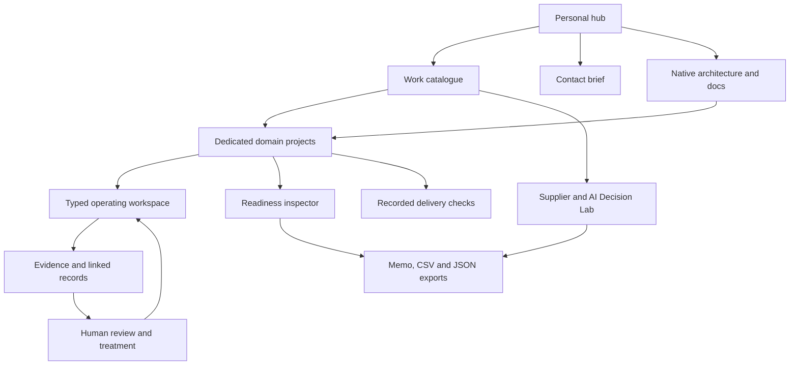
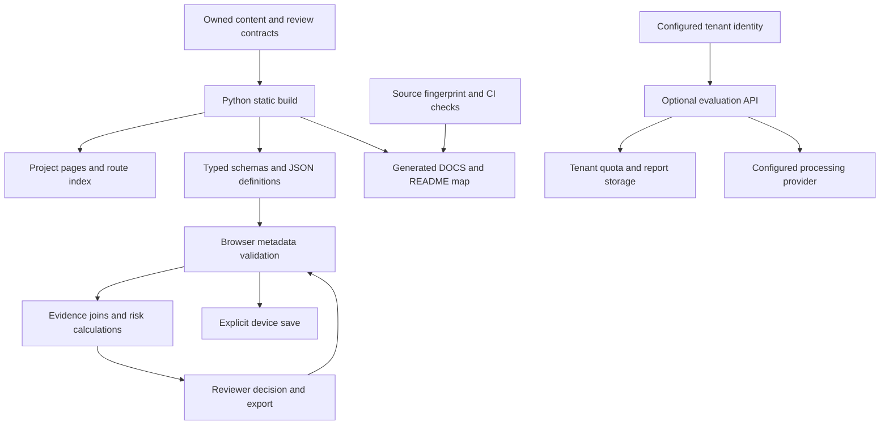

# Connected Governance Workspace

An inspectable connected GRC operating workspace for AI governance, third-party AI/LLM risk, audit readiness and continuous assurance.

[Live workspace](https://aaowasi-projects.pages.dev/workspace/) · [Recorded delivery evidence](https://aaowasi-projects.pages.dev/results/) · [Decision brief](https://aaowasi.pages.dev/contact/) · [Continuous GRC suite](https://aaowasi-projects.pages.dev/suite/)

## What this repository demonstrates

- **29 connected domain projects** across AI governance, third-party risk, audit readiness, privacy, technology risk and assurance.
- **29 GRC operating domains**, **16 shared record types** and **132 register/reporting views** in the continuous GRC suite.
- Browser-local editable records, explicit evidence states, transparent scoring and human review gates.
- Exportable decision memos, JSON round trips and CSV source records.
- Versioned manifests, schemas, tests, workflow validation and recorded delivery checks.

## Start with the live systems

### Connected risk workspace
Change AI inventory, SaaS/LLM vendor, privacy and evidence metadata once, then follow how the same facts affect risk priorities, drift/change signals, evidence coverage, review queues and decision outputs across ten modules.

[Open connected workspace →](https://aaowasi-projects.pages.dev/workspace/)

### Continuous GRC operating suite
Work across obligations, controls, suppliers, risks, evidence, incidents, privacy and AI governance in one operating surface.

[Open continuous GRC suite →](https://aaowasi-projects.pages.dev/suite/)

## Primary governance areas

| Area | Demonstrated mechanics |
|---|---|
| AI governance | AI inventory, NIST AI RMF / NIST AI 600-1 mapping, evaluation evidence, human oversight, release gates and post-deployment drift/change review |
| Third-party & AI vendor risk | SaaS / LLM intake, data-use and training/retention terms, subprocessors, assurance evidence, dependency risk and treatment decisions |
| Audit & continuous assurance | Drift detection, evidence freshness, control-test state, exceptions, remediation ownership and retest |
| Privacy & processor governance | DPA / processor relationships, transfer-review gaps, subprocessor changes and reviewer rationale |
| Executive technology risk | Likelihood/impact signals, appetite/tolerance views, KRIs and accountable treatment decisions |

## Run locally

```bash
# 1. Enter project folder & install dependencies
cd aaowasi-projects
npm install

# 2. Build project
npm run build
npm test

# 3. Run tests & local server

# macOS / Linux:
python3 -m unittest discover -s tests -v
python3 -m http.server 8000 --directory site

# Windows (Command Prompt / PowerShell):
python -m unittest discover -s tests -v
python -m http.server 8000 --directory site
```

## Evidence boundaries

The public interfaces use synthetic scenario data and browser-local records so the mechanics can be inspected safely. They do not claim client telemetry, certification, an audit opinion or legal advice. Unsupported evidence remains visible as missing, stale, failed or manual-review state rather than being auto-approved.

## Framework focus

NIST AI RMF 1.0 · NIST AI 600-1 Generative AI Profile · ISO/IEC 42001:2023 · ISO/IEC 27001:2022 · SOC 2 · NIST CSF 2.0 · GDPR processor governance · EU AI Act transparency

## For a scoped review

If you have one AI use case, vendor set or assurance backlog, [send a decision brief](https://aaowasi.pages.dev/contact/) with the records in scope, evidence available and target date.

## Extended governance workflows

Twenty catalogue workflows connect specialist decisions with shared suite registers. Each project has a complete project page, expandable technical details and onward links. Suite and specialist workspace datasets retain distinct schemas; transfer requires explicit reconciliation.

## Organization evaluation service

An optional Cloudflare Pages Functions backend provides verified-member access and a two-run tenant allowance using D1. API/provider settings and data-processing terms must be configured before activation. No billing provider is connected. See [deployment requirements](docs/ORGANIZATION-EVALUATIONS.md).


<!-- GENERATED-ARCHITECTURE:START -->

## Live architecture and route map

29 dedicated domain projects · 16 typed records · 132 register/reporting views.




[Complete operating and client guide](DOCS.md) · [Terms and conditions](TERMS_AND_CONDITIONS.md) · [License](LICENSE)

### Domain project hierarchy

- D01 **Corporate governance & accountability** → [project](https://aaowasi-projects.pages.dev/work/governance-program/) → [workspace](https://aaowasi-projects.pages.dev/workspace/?domain=governance-program)
- D02 **Enterprise risk & appetite** → [project](https://aaowasi-projects.pages.dev/work/executive-risk/) → [workspace](https://aaowasi-projects.pages.dev/workspace/?domain=executive-risk)
- D03 **Regulatory applicability & change** → [project](https://aaowasi-projects.pages.dev/work/regulatory-obligations/) → [workspace](https://aaowasi-projects.pages.dev/workspace/?domain=regulatory-obligations)
- D04 **Policy lifecycle** → [project](https://aaowasi-projects.pages.dev/work/policy-governance/) → [workspace](https://aaowasi-projects.pages.dev/workspace/?domain=policy-governance)
- D05 **Control implementation & ownership** → [project](https://aaowasi-projects.pages.dev/work/control-management/) → [workspace](https://aaowasi-projects.pages.dev/workspace/?domain=control-management)
- D06 **Internal audit & independence** → [project](https://aaowasi-projects.pages.dev/work/internal-audit/) → [workspace](https://aaowasi-projects.pages.dev/workspace/?domain=internal-audit)
- D07 **External audit & certification readiness** → [project](https://aaowasi-projects.pages.dev/work/audit-readiness/) → [workspace](https://aaowasi-projects.pages.dev/workspace/?domain=audit-readiness)
- D08 **Continuous assurance & remediation** → [project](https://aaowasi-projects.pages.dev/work/continuous-assurance/) → [workspace](https://aaowasi-projects.pages.dev/workspace/?domain=continuous-assurance)
- D09 **Supplier lifecycle & concentration** → [project](https://aaowasi-projects.pages.dev/work/vendor-risk/) → [workspace](https://aaowasi-projects.pages.dev/workspace/?domain=vendor-risk)
- D10 **Procurement & customer assurance** → [project](https://aaowasi-projects.pages.dev/work/customer-assurance/) → [workspace](https://aaowasi-projects.pages.dev/workspace/?domain=customer-assurance)
- D11 **Privacy & individual rights** → [project](https://aaowasi-projects.pages.dev/work/privacy-lifecycle/) → [workspace](https://aaowasi-projects.pages.dev/workspace/?domain=privacy-lifecycle)
- D12 **Processors & cross-border transfers** → [project](https://aaowasi-projects.pages.dev/work/processor-governance/) → [workspace](https://aaowasi-projects.pages.dev/workspace/?domain=processor-governance)
- D13 **Data classification & retention** → [project](https://aaowasi-projects.pages.dev/work/data-governance/) → [workspace](https://aaowasi-projects.pages.dev/workspace/?domain=data-governance)
- D14 **AI inventory & lifecycle authorization** → [project](https://aaowasi-projects.pages.dev/work/ai-governance/) → [workspace](https://aaowasi-projects.pages.dev/workspace/?domain=ai-governance)
- D15 **AI fairness, safety & oversight** → [project](https://aaowasi-projects.pages.dev/work/ai-safety/) → [workspace](https://aaowasi-projects.pages.dev/workspace/?domain=ai-safety)
- D16 **AI transparency & content provenance** → [project](https://aaowasi-projects.pages.dev/work/ai-transparency/) → [workspace](https://aaowasi-projects.pages.dev/workspace/?domain=ai-transparency)
- D17 **Shadow AI & acceptable use** → [project](https://aaowasi-projects.pages.dev/work/shadow-ai/) → [workspace](https://aaowasi-projects.pages.dev/workspace/?domain=shadow-ai)
- D18 **Continuity, recovery & crisis readiness** → [project](https://aaowasi-projects.pages.dev/work/resilience/) → [workspace](https://aaowasi-projects.pages.dev/workspace/?domain=resilience)
- D19 **Incident governance & reporting** → [project](https://aaowasi-projects.pages.dev/work/remediation/) → [workspace](https://aaowasi-projects.pages.dev/workspace/?domain=remediation)
- D20 **Workforce, physical & organizational security** → [project](https://aaowasi-projects.pages.dev/work/workforce-security/) → [workspace](https://aaowasi-projects.pages.dev/workspace/?domain=workforce-security)
- D21 **Financial, fraud & ethical conduct risk** → [project](https://aaowasi-projects.pages.dev/work/financial-conduct/) → [workspace](https://aaowasi-projects.pages.dev/workspace/?domain=financial-conduct)
- D22 **Sector, market & contractual obligations** → [project](https://aaowasi-projects.pages.dev/work/sector-assurance/) → [workspace](https://aaowasi-projects.pages.dev/workspace/?domain=sector-assurance)
- D23 **Security scope & authorization boundary** → [project](https://aaowasi-projects.pages.dev/work/security-boundary/) → [workspace](https://aaowasi-projects.pages.dev/workspace/?domain=security-boundary)
- D24 **Identity, least privilege & segregation** → [project](https://aaowasi-projects.pages.dev/work/identity-authorization/) → [workspace](https://aaowasi-projects.pages.dev/workspace/?domain=identity-authorization)
- D25 **Cloud configuration & change** → [project](https://aaowasi-projects.pages.dev/work/cloud-change/) → [workspace](https://aaowasi-projects.pages.dev/workspace/?domain=cloud-change)
- D26 **Threat, vulnerability & supply-chain assurance** → [project](https://aaowasi-projects.pages.dev/work/threat-supply-chain/) → [workspace](https://aaowasi-projects.pages.dev/workspace/?domain=threat-supply-chain)
- D27 **Logging, evidence integrity & provenance** → [project](https://aaowasi-projects.pages.dev/work/evidence-integrity/) → [workspace](https://aaowasi-projects.pages.dev/workspace/?domain=evidence-integrity)
- D28 **Agent, tool & data authorization** → [project](https://aaowasi-projects.pages.dev/work/agent-authorization/) → [workspace](https://aaowasi-projects.pages.dev/workspace/?domain=agent-authorization)
- D29 **Assessment, authorization & ongoing monitoring** → [project](https://aaowasi-projects.pages.dev/work/ongoing-authorization/) → [workspace](https://aaowasi-projects.pages.dev/workspace/?domain=ongoing-authorization)

<!-- GENERATED-ARCHITECTURE:END -->
