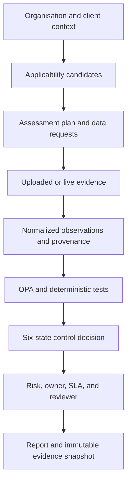

# Ten-project modernization blueprint

## Executive position

The portfolio now presents one assurance engine with ten enterprise modules. The engine separates four concerns that static portfolio packs usually mix together: what applies, what evidence exists, what a deterministic test concludes, and where an authorized person must decide.

The public version uses synthetic data. The design can be connected to live enterprise systems through read-only collectors, scoped credentials, private repositories, and explicit retention rules.

## Clutter elimination map

| Project | Retire or archive | Modern replacement | Auditable outputs | Core measures |
|---|---|---|---|---|
| P01 Trust and assurance | Static trust PDF, duplicated control mappings, manually refreshed evidence links | Claim-control-evidence graph, freshness checks, signed evidence manifest, customer-specific export | Claim status, evidence source and age, exceptions, reviewer approval | Current evidence coverage, response cycle time, expired claims |
| P02 AI governance | Standalone AI policy, spreadsheet register, one-time model review | Versioned AI inventory, use-case classifier, impact assessment, model and supplier provenance, TEVV records, human-oversight plan | AI-system record, risk decision, evaluation result, change event | Owned systems, overdue reviews, failed evaluations, high-risk exceptions |
| P03 TPRM and AI subprocessors | Universal 200-question form, email chasing, undifferentiated scoring | Inherent-risk intake, conditional evidence request, deterministic triage, dependency graph, human approval | Vendor decision, evidence record, concentration view, conditions | Critical vendors with current evidence, overdue reviews, concentration breaches |
| P04 Audit readiness | File-name evidence index, manual walkthrough notes, binary pass/fail | Test procedures, collectors, normalized observations, hashes, six-state decisions, OSCAL assessment outputs | Test result, evidence manifest, finding, POA&M entry | Automated coverage, evidence age, retest rate, unresolved findings |
| P05 Executive risk | Hand-built slide deck, manually colored heatmap, untraceable score | Event-driven risk calculation, appetite thresholds, KRI history, decision log | Board view, appetite breach, decision and owner record | Exposure trend, overdue treatment, risk concentration, decision latency |
| P06 EU AI Act transparency | Article checklist, static disclosure copy, one-time legal review | Deployment gate for direct interaction, synthetic output, deepfake, accessibility, machine-readable marking, documented exception | Product release decision, marking test, disclosure evidence, legal review | In-scope products, marking coverage, failed detection tests, open exceptions |
| P07 Shadow AI and prompt DLP | Annual acceptable-use survey, unmanaged blocklist | SaaS and proxy discovery, AI-tool classification, prompt/data classification, allow/block/review decisions, exception expiry | Egress event, tool status, DLP decision, incident link | Unapproved tool use, sensitive egress, stale exceptions, repeat users |
| P08 Questionnaire automation | Copy-and-paste answer bank, unsupported AI-generated answers | Intent normalization, evidence retrieval, freshness and confidence checks, reviewer workflow | Supported answer, citations, confidence, reviewer decision | Answer reuse, unsupported questions, evidence age, approval cycle time |
| P09 GDPR Article 28 | One DPA checklist per supplier, manual subprocessor list | Processor obligation graph, agreement terms, processing records, transfer basis, subprocessor change events | DPA review record, missing obligation, transfer review, change notice | Executed DPA coverage, unresolved clauses, transfer reviews, notice latency |
| P10 CCM and remediation | Quarterly evidence scramble, findings spreadsheet, manual retest calendar | Scheduled collectors, normalization, OPA tests, finding deduplication, owner/SLA routing, retest, evidence release | Assessment report, finding, remediation record, immutable snapshot | Control coverage, collector health, SLA breaches, mean time to retest |

## Shared lifecycle

## Six-state decision model

| State | Meaning | Automation behavior |
|---|---|---|
| `PASS` | The configured condition is met by current evidence | Record test, evidence references, and timestamp |
| `FAIL` | The configured condition is not met | Create or update a finding and remediation target |
| `NOT_CONFIGURED` | Required telemetry or evidence path is absent | Request configuration or evidence. Do not score as a failure or pass |
| `ERROR` | Collection or evaluation failed | Preserve the error and retry safely. Do not substitute stale data silently |
| `NOT_APPLICABLE` | The selected context does not require the test | Record the scoped rationale and reviewer where required |
| `MANUAL_REVIEW` | Legal, contractual, subjective, or approval judgment is required | Route the evidence bundle to an authorized reviewer |

## Framework routing

The registry treats frameworks as versioned candidates, not a universal checklist. The example selector considers organisation type, jurisdiction, industry, data, AI characteristics, and contractual commitments. It can route work across NIST CSF 2.0, SOC 2, ISO/IEC 27001:2022, ISO 22301, NIST AI RMF, ISO/IEC 42001, the EU AI Act, GDPR, PCI DSS, HIPAA, DORA, NIS2, COSO ERM, and custom mandates.

Selections are documented recommendations. Counsel, auditors, and accountable management decide legal applicability and final scope.

## Control effectiveness method

Each control record should contain:

1. Control objective and source requirement.
2. System boundary and owner.
3. Design-effectiveness procedure.
4. Operating-effectiveness procedure and test period.
5. Evidence source, collection method, timestamp, and digest.
6. Sampling rule, if the test is not continuous.
7. Decision state, rationale, and reviewer.
8. Finding, root cause, residual risk, owner, due date, and retest result.

The engine's numerical effectiveness score is deliberately narrow: `PASS / (PASS + FAIL)`. All other states remain visible and excluded. A high score cannot hide missing telemetry or pending legal review.

## Portfolio evidence model

Raw historical spreadsheets and PDFs should leave the main branch after migration. Create one baseline release, attach the original archive plus a SHA-256 manifest, and mark it as historical evidence. Keep a compact migration record in the repository with source file names, digests, destination modules, and disposition.

For production, use a private repository or dedicated evidence store. Public GitHub Releases are suitable only for synthetic or approved sanitized artifacts.

## Human authorization points

- Legal and regulatory applicability.
- Contract and DPA sufficiency.
- Risk acceptance or exception approval.
- Vendor onboarding decision.
- High-impact AI classification and fundamental-rights conclusions.
- Public disclosure, certification, or assurance claims.
- Write, delete, notify, block, or enforcement actions from an agent.

MCP tools in this repository are read-only or return recommendations with `requires_human_approval: true`. A production write tool needs scoped identity, OPA authorization, idempotency, audit logs, explicit confirmation, and rollback.
